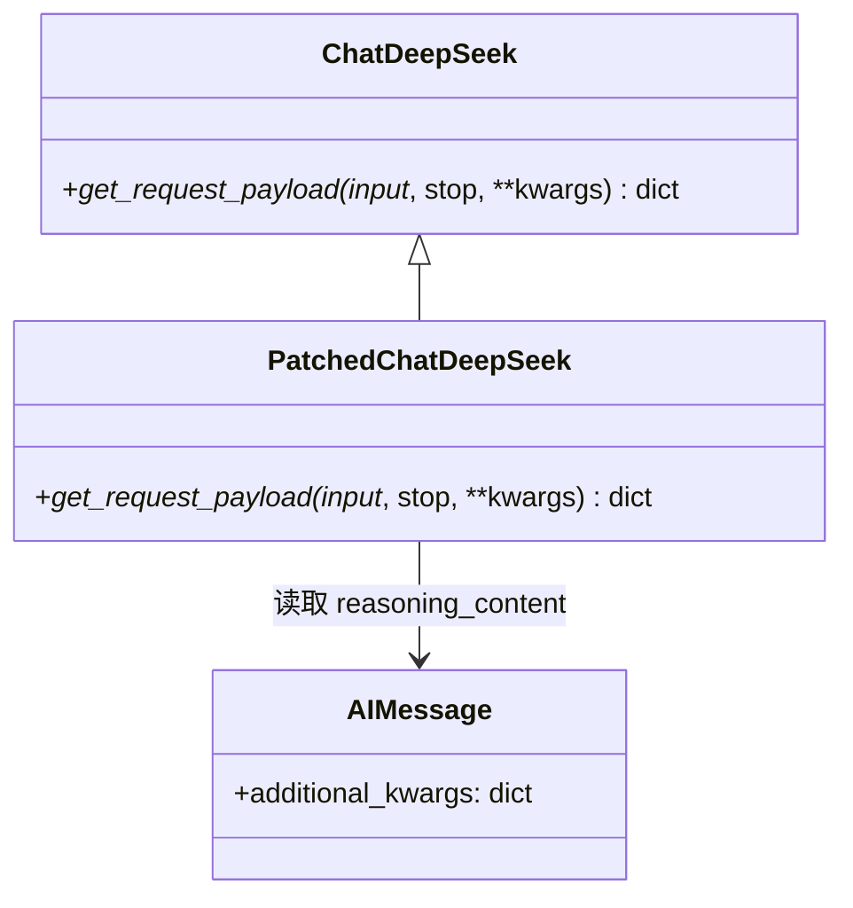
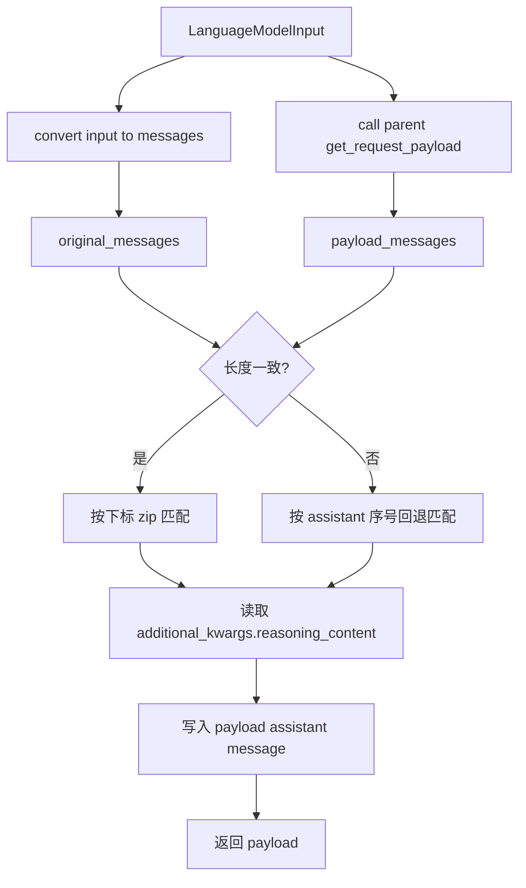
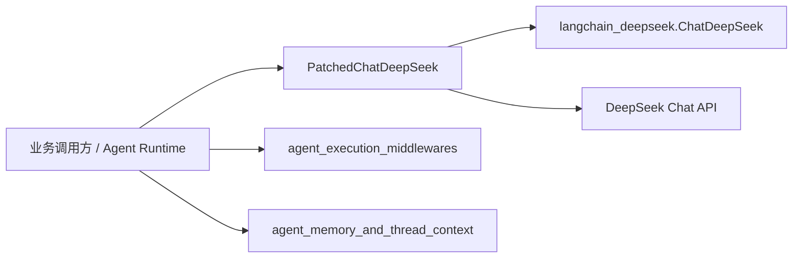

# patched_deepseek 模块文档

## 1. 模块定位与设计动机

`patched_deepseek` 模块提供了一个非常小但非常关键的适配层：`PatchedChatDeepSeek`。它继承自 `langchain_deepseek.ChatDeepSeek`，唯一目标是在多轮对话请求中**稳定保留 `reasoning_content` 字段**。这个字段通常出现在开启“思维/推理”能力的模型交互里，部分 DeepSeek API 在后续轮次会要求每条 assistant 历史消息都带上该字段；如果丢失，服务端可能直接拒绝请求。

这个模块存在的根本原因是：上游类在内部会把推理内容存入 `AIMessage.additional_kwargs`，但后续构建请求 payload 时并不总会把它重新写回 `messages[*]`。因此，业务侧虽然“看起来保存了历史消息”，但真正发往 API 的 JSON 仍可能缺少必要字段。`PatchedChatDeepSeek` 通过覆写 `_get_request_payload` 精准修补这一点，避免侵入式改动其余 LangChain 流程。

从系统分层看，它属于 [model_and_external_clients](model_and_external_clients.md) 的模型客户端修补子模块，作用范围集中在模型请求组装阶段，不负责会话状态持久化，也不处理中间件流程编排（相关内容见 [agent_execution_middlewares](agent_execution_middlewares.md) 与 [agent_memory_and_thread_context](agent_memory_and_thread_context.md)）。

---

## 2. 核心组件：`PatchedChatDeepSeek`

### 2.1 类职责

`backend.src.models.patched_deepseek.PatchedChatDeepSeek` 在行为上保持与 `ChatDeepSeek` 基本一致，只在请求发送前追加一步“历史 assistant 消息的 `reasoning_content` 回填”。这意味着你可以把它当作 `ChatDeepSeek` 的直接替代品使用，而无需改动业务调用方式（`invoke`/`ainvoke`/chain 组合等）。

### 2.2 方法详解：`_get_request_payload`

```python
def _get_request_payload(
    self,
    input_: LanguageModelInput,
    *,
    stop: list[str] | None = None,
    **kwargs: Any,
) -> dict
```

该方法的执行逻辑可以分成四步。

首先，它调用 `self._convert_input(input_).to_messages()` 得到“原始 LangChain 消息序列”（其中 `AIMessage.additional_kwargs` 仍保留推理字段）。其次，它调用父类 `super()._get_request_payload(...)` 生成标准请求体，这一步会产出最终准备发给 DeepSeek API 的 `payload`。然后，补丁逻辑把 `payload["messages"]` 与原始消息序列进行对齐匹配，找出 assistant 消息对应关系。最后，它从原始 `AIMessage.additional_kwargs` 里提取 `reasoning_content`，写入对应 payload message。

返回值是一个字典，即可直接用于后续 HTTP 请求发送的请求体。其副作用是“原地修改”父类创建的 `payload["messages"]` 列表项，为 assistant 消息注入额外字段。

---

## 3. 内部机制与算法策略

### 3.1 结构关系图



该继承关系强调了一个设计决策：补丁没有替换整套请求构建流程，而是复用父类能力，仅在最后做定点增强。这种方式能最大限度降低升级成本与行为偏差。

### 3.2 数据流与修补点



修补点位于“父类生成 payload 之后、真实发请求之前”。这保证了补丁逻辑不影响 prompt 组装、stop 参数处理等其他默认行为。

### 3.3 双重匹配策略说明

模块实现了两层消息匹配机制，以抵抗上游转换过程中的结构差异。

当 `payload_messages` 与 `original_messages` 数量一致时，系统采用按位置一一映射（`zip`）的方式，这是最直接也最稳妥的路径。若数量不一致，则进入回退策略：先筛出原始序列中的 `AIMessage`，再筛出 payload 中 `role == "assistant"` 的项，按出现顺序配对注入。这样即使部分消息在父类转换时被过滤或重排，仍有机会把大部分 `reasoning_content` 补回去。

---

## 4. 与系统其他模块的关系



`PatchedChatDeepSeek` 不直接管理线程上下文、记忆队列或中间件状态，它只保证“已有历史消息在发请求时字段完整”。因此它通常由上层运行时注入并使用，而与线程状态模型、记忆更新策略解耦。若你在系统里已经有模型工厂或配置装配逻辑（参见 [application_and_feature_configuration](application_and_feature_configuration.md)），推荐在该层统一替换为补丁类，避免不同调用路径混用原始类和补丁类。

---

## 5. 使用方式

### 5.1 最小替换示例

```python
from backend.src.models.patched_deepseek import PatchedChatDeepSeek

llm = PatchedChatDeepSeek(
    model="deepseek-reasoner",
    temperature=0.2,
    api_key="${DEEPSEEK_API_KEY}",
)

resp = llm.invoke("请比较 RAG 与 long-context 的适用场景")
print(resp.content)
```

这段代码与 `ChatDeepSeek` 的常规用法一致。补丁行为发生在内部，你通常不需要额外配置开关。

### 5.2 多轮对话示例（关键场景）

```python
from langchain_core.messages import HumanMessage
from backend.src.models.patched_deepseek import PatchedChatDeepSeek

llm = PatchedChatDeepSeek(model="deepseek-reasoner")

history = [HumanMessage(content="什么是向量数据库？")]
a1 = llm.invoke(history)
history.append(a1)

history.append(HumanMessage(content="它与传统关系型数据库最大的差异是什么？"))
a2 = llm.invoke(history)  # 补丁会确保历史 assistant 的 reasoning_content 被带回请求
print(a2.content)
```

如果你在 agent 框架中自行拼接历史消息，建议始终把模型返回的 `AIMessage` 原样保留，以便 `additional_kwargs` 不丢失。

---

## 6. 配置、扩展与维护建议

`PatchedChatDeepSeek` 本身没有新增配置字段，所有构造参数与父类保持一致（例如 `model`、`temperature`、`max_tokens`、`api_key`、`base_url` 等）。这让它非常适合作为“无感替换件”。

若要扩展该类，建议继续保持“最小覆写”原则。比如你要额外补字段（如工具调用元数据或自定义 trace 字段），应尽量在 `_get_request_payload` 后处理阶段追加，而不是复制父类全部逻辑，否则在上游库升级时会显著增加维护负担。

在版本维护上，重点关注 `langchain_deepseek.ChatDeepSeek` 对 `_get_request_payload` 和输入转换路径的签名变化。一旦父类行为调整，补丁的匹配前提（如消息顺序、role 映射）可能受到影响，建议在依赖升级时加入回归测试。

---

## 7. 边界条件、错误风险与已知限制

这个补丁能修复“字段未透传”问题，但不能解决所有 API 级错误。最常见的边界来自消息映射不完全可靠：当父类显著改变消息重写规则时，回退匹配可能把 `reasoning_content` 配错到另一条 assistant 消息。虽然当前实现通过“仅匹配 assistant + 顺序配对”降低风险，但它不是基于 message id 的强一致映射。

另外，补丁只在 `reasoning_content is not None` 时写入字段。若上游历史消息本身已丢失该键（例如持久化时裁剪了 `additional_kwargs`），补丁无法“凭空恢复”推理内容。也就是说，补丁依赖调用链在会话存储中保留原始 `AIMessage` 元数据。

从性能角度看，额外开销主要是一次消息遍历与条件注入，复杂度近似 O(n)，通常远小于网络请求耗时。除非你的单次上下文消息量极大，否则几乎不构成瓶颈。

---

## 8. 测试建议（实践导向）

建议至少覆盖三类测试：

- 正常路径：消息长度一致时，assistant 消息能正确注入 `reasoning_content`。
- 回退路径：人为构造长度不一致 payload，验证按 assistant 顺序仍能注入。
- 缺失路径：assistant 消息没有 `reasoning_content` 时不应注入脏值，也不应抛异常。

你可以通过 mock `super()._get_request_payload` 返回体来做单元测试，从而稳定触发两种匹配分支。

---

## 9. 参考文档

- 父级聚合模块：[`model_and_external_clients.md`](model_and_external_clients.md)
- 配置体系（模型装配入口）：[`application_and_feature_configuration.md`](application_and_feature_configuration.md)
- 运行时中间件上下文：[`agent_execution_middlewares.md`](agent_execution_middlewares.md)
- 记忆与线程状态：[`agent_memory_and_thread_context.md`](agent_memory_and_thread_context.md)

以上文档关注点不同：本模块文档只解释 DeepSeek 请求 payload 的补丁行为，不重复其他模块的状态流转与配置细节。
