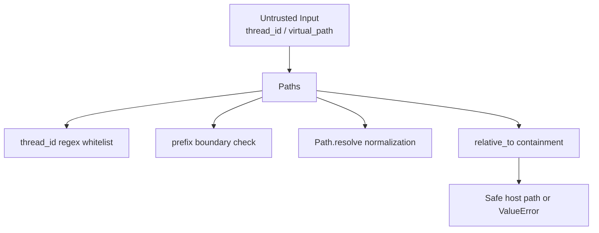
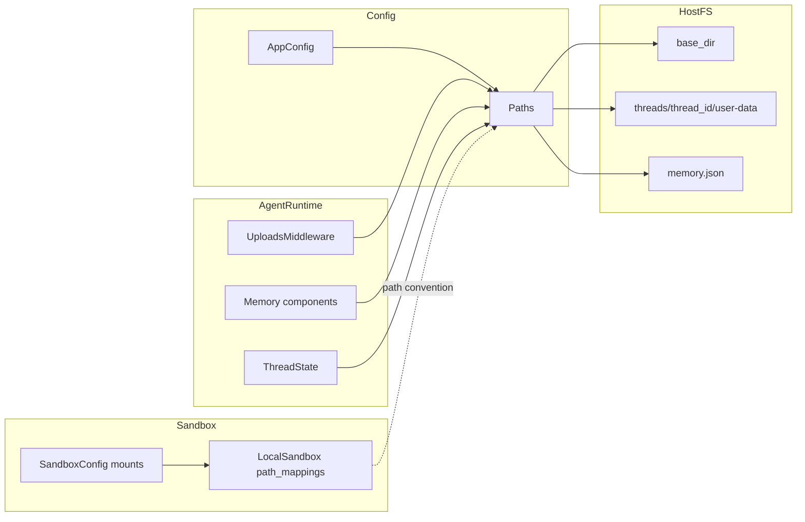
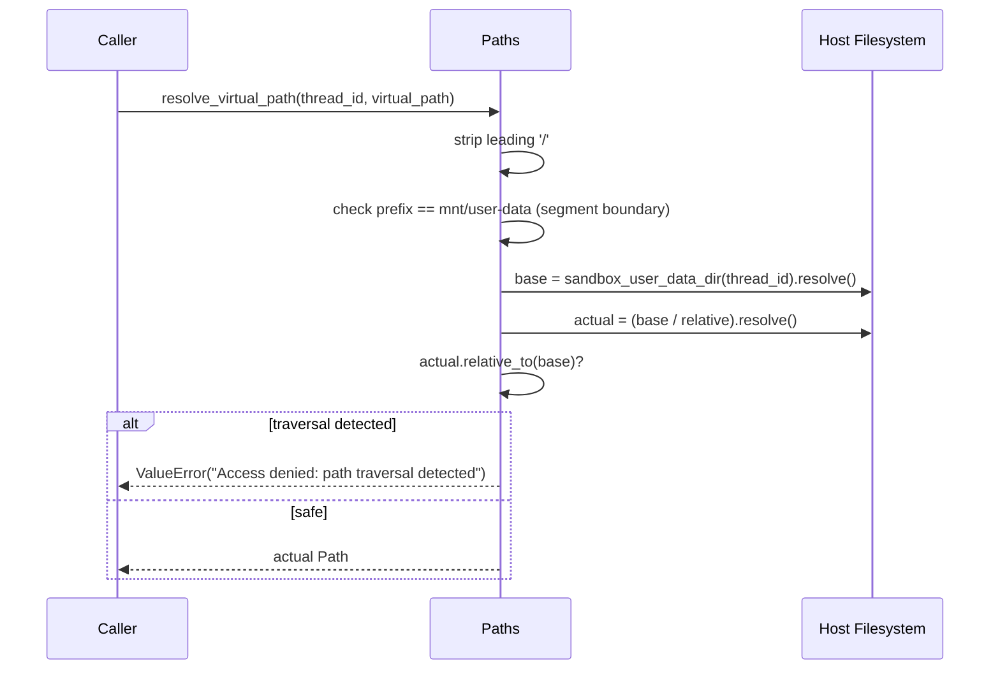
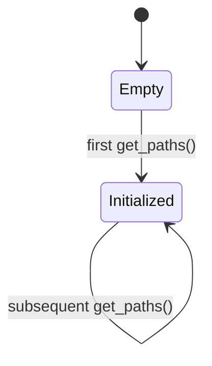

# path_resolution_and_fs_security 模块文档

## 概述：这个模块做什么，为什么必须存在

`path_resolution_and_fs_security` 是 DeerFlow 配置体系中的基础安全模块，对应核心实现 `backend.src.config.paths.Paths`。它解决的是一个看似“工程细节”、但实际上影响整个系统安全边界的问题：**如何在多线程会话、沙箱运行环境、宿主机文件系统之间，提供统一且安全的路径解析规则**。

在 DeerFlow 中，Agent 在沙箱里看到的路径通常是 `/mnt/user-data/...`，而实际落盘路径位于宿主机的 `{base_dir}/threads/{thread_id}/user-data/...`。如果没有集中式路径层，不同模块自行拼接路径，最终会出现三类风险：第一，目录结构不一致导致读写错位；第二，路径遍历（`../`）等安全漏洞；第三，跨模块约定漂移（例如上传目录、输出目录命名不一致）。`Paths` 的价值就是把这些风险收敛为一个可复用、可审计、可测试的单点实现。

从系统定位看，本模块属于 `application_and_feature_configuration`，并与沙箱和中间件形成协作。配置全景可参考 [application_and_feature_configuration.md](application_and_feature_configuration.md)，配置加载流程可参考 [app_config_orchestration.md](app_config_orchestration.md)。本文聚焦路径解析与文件系统安全，不重复其他模块内容。

---

## 设计目标与安全模型

该模块的设计目标可以概括为：在“可用性”和“安全性”之间保持默认安全（secure-by-default）。一方面，它提供足够直接的 API（例如 `sandbox_uploads_dir`、`ensure_thread_dirs`），让业务代码无需重复目录拼接；另一方面，它把关键安全检查放在底层，尽量避免“上层调用方忘记校验”的情况。

安全模型主要覆盖两类威胁。第一类是基于 `thread_id` 的路径注入，例如伪造 `../../etc`。第二类是基于虚拟路径的目录遍历，例如 `/mnt/user-data/outputs/../../secrets`。`Paths` 分别通过正则白名单和 `resolve + relative_to` 的组合进行阻断。



这张图表示：`Paths` 不仅是“路径生成器”，还是“路径防火墙”。

---

## 核心组件一览

本模块只有一个核心类与一个全局入口，但承担了完整路径策略：

- `Paths`：路径解析与安全校验核心。
- `get_paths()`：`Paths` 的懒加载全局单例入口。
- `VIRTUAL_PATH_PREFIX = "/mnt/user-data"`：沙箱视角的用户数据根。
- `_SAFE_THREAD_ID_RE = r"^[A-Za-z0-9_\-]+$"`：线程 ID 白名单规则。

---

## 架构关系与跨模块协作



这里的关键点是：`Paths` 定义了目录与虚拟路径约定，`SandboxConfig` / `LocalSandbox` 提供挂载与路径映射能力，二者必须保持一致，否则会出现“模型看到的路径能说不能用”或“宿主路径泄露”问题。

- `AppConfig` 负责全局配置装配（见 [app_config_orchestration.md](app_config_orchestration.md)）。
- `SandboxConfig` 的 `mounts` 决定容器路径映射策略（见 [model_tool_sandbox_basics.md](model_tool_sandbox_basics.md)）。
- `LocalSandbox` 在本地执行时用 `path_mappings` 做路径正反向替换（见 [local_sandbox_runtime.md](local_sandbox_runtime.md)）。

---

## `Paths` 类详解

### `__init__(base_dir: str | Path | None = None)`

构造函数允许显式注入 `base_dir`。当传入值时会立即调用 `Path(...).resolve()`，将相对路径标准化为绝对路径并缓存到 `self._base_dir`。这保证后续所有子路径都基于稳定锚点，而不是受当前工作目录影响。

参数方面，`base_dir` 是可选项；返回值为 `None`；副作用仅为内存态字段赋值，没有文件系统写入。

### `base_dir` 属性

`base_dir` 是路径系统根节点，解析优先级如下：

1. 构造参数 `base_dir`
2. 环境变量 `DEER_FLOW_HOME`
3. 开发回退：若当前目录名是 `backend`，或当前目录含 `pyproject.toml`，则使用 `cwd/.deer-flow`
4. 默认回退：`$HOME/.deer-flow`

该顺序体现“显式优先、开发友好”的设计。生产环境建议固定 `DEER_FLOW_HOME` 或显式传参，避免进程工作目录变化导致路径漂移。

### `memory_file` 属性

返回 `{base_dir}/memory.json`。这是内存持久化默认路径，通常由 memory 相关模块读取或写入。此属性无副作用，仅做路径拼接。

### `thread_dir(thread_id: str) -> Path`

该方法返回线程根目录 `{base_dir}/threads/{thread_id}`，但在此之前强制执行 `_SAFE_THREAD_ID_RE` 校验，仅允许英文字母、数字、下划线、连字符。任何路径分隔符、点号路径、空格等都被拒绝。

- 参数：`thread_id`（不可信输入源，必须校验）
- 返回：线程目录 `Path`
- 异常：`ValueError`（非法 `thread_id`）
- 安全意义：阻断最直接的目录注入与遍历手法

### 线程目录派生方法

`sandbox_work_dir`、`sandbox_uploads_dir`、`sandbox_outputs_dir`、`sandbox_user_data_dir` 都是 `thread_dir` 的确定性派生，分别指向：

- `.../user-data/workspace`
- `.../user-data/uploads`
- `.../user-data/outputs`
- `.../user-data`

这些方法只返回路径，不会隐式创建目录。这样做的好处是避免 getter 触发 I/O 副作用，调用方可自行控制创建时机。

### `ensure_thread_dirs(thread_id: str) -> None`

该方法负责实际创建标准线程目录结构，内部调用三次 `mkdir(parents=True, exist_ok=True)`。这意味着方法是幂等的：重复调用不会报错，也不会破坏现有目录。

常见调用时机包括线程首次启动、上传功能初始化、沙箱挂载前的目录预热。

### `resolve_virtual_path(thread_id: str, virtual_path: str) -> Path`

这是模块最关键的安全方法：将沙箱虚拟路径解析为宿主机绝对路径，并验证解析结果仍位于线程 `user-data` 根目录下。



内部机制分为四步：先做前缀标准化，再做“段边界”匹配（防止 `mnt/user-dataX` 混淆），再做绝对路径归一化，最后做包含关系验证（`relative_to(base)`）。最后这一步非常关键，因为它检查的是**归一化后的真实路径关系**，能覆盖 `../` 变体。

异常语义：

- 前缀不匹配：`ValueError("Path must start with /mnt/user-data")`
- 路径逃逸：`ValueError("Access denied: path traversal detected")`

---

## 全局单例：`get_paths()` 的行为与注意事项

`get_paths()` 通过模块级变量 `_paths` 实现懒初始化单例。首次调用创建 `Paths()`，后续复用同一实例。



这对大多数服务进程是合理的，但有一个实践注意点：如果你在同一进程运行多个测试用例，并动态切换 `DEER_FLOW_HOME`，单例不会自动刷新。此时建议直接实例化 `Paths(base_dir=...)`，而非依赖全局单例。

---

## 典型用法

### 1) 初始化路径系统

```python
from src.config.paths import Paths

paths = Paths(base_dir="/var/lib/deer-flow")
print(paths.memory_file)
```

### 2) 为线程准备标准目录

```python
from src.config.paths import get_paths

paths = get_paths()
paths.ensure_thread_dirs("thread_001")
```

### 3) 解析 Agent 返回的虚拟产物路径

```python
from src.config.paths import get_paths

paths = get_paths()
host_path = paths.resolve_virtual_path(
    "thread_001",
    "/mnt/user-data/outputs/report.pdf",
)
```

### 4) 错误处理模式（推荐）

```python
try:
    host_path = paths.resolve_virtual_path(thread_id, virtual_path)
except ValueError as e:
    # 建议在 API 层转译为 4xx，并记录安全审计日志
    raise
```

---

## 与沙箱挂载配置的一致性要求

`Paths` 的虚拟前缀约定是 `/mnt/user-data`。因此在使用容器或本地沙箱映射时，必须保证路径语义一致：也就是线程 `user-data` 根目录在运行时确实映射到这个虚拟前缀。若配置了不同挂载点但未同步更新逻辑，会导致 `resolve_virtual_path` 判定失败，或更糟糕地出现路径错配。

在 `SandboxConfig` 中，这通常通过 `mounts`（`VolumeMountConfig`）体现；在本地沙箱中，对应 `LocalSandbox.path_mappings`。相关配置细节请参考 [model_tool_sandbox_basics.md](model_tool_sandbox_basics.md) 与 [local_sandbox_runtime.md](local_sandbox_runtime.md)。

---

## 边界条件、错误场景与已知限制

本模块默认策略较保守，这带来安全收益，也有工程限制。`thread_id` 仅允许 `[A-Za-z0-9_-]`，因此包含点号、空格、中文或其它符号的 ID 会被拒绝。如果业务确有扩展需要，必须在所有依赖链路统一更新并做回归测试。

`base_dir` 属性本身不会创建目录；如果直接在其子目录写文件，可能出现父目录不存在错误。调用方应在初始化阶段显式调用 `ensure_thread_dirs` 或更高层目录准备逻辑。

`resolve_virtual_path` 只接受 `/mnt/user-data` 前缀。这是安全边界的一部分，不建议在业务代码绕过。如果未来确需支持多前缀，建议在该模块内统一扩展，而不是在调用方做“先替换字符串再调用”的临时方案。

此外，路径级防护不等于系统级隔离。即便 `Paths` 阻止了目录遍历，仍应配合容器权限、只读挂载、最小权限运行用户等操作系统层安全策略。

---

## 扩展与维护建议

如果要扩展该模块，建议遵循“安全逻辑集中化”原则。更具体地说，可以考虑把 `VIRTUAL_PATH_PREFIX` 配置化，但必须保留段边界匹配与包含关系校验；可以考虑新增 `ensure_base_dirs()` 统一创建根目录；也可以把 `ValueError` 细分为领域异常类型，便于网关层映射更明确的错误码。

无论如何演进，`thread_id` 校验与路径 containment 校验都不应下放到上层业务，否则极易出现调用链缺口，形成不一致的安全姿态。

