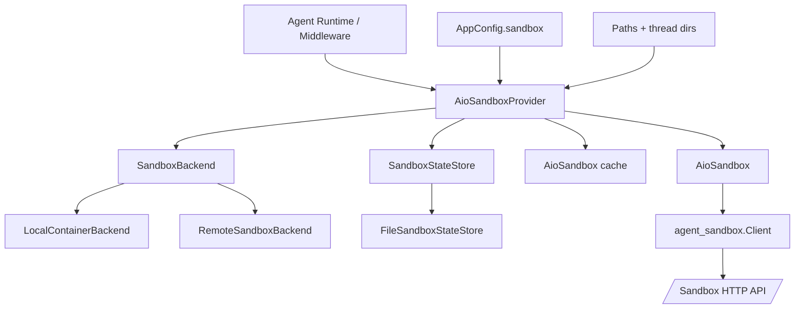
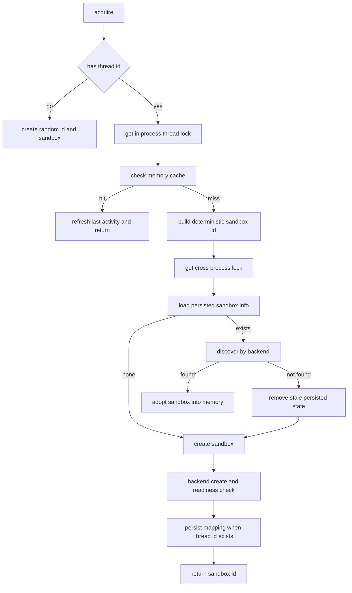
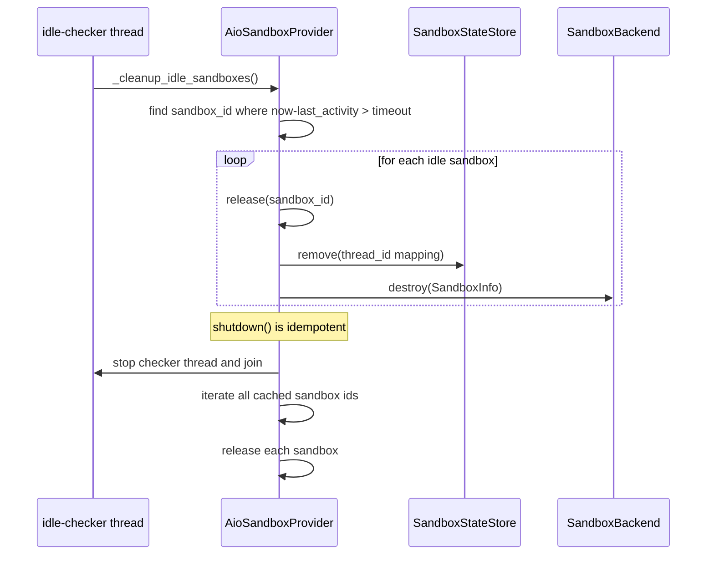

# provider_orchestration 模块文档

## 模块定位与设计动机

`provider_orchestration` 是 `sandbox_aio_community_backend` 体系中的“编排层”模块，核心由 `AioSandboxProvider` 与 `AioSandbox` 两个组件组成。它的存在目的不是实现某一种具体沙箱技术，而是把**沙箱生命周期管理**（创建、复用、恢复、释放、超时清理、优雅退出）和**沙箱内操作能力**（命令执行、文件读写）组织成一个对上层稳定的契约。

在系统运行中，Agent 往往需要跨多轮对话复用同一执行环境，以保留工作目录、上传文件、生成产物等上下文。如果每轮都新建沙箱，性能和状态一致性都会显著下降；如果只依赖单进程内存，又会在多进程/多实例部署下失效。`provider_orchestration` 通过“进程内缓存 + 跨进程状态存储 + 后端发现”三层恢复机制解决这个问题，并通过确定性 `sandbox_id` 保证同一 `thread_id` 在不同进程上可定位到同一个目标沙箱。

该模块是一个典型的“组合式编排”实现：它组合 `SandboxBackend`（如何创建/销毁沙箱）与 `SandboxStateStore`（如何持久化 thread→sandbox 映射），自身负责协调与一致性控制。关于这些抽象与具体后端的细节，建议配合阅读 [provisioning_backends](provisioning_backends.md) 与 [state_persistence](state_persistence.md) 文档，以及基础抽象 [sandbox_abstractions](sandbox_abstractions.md)。

---

## 核心组件概览

### 1) `AioSandboxProvider`

`AioSandboxProvider` 实现了 `SandboxProvider` 抽象接口，是本模块的控制中枢。它接收上层传入的 `thread_id`，决定复用已有沙箱、恢复外部已存在沙箱，还是新建沙箱，并在后台持续处理空闲回收。它同时管理多种锁：

- 全局进程内锁（保护 provider 内部映射表）
- 每线程进程内锁（防止同进程同线程并发 acquire）
- 跨进程锁（由 `SandboxStateStore.lock(thread_id)` 提供）

这种分层锁策略可以在安全性与吞吐之间取得平衡：热点 `thread_id` 被串行化，非同一线程请求仍可并发。

### 2) `AioSandbox`

`AioSandbox` 实现了 `Sandbox` 抽象接口，是对 `agent_sandbox` HTTP client 的封装。上层拿到 `Sandbox` 后只需要调用统一方法（`execute_command`、`read_file`、`write_file` 等），无需关心底层是本地容器还是远程 Pod。它将网络调用异常处理、`home_dir` 懒加载、二进制写入 base64 编码等细节统一收口。

---

## 架构与依赖关系



上图体现了该模块的核心思想：`AioSandboxProvider` 位于上层 Agent 执行链和下层基础设施之间。它不直接实现容器或 Pod 管理，而是把“资源供给”委托给 `SandboxBackend`，把“跨进程状态”委托给 `SandboxStateStore`，自己专注于编排与一致性。

---

## 关键流程说明

### Acquire 流程（最重要）



这个流程体现了三层一致性策略：

先走内存快路径，命中时几乎无 I/O；未命中后进入跨进程锁域，防止并发重复创建；在锁内优先恢复旧状态并做后端再发现，只有确实无法恢复才创建新沙箱。对于稳定运行的线程，这能显著降低重复建箱开销。

### Release / Idle Cleanup / Shutdown 流程



`shutdown()` 同时注册在 `atexit` 与信号处理器（`SIGTERM/SIGINT`）上，因此无论是正常退出还是容器被终止，都会尽力执行资源回收。其幂等性由 `_shutdown_called` 保证，避免重复执行破坏状态。

---

## 组件级深度说明

## `AioSandboxProvider` 详解

### 内部状态

`AioSandboxProvider` 内部维护多个映射：

- `_sandboxes: sandbox_id -> AioSandbox`：运行时对象缓存
- `_sandbox_infos: sandbox_id -> SandboxInfo`：用于释放时定位后端资源
- `_thread_sandboxes: thread_id -> sandbox_id`：线程到沙箱映射（进程内）
- `_thread_locks: thread_id -> Lock`：细粒度线程锁
- `_last_activity: sandbox_id -> timestamp`：空闲超时判断依据

这些状态都由 `_lock` 保护，避免竞态访问。

### 配置加载与后端选择

`_load_config()` 从 `AppConfig.sandbox` 读取并归一化配置，关键字段包括 `image`、`port`、`auto_start`、`container_prefix`、`idle_timeout`、`mounts`、`environment`、`provisioner_url`。

`_create_backend()` 的选择逻辑是：

1. 若设置 `provisioner_url`，使用 `RemoteSandboxBackend`（远程编排模式）
2. 否则要求 `auto_start=true`，使用 `LocalContainerBackend`
3. 若两者都不满足，抛 `RuntimeError`

这意味着目前实现并不支持“仅给 `base_url` 直接连接固定沙箱”模式，尽管配置字段中存在 `base_url`。

### 环境变量解析

`_resolve_env_vars()` 会把值形如 `$ENV_NAME` 的配置解析为宿主进程环境变量值。未设置时会落为 `""`（空字符串），这在生产中是一个常见坑：如果你以为缺失时会报错，实际上不会，需要在部署前做显式校验。

### 确定性 ID 与跨进程恢复

`_deterministic_sandbox_id(thread_id)` 使用 `sha256(thread_id)` 前 8 位，保证不同进程对同一 `thread_id` 得到同一 `sandbox_id`。这使 `discover()` 可以按约定名称/ID 回查实际资源，避免只能依赖共享内存。

### 挂载计算

`_get_extra_mounts(thread_id)` 汇总两类挂载：

- 线程目录挂载：`workspace/uploads/outputs`
- skills 目录挂载：只读挂载，提升安全性

线程目录由 `Paths.ensure_thread_dirs(thread_id)` 懒创建。skills 挂载获取失败不会中断流程，只记录 warning 并跳过。

### `acquire(thread_id)` / `_acquire_internal()`

- **参数**：`thread_id: str | None`
- **返回**：`sandbox_id: str`
- **副作用**：可能创建容器/Pod、写入状态文件、更新内存映射与活动时间

当 `thread_id is None` 时，使用随机 8 位 UUID，且不会做 thread 级持久化映射。这类沙箱更像临时会话，不具备跨轮恢复语义。

### `_try_recover(thread_id)`

- 从 state store 加载 `SandboxInfo`
- 调用 backend `discover(sandbox_id)` 二次确认真实可达地址
- 成功则把 sandbox “收编”进当前进程缓存
- 若发现 URL 变化（例如端口重映射），会回写 state store

如果 state store 中记录已陈旧（容器/Pod 不存在），会主动 `remove(thread_id)`，防止下次反复误恢复。

### `_create_sandbox(thread_id, sandbox_id)`

- 调 backend `create(...)`
- 调 `wait_for_sandbox_ready(url, timeout=60)` 轮询健康
- 未就绪则执行 backend `destroy(info)` 并抛 `RuntimeError`
- 成功后写入缓存与持久化映射

这里采用“创建后强校验”策略，能尽早暴露起箱失败，不把半初始化资源交给上层。

### `get(sandbox_id)`

返回缓存中的 `AioSandbox`，并刷新 `last_activity`。注意它不做 state store / backend 反查，因此若沙箱只存在于外部、尚未被当前进程收编，`get` 会返回 `None`。

### `release(sandbox_id)`

释放顺序是：

1. 先移除进程内映射（锁内）
2. 再清理持久化状态（锁外，避免长时间占锁）
3. 最后调用 backend `destroy(info)` 释放底层资源

这种顺序避免了文件 I/O 和外部调用拖慢临界区。

### 空闲回收与优雅退出

当 `idle_timeout > 0` 时，后台守护线程每 60 秒扫描一次 `_last_activity`。超时沙箱会调用 `release()`。`shutdown()` 会停止该线程并尝试释放全部缓存沙箱。

---

## `AioSandbox` 详解

`AioSandbox` 是操作层封装，构造时初始化 `agent_sandbox.Sandbox` client（600 秒超时）。

### `home_dir` 属性

首次访问会调用 `sandbox.get_context()` 获取并缓存。后续访问不再发请求，属于典型懒加载。

### `execute_command(command)`

执行 shell 命令并返回文本输出；无输出时返回 `"(no output)"`。异常时不会抛出，而是记录日志后返回 `"Error: ..."` 字符串。这种“错误字符串化”方便上层对话展示，但也会降低类型安全。

### `read_file(path)`

读取文件内容；异常时同样返回 `"Error: ..."` 字符串而非抛异常。

### `list_dir(path, max_depth=2)`

底层通过 `find ... | head -500` 的 shell 命令模拟目录遍历。其行为受 shell 与路径转义影响，且输出最多 500 行，适合作为“快速查看”而非完整文件系统索引。

### `write_file(path, content, append=False)`

- `append=False`：直接覆盖写入
- `append=True`：先 `read_file` 再拼接写回

这里有一个重要边界：当 `read_file` 失败时会返回 `Error:` 文本，代码会检查此前缀并跳过拼接，最终相当于写入“仅新内容”。这可避免把错误文本写进文件，但也意味着 append 语义在失败场景退化为覆盖。

### `update_file(path, content: bytes)`

把二进制内容 base64 编码后写入，并声明 `encoding="base64"`。异常会抛出，和 `execute_command/read_file` 的“吞异常返回字符串”策略不同，调用方需注意分支处理。

---

## API 参考（按方法）

为了便于维护者快速定位行为，本节把两个核心类的方法按“职责、输入、输出、副作用、失败语义”统一说明。相比前文的流程叙述，这里更偏向接口契约视角。

### `AioSandboxProvider` 方法契约

| 方法 | 主要职责 | 输入参数 | 返回值 | 关键副作用 | 失败语义 |
|---|---|---|---|---|---|
| `__init__()` | 初始化编排器，加载配置并启动后台机制 | 无 | 无 | 创建锁与缓存；构建 backend/state_store；注册 `atexit` 和信号处理；可能启动 idle checker | 配置非法会在初始化阶段抛异常 |
| `_create_backend()` | 依据配置选择后端实现 | 无（读取 `_config`） | `SandboxBackend` | 决定后续 create/discover/destroy 行为路径 | 若 `auto_start=false` 且无 `provisioner_url`，抛 `RuntimeError` |
| `_create_state_store()` | 构建跨进程状态存储 | 无 | `SandboxStateStore` | 影响 thread→sandbox 的持久化与跨进程锁能力 | 当前实现固定为文件存储；路径不可写时后续操作报错 |
| `_load_config()` | 从 `AppConfig` 归一化读取沙箱配置 | 无 | `dict` | 决定镜像、端口、超时、挂载、环境变量等运行参数 | 配置对象缺失字段时用默认值 |
| `_resolve_env_vars(env_config)` | 解析 `$ENV` 占位 | `dict[str,str]` | `dict[str,str]` | 读取宿主环境变量 | 未命中环境变量时返回空字符串，不抛错 |
| `_deterministic_sandbox_id(thread_id)` | 生成确定性 ID | `str` | `str`(8位) | 为跨进程发现提供稳定键 | 无显式异常处理 |
| `_get_extra_mounts(thread_id)` | 汇总 thread mounts + skills mount | `str|None` | `list[tuple[str,str,bool]]` | 可能触发目录创建与日志记录 | skills mount 获取失败仅 warning |
| `_get_thread_mounts(thread_id)` | 生成线程目录挂载 | `str` | `list[tuple[str,str,bool]]` | 调用 `ensure_thread_dirs` 懒创建目录 | 文件系统异常会上抛 |
| `_get_skills_mount()` | 尝试生成技能目录只读挂载 | 无 | `tuple|None` | 读取 `skills` 配置和路径存在性 | 任何异常吞掉并返回 `None` |
| `_start_idle_checker()` | 启动空闲清理线程 | 无 | 无 | 产生 daemon 线程周期扫描活动时间 | 线程创建失败会抛异常 |
| `_idle_checker_loop()` | 空闲扫描主循环 | 无 | 无 | 周期调用 `_cleanup_idle_sandboxes` | 内部捕获异常并记录错误，循环继续 |
| `_cleanup_idle_sandboxes(idle_timeout)` | 筛选并释放超时沙箱 | `float` | 无 | 调用 `release` 触发状态删除和资源销毁 | 单个 release 失败不影响其他 sandbox |
| `_register_signal_handlers()` | 注册 `SIGTERM/SIGINT` 优雅退出 | 无 | 无 | 替换进程信号处理函数 | 非主线程注册失败时仅 debug 日志 |
| `_get_thread_lock(thread_id)` | 获取 thread 级本地锁 | `str` | `threading.Lock` | 可能创建新锁对象 | 无 |
| `acquire(thread_id=None)` | 对外申请沙箱入口 | `str|None` | `sandbox_id:str` | 可能恢复或创建沙箱，更新活动时间，落盘映射 | 创建失败或就绪失败抛 `RuntimeError` |
| `_acquire_internal(thread_id)` | 三层一致性核心实现 | `str|None` | `sandbox_id:str` | 访问缓存/状态存储/后端发现与创建 | 继承内部调用异常 |
| `_try_recover(thread_id)` | 从持久化状态与后端发现恢复 | `str` | `str|None` | 可能把外部 sandbox 收编到内存并回写状态 | 发现失败时清理陈旧映射并返回 `None` |
| `_create_sandbox(thread_id, sandbox_id)` | 新建沙箱并等待可用 | `str|None`,`str` | `sandbox_id:str` | 创建后端资源、健康等待、缓存写入、状态持久化 | 就绪超时会先 `destroy` 再抛 `RuntimeError` |
| `get(sandbox_id)` | 读取本进程缓存中的沙箱对象 | `str` | `Sandbox|None` | 命中时刷新活动时间 | 不做跨进程恢复，未命中返回 `None` |
| `release(sandbox_id)` | 释放单个沙箱 | `str` | 无 | 删除内存映射、删除持久化映射、销毁后端资源 | backend destroy 异常上抛给调用者 |
| `shutdown()` | 全量优雅停止 | 无 | 无 | 幂等停止 idle 线程并逐个释放沙箱 | 单个释放失败仅记录日志并继续 |

### `AioSandbox` 方法契约

| 方法 | 主要职责 | 输入参数 | 返回值 | 关键副作用 | 失败语义 |
|---|---|---|---|---|---|
| `__init__(id, base_url, home_dir=None)` | 初始化 sandbox 客户端封装 | `id:str`,`base_url:str`,`home_dir:str|None` | 无 | 创建 `agent_sandbox` HTTP client | 客户端构造异常会上抛 |
| `base_url` | 获取当前连接地址 | 无 | `str` | 无 | 无 |
| `home_dir` | 惰性加载 sandbox home 目录 | 无 | `str` | 首次访问触发一次远程请求并缓存结果 | 远程异常会上抛（未在属性内捕获） |
| `execute_command(command)` | 执行 shell 命令 | `command:str` | `str` | 发送远程执行请求 | 捕获异常并返回 `Error: ...` |
| `read_file(path)` | 读取文本文件 | `path:str` | `str` | 发送远程文件读取请求 | 捕获异常并返回 `Error: ...` |
| `list_dir(path,max_depth=2)` | 快速列出目录内容 | `path:str`,`max_depth:int` | `list[str]` | 实际走 shell `find` 命令 | 捕获异常后返回空列表 |
| `write_file(path,content,append=False)` | 写文本文件（覆盖或追加） | `path:str`,`content:str`,`append:bool` | `None` | 追加模式会先读再写 | 失败记录日志并抛异常 |
| `update_file(path,content:bytes)` | 写入二进制文件 | `path:str`,`content:bytes` | `None` | base64 编码后远程写入 | 失败记录日志并抛异常 |

这两个表格的组合可以作为“快速检查清单”：如果你在上层调用链看到 `None`、空列表、`Error:` 字符串或异常混杂出现，先回到此处确认对应方法采用的是哪一种失败策略。

---

## 与其他模块的集成关系

`provider_orchestration` 在系统中的位置可以概括为：

- 向上：被 `sandbox_core_runtime` 的中间件/线程状态体系消费（见 [agent_sandbox_binding](agent_sandbox_binding.md)、[thread_state_schema](thread_state_schema.md)）
- 向下：依赖 `provisioning_backends` 进行资源供给，依赖 `state_persistence` 实现跨进程一致性
- 横向：依赖 `application_and_feature_configuration` 提供配置，依赖路径系统计算线程目录

如果你正在排查“同一 thread 为什么每轮重建沙箱”，优先查看：thread_id 传递是否稳定、state store 文件是否可写、backend discover 是否成功。

---

## 配置与使用

### 本地容器模式（默认）

```yaml
sandbox:
  use: src.community.aio_sandbox:AioSandboxProvider
  image: enterprise-public-cn-beijing.cr.volces.com/vefaas-public/all-in-one-sandbox:latest
  port: 8080
  auto_start: true
  container_prefix: deer-flow-sandbox
  idle_timeout: 600
  mounts:
    - host_path: /opt/shared
      container_path: /mnt/shared
      read_only: false
  environment:
    NODE_ENV: production
    API_KEY: $MY_API_KEY
```

### 远程 provisioner 模式

```yaml
sandbox:
  use: src.community.aio_sandbox:AioSandboxProvider
  provisioner_url: http://provisioner:8002
  idle_timeout: 900
```

### 基础调用示例

```python
from src.community.aio_sandbox.aio_sandbox_provider import AioSandboxProvider

provider = AioSandboxProvider()

sandbox_id = provider.acquire(thread_id="thread-123")
sandbox = provider.get(sandbox_id)

if sandbox is None:
    raise RuntimeError("sandbox not found in current process cache")

print(sandbox.execute_command("pwd"))
sandbox.write_file("/workspace/hello.txt", "hello")
print(sandbox.read_file("/workspace/hello.txt"))

provider.release(sandbox_id)
```

---

## 可扩展性与二次开发建议

扩展该模块通常有三个方向。

第一是新增 `SandboxBackend` 实现，例如接入新的容器平台或云函数执行环境。你需要实现 `create/destroy/is_alive/discover` 四个方法，并确保 `discover` 能基于确定性 `sandbox_id` 找到已存在实例，否则跨进程恢复能力会退化。

第二是新增 `SandboxStateStore` 实现，例如 Redis 存储。重点在 `lock(thread_id)` 的分布式锁语义：必须保证同一 `thread_id` 在任意时刻只有一个创建者。

第三是增强 `AioSandbox` 操作接口，例如补充批量文件操作、更安全的目录遍历或结构化命令执行结果。在做这类演进时，建议保留 `Sandbox` 抽象兼容性，避免影响上层中间件。

---

## 边界条件、错误处理与已知限制

该模块在工程上是稳健的，但仍有一些应重点关注的约束。

- `idle_checker` 是近似定时扫描（60s 粒度），不是精确 TTL，到期后可能延迟一轮才释放。
- `wait_for_sandbox_ready` 固定轮询 `/v1/sandbox`，若后端健康接口变更会导致误判未就绪。
- `AioSandbox.execute_command/read_file` 把异常转成字符串，调用方如果用字符串做业务判断，需谨慎区分真实输出与错误输出。
- `list_dir` 使用 shell 拼接命令，若 `path` 未经可信来源控制，存在命令注入风险。
- 当前 state store 默认是文件实现；多机部署若无共享文件系统，跨实例恢复会失效。
- `_load_config` 中 `idle_timeout` 采用 `or DEFAULT_IDLE_TIMEOUT`，因此配置为 `0` 也会回退到默认值，和注释“0 表示禁用”存在语义不一致。
- signal handler 仅能在主线程注册；非主线程构造 provider 时会跳过信号接管。

---

## 运维与排障建议

当出现“沙箱泄漏”或“无法复用”的问题时，建议按这个顺序排查：先看 provider 日志中的 `acquire/recover/create/release` 路径；再看 state 文件（`threads/<thread_id>/sandbox.json`）是否正确更新；然后看 backend discover 能否找到同名容器或远程 Pod；最后检查健康探针 URL 与网络可达性。

在高并发场景中，如果某个 `thread_id` 请求异常集中，thread 级锁会形成串行瓶颈，这是设计上的一致性换吞吐。可通过业务层限流、thread 粒度拆分，或缩短单次 acquire 临界区内慢操作来缓解。

---

## 参考文档

- 总览：[`sandbox_aio_community_backend.md`](sandbox_aio_community_backend.md)
- 抽象层：[`sandbox_abstractions.md`](sandbox_abstractions.md)
- 核心运行时：[`sandbox_core_runtime.md`](sandbox_core_runtime.md)
- 配置系统：[`application_and_feature_configuration.md`](application_and_feature_configuration.md)
- Provisioner 服务契约：[`sandbox_provisioner_service.md`](sandbox_provisioner_service.md)
