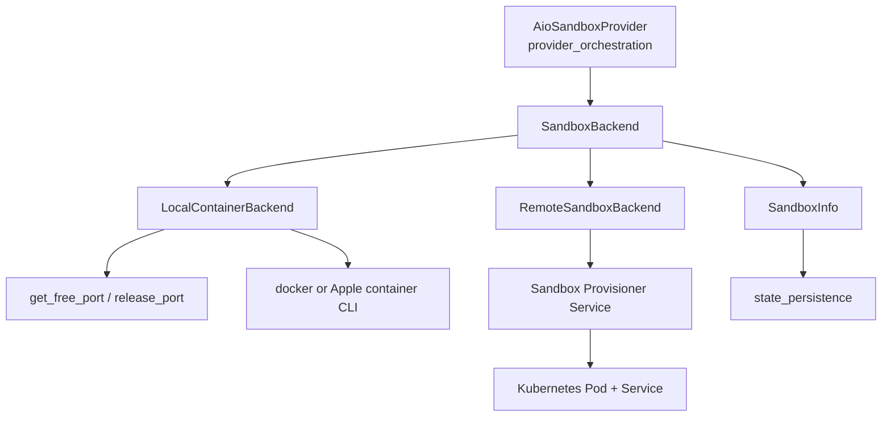
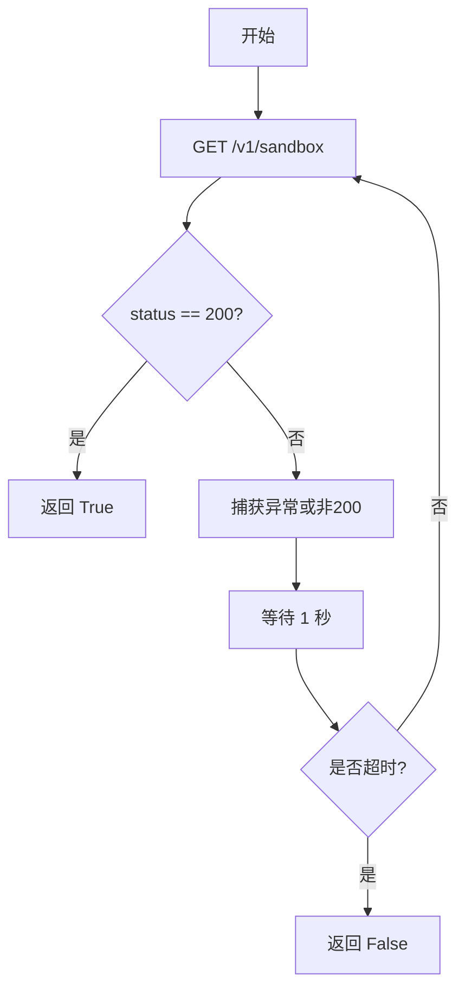
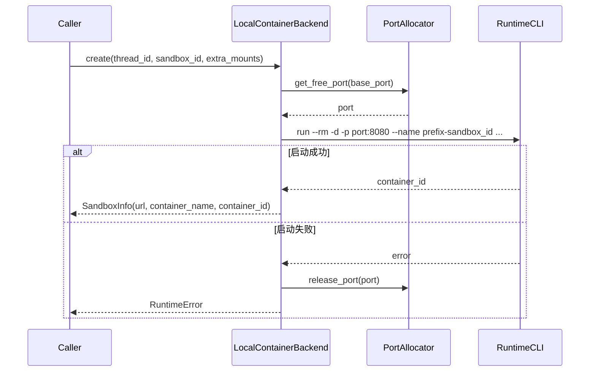
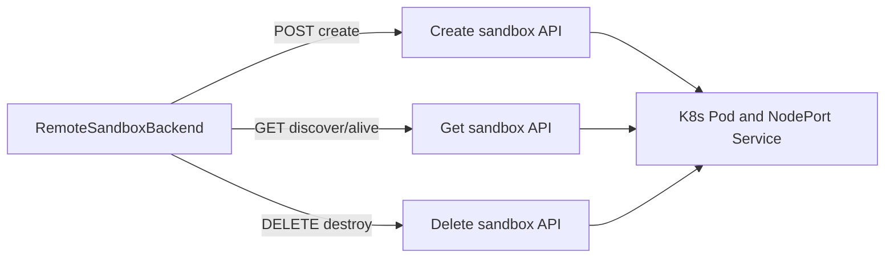
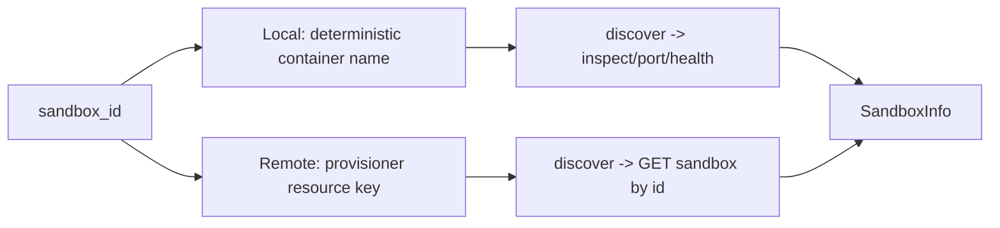

# provisioning_backends 模块文档

## 模块简介：它解决了什么问题，为什么独立成模块

`provisioning_backends` 是 `sandbox_aio_community_backend` 中专门负责“沙箱供给（provisioning）”的子模块。它的职责并不是定义沙箱能力本身（例如执行代码、文件读写），而是回答一个更基础的问题：**当上层需要一个可访问的 sandbox URL 时，底层应该如何创建、发现、销毁这个运行实例**。

在系统设计上，这个模块将“生命周期编排”与“基础设施实现”解耦。上层（如 `AioSandboxProvider`）只关心语义动作：获取、复用、恢复、释放；而本模块关心具体落地方式：本地启动容器，还是通过远程 provisioner 创建 K8s Pod/Service。通过 `SandboxBackend` 抽象，系统可以在不改上层业务流程的情况下切换执行环境，这也是该模块存在的核心价值。

如果你对整体流程还不熟悉，建议先阅读 [provider_orchestration](provider_orchestration.md) 了解 `AioSandboxProvider` 的 acquire/recover 逻辑，再回到本文看 backend 层细节。

---

## 模块边界与依赖关系

从模块边界看，`provisioning_backends` 只处理“资源供给动作”，不负责状态持久化、不负责线程级映射、不负责调用沙箱内部 API。它的输出是 `SandboxInfo`（包含 URL、ID 以及可选容器信息），供上层继续管理。



这张图反映了关键事实：

- 上层只依赖抽象 `SandboxBackend`，不直接耦合 Docker/K8s。
- 本地与远程实现最终都返回统一的 `SandboxInfo`，因此上层流程保持一致。
- 状态持久化在别的模块完成（见 [state_persistence](state_persistence.md)），本模块只产出元数据。

---

## 核心组件一：`SandboxBackend`（抽象契约）

`SandboxBackend` 定义了所有 provisioning backend 必须实现的四个方法：`create`、`destroy`、`is_alive`、`discover`。这四个方法构成了最小闭环：创建、清理、探活、恢复。

### 1) `create(thread_id, sandbox_id, extra_mounts=None) -> SandboxInfo`

该方法用于“新建或接入”一个沙箱实例。参数语义是：

- `thread_id`：线程上下文标识，供后端按线程组织资源。
- `sandbox_id`：确定性 ID，是跨进程恢复的锚点。
- `extra_mounts`：额外挂载列表 `(host_path, container_path, read_only)`，通常本地容器后端会使用。

返回值为 `SandboxInfo`，至少应包含 `sandbox_id` 与可访问的 `sandbox_url`。

### 2) `destroy(info) -> None`

释放资源。实现可以是：

- 本地模式：停止容器并回收端口。
- 远程模式：调用 provisioner 删除 Pod/Service。

该方法通常应遵循“幂等 + best effort”的思路，避免因为清理阶段异常影响主流程稳定性。

### 3) `is_alive(info) -> bool`

轻量存活检查，强调低成本、低延迟。它通常不做完整业务健康探测，而是检查容器/POD 是否处于运行态。

### 4) `discover(sandbox_id) -> SandboxInfo | None`

跨进程恢复核心方法。基于确定性 `sandbox_id` 尝试找到已存在资源；找到且可用则返回 `SandboxInfo`，否则返回 `None`。

---

## 关键辅助函数：`wait_for_sandbox_ready(sandbox_url, timeout=30)`

该函数在 `backend.py` 中实现，用于轮询 `${sandbox_url}/v1/sandbox`，直到 ready 或超时。它的行为特征是：

- 每次请求 `timeout=5` 秒；
- 捕获 `requests.exceptions.RequestException` 并继续重试；
- 每轮 sleep 1 秒；
- 收到 HTTP 200 立即返回 `True`，超时返回 `False`。



这个函数很重要，因为“资源已创建”不等于“服务已可用”。它在本地发现流程中用作最终可达性验证。

---

## 核心组件二：`LocalContainerBackend`

`LocalContainerBackend` 是本地容器实现，支持 Docker 与 Apple Container（macOS）。它通过确定性容器命名 + 端口分配 + CLI 查询能力，提供可恢复的本地沙箱运行模式。

### 构造参数与内部状态

构造函数参数：

- `image: str`：要启动的沙箱镜像。
- `base_port: int`：端口扫描起点。
- `container_prefix: str`：容器名前缀，用于形成确定性命名。
- `config_mounts: list`：配置文件里的固定挂载项（通常来自 `VolumeMountConfig`）。
- `environment: dict[str, str]`：注入到容器内的环境变量。

初始化时会调用 `_detect_runtime()` 自动选择运行时，并可通过 `runtime` 属性读取结果（`docker` 或 `container`）。

### 运行时探测：`_detect_runtime()`

- 在 macOS 上，优先执行 `container --version`；成功则使用 Apple Container。
- 否则回退到 Docker。
- 在非 macOS 平台，默认 Docker。

这个策略让开发机（尤其是 Mac）与服务器环境可共享同一后端实现，减少配置分叉。

### `create()` 内部工作流

`create()` 的顺序是：

1. 生成确定性容器名：`{container_prefix}-{sandbox_id}`。
2. 通过 `get_free_port(start_port=base_port)` 分配主机端口。
3. 调用 `_start_container()` 启动容器。
4. 若启动失败，立即 `release_port(port)`，避免端口泄漏。
5. 返回 `SandboxInfo`（含 `sandbox_url/container_name/container_id`）。



### `_start_container()` 命令构建细节

该方法会逐项拼接命令：

- 基础命令：`[runtime, "run"]`
- Docker 附加项：`--security-opt seccomp=unconfined`
- 生命周期与网络：`--rm -d -p {port}:8080 --name {container_name}`
- 环境变量：逐个追加 `-e KEY=VALUE`
- 固定挂载：来自 `config_mounts`
- 临时挂载：来自 `extra_mounts`
- 最后追加镜像名

失败时捕获 `subprocess.CalledProcessError` 并抛出 `RuntimeError`，错误文本包含 CLI stderr，便于排障。

### `destroy()`

`destroy()` 会尝试：

1. 若有 `container_id`，调用 `_stop_container()`；
2. 从 `sandbox_url` 解析端口并 `release_port()`。

它吞掉 URL 解析异常，因此在 URL 格式异常时可能无法回收端口。

### `is_alive()` 与 `discover()`

- `is_alive()`：只依赖 `_is_container_running(container_name)`，属于“容器态探活”。
- `discover()`：执行三段验证：
  1) 容器是否运行；
  2) 能否拿到映射端口；
  3) API 健康检查是否通过（`wait_for_sandbox_ready(timeout=5)`）。

任一步失败都返回 `None`。这使恢复过程更保守：宁愿不恢复，也不返回不可用实例。

### 使用示例

```python
from src.community.aio_sandbox.local_backend import LocalContainerBackend

backend = LocalContainerBackend(
    image="my-sandbox:latest",
    base_port=18080,
    container_prefix="deer-flow-sandbox",
    config_mounts=[],
    environment={"NODE_ENV": "production"},
)

info = backend.create(thread_id="thread-1", sandbox_id="sbx-001")
print(info.sandbox_url)
```

---

## 核心组件三：`RemoteSandboxBackend`

`RemoteSandboxBackend` 是一个“远程控制面客户端”。它不直接创建容器，而是将生命周期请求转发给 provisioner 服务（通常由其对接 K8s API 创建 Pod + Service）。

### 构造与属性

- `__init__(provisioner_url: str)`：保存服务地址并去掉末尾 `/`。
- `provisioner_url` 属性：返回规范化地址。

### 四个抽象方法如何映射到 HTTP API

- `create()` → `POST /api/sandboxes`
- `destroy()` → `DELETE /api/sandboxes/{sandbox_id}`
- `is_alive()` → `GET /api/sandboxes/{sandbox_id}` 并判断 `status == "Running"`
- `discover()` → `GET /api/sandboxes/{sandbox_id}`（404 视为不存在）



### 关键私有方法与错误语义

`_provisioner_create()`：请求失败会抛 `RuntimeError`。这是硬失败语义，因为调用方必须知道创建未完成。

`_provisioner_destroy()`：失败仅 warning，不抛异常。体现清理路径 best-effort 原则。

`_provisioner_is_alive()`：异常时直接返回 `False`，避免探活影响主流程。

`_provisioner_discover()`：

- 404 返回 `None`（正常不存在）；
- 其他请求异常也返回 `None`（恢复流程容错）；
- 成功时返回 `SandboxInfo(sandbox_id, sandbox_url)`。

关于 provisioner 端 API 数据结构与部署方式，请参考 [sandbox_provisioner_service](sandbox_provisioner_service.md)。

---

## 进程内/跨进程行为与恢复语义

`provisioning_backends` 能支持跨进程恢复，关键不在“共享内存”，而在“确定性寻址”。

在本地后端中，容器名由 `container_prefix + sandbox_id` 构成，任何进程都能据此执行 `inspect/port` 找回实例；在远程后端中，`sandbox_id` 被用作 provisioner 的查询主键。也就是说，只要 `sandbox_id` 生成规则稳定，`discover()` 就可以重建连接信息。



---

## 配置与落地示例

### 本地容器模式（典型）

```yaml
sandbox:
  use: src.community.aio_sandbox:AioSandboxProvider
  image: enterprise-public-cn-beijing.cr.volces.com/vefaas-public/all-in-one-sandbox:latest
  port: 8080
  auto_start: true
  container_prefix: deer-flow-sandbox
  mounts:
    - host_path: /data/shared
      container_path: /mnt/shared
      read_only: false
  environment:
    API_KEY: ${MY_API_KEY}
    NODE_ENV: production
```

### 远程 provisioner 模式

```yaml
sandbox:
  use: src.community.aio_sandbox:AioSandboxProvider
  provisioner_url: http://provisioner:8002
```

完整配置项来源与字段含义可参考 [application_and_feature_configuration](application_and_feature_configuration.md)。

---

## 扩展新 backend 的实现建议

若你要新增一个 backend（例如对接云厂商沙箱服务），建议直接实现 `SandboxBackend` 并严格遵守以下行为约束：

- `create()` 返回的 `sandbox_url` 必须是上层可直接访问的地址。
- `discover()` 必须与 `create()` 使用同一定位规则（同一 `sandbox_id` 必须可复现定位）。
- `is_alive()` 保持轻量，不要引入重操作。
- `destroy()` 尽量幂等，即便资源已不存在也不应引发不可控失败。

```python
from src.community.aio_sandbox.backend import SandboxBackend
from src.community.aio_sandbox.sandbox_info import SandboxInfo

class MyBackend(SandboxBackend):
    def create(self, thread_id, sandbox_id, extra_mounts=None) -> SandboxInfo:
        return SandboxInfo(sandbox_id=sandbox_id, sandbox_url="http://example")

    def destroy(self, info: SandboxInfo) -> None:
        pass

    def is_alive(self, info: SandboxInfo) -> bool:
        return True

    def discover(self, sandbox_id: str) -> SandboxInfo | None:
        return None
```

---

## 边界条件、错误场景与运维注意事项

### 1) 本地端口与容器状态可能短暂不一致

`create()` 先拿端口再启容器，若启动失败会释放端口；但在极端异常（进程崩溃）下仍可能出现端口状态残留。建议配合端口工具与容器清理任务做周期巡检，详见 [backend_operational_utilities](backend_operational_utilities.md)。

### 2) `destroy()` 不是强一致事务

本地后端 stop 失败只 warning；远程后端 delete 失败也只 warning。换句话说，销毁是 best-effort，不保证立刻完成。若你在高并发回收场景下依赖强一致释放，需要在上层增加重试与审计。

### 3) 健康检查路径是硬编码契约

`wait_for_sandbox_ready()` 固定检查 `/v1/sandbox`。若替换镜像后健康端点不兼容，会导致 discover 判定失败。自定义镜像时必须保持该 API 契约，或同步改动检查逻辑。

### 4) Docker 安全选项的权衡

本地 Docker 模式默认添加 `seccomp=unconfined`，提升兼容性但降低隔离强度。生产环境应结合安全策略评估是否需要替换为更严格配置。

### 5) 网络抖动会影响远程 discover/alive 结果

`RemoteSandboxBackend` 在请求异常时常返回 `None/False`，这是容错设计，不代表资源一定不存在。运维排查时应同时检查 provisioner 与 K8s 实际状态。

---

## 与其他文档的阅读路径

为了避免重复，建议按以下顺序阅读：

1. [sandbox_aio_community_backend](sandbox_aio_community_backend.md)：先理解社区沙箱总览。
2. [provider_orchestration](provider_orchestration.md)：理解上层 acquire/recover 策略。
3. 本文 `provisioning_backends`：理解本地/远程供给实现。
4. [state_persistence](state_persistence.md)：理解 `SandboxInfo` 如何落盘与恢复。
5. [sandbox_provisioner_service](sandbox_provisioner_service.md)：理解远程 API 契约和服务端行为。

通过这条路径，你可以从抽象到实现、从控制平面到数据平面建立完整认知。
