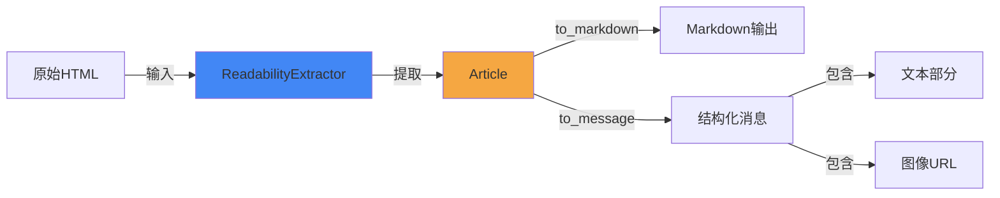

# 可读性工具模块 (readability_utilities)

## 概述

可读性工具模块是一个用于从 HTML 内容中提取、处理和转换可读内容的实用工具模块。它的主要目的是从网页 HTML 中提取有意义的文章内容，并将其转换为适合在应用程序中使用的格式，如 Markdown 或结构化消息格式。

这个模块解决了从复杂的网页 HTML 中提取核心内容的挑战，能够去除导航栏、广告、页脚等无关元素，专注于文章的主要内容。它被设计为后端系统中的一个基础工具组件，为其他模块提供内容提取和转换功能。

## 核心组件

### Article 类

`Article` 类是一个数据容器和内容转换器，负责存储提取的文章内容并提供将其转换为不同格式的方法。

#### 主要属性

- `url`: 文章的源 URL（用于解析相对路径的图像链接）
- `title`: 文章标题
- `html_content`: 提取的 HTML 格式的文章内容

#### 方法

##### `__init__(self, title: str, html_content: str)`

初始化 Article 对象，设置标题和 HTML 内容。

**参数：**
- `title`: 文章标题
- `html_content`: HTML 格式的文章内容

##### `to_markdown(self, including_title: bool = True) -> str`

将文章内容转换为 Markdown 格式。

**参数：**
- `including_title`: 是否在输出中包含标题（默认为 True）

**返回值：**
- Markdown 格式的文章内容字符串

**工作原理：**
1. 如果 `including_title` 为 True，首先添加标题作为一级标题
2. 检查 HTML 内容是否为空或只包含空白字符
3. 如果内容有效，使用 `markdownify` 库将 HTML 转换为 Markdown
4. 如果内容为空，返回默认的 "No content available" 提示

##### `to_message(self) -> list[dict]`

将文章内容转换为结构化的消息格式，适合用于 AI 对话系统。

**返回值：**
- 包含文本和图像 URL 的字典列表，每个字典有 `type` 字段标识内容类型

**工作原理：**
1. 首先将文章转换为 Markdown 格式
2. 使用正则表达式分离文本和图像链接
3. 对于图像链接，使用 `urljoin` 和存储的 `url` 属性将相对路径转换为绝对 URL
4. 创建结构化的消息列表，交替包含文本和图像
5. 确保即使所有处理后内容为空，也会返回一个默认的 "No content available" 消息

### ReadabilityExtractor 类

`ReadabilityExtractor` 是一个内容提取器，负责从原始 HTML 字符串中提取文章内容。

#### 方法

##### `extract_article(self, html: str) -> Article`

从 HTML 字符串中提取文章内容并创建 Article 对象。

**参数：**
- `html`: 原始 HTML 字符串

**返回值：**
- 包含提取内容的 Article 对象

**工作原理：**
1. 使用 `readabilipy` 库的 `simple_json_from_html_string` 函数从 HTML 中提取结构化内容
2. 获取提取的内容和标题
3. 如果内容为空或无效，设置默认的内容提示
4. 如果标题为空或无效，设置默认的 "Untitled" 标题
5. 创建并返回 Article 对象

## 架构与工作流程



## 使用示例

### 基本用法

```python
from backend.src.utils.readability import ReadabilityExtractor

# 创建提取器实例
extractor = ReadabilityExtractor()

# 假设我们有一些HTML内容
html_content = """
<html>
    <head><title>示例文章</title></head>
    <body>
        <h1>这是文章标题</h1>
        <p>这是文章的第一段内容。</p>
        <p>这是文章的第二段内容，包含一张图片：</p>
    </body>
</html>
"""

# 提取文章
article = extractor.extract_article(html_content)
article.url = "https://example.com/article"  # 设置源URL以便解析相对路径

# 转换为Markdown
markdown = article.to_markdown()
print(markdown)

# 转换为消息格式
message = article.to_message()
print(message)
```

## 配置与依赖

### 依赖项

- `markdownify`: 用于将 HTML 转换为 Markdown
- `readabilipy`: 用于从 HTML 中提取可读内容

### 安装依赖

```bash
pip install markdownify readabilipy
```

## 注意事项与限制

1. **HTML 质量依赖性**：
   - 提取质量高度依赖于输入 HTML 的结构和质量
   - 对于非标准或严重损坏的 HTML，提取效果可能不佳

2. **内容类型限制**：
   - 主要设计用于提取文章类内容，对于非文章类网页效果可能不理想
   - 对于需要JavaScript渲染的动态内容，需要先获取渲染后的HTML

3. **图像处理**：
   - `to_message()` 方法依赖于正确设置 `url` 属性来解析相对路径
   - 不会验证图像URL的有效性或可用性

4. **错误处理**：
   - 当前实现采用"优雅降级"策略，不抛出异常，而是返回合理的默认值
   - 在极端情况下可能返回默认的 "No content available" 消息

## 相关模块

- 此模块常与网络获取模块配合使用，用于处理抓取的网页内容
- 其输出可直接用于与 [agent_memory_and_thread_context](agent_memory_and_thread_context.md) 模块中的记忆系统集成
- 结构化消息格式可用于 [agent_execution_middlewares](agent_execution_middlewares.md) 中的中间件处理
