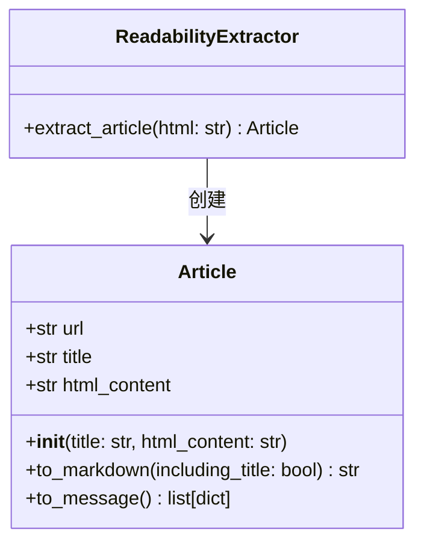
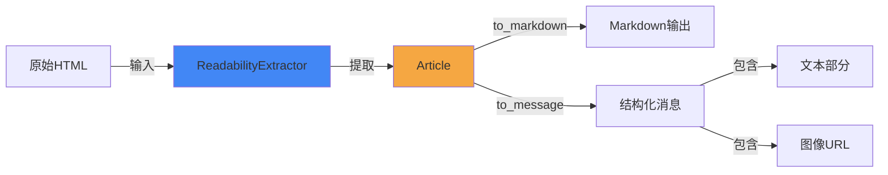

# 可读性工具模块 (readability_utilities)

## 概述

可读性工具模块是一个用于从 HTML 内容中提取、处理和转换可读内容的实用工具模块。它的主要目的是从网页 HTML 中提取有意义的文章内容，并将其转换为适合在应用程序中使用的格式，如 Markdown 或结构化消息格式。

这个模块解决了从复杂的网页 HTML 中提取核心内容的挑战，能够去除导航栏、广告、页脚等无关元素，专注于文章的主要内容。它被设计为后端系统中的一个基础工具组件，为其他模块提供内容提取和转换功能。

## 核心组件

### 类关系图



### Article 类

`Article` 类是一个数据容器和内容转换器，负责存储提取的文章内容并提供将其转换为不同格式的方法。

#### 主要属性

- `url`: 文章的源 URL（用于解析相对路径的图像链接）
- `title`: 文章标题
- `html_content`: 提取的 HTML 格式的文章内容

#### 方法

##### `__init__(self, title: str, html_content: str)`

初始化 Article 对象，设置标题和 HTML 内容。

**参数：**
- `title`: 文章标题
- `html_content`: HTML 格式的文章内容

##### `to_markdown(self, including_title: bool = True) -> str`

将文章内容转换为 Markdown 格式。

**参数：**
- `including_title`: 是否在输出中包含标题（默认为 True）

**返回值：**
- Markdown 格式的文章内容字符串

**工作原理：**
1. 如果 `including_title` 为 True，首先添加标题作为一级标题
2. 检查 HTML 内容是否为空或只包含空白字符
3. 如果内容有效，使用 `markdownify` 库将 HTML 转换为 Markdown
4. 如果内容为空，返回默认的 "No content available" 提示

##### `to_message(self) -> list[dict]`

将文章内容转换为结构化的消息格式，适合用于 AI 对话系统。

**返回值：**
- 包含文本和图像 URL 的字典列表，每个字典有 `type` 字段标识内容类型

**工作原理：**
1. 首先将文章转换为 Markdown 格式
2. 使用正则表达式分离文本和图像链接
3. 对于图像链接，使用 `urljoin` 和存储的 `url` 属性将相对路径转换为绝对 URL
4. 创建结构化的消息列表，交替包含文本和图像
5. 确保即使所有处理后内容为空，也会返回一个默认的 "No content available" 消息

### ReadabilityExtractor 类

`ReadabilityExtractor` 是一个内容提取器，负责从原始 HTML 字符串中提取文章内容。

#### 方法

##### `extract_article(self, html: str) -> Article`

从 HTML 字符串中提取文章内容并创建 Article 对象。

**参数：**
- `html`: 原始 HTML 字符串

**返回值：**
- 包含提取内容的 Article 对象

**工作原理：**
1. 使用 `readabilipy` 库的 `simple_json_from_html_string` 函数从 HTML 中提取结构化内容
2. 获取提取的内容和标题
3. 如果内容为空或无效，设置默认的内容提示
4. 如果标题为空或无效，设置默认的 "Untitled" 标题
5. 创建并返回 Article 对象

## 架构与工作流程



### 工作流程说明

1. **内容提取阶段**：
   - `ReadabilityExtractor` 接收原始 HTML 作为输入
   - 使用 `readabilipy` 库应用可读性算法提取主要内容
   - 处理提取结果，确保内容和标题有效

2. **内容存储阶段**：
   - 创建 `Article` 对象存储提取的标题和内容
   - 可选择设置源 URL 以便后续处理相对链接

3. **内容转换阶段**：
   - 根据需要调用 `to_markdown()` 或 `to_message()` 方法
   - `to_markdown()` 生成适合存储或显示的纯文本格式
   - `to_message()` 生成适合 AI 处理的结构化格式，分离文本和图像

## 使用示例

### 基本用法

```python
from backend.src.utils.readability import ReadabilityExtractor

# 创建提取器实例
extractor = ReadabilityExtractor()

# 假设我们有一些HTML内容
html_content = """
<html>
    <head><title>示例文章</title></head>
    <body>
        <h1>这是文章标题</h1>
        <p>这是文章的第一段内容。</p>
        <p>这是文章的第二段内容，包含一张图片：</p>
    </body>
</html>
"""

# 提取文章
article = extractor.extract_article(html_content)
article.url = "https://example.com/article"  # 设置源URL以便解析相对路径

# 转换为Markdown
markdown = article.to_markdown()
print(markdown)

# 转换为消息格式
message = article.to_message()
print(message)
```

### 在Web爬虫中使用

```python
import requests
from backend.src.utils.readability import ReadabilityExtractor

def extract_article_from_url(url):
    # 获取网页内容
    response = requests.get(url)
    response.raise_for_status()
    
    # 提取文章
    extractor = ReadabilityExtractor()
    article = extractor.extract_article(response.text)
    article.url = url  # 设置源URL
    
    return article

# 使用示例
article = extract_article_from_url("https://example.com/some-article")
print(f"标题: {article.title}")
print(f"内容(Markdown):\n{article.to_markdown()}")
```

## 配置与依赖

### 依赖项

- `markdownify`: 用于将 HTML 转换为 Markdown
- `readabilipy`: 用于从 HTML 中提取可读内容

### 安装依赖

```bash
pip install markdownify readabilipy
```

## 注意事项与限制

### 边界情况处理

模块已经内置了对以下边界情况的处理：

1. **空 HTML 输入**：
   - 如果传入的 HTML 为空或只包含空白字符，`ReadabilityExtractor.extract_article()` 仍会返回一个有效的 Article 对象
   - 标题会设置为 "Untitled"，内容会设置为 "No content could be extracted from this page"

2. **提取内容为空**：
   - 即使 HTML 不为空，但可读性算法无法提取有效内容时，也会返回默认内容
   - `Article.to_markdown()` 和 `Article.to_message()` 都会检查内容是否有效，并在必要时提供默认消息

3. **相对 URL 处理**：
   - `Article.to_message()` 方法能够正确处理相对 URL，但需要先设置 `Article.url` 属性
   - 如果未设置 URL，图像链接可能无法正确解析

### 错误处理策略

当前实现采用了"优雅降级"的错误处理策略：

- 不抛出异常，而是返回合理的默认值
- 确保方法始终返回有效数据类型，避免 `None` 值
- 提供用户友好的默认消息（如 "No content available"）

### HTML 质量依赖性

- 提取质量高度依赖于输入 HTML 的结构和质量
- 对于非标准或严重损坏的 HTML，提取效果可能不佳

### 内容类型限制

- 主要设计用于提取文章类内容，对于非文章类网页（如首页、目录页）效果可能不理想
- 对于需要JavaScript渲染的动态内容，需要先获取渲染后的HTML

### 图像处理

- `to_message()` 方法依赖于正确设置 `url` 属性来解析相对路径
- 不会验证图像URL的有效性或可用性

### 性能考虑

- 对于非常大的HTML文档，提取过程可能需要较长时间
- 建议在处理大量内容时考虑使用异步处理或批处理

## 扩展与开发

### 自定义内容提取

可以通过继承 `ReadabilityExtractor` 类并重写 `extract_article` 方法来实现自定义的内容提取逻辑：

```python
from backend.src.utils.readability import ReadabilityExtractor, Article

class CustomReadabilityExtractor(ReadabilityExtractor):
    def extract_article(self, html: str) -> Article:
        # 自定义提取逻辑
        # ...
        return Article(title=custom_title, html_content=custom_content)
```

### 增强 Article 类

可以通过继承 `Article` 类来添加更多输出格式或处理功能：

```python
from backend.src.utils.readability import Article

class EnhancedArticle(Article):
    def to_plain_text(self) -> str:
        # 添加纯文本输出功能
        # ...
        pass
    
    def summarize(self, max_length: int = 500) -> str:
        # 添加内容摘要功能
        # ...
        pass
```

## 实际应用场景

### 与 AI 助手集成

这个模块非常适合用于增强 AI 助手处理网页内容的能力。例如，当用户请求 AI 助手分析某个网页时：

```python
from backend.src.utils.readability import ReadabilityExtractor
import requests

def analyze_webpage(url, question):
    # 获取网页内容
    response = requests.get(url)
    response.raise_for_status()
    
    # 提取可读内容
    extractor = ReadabilityExtractor()
    article = extractor.extract_article(response.text)
    article.url = url
    
    # 准备 AI 提示
    context = article.to_markdown()
    
    # 构建 AI 提示
    prompt = f"""请基于以下文章内容回答问题。
    
文章标题: {article.title}
文章内容:
{context}

问题: {question}
"""
    
    return prompt

# 使用示例
prompt = analyze_webpage(
    "https://example.com/ai-article", 
    "这篇文章的主要观点是什么？"
)
print(prompt)
```

### 构建网页内容存档系统

这个模块也可以用于构建网页内容存档系统，保存网页的主要内容而非整个 HTML：

```python
from backend.src.utils.readability import ReadabilityExtractor
import requests
from datetime import datetime
import json

def archive_webpage(url):
    # 获取网页
    response = requests.get(url)
    response.raise_for_status()
    
    # 提取内容
    extractor = ReadabilityExtractor()
    article = extractor.extract_article(response.text)
    article.url = url
    
    # 创建存档记录
    archive = {
        "url": url,
        "title": article.title,
        "content_markdown": article.to_markdown(),
        "archived_at": datetime.now().isoformat(),
        "content_messages": article.to_message()
    }
    
    # 保存存档
    with open(f"archive_{hash(url)}.json", "w", encoding="utf-8") as f:
        json.dump(archive, f, ensure_ascii=False, indent=2)
    
    return archive

# 使用示例
archive = archive_webpage("https://example.com/important-article")
print(f"已存档: {archive['title']}")
```

## 相关模块

- 此模块常与网络获取模块配合使用，用于处理抓取的网页内容
- 其输出可直接用于与 [agent_memory_and_thread_context](agent_memory_and_thread_context.md) 模块中的记忆系统集成
- 结构化消息格式可用于 [agent_execution_middlewares](agent_execution_middlewares.md) 中的中间件处理

## 总结

可读性工具模块是一个简单而强大的工具，专门设计用于从复杂的 HTML 页面中提取和转换有意义的内容。通过结合 `readabilipy` 和 `markdownify` 库，它能够：

- 智能地识别和提取网页中的主要文章内容
- 将 HTML 内容转换为易于处理的 Markdown 格式
- 生成适合 AI 系统使用的结构化消息格式
- 正确处理图像链接，支持相对路径转换为绝对 URL

该模块采用"优雅降级"的设计哲学，确保在各种边界情况下都能返回有用的结果，而不是抛出异常。这使得它非常适合集成到更大的系统中，作为内容处理管道的一部分。

无论是用于构建 AI 助手、网页存档系统还是内容聚合平台，这个模块都提供了一个坚实的基础，可以根据具体需求进行扩展和定制。
