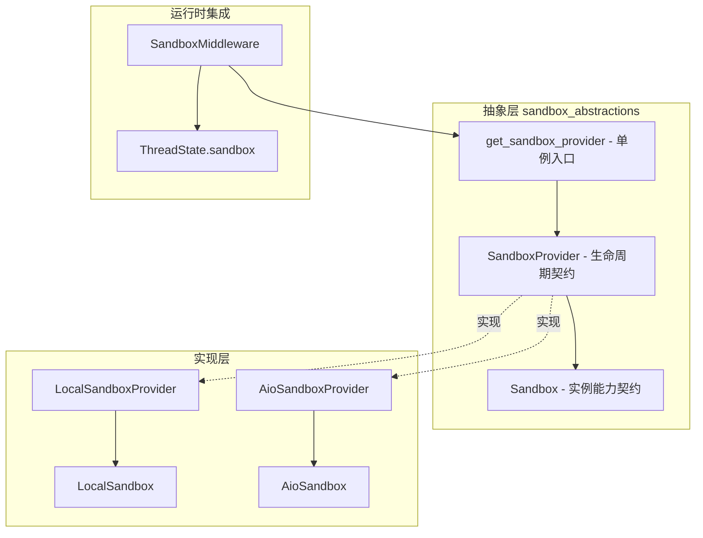
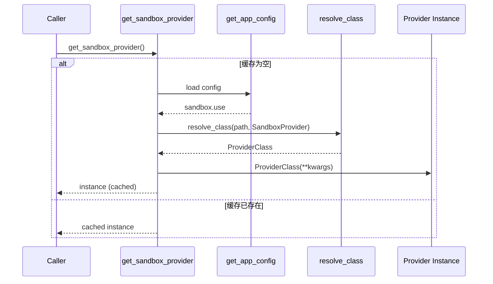
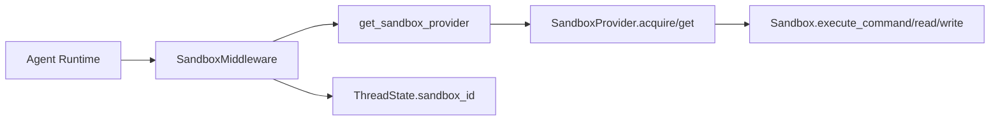
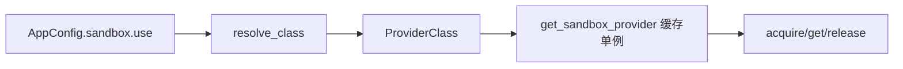
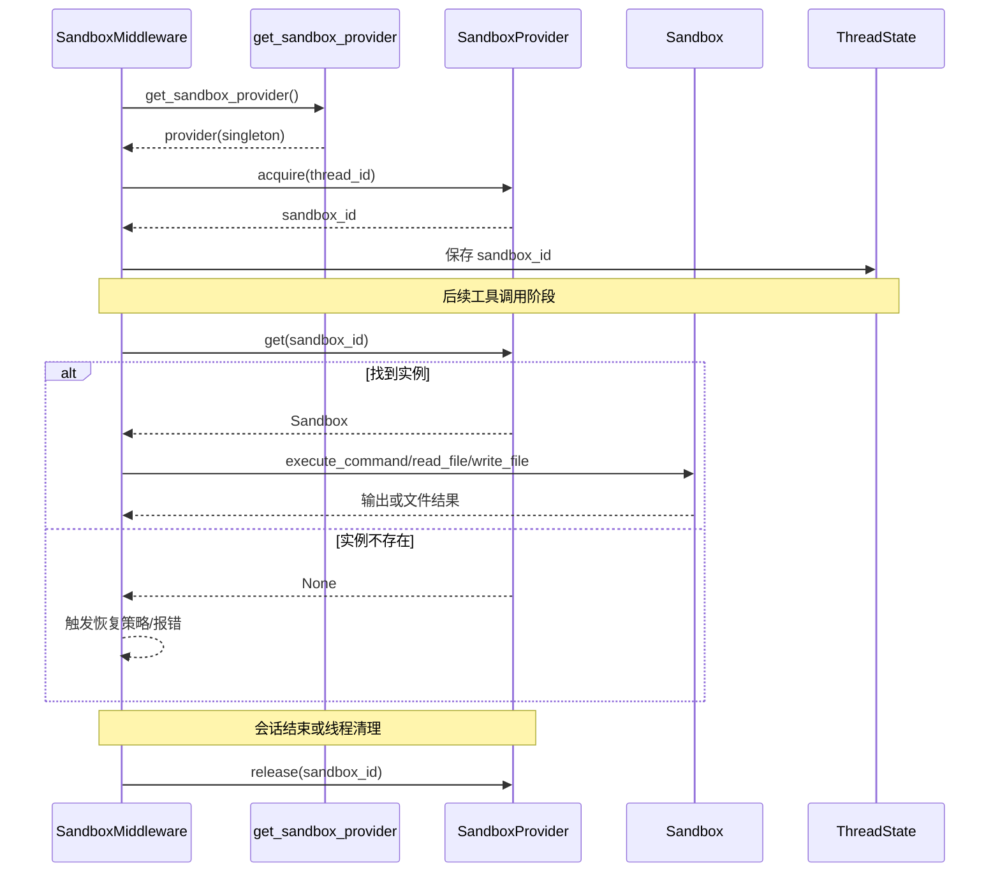

# sandbox_abstractions 模块文档

## 1. 模块定位与存在意义

`sandbox_abstractions` 是整个沙箱子系统的“抽象契约层”，核心只包含两个组件：`Sandbox` 与 `SandboxProvider`。它不直接实现容器管理、命令执行细节或线程绑定逻辑，而是定义“任何沙箱实现都必须遵循的最小能力边界”。这种设计将“接口稳定性”与“实现可替换性”分离开来：上层 Agent 与中间件只依赖抽象，不绑定具体后端（本地、容器、远程服务）。

从工程角度看，这个模块解决的是典型的运行时解耦问题。Agent 在执行工具时需要统一地执行 shell 命令、读写文件、列目录，但不同部署环境对隔离、性能、可观测性和运维策略要求差异很大。如果没有抽象层，业务逻辑会不可避免地掺入大量后端判断分支，最终导致维护复杂度迅速增长。`sandbox_abstractions` 通过强制统一的 API 面，保证上游逻辑可长期稳定，同时允许下游实现自由演进。

你可以把它理解为：`Sandbox` 定义“单个沙箱实例能做什么”，`SandboxProvider` 定义“系统如何分配和管理沙箱实例”。二者组合后，构成了 sandbox runtime 的最小核心协议。

---

## 2. 核心组件总览

当前模块包含以下核心抽象：

- `backend.src.sandbox.sandbox.Sandbox`
- `backend.src.sandbox.sandbox_provider.SandboxProvider`
- 辅助函数：`get_sandbox_provider`、`reset_sandbox_provider`、`shutdown_sandbox_provider`、`set_sandbox_provider`

虽然只有少量代码，但它们决定了整个系统的沙箱生命周期、实现注入方式与运行时行为基线。具体的本地实现可参考 [sandbox_core_runtime.md](sandbox_core_runtime.md) 与 [sandbox_aio_community_backend.md](sandbox_aio_community_backend.md)。

---

## 3. 架构关系与系统集成



这张图反映了一个关键边界：`sandbox_abstractions` 只提供协议，不处理业务流程。真正把沙箱接到 Agent 生命周期的是 `SandboxMiddleware`（见 [sandbox_core_runtime.md](sandbox_core_runtime.md)），而真正执行命令与文件操作的是具体实现（本地或容器化后端）。因此当你排查问题时，先区分“契约层问题”还是“实现层问题”通常能显著缩小范围。

---

## 4. `Sandbox` 抽象：单实例能力契约

### 4.1 设计目的

`Sandbox` 是一个 `ABC`（抽象基类），用来规范任何沙箱实例必须支持的基本能力。它把上层需要的操作收敛为 5 类：命令执行、文件读取、目录遍历、文本写入、二进制更新。这一组 API 足以覆盖大多数工具执行场景，同时避免过度暴露底层实现细节。

### 4.2 字段与初始化

`Sandbox` 内部维护 `_id: str`，通过构造函数注入并通过 `id` 属性只读暴露。这个 ID 是 provider 生命周期管理的锚点：中间件或运行时通常只保存 `sandbox_id`，需要时再从 provider 取回实例。

```python
class Sandbox(ABC):
    _id: str

    def __init__(self, id: str):
        self._id = id

    @property
    def id(self) -> str:
        return self._id
```

### 4.3 抽象方法逐项说明

#### `execute_command(command: str) -> str`

该方法定义“在沙箱中执行 bash 命令并返回输出”。抽象层不规定 shell 类型、超时策略、stderr 拼接格式或返回码表达方式，这些由实现自行决定。因此上层调用方不能假设某种固定输出模板，只能把返回值当作“面向用户/模型的执行结果文本”。

常见实现副作用包括：创建临时文件、访问挂载目录、触发系统命令、消耗 CPU/内存。对生产后端而言，这里通常还会叠加资源限制与审计。

#### `read_file(path: str) -> str`

读取指定绝对路径的文本内容。抽象层不约束编码探测与错误处理形式（例如不存在、权限不足、二进制文件误读），因此实现应尽量在文档或异常中明确语义。

#### `list_dir(path: str, max_depth=2) -> list[str]`

列出目录内容，并提供深度控制参数。`max_depth` 默认值为 2，这个默认行为对大目录有保护意义，可避免一次请求返回过大结果。抽象层未强制返回排序规则或路径格式（绝对/相对），实现应保持一致性。

#### `write_file(path: str, content: str, append: bool = False) -> None`

以文本方式写文件。`append=False` 表示创建或覆盖，`append=True` 表示追加。该方法典型副作用是创建父目录、覆盖旧数据、触发权限检查。

#### `update_file(path: str, content: bytes) -> None`

以二进制方式更新文件，常用于图片、压缩包、模型产物等非文本内容。它与 `write_file` 分离，避免文本编码路径与二进制路径混用。

### 4.4 契约约束与实现建议

`Sandbox` 只定义“必须有这些能力”，但没有定义线程安全、原子写、事务回滚等高级保证。实现者应根据后端特性补充：

- 明确异常模型（抛异常 vs 返回错误文本）；
- 明确路径语义（虚拟路径、挂载路径、宿主路径映射）；
- 明确命令执行限制（超时、黑白名单、资源配额）；
- 明确编码与换行规范，避免跨平台行为漂移。

---

## 5. `SandboxProvider` 抽象：生命周期管理契约

### 5.1 职责边界

`SandboxProvider` 负责“拿到沙箱、查找沙箱、释放沙箱”，也就是资源生命周期管理，不负责执行具体命令。它是连接 Agent 线程上下文与沙箱实例池（或单例）的关键层。

```python
class SandboxProvider(ABC):
    @abstractmethod
    def acquire(self, thread_id: str | None = None) -> str: ...

    @abstractmethod
    def get(self, sandbox_id: str) -> Sandbox | None: ...

    @abstractmethod
    def release(self, sandbox_id: str) -> None: ...
```

### 5.2 方法语义

#### `acquire(thread_id: str | None = None) -> str`

申请一个沙箱并返回 ID。`thread_id` 是可选参数，意味着 provider 可以选择按线程复用、按请求新建，或完全忽略线程信息（如 `LocalSandboxProvider` 的全局单例策略）。

#### `get(sandbox_id: str) -> Sandbox | None`

根据 ID 获取沙箱实例。返回 `None` 表示找不到或已释放。调用方需要处理空值分支，不能默认一定存在。

#### `release(sandbox_id: str) -> None`

释放沙箱资源。抽象层不要求“必须销毁进程/容器”，也允许 no-op（本地单例实现即如此）。但对于有成本的后端（容器、远程实例），这是控制资源泄露的核心操作。

### 5.3 与线程状态的关系

在线程模型中，`ThreadState.sandbox.sandbox_id` 只保存标识而不保存对象本身，这使状态可序列化且跨进程兼容。真正使用时再通过 provider 反查实例。对应 schema 见 [thread_state_schema.md](thread_state_schema.md)。

---

## 6. Provider 单例入口与动态装配机制

`sandbox_provider.py` 除了抽象类，还提供了全局 provider 管理函数，形成一套“懒加载 + 单例缓存 + 可注入替换”的机制。

### 6.1 `get_sandbox_provider(**kwargs)`

该函数读取应用配置 `config.sandbox.use`，通过反射函数 `resolve_class` 动态解析 provider 类，并将实例缓存到 `_default_sandbox_provider`。后续调用直接复用缓存。



这里的动态装配保证了部署环境可通过配置切换后端，不必修改业务代码。配置结构请参考 [application_and_feature_configuration.md](application_and_feature_configuration.md) 中的 `SandboxConfig`。

### 6.2 `reset_sandbox_provider()`

该函数仅清理缓存引用，不调用 provider 的 shutdown/释放逻辑。它适用于测试隔离或快速切换配置，但存在资源孤儿风险（例如容器仍在后台运行）。

### 6.3 `shutdown_sandbox_provider()`

该函数会先检测当前 provider 是否有 `shutdown` 方法，有则调用后再清空缓存。它是推荐的“安全重置”方式，尤其在应用退出或热重载时应优先使用。

### 6.4 `set_sandbox_provider(provider)`

直接注入自定义 provider，典型用于单元测试、集成测试或临时替身实现。由于是全局覆盖，测试场景要注意恢复现场，避免跨用例污染。

---

## 7. 与其他模块的协作关系

`sandbox_abstractions` 本身是“被依赖者”，并不主动驱动流程。实际协作链路通常如下：



`SandboxMiddleware` 负责何时创建沙箱（eager/lazy）以及将 `sandbox_id` 写入线程状态，这部分行为属于运行时编排，详见 [sandbox_core_runtime.md](sandbox_core_runtime.md)。如果你关注容器后端如何实现 acquire/release 与状态存储，则应查看 [sandbox_aio_community_backend.md](sandbox_aio_community_backend.md)。

---

## 8. 使用方式与典型模式

### 8.1 基础调用示例

```python
from src.sandbox.sandbox_provider import get_sandbox_provider

provider = get_sandbox_provider()
sandbox_id = provider.acquire(thread_id="thread-123")

sandbox = provider.get(sandbox_id)
if sandbox is None:
    raise RuntimeError(f"Sandbox {sandbox_id} not found")

result = sandbox.execute_command("pwd && ls -la")
sandbox.write_file("/mnt/user-data/workspace/note.txt", "hello")
content = sandbox.read_file("/mnt/user-data/workspace/note.txt")

provider.release(sandbox_id)
```

### 8.2 测试替身注入示例

```python
from src.sandbox.sandbox_provider import set_sandbox_provider, reset_sandbox_provider

class FakeProvider(...):
    ...

set_sandbox_provider(FakeProvider())
# run tests...
reset_sandbox_provider()
```

这种方式可以绕开真实容器启动，提高测试速度；但请确保测试结束后重置全局单例。

---

## 9. 扩展指南：如何实现新的 SandboxProvider

实现新后端时，推荐按“先契约、后策略”的顺序推进。先完整实现 `Sandbox` 与 `SandboxProvider` 的抽象方法，再补充调度、缓存、回收策略。这样可以确保最小可用路径先跑通，再逐步优化。

一个最小可行实现至少应回答以下问题：

1. `acquire` 是每次新建、按线程复用，还是对象池租赁；
2. `get` 在实例失效时返回 `None` 还是抛异常；
3. `release` 是同步销毁还是标记空闲；
4. `execute_command` 如何处理超时、stderr、exit code；
5. 文件 API 的路径如何映射到隔离文件系统。

如果你要实现容器或远程沙箱，建议以社区后端为参考：[sandbox_aio_community_backend.md](sandbox_aio_community_backend.md)。

---

## 10. 边界条件、错误场景与运维注意事项

### 10.1 单例缓存的隐性副作用

`get_sandbox_provider` 使用进程级全局缓存。优点是减少重复初始化成本，缺点是跨请求共享状态。若 provider 内部持有可变状态（连接池、容器映射、租约记录），并发访问时必须自行保证线程安全。

### 10.2 `reset` 与 `shutdown` 语义差异

很多资源泄露问题来自误用 `reset_sandbox_provider`。它不会清理底层资源，只是丢弃 Python 引用。生产环境应优先调用 `shutdown_sandbox_provider`，让 provider 有机会释放容器/网络连接/临时目录。

### 10.3 `get(...)->None` 的空值分支

调用方常见误区是直接对 `provider.get(id)` 的结果执行方法。契约明确允许返回 `None`，所以必须显式判空，否则会触发二次错误并掩盖真正问题（如沙箱已过期）。

### 10.4 输出格式不统一风险

`execute_command` 返回 `str`，但抽象层未统一 stderr 与 exit code 的排版。不同实现若格式差异较大，可能影响上层解析逻辑或提示词行为。若业务依赖稳定格式，建议在调用层增加规范化适配。

### 10.5 安全边界不在抽象层保证

抽象层不会自动提供安全隔离。真正的隔离能力取决于具体实现。例如本地实现可能直接执行宿主命令，不适合不可信代码。生产场景应使用具备容器隔离与资源限制的 provider。

---

## 11. 设计取舍总结

`sandbox_abstractions` 的代码非常短，但它承载了系统层面的关键取舍：通过最小抽象稳定上层接口，通过动态装配保持实现可替换，通过单例入口降低集成复杂度。它有意把复杂性“下沉”到实现层和中间件层，因此阅读时不要期待在这里看到完整业务流程；正确方式是把它当作契约源头，再结合 [sandbox_core_runtime.md](sandbox_core_runtime.md) 与 [sandbox_aio_community_backend.md](sandbox_aio_community_backend.md) 理解完整运行路径。


---

## 12. 配置驱动装配与运行时行为

`get_sandbox_provider()` 的核心价值，是把“使用哪个 provider”从代码中抽离到配置中。根据 `sandbox_provider.py` 的实现，它会读取 `get_app_config()` 返回的 `config.sandbox.use`，然后用 `resolve_class` 动态加载目标类。也就是说，应用层不需要 import 某个具体 provider，只要提供可解析的类路径即可完成后端切换。

一个典型配置片段（字段名以实际 `SandboxConfig` 为准）可以表达为：

```yaml
sandbox:
  use: "src.sandbox.local.local_sandbox_provider.LocalSandboxProvider"
```

如果要切换到社区 AIO 实现，通常只需要替换 `use` 指向的类路径，并确保对应依赖已安装、运行时参数可用。配置结构与字段定义请参考 [application_and_feature_configuration.md](application_and_feature_configuration.md)。



这条链路解释了为什么该模块被称为 abstraction：业务代码只看见 `SandboxProvider` 接口，而非具体类名。其直接收益是部署环境切换成本低，测试替换也更自然。

---

## 13. 组件交互与调用时序（细化）

下面的时序图给出一个完整请求周期：中间件为线程准备沙箱，工具执行时通过 provider 取回实例，最终在合适时机释放。



这里有一个容易忽视的点：`sandbox_abstractions` 并不规定何时 `acquire`、何时 `release`，这些策略属于编排层。也正因如此，不同部署形态可以采用不同生命周期策略（按线程长期持有、按请求短租、池化复用）。

---

## 14. 实现者检查清单（面向扩展）

当你实现新的 `Sandbox` 或 `SandboxProvider` 时，建议在提交前逐项自检：

- 是否对 `execute_command` 约定了超时、错误输出与返回内容格式。
- 是否对 `read_file` / `write_file` / `update_file` 的编码与路径安全边界给出明确语义。
- 是否确保 `get` 在沙箱失效时返回 `None`（或在上层有一致异常策略）。
- 是否提供可预测的资源回收策略，并在 `shutdown`（若实现）中统一回收。
- 是否在并发场景下保护内部映射结构（尤其是 `sandbox_id -> sandbox instance`）。
- 是否在测试中覆盖“重复 release”“释放后 get”“reset 未 shutdown”等退化路径。

这份清单不是框架硬约束，但它覆盖了本模块最常见的线上故障来源：资源泄漏、状态不一致、并发竞态与错误语义漂移。
