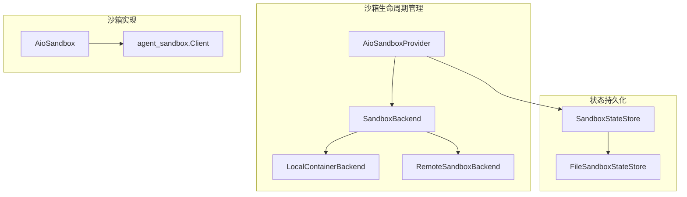

# sandbox_aio_community_backend 模块文档

## 概述

`sandbox_aio_community_backend` 模块提供了一个灵活、可扩展的沙箱环境管理系统，用于安全地执行代码和操作。该模块是整个系统的核心组件之一，负责管理沙箱的生命周期、资源分配和状态维护。

### 设计理念

该模块采用了分层架构设计，通过抽象接口将沙箱的创建、管理和状态持久化分离，实现了高度的灵活性和可扩展性。主要设计原则包括：

1. **后端抽象**：通过 `SandboxBackend` 抽象接口支持多种沙箱实现（本地容器、远程 Kubernetes 等）
2. **状态持久化**：通过 `SandboxStateStore` 接口实现跨进程的沙箱状态共享
3. **线程安全**：提供多进程和多线程安全的沙箱访问机制
4. **资源管理**：自动处理沙箱的创建、复用和释放，包括空闲超时管理

### 核心功能

- 支持本地 Docker/Apple Container 和远程 Kubernetes 两种部署模式
- 跨进程沙箱发现和状态共享
- 线程安全的沙箱获取和释放机制
- 自动空闲超时清理
- 优雅的关闭处理
- 支持线程特定的目录挂载和技能目录挂载

## 架构设计

### 整体架构图



### 核心组件关系

该模块由以下核心组件组成，每个组件都有明确的职责：

1. **AioSandboxProvider**：核心协调器，负责管理沙箱的获取、释放和生命周期
2. **SandboxBackend**：抽象接口，定义沙箱的创建、销毁和发现方法
3. **LocalContainerBackend**：本地容器后端实现，管理 Docker 或 Apple Container
4. **RemoteSandboxBackend**：远程后端实现，与 provisioner 服务交互
5. **SandboxStateStore**：状态存储抽象接口，用于跨进程状态共享
6. **FileSandboxStateStore**：基于文件的状态存储实现
7. **AioSandbox**：沙箱实现，封装与沙箱容器的交互
8. **SandboxInfo**：沙箱元数据，用于跨进程发现和状态持久化

## 子模块说明

### 沙箱提供器 (aio_sandbox_provider)

该子模块包含 `AioSandboxProvider` 类，是整个沙箱管理系统的核心。它负责协调沙箱的创建、获取和释放，处理线程安全和跨进程状态同步。详细信息请参考 [aio_sandbox_provider 子模块文档](aio_sandbox_provider.md)。

### 沙箱实现 (aio_sandbox)

该子模块包含 `AioSandbox` 类，提供了与沙箱容器交互的具体实现。它封装了命令执行、文件读写等核心功能。详细信息请参考 [aio_sandbox 子模块文档](aio_sandbox.md)。

### 后端抽象 (backend)

该子模块定义了 `SandboxBackend` 抽象基类和 `wait_for_sandbox_ready` 辅助函数，为不同的沙箱实现提供统一的接口。详细信息请参考 [backend 子模块文档](backend.md)。

### 本地容器后端 (local_backend)

该子模块包含 `LocalContainerBackend` 类，实现了本地 Docker 或 Apple Container 的沙箱管理。详细信息请参考 [local_backend 子模块文档](local_backend.md)。

### 远程沙箱后端 (remote_backend)

该子模块包含 `RemoteSandboxBackend` 类，实现了与远程 provisioner 服务交互的沙箱管理。详细信息请参考 [remote_backend 子模块文档](remote_backend.md)。

### 状态存储 (state_store 和 file_state_store)

这些子模块定义了状态存储的抽象接口和基于文件的实现，用于跨进程的沙箱状态共享。详细信息请参考 [state_store 子模块文档](state_store.md)。

### 沙箱信息 (sandbox_info)

该子模块包含 `SandboxInfo` 数据类，用于存储沙箱的元数据信息。详细信息请参考 [sandbox_info 子模块文档](sandbox_info.md)。

## 与其他模块的关系

`sandbox_aio_community_backend` 模块与以下模块有紧密的依赖关系：

1. **sandbox_core_runtime**：提供了 `Sandbox` 和 `SandboxProvider` 抽象基类
2. **application_and_feature_configuration**：提供了配置管理功能
3. **backend_operational_utilities**：提供了网络端口分配等工具功能

在使用该模块时，请确保正确配置了相关依赖模块。

## 使用指南

### 基本配置

在 `config.yaml` 中配置沙箱提供器：

```yaml
sandbox:
  use: src.community.aio_sandbox:AioSandboxProvider
  image: enterprise-public-cn-beijing.cr.volces.com/vefaas-public/all-in-one-sandbox:latest
  port: 8080
  auto_start: true
  container_prefix: deer-flow-sandbox
  idle_timeout: 600
  mounts:
    - host_path: /path/on/host
      container_path: /path/in/container
      read_only: false
  environment:
    NODE_ENV: production
    API_KEY: $MY_API_KEY
```

### 获取和使用沙箱

```python
from src.community.aio_sandbox.aio_sandbox_provider import AioSandboxProvider

# 创建提供器实例
provider = AioSandboxProvider()

# 为线程获取沙箱
sandbox_id = provider.acquire(thread_id="my-thread-id")

# 获取沙箱实例
sandbox = provider.get(sandbox_id)

# 执行命令
output = sandbox.execute_command("ls -la")

# 读取文件
content = sandbox.read_file("/path/to/file.txt")

# 写入文件
sandbox.write_file("/path/to/file.txt", "Hello, World!")

# 释放沙箱（可选，空闲超时会自动处理）
provider.release(sandbox_id)
```

### 远程部署模式

对于远程 Kubernetes 部署，配置如下：

```yaml
sandbox:
  use: src.community.aio_sandbox:AioSandboxProvider
  provisioner_url: http://provisioner:8002
```

## 注意事项和限制

1. **本地容器后端**：需要确保 Docker 或 Apple Container 服务正常运行
2. **文件状态存储**：在多主机部署中需要共享存储（如 PVC）
3. **空闲超时**：设置合理的空闲超时值以避免资源浪费
4. **线程安全**：虽然提供了线程安全机制，但在高并发场景下仍需注意性能
5. **环境变量**：配置环境变量时，以 `$` 开头的值会从系统环境变量中解析

更多详细信息请参考各子模块的文档。
