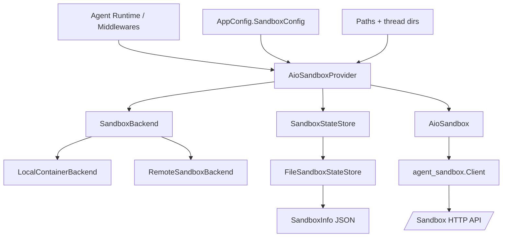
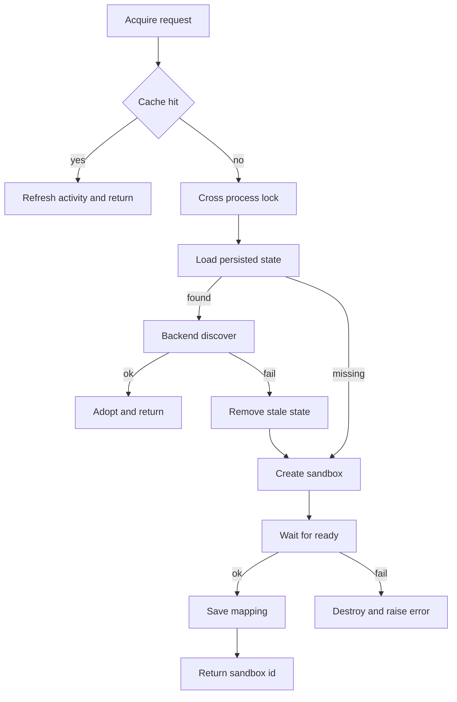

# sandbox_aio_community_backend 模块文档

## 1. 模块简介：它解决了什么问题，为什么存在

`sandbox_aio_community_backend` 是 `sandbox_core_runtime` 在社区版中的一套“可落地沙箱后端实现”，目标是让 Agent 在多轮对话中拥有**可复用、可恢复、可回收**的执行环境。它不仅负责“启动一个沙箱”，还要解决真实生产中更棘手的问题：同一个 `thread_id` 在多进程下如何稳定复用同一沙箱、进程重启后如何恢复连接、如何避免并发重复建箱、以及如何在空闲后自动释放资源。

该模块采用“编排层 + 供给层 + 状态层”的设计：

- 编排层由 `AioSandboxProvider` 主导，管理 acquire/recover/release/shutdown 全生命周期；
- 供给层通过 `SandboxBackend` 抽象隔离本地容器与远程 provisioner 两种资源模式；
- 状态层通过 `SandboxStateStore` 持久化 thread→sandbox 映射，保障跨进程一致性。

这套设计让上层 Agent 逻辑只依赖统一的 `SandboxProvider/Sandbox` 抽象，不需要感知底层是 Docker、Apple Container 还是 K8s Pod。

---

## 2. 架构总览



上图展示了模块的核心协作关系：`AioSandboxProvider` 位于中心位置，向下组合“怎么创建资源”（backend）和“怎么持久化状态”（state store），向上提供稳定的 `SandboxProvider` 语义，向侧边消费配置与路径系统。`AioSandbox` 负责具体沙箱 API 操作封装（命令执行、文件读写等）。

---

## 3. 核心流程（高层）

### 3.1 Acquire 与跨进程恢复



这个流程是模块价值的核心：持久化状态只是“恢复线索”，最终是否可复用由 backend 发现与健康检查共同决定。因此它既能避免盲目信任陈旧状态，也能减少不必要重建。

### 3.2 释放与空闲清理

`AioSandboxProvider` 通过后台线程按固定间隔扫描 `_last_activity`，对超时沙箱执行 `release()`。`release()` 会按“内存状态 → 持久化映射 → 后端资源”顺序清理，确保不会长期持有无效映射。`shutdown()` 是幂等的，会停止清理线程并尽力释放所有缓存沙箱。

---

## 4. 子模块导航（详细说明请看子文档）

### 4.1 编排与运行时接入 — [provider_orchestration.md](provider_orchestration.md)

该文档详细解释 `AioSandboxProvider` 与 `AioSandbox` 的内部实现，包括三层一致性策略、thread 级锁与跨进程锁组合、信号处理、空闲回收线程、以及 `execute_command/read_file/write_file/update_file` 的行为差异。若你在排查“同一线程为何未复用沙箱”或“为什么 shutdown 没有释放干净”，应从这个文档开始。

### 4.2 资源供给后端 — [provisioning_backends.md](provisioning_backends.md)

该文档聚焦 `SandboxBackend` 契约与两类实现：`LocalContainerBackend`（Docker/Apple Container）和 `RemoteSandboxBackend`（Provisioner/K8s）。它覆盖端口分配、容器命令构造、discover 机制、健康探测、HTTP 错误处理等关键细节。若你遇到“容器起不来/远程 Pod 不可达”的问题，这里是主入口。

### 4.3 状态持久化与并发互斥 — [state_persistence.md](state_persistence.md)

该文档说明 `SandboxStateStore` 抽象、`FileSandboxStateStore` 的 JSON + `fcntl` 锁实现，以及 `SandboxInfo` 的序列化兼容语义。重点在于为什么它能避免多进程重复建箱，以及为什么在共享存储缺失时会失去跨实例复用能力。

---

## 5. 与其他模块的关系（避免重复阅读）

- 抽象基类来源：[`sandbox_core_runtime.md`](sandbox_core_runtime.md)（`Sandbox` / `SandboxProvider`）。
- 配置来源：[`application_and_feature_configuration.md`](application_and_feature_configuration.md)（`SandboxConfig`、`VolumeMountConfig`、路径与环境变量策略）。
- 端口工具依赖：[`backend_operational_utilities.md`](backend_operational_utilities.md)（`get_free_port/release_port` 所在工具域）。
- 远程 provisioner 接口契约：[`sandbox_provisioner_service.md`](sandbox_provisioner_service.md)。
- 若要理解线程上下文如何驱动沙箱复用，可结合 [`agent_memory_and_thread_context.md`](agent_memory_and_thread_context.md)。

---

## 6. 配置与使用（快速上手）

### 本地容器模式

```yaml
sandbox:
  use: src.community.aio_sandbox:AioSandboxProvider
  image: enterprise-public-cn-beijing.cr.volces.com/vefaas-public/all-in-one-sandbox:latest
  port: 8080
  auto_start: true
  container_prefix: deer-flow-sandbox
  idle_timeout: 600
  mounts:
    - host_path: /path/on/host
      container_path: /path/in/container
      read_only: false
  environment:
    NODE_ENV: production
    API_KEY: $MY_API_KEY
```

### 远程 provisioner 模式

```yaml
sandbox:
  use: src.community.aio_sandbox:AioSandboxProvider
  provisioner_url: http://provisioner:8002
  idle_timeout: 900
```

### 使用示例

```python
from src.community.aio_sandbox.aio_sandbox_provider import AioSandboxProvider

provider = AioSandboxProvider()
sandbox_id = provider.acquire(thread_id="thread-001")
sandbox = provider.get(sandbox_id)

if sandbox is None:
    raise RuntimeError("sandbox not found")

print(sandbox.execute_command("pwd"))
sandbox.write_file("/workspace/demo.txt", "hello")
print(sandbox.read_file("/workspace/demo.txt"))

provider.release(sandbox_id)
```

---

## 7. 关键风险、边界条件与已知限制

1. `FileSandboxStateStore` 依赖共享文件系统；多机无共享存储时，跨实例恢复会失效。  
2. `AioSandbox.execute_command/read_file` 失败时返回 `"Error: ..."` 字符串而非抛异常，调用方要做显式判定。  
3. `list_dir` 基于 shell `find` 命令拼接，路径来源必须可信（避免命令注入风险）。  
4. 健康检查路径固定为 `/v1/sandbox`，自定义镜像需保持该契约。  
5. 空闲清理是周期扫描而非精确 TTL，释放存在秒级到分钟级延迟。  
6. 环境变量 `$NAME` 解析不到时会得到空字符串，不会自动报错，部署时建议加启动前校验。

---

## 8. 扩展建议

- 新增 backend：实现 `SandboxBackend` 四个方法，重点保证 `discover(sandbox_id)` 与 `create()` 定位规则一致。  
- 新增 state store：实现 `SandboxStateStore`，关键是 `lock(thread_id)` 的跨进程互斥语义（如 Redis 分布式锁）。  
- 扩展 sandbox 操作能力：在保持 `Sandbox` 抽象兼容的前提下增强 `AioSandbox`，避免影响上层中间件调用。

如果你是首次接手该模块，推荐阅读顺序：

1) 本文（系统视角） → 2) [provider_orchestration.md](provider_orchestration.md) → 3) [provisioning_backends.md](provisioning_backends.md) → 4) [state_persistence.md](state_persistence.md)。
