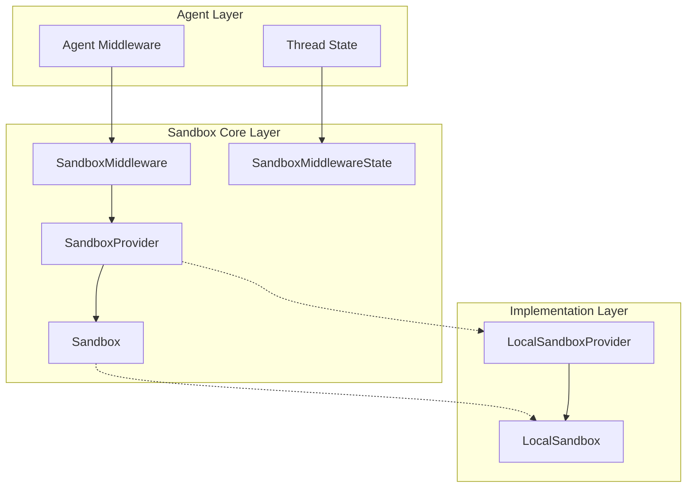
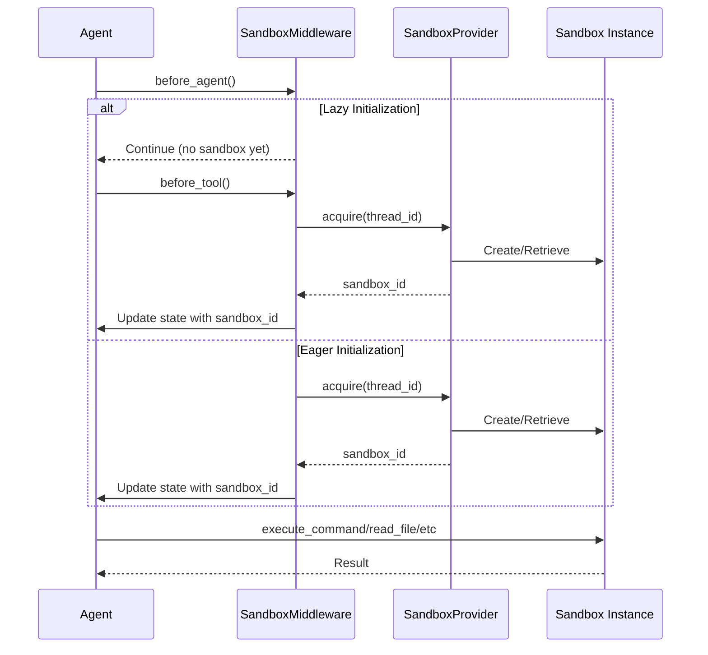

# Sandbox Core Runtime Module Documentation

## 1. Introduction

The Sandbox Core Runtime module provides a secure, isolated environment for executing code and commands within the agent system. This module is designed to separate untrusted code execution from the main application environment while still providing necessary file system operations and command execution capabilities.

### Purpose and Design Rationale

The primary purpose of this module is to create a standardized interface for sandbox environments that can be implemented with different backends (local, Docker-based, remote, etc.). The design follows an abstract factory pattern where:

- `Sandbox` defines the core interface for interacting with sandbox environments
- `SandboxProvider` manages the lifecycle of sandbox instances
- Middleware integrates sandbox functionality with the agent execution flow
- Concrete implementations (like `LocalSandbox`) provide specific backend functionality

This architecture allows the system to switch between different sandbox implementations without changing the core agent logic, making it flexible for development, testing, and production deployments.

### Key Problems Solved

1. **Isolation**: Provides a layer of isolation between agent-executed code and the host system
2. **Standardization**: Creates a uniform interface for sandbox operations across different implementations
3. **Lifecycle Management**: Handles acquisition, reuse, and cleanup of sandbox environments
4. **Path Mapping**: Enables consistent file path handling between containerized and local environments
5. **Agent Integration**: Seamlessly integrates sandbox capabilities with the agent middleware system

## 2. Architecture Overview

The Sandbox Core Runtime module follows a layered architecture with clear separation of concerns:



### Component Relationships

1. **SandboxMiddleware**: Integrates sandbox functionality with the agent execution flow, managing sandbox acquisition and state.
2. **SandboxProvider**: Abstract interface for acquiring and managing sandbox instances, with concrete implementations like LocalSandboxProvider.
3. **Sandbox**: Abstract base class defining the core operations that any sandbox implementation must support.
4. **LocalSandbox**: A concrete implementation that uses the local file system and command execution, suitable for development.
5. **State Components**: SandboxMiddlewareState and related state types maintain sandbox information within the agent's thread state.

### Data Flow



## 3. Sub-modules

The Sandbox Core Runtime module consists of the following key sub-modules:

### Core Interfaces

The core interfaces (`Sandbox` and `SandboxProvider`) define the contract that all sandbox implementations must follow. These interfaces abstract the underlying implementation details and provide a consistent API for working with sandbox environments. The `Sandbox` interface focuses on the actual operations within the sandbox (command execution, file operations), while `SandboxProvider` handles the lifecycle management of sandbox instances.

### Middleware Integration

The middleware component (`SandboxMiddleware`) integrates sandbox functionality with the agent execution flow. It manages the acquisition of sandbox environments, associates them with agent threads, and ensures proper state management. The middleware supports both lazy initialization (acquiring sandbox on first tool use) and eager initialization (acquiring sandbox at agent start), providing flexibility for different use cases.

### Local Implementation

The local implementation provides a development-friendly sandbox that uses the host machine's file system and command execution environment. This implementation includes path mapping capabilities to simulate container paths while working on a local file system, making it ideal for development and testing scenarios where full containerization might not be necessary or desirable.

## 4. Usage and Configuration

### Basic Usage

To use the sandbox system, you typically interact with it through the agent middleware or directly via the sandbox provider:

```python
from src.sandbox import get_sandbox_provider

# Get the sandbox provider instance
provider = get_sandbox_provider()

# Acquire a sandbox
sandbox_id = provider.acquire(thread_id="example-thread")

# Get the sandbox instance
sandbox = provider.get(sandbox_id)

# Execute commands
result = sandbox.execute_command("echo 'Hello, Sandbox!'")

# File operations
sandbox.write_file("/tmp/example.txt", "Hello, World!")
content = sandbox.read_file("/tmp/example.txt")
directory_list = sandbox.list_dir("/tmp")

# Release the sandbox when done
provider.release(sandbox_id)
```

### Configuration

The sandbox system is configured through the application configuration. The main configuration options include:

- `sandbox.use`: Specifies which sandbox provider implementation to use
- `skills.container_path`: Path in the sandbox where skills should be mounted
- Skills directory configuration for path mapping

The `LocalSandboxProvider` automatically sets up path mappings based on the skills configuration, mapping the container path for skills to the actual local skills directory.

### Middleware Configuration

The `SandboxMiddleware` can be configured with the following options:

- `lazy_init` (default: `True`): When True, defers sandbox acquisition until the first tool call. When False, acquires the sandbox immediately when the agent starts.

## 5. Key Classes and Components

### Sandbox (Abstract Base Class)

The `Sandbox` abstract base class defines the interface that all sandbox implementations must provide. It includes methods for command execution and file system operations.

**Key Methods:**
- `execute_command(command: str) -> str`: Executes a bash command in the sandbox and returns the output
- `read_file(path: str) -> str`: Reads the content of a file at the specified path
- `list_dir(path: str, max_depth=2) -> list[str]`: Lists directory contents up to the specified depth
- `write_file(path: str, content: str, append: bool = False) -> None`: Writes text content to a file
- `update_file(path: str, content: bytes) -> None`: Writes binary content to a file

### SandboxProvider (Abstract Base Class)

The `SandboxProvider` abstract base class defines the interface for managing sandbox instances.

**Key Methods:**
- `acquire(thread_id: str | None = None) -> str`: Acquires a sandbox environment and returns its ID
- `get(sandbox_id: str) -> Sandbox | None`: Retrieves a sandbox instance by ID
- `release(sandbox_id: str) -> None`: Releases a sandbox environment

**Helper Functions:**
- `get_sandbox_provider(**kwargs) -> SandboxProvider`: Returns the singleton sandbox provider instance
- `reset_sandbox_provider() -> None`: Resets the singleton without proper shutdown
- `shutdown_sandbox_provider() -> None`: Properly shuts down and resets the provider
- `set_sandbox_provider(provider: SandboxProvider) -> None`: Sets a custom sandbox provider instance

### SandboxMiddleware

The `SandboxMiddleware` integrates sandbox functionality with the agent execution flow.

**Key Features:**
- Manages sandbox acquisition and association with agent threads
- Supports both lazy and eager initialization modes
- Maintains sandbox state in the agent's thread state
- Reuses sandboxes across multiple turns within the same thread

**Important Behavior:**
- Sandboxes are NOT released after each agent call to avoid wasteful recreation
- Cleanup typically happens at application shutdown via SandboxProvider.shutdown()
- The middleware is compatible with the `ThreadState` schema

### LocalSandbox

The `LocalSandbox` is a concrete implementation of the `Sandbox` interface that uses the local file system and command execution.

**Key Features:**
- Path mapping between container paths and local paths
- Command execution in the local shell (/bin/zsh)
- File system operations on the local file system
- Automatic resolution and reverse-resolution of paths in commands and output

**Path Mapping:**
The `LocalSandbox` maintains a mapping of container paths to local paths, allowing it to simulate a container environment while using the local file system. This is especially useful for development and testing.

### LocalSandboxProvider

The `LocalSandboxProvider` is a concrete implementation of `SandboxProvider` that manages `LocalSandbox` instances.

**Key Features:**
- Singleton pattern: Always returns the same LocalSandbox instance
- Automatic path mapping setup based on skills configuration
- No-op release method (since it uses a singleton)

## 6. Security Considerations and Limitations

### Security Notes

- The `LocalSandbox` implementation is NOT suitable for production use with untrusted code, as it executes commands directly on the host system.
- Production deployments should use a containerized sandbox implementation like the one provided in the `sandbox_aio_community_backend` module.
- Path mapping in `LocalSandbox` is for development convenience and does not provide security isolation.

### Important Limitations

1. **LocalSandbox Limitations:**
   - Executes commands with the current user's privileges
   - No real isolation from the host system
   - Command timeout is hardcoded to 600 seconds (10 minutes)
   - Uses /bin/zsh specifically, which may not be available on all systems

2. **SandboxMiddleware Limitations:**
   - Sandboxes are not automatically released after agent calls (by design, for reuse)
   - Proper cleanup requires explicit shutdown of the sandbox provider

3. **General Considerations:**
   - The current implementation doesn't handle sandbox resource limits (CPU, memory, disk)
   - There's no built-in mechanism for sandbox persistence beyond the application lifecycle

## 7. Extending the Sandbox System

To create a custom sandbox implementation:

1. Subclass `Sandbox` and implement all abstract methods
2. Subclass `SandboxProvider` and implement the acquisition/retrieval/release logic
3. Register your provider class in the configuration system
4. Update the application configuration to use your new provider

For container-based sandboxes, consider looking at the `sandbox_aio_community_backend` module as a reference implementation.

## 8. Related Modules

- [sandbox_aio_community_backend](sandbox_aio_community_backend.md): Provides a container-based sandbox implementation using Docker
- [agent_execution_middlewares](agent_execution_middlewares.md): Contains other middleware components that work alongside SandboxMiddleware
- [agent_memory_and_thread_context](agent_memory_and_thread_context.md): Defines the thread state types that SandboxMiddleware integrates with
- [application_and_feature_configuration](application_and_feature_configuration.md): Contains the configuration classes used by the sandbox system
