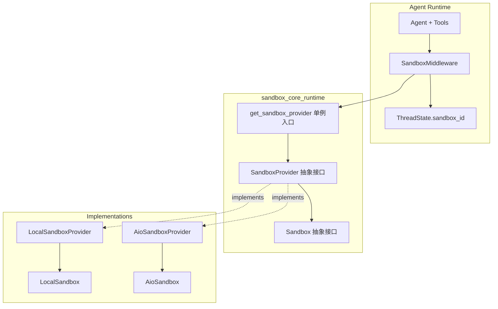
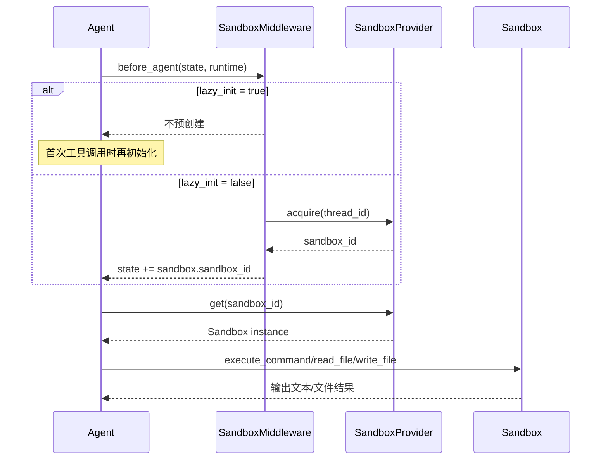

# sandbox_core_runtime 模块文档

## 1. 模块概述

`sandbox_core_runtime` 是整个 Agent 运行时中的“沙箱核心编排层”。它定义统一的沙箱能力接口（执行命令、文件读写、目录浏览）、提供沙箱实例生命周期管理入口（acquire/get/release），并通过中间件把沙箱与会话线程状态绑定起来，使工具调用可以在同一线程内复用同一运行环境。

该模块存在的根本原因是把“Agent 业务逻辑”与“执行环境实现细节”解耦。上层 Agent 不需要知道底层是本地进程、Docker 容器还是远程 provisioner，只依赖统一的 `Sandbox` / `SandboxProvider` 协议即可。这种设计让开发环境可用本地沙箱快速迭代，生产环境可切换到容器隔离后端（见 [sandbox_aio_community_backend.md](sandbox_aio_community_backend.md)），而无需改动业务链路。

## 2. 解决的问题与设计取舍

`sandbox_core_runtime` 重点解决四类问题：第一，统一执行接口，避免工具层散落后端判断；第二，线程级复用，减少每轮对话重复创建环境的开销；第三，配置驱动装配，通过 `sandbox.use` 动态选择 provider；第四，与线程状态系统对齐，在 `ThreadState.sandbox.sandbox_id` 中保存可序列化标识，而非直接持有实例对象。

同时它也做了明确取舍：核心层只定义契约与编排，不内置强隔离能力；安全边界取决于具体 provider。也因此，`LocalSandbox` 适合开发调试，不适合执行不可信代码。

## 3. 架构总览



上图体现了模块边界：`sandbox_core_runtime` 只负责抽象和运行时接入；具体隔离、容器启动、远程通信由实现层承担。对于容器化后端的状态存储、空闲回收、后端抽象，请参考 [sandbox_aio_community_backend.md](sandbox_aio_community_backend.md)。

## 4. 关键执行流



该流程强调一个易错点：默认 `lazy_init=True`，`before_agent` 不一定写入 sandbox。若你的自定义逻辑在工具调用前就强依赖 `sandbox_id`，需要改为 eager 模式或在工具入口执行初始化保障逻辑。

## 5. 子模块说明（按职责拆分）

### 5.1 抽象契约层：`sandbox_abstractions`

该子模块定义 `Sandbox` 与 `SandboxProvider` 的稳定协议，以及全局 provider 单例管理函数（`get_sandbox_provider` / `shutdown_sandbox_provider` 等）。它是可替换后端的基础，不关心具体执行细节。详见 [sandbox_abstractions.md](sandbox_abstractions.md)。

### 5.2 Agent 绑定层：`agent_sandbox_binding`

该子模块实现 `SandboxMiddlewareState` 与 `SandboxMiddleware`，负责把沙箱生命周期挂到 Agent middleware 流程中，并把 `sandbox_id` 回写到线程状态。它决定 eager/lazy 初始化行为，是“策略入口”。详见 [agent_sandbox_binding.md](agent_sandbox_binding.md)。

### 5.3 本地运行时层：`local_sandbox_runtime`

该子模块提供 `LocalSandbox` 与 `LocalSandboxProvider`。前者实现本地命令执行和文件操作，并支持容器路径到本地路径的双向映射；后者以单例方式提供本地沙箱实例，便于开发调试。详见 [local_sandbox_runtime.md](local_sandbox_runtime.md)。

## 6. 与其他模块的关系

- 与 [application_and_feature_configuration.md](application_and_feature_configuration.md)：读取 `AppConfig.sandbox`（尤其 `sandbox.use`）决定 provider 装配；本地 provider 还会读取 skills 路径配置。
- 与 [agent_memory_and_thread_context.md](agent_memory_and_thread_context.md) / [thread_state_schema.md](thread_state_schema.md)：`SandboxMiddlewareState` 需与线程状态 schema 兼容（`sandbox`, `thread_data` 字段）。
- 与 [agent_execution_middlewares.md](agent_execution_middlewares.md)：`SandboxMiddleware` 通常与 `ThreadDataMiddleware`、Uploads 等中间件协同工作。
- 与 [sandbox_aio_community_backend.md](sandbox_aio_community_backend.md)：后者是生产导向实现层，前者是核心契约+接入层。

## 7. 使用与配置

最小配置示例：

```yaml
sandbox:
  use: src.sandbox.local.local_sandbox_provider:LocalSandboxProvider

skills:
  path: ../skills
  container_path: /mnt/skills
```

典型调用：

```python
from src.sandbox.sandbox_provider import get_sandbox_provider

provider = get_sandbox_provider()
sandbox_id = provider.acquire(thread_id="t-1")
sandbox = provider.get(sandbox_id)

output = sandbox.execute_command("pwd && ls -la")
```

中间件接入：

```python
from src.sandbox.middleware import SandboxMiddleware

middlewares = [
    SandboxMiddleware(lazy_init=True),
]
```

## 8. 错误条件、边界与限制

1. **thread_id 缺失**：eager 模式下 `runtime.context["thread_id"]` 缺失会直接失败。
2. **Provider 单例副作用**：全局缓存提高性能，但测试和热重载场景需显式 `shutdown_sandbox_provider()`，否则可能遗留资源。
3. **LocalSandbox 安全限制**：使用 `shell=True` + 宿主机权限，不可用于不可信输入。
4. **输出格式一致性**：`execute_command` 返回纯文本，不同 provider 的 stderr/exit code 排版可能不同；上层若依赖结构化解析需自行规范化。
5. **释放策略差异**：中间件默认不在每次调用后 release，资源回收依赖 provider 实现（如 idle timeout 或 shutdown）。

## 9. 扩展建议

如果要新增沙箱后端，推荐顺序是：先完整实现 `Sandbox` 与 `SandboxProvider` 抽象方法，再接入 `sandbox.use` 配置动态装配，最后补充回收策略（idle timeout / shutdown）与可观测性（结构化日志、trace tags）。

若目标是生产不可信代码执行，应优先沿 [sandbox_aio_community_backend.md](sandbox_aio_community_backend.md) 路线扩展容器/远程隔离能力，而不是在 `LocalSandbox` 上叠加安全补丁。

## 10. 参考文档索引

本文作为总览，具体实现细节已拆分到以下子模块文档，请按“抽象契约 → Agent 绑定 → 本地实现”的顺序阅读：

- [sandbox_abstractions.md](sandbox_abstractions.md)
- [agent_sandbox_binding.md](agent_sandbox_binding.md)
- [local_sandbox_runtime.md](local_sandbox_runtime.md)
- [sandbox_aio_community_backend.md](sandbox_aio_community_backend.md)
- [application_and_feature_configuration.md](application_and_feature_configuration.md)
- [thread_state_schema.md](thread_state_schema.md)
- [agent_execution_middlewares.md](agent_execution_middlewares.md)
