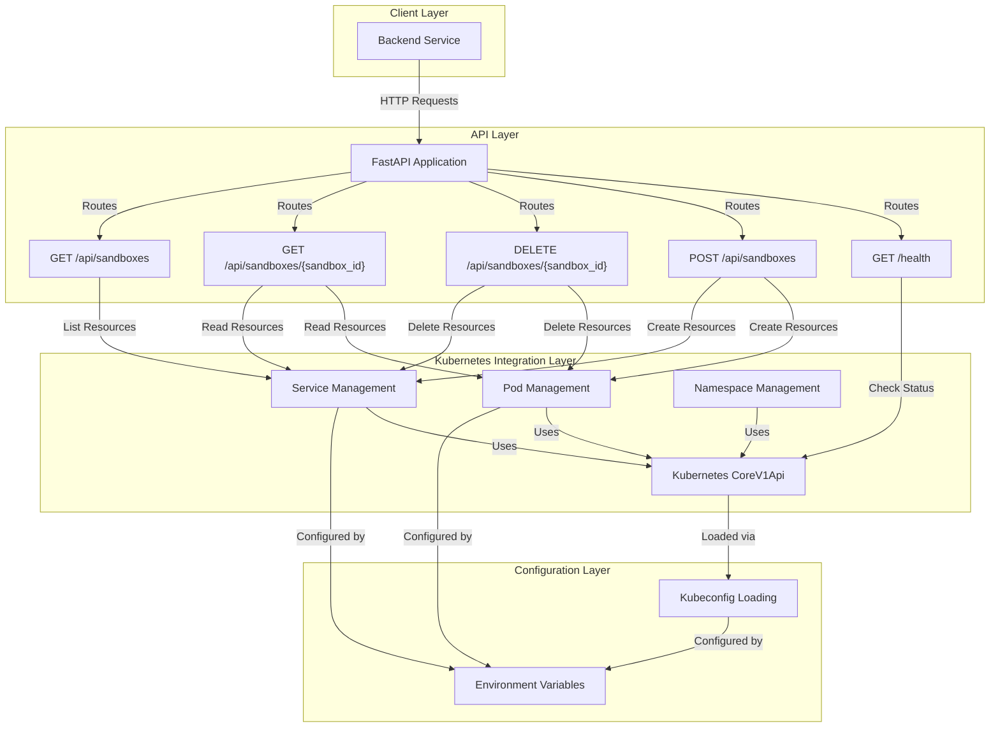
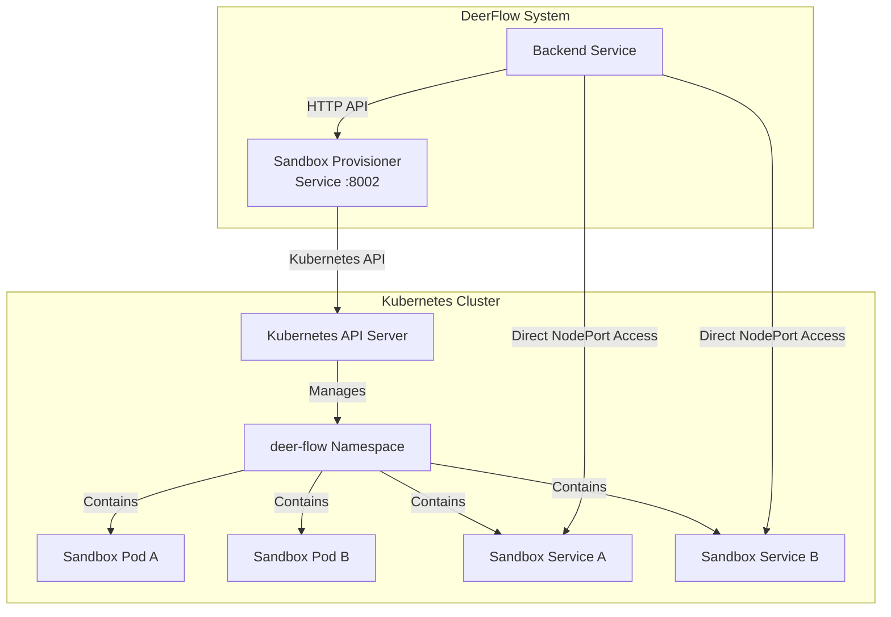

# Sandbox Provisioner Service Module Documentation

## 1. Introduction

The `sandbox_provisioner_service` module is a critical component of the DeerFlow system responsible for dynamically creating, managing, and destroying isolated sandbox environments in a Kubernetes cluster. This service provides a RESTful API that enables the backend to provision sandboxes on-demand, each with its own dedicated Pod and NodePort Service for direct communication.

### Purpose and Design Rationale

This module exists to address several key requirements:
- **Isolation**: Each sandbox operates in its own Kubernetes Pod, ensuring strong isolation between different execution environments
- **Dynamic Provisioning**: Sandboxes are created on-demand rather than pre-allocated, optimizing resource usage
- **Direct Access**: Each sandbox gets a dedicated NodePort Service, allowing the backend to communicate directly with sandboxes
- **Scalability**: Leveraging Kubernetes allows the system to scale sandbox provisioning horizontally
- **Persistence**: HostPath volumes enable persistent storage for skills and user data across sandbox restarts

The service is designed to run either inside or outside a Kubernetes cluster, with flexible configuration via environment variables to adapt to different deployment scenarios.

## 2. Architecture

The Sandbox Provisioner Service follows a layered architecture with clear separation between API handling, Kubernetes resource management, and configuration layers.

### Component Architecture Diagram



### System Context Diagram



### Architecture Details

The module consists of several key components working together:

1. **FastAPI Application**: Serves as the API gateway, handling HTTP requests and responses
2. **Kubernetes Client**: Manages communication with the Kubernetes API server
3. **Resource Builders**: Constructs Kubernetes Pod and Service manifests
4. **Resource Helpers**: Provides utility functions for interacting with Kubernetes resources
5. **Configuration Management**: Handles environment-based configuration

The service follows a typical request-response flow:
1. An HTTP request arrives at the FastAPI endpoint
2. The endpoint handler processes the request
3. Kubernetes API operations are performed as needed
4. A response is constructed and returned to the client

## 3. Core Components

### 3.1 FastAPI Application Lifecycle

The application uses FastAPI's lifespan context manager to handle initialization and cleanup:

```python
@asynccontextmanager
async def lifespan(_app: FastAPI):
    global core_v1
    _wait_for_kubeconfig()
    core_v1 = _init_k8s_client()
    _ensure_namespace()
    logger.info("Provisioner is ready (using host Kubernetes)")
    yield
```

This lifecycle manager:
1. Waits for the kubeconfig file to become available
2. Initializes the Kubernetes client
3. Ensures the target namespace exists
4. Marks the service as ready
5. Handles cleanup (though no specific cleanup is implemented in this version)

### 3.2 Request/Response Models

#### CreateSandboxRequest

```python
class CreateSandboxRequest(BaseModel):
    sandbox_id: str
    thread_id: str
```

This Pydantic model defines the request body for creating a new sandbox:
- `sandbox_id`: Unique identifier for the sandbox
- `thread_id`: Identifier for the associated conversation thread

#### SandboxResponse

```python
class SandboxResponse(BaseModel):
    sandbox_id: str
    sandbox_url: str  # Direct access URL, e.g. http://host.docker.internal:{NodePort}
    status: str
```

This model defines the response structure for sandbox operations:
- `sandbox_id`: Unique identifier for the sandbox
- `sandbox_url`: Direct access URL for the sandbox (NodePort endpoint)
- `status`: Current status of the sandbox pod (Pending/Running/Succeeded/Failed/Unknown/NotFound)

### 3.3 Kubernetes Client Initialization

#### _init_k8s_client()

```python
def _init_k8s_client() -> k8s_client.CoreV1Api:
    """Load kubeconfig from the mounted host config and return a CoreV1Api.

    Tries the mounted kubeconfig first, then falls back to in-cluster
    config (useful if the provisioner itself runs inside K8s).
    """
    if os.path.exists(KUBECONFIG_PATH):
        # Load from kubeconfig file
        # ...
    else:
        # Try in-cluster config
        # ...
    
    # Optionally rewrite API server address
    # ...
    
    return k8s_client.CoreV1Api()
```

This function initializes the Kubernetes client with a fallback mechanism:
1. First attempts to load configuration from the specified kubeconfig path
2. Falls back to in-cluster configuration if no kubeconfig is found
3. Optionally rewrites the Kubernetes API server address if `K8S_API_SERVER` is set
4. Disables SSL verification for self-signed certificates when API server is rewritten

#### _wait_for_kubeconfig()

```python
def _wait_for_kubeconfig(timeout: int = 30) -> None:
    """Wait for kubeconfig file if configured, then continue with fallback support."""
    deadline = time.time() + timeout
    while time.time() < deadline:
        # Check for kubeconfig
        # ...
        time.sleep(2)
    # If timeout, proceed with in-cluster config attempt
```

This function waits up to the specified timeout for the kubeconfig file to become available:
- Checks for the kubeconfig file every 2 seconds
- Validates that the path points to a file (not a directory)
- Falls back to attempting in-cluster configuration if timeout is reached

#### _ensure_namespace()

```python
def _ensure_namespace() -> None:
    """Create the K8s namespace if it does not yet exist."""
    try:
        core_v1.read_namespace(K8S_NAMESPACE)
        logger.info(f"Namespace '{K8S_NAMESPACE}' already exists")
    except ApiException as exc:
        if exc.status == 404:
            # Create namespace
            # ...
        else:
            raise
```

This function ensures the target Kubernetes namespace exists:
- Checks if the namespace already exists
- Creates it with appropriate labels if it doesn't exist
- Propagates any errors other than "not found"

### 3.4 Kubernetes Resource Builders

#### _build_pod()

```python
def _build_pod(sandbox_id: str, thread_id: str) -> k8s_client.V1Pod:
    """Construct a Pod manifest for a single sandbox."""
    # Constructs and returns a V1Pod object with:
    # - Appropriate metadata and labels
    # - Container configuration with the sandbox image
    # - Resource requests and limits
    # - Volume mounts for skills and user data
    # - Readiness and liveness probes
```

This function constructs a Kubernetes Pod manifest with:
- Metadata containing the sandbox ID and appropriate labels
- A single container running the specified sandbox image
- Port configuration for HTTP access (port 8080)
- Readiness and liveness probes checking the `/v1/sandbox` endpoint
- Resource requests (100m CPU, 256Mi memory, 500Mi storage) and limits (1000m CPU, 1Gi memory, 500Mi storage)
- Volume mounts for skills (read-only) and user data (read-write)
- HostPath volumes pointing to the configured skills and threads paths

#### _build_service()

```python
def _build_service(sandbox_id: str) -> k8s_client.V1Service:
    """Construct a NodePort Service manifest (port auto-allocated by K8s)."""
    # Constructs and returns a V1Service object with:
    # - Appropriate metadata and labels
    # - NodePort type specification
    # - Port configuration mapping to the sandbox pod
    # - Selector matching the sandbox pod
```

This function constructs a Kubernetes Service manifest with:
- Metadata containing the sandbox ID and appropriate labels
- Service type set to NodePort (auto-allocated by Kubernetes)
- Port configuration mapping port 8080 to the sandbox pod
- Selector matching the sandbox pod by sandbox ID

### 3.5 Kubernetes Resource Helpers

#### _pod_name() and _svc_name()

```python
def _pod_name(sandbox_id: str) -> str:
    return f"sandbox-{sandbox_id}"

def _svc_name(sandbox_id: str) -> str:
    return f"sandbox-{sandbox_id}-svc"
```

These simple helper functions generate consistent names for Kubernetes resources based on the sandbox ID.

#### _sandbox_url()

```python
def _sandbox_url(node_port: int) -> str:
    """Build the sandbox URL using the configured NODE_HOST."""
    return f"http://{NODE_HOST}:{node_port}"
```

Constructs the direct access URL for a sandbox using the configured node host and the allocated NodePort.

#### _get_node_port()

```python
def _get_node_port(sandbox_id: str) -> int | None:
    """Read the K8s-allocated NodePort from the Service."""
    try:
        svc = core_v1.read_namespaced_service(_svc_name(sandbox_id), K8S_NAMESPACE)
        for port in svc.spec.ports or []:
            if port.name == "http":
                return port.node_port
    except ApiException:
        pass
    return None
```

Retrieves the auto-allocated NodePort from the sandbox service:
- Reads the service resource from Kubernetes
- Finds the "http" port in the service specification
- Returns the node_port value or None if not found or if an error occurs

#### _get_pod_phase()

```python
def _get_pod_phase(sandbox_id: str) -> str:
    """Return the Pod phase (Pending / Running / Succeeded / Failed / Unknown)."""
    try:
        pod = core_v1.read_namespaced_pod(_pod_name(sandbox_id), K8S_NAMESPACE)
        return pod.status.phase or "Unknown"
    except ApiException:
        return "NotFound"
```

Retrieves the current phase of the sandbox pod:
- Reads the pod resource from Kubernetes
- Returns the pod's phase (Pending, Running, Succeeded, Failed, Unknown)
- Returns "NotFound" if the pod doesn't exist or an error occurs

## 4. API Endpoints

### 4.1 Health Check

```python
@app.get("/health")
async def health():
    """Provisioner health check."""
    return {"status": "ok"}
```

A simple health check endpoint that returns a 200 OK response with status "ok" when the service is running.

### 4.2 Create Sandbox

```python
@app.post("/api/sandboxes", response_model=SandboxResponse)
async def create_sandbox(req: CreateSandboxRequest):
    """Create a sandbox Pod + NodePort Service for *sandbox_id*.

    If the sandbox already exists, returns the existing information
    (idempotent).
    """
    # Implementation...
```

This endpoint creates a new sandbox environment:

**Request Body:**
- `sandbox_id`: Unique identifier for the sandbox
- `thread_id`: Identifier for the associated thread

**Response:**
- `SandboxResponse` object with sandbox ID, URL, and status

**Processing Logic:**
1. Checks if the sandbox already exists (by looking for an allocated NodePort)
2. If it exists, returns the existing sandbox information
3. Creates the Pod using the manifest builder
4. Creates the Service using the manifest builder
5. If Service creation fails, attempts to roll back the Pod
6. Waits up to 10 seconds (20 retries × 0.5 seconds) for the NodePort to be allocated
7. Returns the sandbox information with the allocated URL and current status

**Error Handling:**
- Returns 500 Internal Server Error if Pod or Service creation fails (with 409 Conflict exceptions handled as already exists)
- Returns 500 Internal Server Error if NodePort isn't allocated within the timeout period

### 4.3 Destroy Sandbox

```python
@app.delete("/api/sandboxes/{sandbox_id}")
async def destroy_sandbox(sandbox_id: str):
    """Destroy a sandbox Pod + Service."""
    # Implementation...
```

This endpoint destroys an existing sandbox environment:

**Path Parameters:**
- `sandbox_id`: Unique identifier for the sandbox to destroy

**Response:**
- JSON object with "ok": true and the sandbox_id on success

**Processing Logic:**
1. Attempts to delete the Service (ignores 404 Not Found errors)
2. Attempts to delete the Pod (ignores 404 Not Found errors)
3. Collects any errors that occur during deletion
4. Returns success if no errors or only 404 errors occurred
5. Returns partial cleanup error if other errors occurred

**Error Handling:**
- Returns 500 Internal Server Error with details of partial cleanup if non-404 errors occur

### 4.4 Get Sandbox

```python
@app.get("/api/sandboxes/{sandbox_id}", response_model=SandboxResponse)
async def get_sandbox(sandbox_id: str):
    """Return current status and URL for a sandbox."""
    # Implementation...
```

This endpoint retrieves information about a specific sandbox:

**Path Parameters:**
- `sandbox_id`: Unique identifier for the sandbox

**Response:**
- `SandboxResponse` object with sandbox ID, URL, and status

**Processing Logic:**
1. Retrieves the NodePort for the sandbox
2. Returns 404 Not Found if no NodePort is found
3. Otherwise, returns the sandbox information with current URL and pod phase

### 4.5 List Sandboxes

```python
@app.get("/api/sandboxes")
async def list_sandboxes():
    """List every sandbox currently managed in the namespace."""
    # Implementation...
```

This endpoint lists all sandboxes currently managed by the service:

**Response:**
- JSON object with:
  - `sandboxes`: Array of `SandboxResponse` objects
  - `count`: Number of sandboxes found

**Processing Logic:**
1. Lists all Services in the namespace with the label `app=deer-flow-sandbox`
2. For each Service, extracts the sandbox ID from its labels
3. Retrieves the NodePort from the Service
4. Gets the current pod phase for each sandbox
5. Constructs and returns the list of sandbox responses

**Error Handling:**
- Returns 500 Internal Server Error if listing Services fails

## 5. Configuration

The service is configured entirely through environment variables, making it flexible for different deployment environments:

| Environment Variable | Default Value | Description |
|----------------------|---------------|-------------|
| `K8S_NAMESPACE` | `deer-flow` | Kubernetes namespace to use for sandbox resources |
| `SANDBOX_IMAGE` | `enterprise-public-cn-beijing.cr.volces.com/vefaas-public/all-in-one-sandbox:latest` | Container image to use for sandbox pods |
| `SKILLS_HOST_PATH` | `/skills` | Host path to mount as read-only skills volume |
| `THREADS_HOST_PATH` | `/.deer-flow/threads` | Host path prefix for thread-specific user data |
| `KUBECONFIG_PATH` | `/root/.kube/config` | Path to kubeconfig file inside the provisioner container |
| `NODE_HOST` | `host.docker.internal` | Hostname/IP that backend uses to reach NodePort services |
| `K8S_API_SERVER` | (not set) | Override Kubernetes API server address (useful for Docker Desktop) |

### Important Configuration Notes

- **KUBECONFIG_PATH**: When running the provisioner in a container, the host's kubeconfig should typically be mounted at this path
- **NODE_HOST**:
  - On Docker Desktop for macOS/Windows, use `host.docker.internal`
  - On Linux, you may need to use the host's LAN IP address
  - When running the backend outside the Kubernetes cluster, this should be an address reachable from the backend
- **K8S_API_SERVER**: Useful when the kubeconfig references `localhost` but the provisioner is running inside a container (e.g., `https://host.docker.internal:6443` for Docker Desktop)

## 6. Usage Examples

### 6.1 Creating a Sandbox

```python
import requests

response = requests.post(
    "http://localhost:8002/api/sandboxes",
    json={
        "sandbox_id": "my-sandbox-123",
        "thread_id": "thread-456"
    }
)

if response.status_code == 200:
    sandbox = response.json()
    print(f"Sandbox created: {sandbox['sandbox_id']}")
    print(f"Access URL: {sandbox['sandbox_url']}")
    print(f"Status: {sandbox['status']}")
else:
    print(f"Error: {response.status_code} - {response.text}")
```

### 6.2 Getting Sandbox Status

```python
import requests

sandbox_id = "my-sandbox-123"
response = requests.get(f"http://localhost:8002/api/sandboxes/{sandbox_id}")

if response.status_code == 200:
    sandbox = response.json()
    print(f"Status: {sandbox['status']}")
    print(f"URL: {sandbox['sandbox_url']}")
elif response.status_code == 404:
    print("Sandbox not found")
else:
    print(f"Error: {response.status_code}")
```

### 6.3 Listing All Sandboxes

```python
import requests

response = requests.get("http://localhost:8002/api/sandboxes")

if response.status_code == 200:
    data = response.json()
    print(f"Found {data['count']} sandboxes:")
    for sandbox in data['sandboxes']:
        print(f"  - {sandbox['sandbox_id']}: {sandbox['status']} at {sandbox['sandbox_url']}")
else:
    print(f"Error: {response.status_code}")
```

### 6.4 Destroying a Sandbox

```python
import requests

sandbox_id = "my-sandbox-123"
response = requests.delete(f"http://localhost:8002/api/sandboxes/{sandbox_id}")

if response.status_code == 200:
    print(f"Sandbox {sandbox_id} deleted successfully")
else:
    print(f"Error: {response.status_code} - {response.text}")
```

## 7. Integration with Other Modules

The Sandbox Provisioner Service is designed to work with several other modules in the DeerFlow system:

- **Backend Service**: The primary client of this API, responsible for requesting sandbox creation and destruction
- **Sandbox Core Runtime**: The sandboxes provisioned by this service run the sandbox implementation from the [sandbox_core_runtime](sandbox_core_runtime.md) module
- **Agent Memory and Thread Context**: The `thread_id` parameter links sandboxes to specific threads managed by the [agent_memory_and_thread_context](agent_memory_and_thread_context.md) module
- **Application and Feature Configuration**: Configuration for sandboxes may be influenced by settings from the [application_and_feature_configuration](application_and_feature_configuration.md) module, particularly the `SandboxConfig`

## 8. Edge Cases and Limitations

### 8.1 Error Conditions

1. **Kubernetes API Unreachable**: If the Kubernetes API is not reachable during initialization, the service will fail to start
2. **NodePort Allocation Timeout**: If Kubernetes doesn't allocate a NodePort within 10 seconds, the create operation will fail
3. **Partial Cleanup**: When deleting a sandbox, it's possible for one resource (Pod or Service) to be deleted successfully while the other fails
4. **Resource Limits**: If the Kubernetes cluster doesn't have enough resources to satisfy the sandbox pod's resource requests, the pod will remain in Pending state
5. **HostPath Volume Issues**: If the configured host paths don't exist or have incorrect permissions, the pod may fail to start

### 8.2 Operational Considerations

1. **Idempotency**: The create sandbox endpoint is idempotent - calling it multiple times with the same sandbox_id will not create duplicate resources
2. **Garbage Collection**: The service doesn't implement automatic garbage collection of unused sandboxes - this should be handled by the client or a separate process
3. **Security**: The current implementation runs with `allow_privilege_escalation=True` which may pose security risks in multi-tenant environments
4. **Networking**: The NodePort service type has limitations in production environments - consider using LoadBalancer or Ingress for production deployments
5. **Storage**: HostPath volumes are used for simplicity, but they have limitations in multi-node clusters - consider using PersistentVolumes for more robust storage

### 8.3 Known Limitations

1. **Single Kubernetes Cluster**: The service currently only supports a single Kubernetes cluster
2. **No Sandbox Pooling**: Sandboxes are created on-demand, not pre-warmed in a pool, which may result in slower initial access
3. **Limited Sandbox Configuration**: Most pod configuration is hard-coded - only the image and a few paths are configurable via environment variables
4. **No Authentication/Authorization**: The API doesn't implement any authentication or authorization - it should be deployed in a trusted network environment
5. **Limited Monitoring**: Beyond basic health checks and logging, the service doesn't provide extensive monitoring capabilities

## 9. Deployment Considerations

### Docker Compose Deployment

When deploying via Docker Compose (as suggested in the module's docstring), consider the following:

1. **Mount Kubeconfig**: Mount the host's kubeconfig to the provisioner container
2. **Set NODE_HOST**: Configure `NODE_HOST` appropriately for your Docker environment
3. **Optional K8S_API_SERVER**: If using Docker Desktop, you may need to set `K8S_API_SERVER` to `https://host.docker.internal:6443`
4. **Volume Mounts**: Ensure the skills and threads host paths are accessible from the Kubernetes nodes

### Kubernetes Deployment

When deploying the provisioner itself inside Kubernetes:

1. **ServiceAccount**: Use a ServiceAccount with appropriate permissions to create/delete Pods and Services in the target namespace
2. **In-Cluster Config**: Let the service use in-cluster configuration by not mounting a kubeconfig
3. **Network Policy**: Implement Network Policies to control access to the provisioner API
4. **Resource Limits**: Set appropriate resource requests and limits for the provisioner itself
5. **High Availability**: Consider running multiple replicas for high availability (though the current implementation doesn't handle leader election)

## 10. Conclusion

The Sandbox Provisioner Service is a crucial component of the DeerFlow system that enables dynamic, on-demand provisioning of isolated sandbox environments. By leveraging Kubernetes for orchestration, it provides a scalable and manageable solution for running sandboxed workloads.

While the current implementation is focused on simplicity and development environments, it provides a solid foundation that can be extended with additional features like:
- Authentication and authorization
- Sandbox pooling and pre-warming
- More flexible sandbox configuration
- Enhanced monitoring and observability
- Support for multiple Kubernetes clusters
- Advanced networking options (Ingress, LoadBalancer)
- PersistentVolumeClaim support for storage

When using this module, carefully consider your deployment environment and security requirements, and configure the service accordingly.
