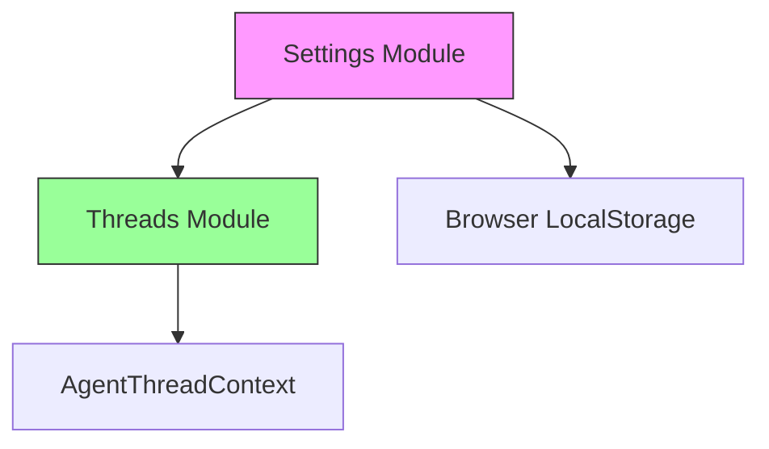

# Settings 模块文档

## 概述

Settings 模块是前端应用程序的核心配置管理模块，负责处理应用程序的本地设置存储、读取和管理。该模块提供了统一的接口来管理用户偏好设置、应用程序上下文和布局配置，确保设置在不同会话之间的持久化。

### 主要功能

- 本地设置的持久化存储与读取
- 默认设置的管理与合并
- 通知配置管理
- 上下文配置管理（包括模型和模式选择）
- 布局配置管理

## 核心组件

### LocalSettings 接口

`LocalSettings` 是 Settings 模块的核心类型定义，它描述了应用程序本地设置的完整结构。

```typescript
export interface LocalSettings {
  notification: {
    enabled: boolean;
  };
  context: Omit<
    AgentThreadContext,
    "thread_id" | "is_plan_mode" | "thinking_enabled" | "subagent_enabled"
  > & {
    mode: "flash" | "thinking" | "pro" | "ultra" | undefined;
  };
  layout: {
    sidebar_collapsed: boolean;
  };
}
```

#### 结构说明

- **notification**: 通知相关配置
  - `enabled`: 布尔值，控制是否启用通知功能

- **context**: 应用程序上下文配置，基于 `AgentThreadContext` 类型但进行了选择性省略
  - `model_name`: 字符串或 undefined，指定默认使用的模型名称
  - `mode`: 字符串或 undefined，指定应用程序的运行模式，可选值包括 "flash"、"thinking"、"pro"、"ultra"

- **layout**: 应用程序布局配置
  - `sidebar_collapsed`: 布尔值，控制侧边栏是否折叠

### DEFAULT_LOCAL_SETTINGS

默认设置常量，定义了应用程序的初始配置状态：

```typescript
export const DEFAULT_LOCAL_SETTINGS: LocalSettings = {
  notification: {
    enabled: true,
  },
  context: {
    model_name: undefined,
    mode: undefined,
  },
  layout: {
    sidebar_collapsed: false,
  },
};
```

此常量确保即使用户尚未设置任何偏好，应用程序也能以合理的默认值正常运行。

### getLocalSettings() 函数

从本地存储中获取用户设置的函数。如果存储中没有设置或解析失败，则返回默认设置。

```typescript
export function getLocalSettings(): LocalSettings {
  if (typeof window === "undefined") {
    return DEFAULT_LOCAL_SETTINGS;
  }
  const json = localStorage.getItem(LOCAL_SETTINGS_KEY);
  try {
    if (json) {
      const settings = JSON.parse(json);
      const mergedSettings = {
        ...DEFAULT_LOCAL_SETTINGS,
        context: {
          ...DEFAULT_LOCAL_SETTINGS.context,
          ...settings.context,
        },
        layout: {
          ...DEFAULT_LOCAL_SETTINGS.layout,
          ...settings.layout,
        },
        notification: {
          ...DEFAULT_LOCAL_SETTINGS.notification,
          ...settings.notification,
        },
      };
      return mergedSettings;
    }
  } catch {}
  return DEFAULT_LOCAL_SETTINGS;
}
```

#### 工作原理

1. 首先检查是否在浏览器环境中（`typeof window === "undefined"`），如果不是（如服务端渲染），直接返回默认设置
2. 尝试从 `localStorage` 中获取存储的设置
3. 如果找到设置，尝试解析 JSON
4. 使用深度合并策略，将用户设置与默认设置合并，确保所有字段都有值
5. 如果任何步骤失败（如 JSON 解析错误），返回默认设置

#### 返回值

- 总是返回一个完整的 `LocalSettings` 对象，保证所有必要字段都存在

### saveLocalSettings() 函数

将用户设置保存到本地存储的函数。

```typescript
export function saveLocalSettings(settings: LocalSettings) {
  localStorage.setItem(LOCAL_SETTINGS_KEY, JSON.stringify(settings));
}
```

#### 参数

- `settings`: 完整的 `LocalSettings` 对象，将被序列化为 JSON 并存储

#### 工作原理

1. 将设置对象序列化为 JSON 字符串
2. 使用预定义的键 `LOCAL_SETTINGS_KEY` 将其保存到 `localStorage`

## 模块架构和依赖关系

Settings 模块与其他核心模块有以下依赖关系：



Settings 模块依赖于 [Threads 模块](threads.md) 中的 `AgentThreadContext` 类型，用于构建 context 配置部分。此模块直接与浏览器的 `localStorage` API 交互，实现设置的持久化。

## 使用指南

### 基本使用

#### 读取设置

```typescript
import { getLocalSettings } from 'frontend/src/core/settings/local';

// 获取当前设置
const settings = getLocalSettings();

// 使用设置
if (settings.notification.enabled) {
  // 启用通知
}

if (settings.layout.sidebar_collapsed) {
  // 侧边栏折叠状态处理
}
```

#### 保存设置

```typescript
import { saveLocalSettings, getLocalSettings } from 'frontend/src/core/settings/local';

// 获取当前设置
const settings = getLocalSettings();

// 修改设置
settings.notification.enabled = false;
settings.layout.sidebar_collapsed = true;
settings.context.model_name = 'gpt-4';
settings.context.mode = 'pro';

// 保存修改
saveLocalSettings(settings);
```

### 在 React 组件中使用

```typescript
import { useEffect, useState } from 'react';
import { getLocalSettings, saveLocalSettings, LocalSettings } from 'frontend/src/core/settings/local';

function SettingsComponent() {
  const [settings, setSettings] = useState<LocalSettings>(getLocalSettings());

  const updateNotificationSetting = (enabled: boolean) => {
    const newSettings = {
      ...settings,
      notification: { ...settings.notification, enabled }
    };
    setSettings(newSettings);
    saveLocalSettings(newSettings);
  };

  return (
    <div>
      <label>
        <input
          type="checkbox"
          checked={settings.notification.enabled}
          onChange={(e) => updateNotificationSetting(e.target.checked)}
        />
        启用通知
      </label>
    </div>
  );
}
```

## 边缘情况和注意事项

1. **服务端渲染 (SSR) 环境**: 模块会检测 `window` 对象是否存在，如果不存在（如在服务端渲染环境中），`getLocalSettings()` 会直接返回默认设置，不会尝试访问 `localStorage`。

2. **设置不完整或损坏**: 如果存储的设置 JSON 格式不正确或缺少某些字段，模块会使用默认设置进行补充，确保始终返回完整的设置对象。

3. **存储容量限制**: 浏览器 `localStorage` 有容量限制（通常为 5MB-10MB），虽然本模块存储的数据量很小，但在存储大量数据时需要注意此限制。

4. **隐私模式**: 在某些浏览器的隐私/无痕模式下，`localStorage` 可能不可用或行为不同，模块通过错误处理机制确保在此情况下仍能正常工作。

5. **设置合并策略**: `getLocalSettings()` 采用深度合并策略，确保即使用户设置只包含部分字段，也能与默认设置正确合并。

## 扩展和自定义

### 添加新的设置项

要添加新的设置项，需要：

1. 在 `LocalSettings` 接口中添加新字段
2. 在 `DEFAULT_LOCAL_SETTINGS` 中提供默认值
3. 更新 `getLocalSettings()` 函数中的合并逻辑（如需要）

示例：

```typescript
// 更新接口
export interface LocalSettings {
  // ... 现有字段
  theme: {
    mode: 'light' | 'dark' | 'system';
  };
}

// 更新默认设置
export const DEFAULT_LOCAL_SETTINGS: LocalSettings = {
  // ... 现有默认值
  theme: {
    mode: 'system',
  },
};

// 更新合并逻辑（在 getLocalSettings 函数中）
const mergedSettings = {
  ...DEFAULT_LOCAL_SETTINGS,
  // ... 其他合并
  theme: {
    ...DEFAULT_LOCAL_SETTINGS.theme,
    ...settings.theme,
  },
};
```

## 相关模块

- [Threads 模块](threads.md): 提供 `AgentThreadContext` 类型定义，是 Settings 模块 context 部分的基础
