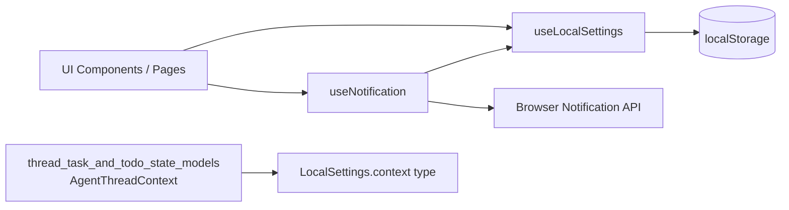
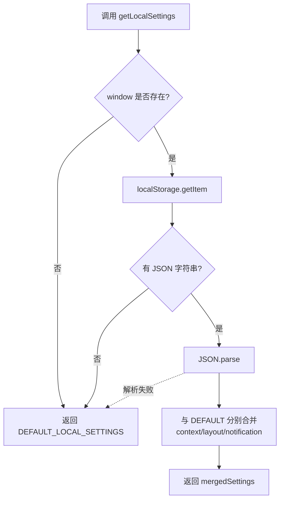
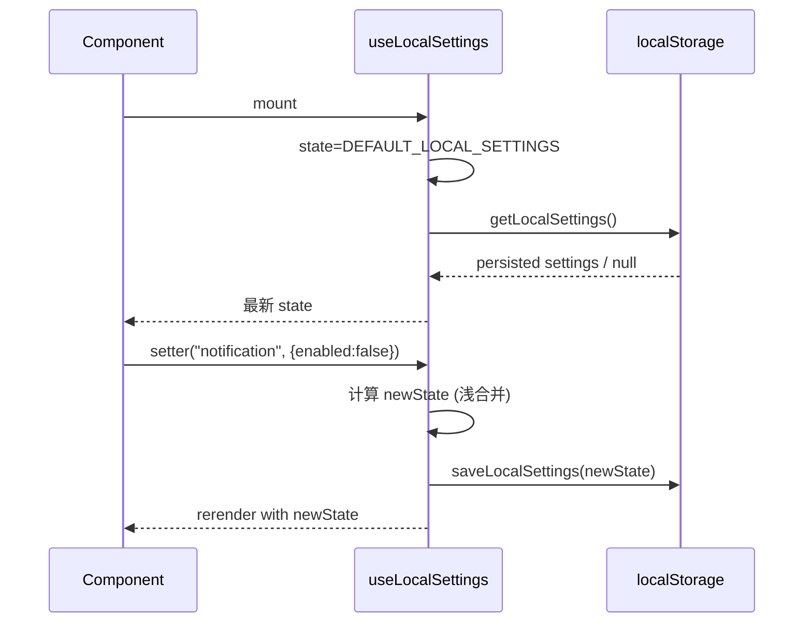
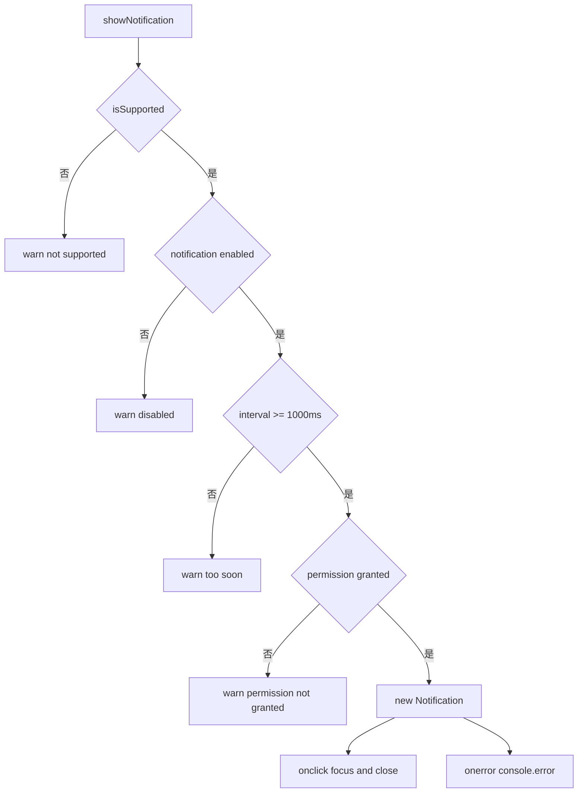
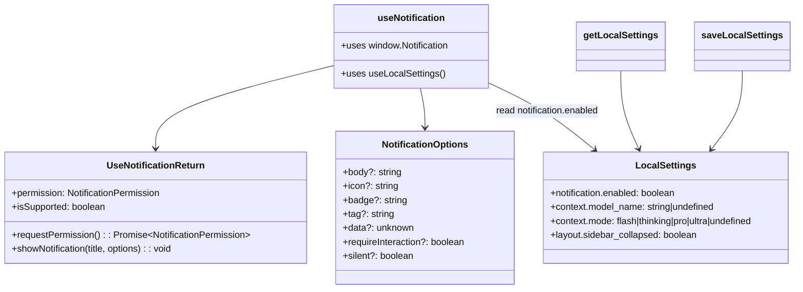

# settings_and_notification_runtime 模块文档

## 模块简介

`settings_and_notification_runtime` 是前端核心域中的“用户本地偏好 + 浏览器通知”运行时层。它存在的核心原因是：应用需要在**不依赖后端**的前提下，持续记住用户偏好（例如通知开关、默认模型、布局状态），并把这些偏好立即作用到交互行为（例如是否发送系统通知）。

从职责边界来看，这个模块并不负责业务消息本身，也不负责线程编排；它负责的是“运行时环境行为开关”和“本地持久化”。它把 `localStorage`、浏览器 `Notification API`、React hook 状态管理三者封装到统一接口中，让上层组件只关心“当前是否可通知、如何请求权限、如何发通知、如何更新设置”。

该模块包含三个核心类型/接口：

- `LocalSettings`：定义本地设置结构。
- `NotificationOptions`：定义通知参数。
- `UseNotificationReturn`：定义通知 hook 的返回协议。

其实现分布在：

- `frontend/src/core/settings/local.ts`
- `frontend/src/core/settings/hooks.ts`（由 `../settings` re-export，被通知模块调用）
- `frontend/src/core/notification/hooks.ts`

---

## 在系统中的定位

在 `frontend_core_domain_types_and_state` 大模块中，`settings_and_notification_runtime` 是偏“基础设施 runtime”的子域，依赖线程上下文类型但不依赖具体 UI 页面。它与其他模块的关系可概括为：



这个结构意味着：通知行为不是独立配置源，而是显式受 `LocalSettings.notification.enabled` 控制；同时设置模型字段通过 `AgentThreadContext` 的裁剪类型进行约束，避免定义重复。

> 相关类型细节可参考：[thread_task_and_todo_state_models.md](thread_task_and_todo_state_models.md)、[frontend_core_domain_types_and_state.md](frontend_core_domain_types_and_state.md)

---

## 核心数据结构

## `LocalSettings`

`LocalSettings` 是本地配置的单一事实来源（Single Source of Truth），包含三个子域：`notification`、`context`、`layout`。

```typescript
export interface LocalSettings {
  notification: {
    enabled: boolean;
  };
  context: Omit<
    AgentThreadContext,
    "thread_id" | "is_plan_mode" | "thinking_enabled" | "subagent_enabled"
  > & {
    mode: "flash" | "thinking" | "pro" | "ultra" | undefined;
  };
  layout: {
    sidebar_collapsed: boolean;
  };
}
```

设计上，`context` 使用 `Omit<AgentThreadContext, ...>`，只保留可作为“全局默认偏好”的字段（如 `model_name`），排除线程实例强绑定的字段（如 `thread_id`）。这保证了“用户偏好”与“线程运行时状态”不会混淆。

### `DEFAULT_LOCAL_SETTINGS`

默认值如下：

```typescript
export const DEFAULT_LOCAL_SETTINGS: LocalSettings = {
  notification: { enabled: true },
  context: { model_name: undefined, mode: undefined },
  layout: { sidebar_collapsed: false },
};
```

默认策略体现了“可用优先”：

- 通知默认开启（但仍受浏览器权限约束）。
- 模型和模式默认不预选，交由上层流程决定。
- 侧边栏默认展开。

---

## 设置读写与持久化机制

## `getLocalSettings()`

`getLocalSettings()` 负责读取和容错恢复，关键步骤是“读取 -> 解析 -> 与默认值分域合并 -> 返回完整结构”。



这个“按子对象合并”的策略非常关键：即使历史版本只存了 `layout`，也不会导致 `notification` 丢失，升级兼容性较好。

## `saveLocalSettings(settings)`

该函数直接将完整 `LocalSettings` 序列化写回固定 key：`deerflow.local-settings`。

```typescript
export function saveLocalSettings(settings: LocalSettings) {
  localStorage.setItem(LOCAL_SETTINGS_KEY, JSON.stringify(settings));
}
```

它不做 schema 校验，也不做异常捕获（例如 Safari 隐私模式可能抛出 quota/security 异常），因此调用方通常依赖上层 UI/错误边界兜底。

---

## React 运行时接口：`useLocalSettings()`

虽然不是“核心组件列表”里的条目，但 `useNotification()` 强依赖它，因此这里补充其运行机制。

`useLocalSettings()` 返回 `[state, setter]`：

- `state`：当前设置对象。
- `setter(key, partialValue)`：按一级 key（`notification/context/layout`）做浅合并并持久化。

其内部行为：首次 mount 后调用 `getLocalSettings()` 覆盖默认 state，随后每次 setter 更新都会同步 `saveLocalSettings(newState)`。



---

## 通知运行时：`useNotification()`

## 接口契约

`UseNotificationReturn` 定义了通知能力对上层的最小可用面：

```typescript
interface UseNotificationReturn {
  permission: NotificationPermission;
  isSupported: boolean;
  requestPermission: () => Promise<NotificationPermission>;
  showNotification: (title: string, options?: NotificationOptions) => void;
}
```

`NotificationOptions` 基本对齐原生 `Notification` 构造参数（`body`、`icon`、`tag`、`silent` 等）。

## 内部流程

`useNotification()` 的控制链路是“能力探测 -> 权限管理 -> 设置校验 -> 频率限制 -> 发送通知 -> 事件绑定”。



### 关键实现要点

1. 在 `useEffect` 中检测 `"Notification" in window`，并读取 `Notification.permission` 初始化状态。
2. `requestPermission()` 在不支持场景下直接返回 `"denied"`，在支持场景调用原生 `Notification.requestPermission()`。
3. `showNotification()` 会读取 `useLocalSettings()` 的当前值，尊重应用级开关。
4. 通过 `lastNotificationTime`（`useRef<Date>`）做节流，最短间隔 1 秒。

---

## 组件关系与调用协作



这个关系图反映了一个很重要的设计选择：通知模块没有自己的配置存储，它是 settings 的消费方。这样可以让“通知是否启用”在全应用保持一致，避免某个页面单独控制导致行为不统一。

---

## 实际使用与配置示例

### 1) 在页面中请求权限并发送通知

```typescript
import { useNotification } from "@/core/notification/hooks";

export function NotifyButton() {
  const { permission, requestPermission, showNotification } = useNotification();

  const onClick = async () => {
    const p = permission === "granted" ? "granted" : await requestPermission();
    if (p === "granted") {
      showNotification("任务完成", {
        body: "你的后台任务已经结束",
        tag: "task-finish",
      });
    }
  };

  return <button onClick={onClick}>发送通知</button>;
}
```

### 2) 切换通知设置（写入本地）

```typescript
import { useLocalSettings } from "@/core/settings";

export function NotificationToggle() {
  const [settings, setSettings] = useLocalSettings();

  return (
    <input
      type="checkbox"
      checked={settings.notification.enabled}
      onChange={(e) => setSettings("notification", { enabled: e.target.checked })}
    />
  );
}
```

### 3) 设置默认模型与模式

```typescript
setSettings("context", {
  model_name: "gpt-4o-mini",
  mode: "thinking",
});
```

---

## 可扩展点与演进建议

当前实现非常轻量，适合基础场景。若要增强，可在以下方向扩展：

- 为 `LocalSettings` 引入版本号与迁移器（migration），避免字段重命名后兼容风险。
- 为 `saveLocalSettings` 增加 `try/catch` 与 telemetry，提升故障可观测性。
- 为 `useNotification` 增加 `visibilityState`、`document.hasFocus()` 等策略，减少前台噪音通知。
- 监听权限变化（部分浏览器可借助 Permissions API）以避免权限状态陈旧。
- 跨 Tab 同步：监听 `storage` 事件，让设置变化实时广播到其他标签页。

---

## 边界条件、错误场景与已知限制

本模块最需要关注的是“静默失败”和“平台差异”。

1. `getLocalSettings()` 在 JSON 解析失败时吞掉异常并返回默认值，虽然保证了可用性，但会掩盖数据损坏来源。
2. `saveLocalSettings()` 没有异常处理；当存储不可用或超配额时可能直接抛错。
3. `useNotification()` 的 `lastNotificationTime` 初始值是 `new Date()`，这意味着**hook 刚创建后的前 1 秒发送会被判定为 too soon**。这是一个容易忽略的行为。
4. 通知节流是“hook 实例级”，不是全局单例级。如果多个组件各自调用 `useNotification()`，它们各有独立节流窗口。
5. `permission` 状态仅在 mount 与主动请求时更新；用户在浏览器设置面板中手动改权限后，页面内状态可能不同步。
6. SSR 场景下 `getLocalSettings()` 已处理 `window` 不存在；但 `saveLocalSettings()` 若在 SSR 误调用仍会报错（因为未做守卫）。
7. 浏览器兼容性差异仍由上层承担，尤其是移动端和 iOS WebView 对 Notification API 支持并不一致。

---

## 与其他文档的关系

为避免重复，以下主题建议直接阅读对应模块文档：

- 线程上下文类型来源与语义： [thread_task_and_todo_state_models.md](thread_task_and_todo_state_models.md)
- 前端核心域总体分层： [frontend_core_domain_types_and_state.md](frontend_core_domain_types_and_state.md)
- 单独的 settings 细节（若已维护）： [settings.md](settings.md)
- 单独的 notification 细节（若已维护）： [notification.md](notification.md)

本文件重点在“settings 与 notification 的联合运行时机制”，用于理解它们如何在真实界面中协同工作。
