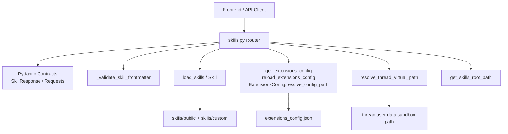
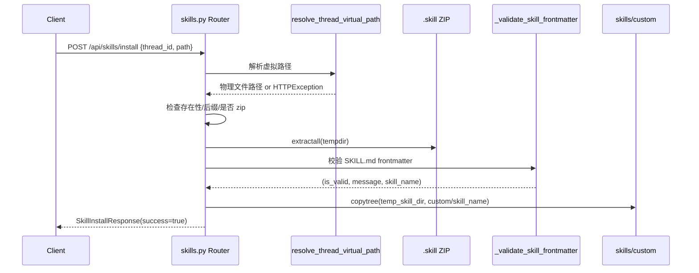

# skill_management_contracts 模块文档

## 1. 模块定位与设计目标

`skill_management_contracts` 是网关层（Gateway）中专门面向“技能管理”能力的 API 契约模块，对应实现位于 `backend/src/gateway/routers/skills.py`。它定义了前端或外部调用方与后端技能系统交互时所需的请求/响应模型，并在同一文件中承载了技能查询、启用状态更新与技能安装这三类核心操作的路由逻辑。

这个模块存在的根本原因，是把“技能运行时（skills runtime）”与“HTTP 访问接口”解耦。运行时负责扫描技能目录、解析 `SKILL.md`、决定技能是否可用；而本模块负责把这些能力以可验证、可追踪、可向后兼容的 API 契约暴露给调用方。这样做有三个直接收益：第一，前后端可以围绕稳定数据结构并行开发；第二，管理动作（启用/禁用、安装）可以统一落在网关侧进行安全与校验控制；第三，技能元数据与状态配置（`extensions_config.json`）可以通过标准化流程持久化和热更新。

在更大的系统里，它是 [gateway_api_contracts.md](gateway_api_contracts.md) 的一个子模块，依赖 [application_and_feature_configuration.md](application_and_feature_configuration.md) 中的扩展配置能力、依赖 [subagents_and_skills_runtime.md](subagents_and_skills_runtime.md) 中的 `Skill` 与 `load_skills` 语义，并通过路径解析能力与线程沙箱目录建立受控文件访问关系（可参考 [path_resolution_and_fs_security.md](path_resolution_and_fs_security.md)）。

---

## 2. 核心能力概览

本模块对外提供 4 个 REST 端点（`/api` 前缀下）：

- `GET /skills`：返回全部技能（包含 disabled）。
- `GET /skills/{skill_name}`：返回指定技能详情。
- `PUT /skills/{skill_name}`：更新技能启用状态（写入扩展配置文件）。
- `POST /skills/install`：从线程虚拟路径指向的 `.skill` 文件安装自定义技能。

此外，它还包含两类内部辅助能力：

- `_validate_skill_frontmatter`：校验解压后技能目录中的 `SKILL.md` Frontmatter 结构与字段约束。
- `_skill_to_response`：把运行时 `Skill` 对象转换为 API 层 `SkillResponse`。

这些能力共同构成“可枚举、可查询、可控开关、可安装扩展”的完整技能管理闭环。

---

## 3. 架构与依赖关系

### 3.1 模块内外关系图



这张图体现了一个关键事实：`skills.py` 虽然归属网关层，但它并不是“纯 DTO 文件”，而是同时承担编排职责。它要把外部输入先约束为 Pydantic 请求模型，再调用路径解析、技能加载、配置写入等下游能力，最后把结果映射为稳定响应契约返回。

### 3.2 交互时序（以安装技能为例）



该流程的设计重点是“先临时解压、再校验、最后落盘”。它避免了无效包直接写入 `skills/custom`，降低了脏数据进入运行时扫描目录的概率。

---

## 4. API 契约模型详解（Core Components）

### 4.1 `SkillResponse`

`SkillResponse` 是技能查询场景的基础响应模型，字段包括：`name`、`description`、`license`、`category`、`enabled`。其中 `category` 当前语义为 `public` 或 `custom`，`enabled` 表示技能在当前扩展配置下是否可用。该模型直接承接运行时 `Skill` 对象的元数据，因此是 UI 展示技能列表、技能详情页、启用状态开关的核心数据结构。

### 4.2 `SkillsListResponse`

`SkillsListResponse` 仅包含 `skills: list[SkillResponse]`。虽然结构简单，但它通过显式外层对象而不是直接返回数组，给后续扩展分页信息、版本字段、统计元数据留出了兼容空间。

### 4.3 `SkillUpdateRequest`

`SkillUpdateRequest` 目前只有一个必填字段 `enabled: bool`。这个设计体现了“状态与定义分离”的原则：修改启用状态只写配置，不改 `SKILL.md`。因此该模型不允许提交技能描述、license 等定义信息，避免 API 混入“配置更新”和“内容发布”两个不同职责。

### 4.4 `SkillInstallRequest`

`SkillInstallRequest` 包含两个关键字段：

- `thread_id`：标识文件所在线程上下文。
- `path`：线程沙箱内虚拟路径，如 `/mnt/user-data/outputs/my-skill.skill`。

它并不直接允许客户端上传二进制内容，而是假定文件已在线程工作目录可访问。这与上传模块的职责边界一致：上传模块负责把文件放到安全路径，本模块负责从该路径进行业务安装。

### 4.5 `SkillInstallResponse`

`SkillInstallResponse` 包含 `success`、`skill_name`、`message`。即使安装失败也会通过 HTTPException 走错误状态码；成功时该模型为前端提供可直接展示的结果消息与安装后的规范技能名。

---

## 5. 关键内部函数与路由实现细节

### 5.1 `_validate_skill_frontmatter(skill_dir: Path) -> tuple[bool, str, str | None]`

该函数是安装流程的核心安全闸门，负责验证 `skill_dir/SKILL.md` 顶部 YAML frontmatter。其校验步骤是“存在性 -> 结构 -> 语义 -> 字段约束”：

1. 必须存在 `SKILL.md`。
2. 文件必须以 `---` 开头，且能通过正则提取 frontmatter 区块。
3. YAML 解析结果必须是字典。
4. 只能出现允许字段：`name`, `description`, `license`, `allowed-tools`, `metadata`。
5. `name` 与 `description` 必填。
6. `name` 必须是 hyphen-case（`^[a-z0-9-]+$`），不能首尾 `-`、不能 `--`、长度 <= 64。
7. `description` 若非空，不能含 `<` 或 `>`，长度 <= 1024。

返回值语义：

- `True, "Skill is valid!", skill_name`：可继续安装。
- `False, reason, None`：调用方应中止并返回 400。

副作用：无文件写入，但会读取 `SKILL.md` 文本并进行解析。

### 5.2 `_skill_to_response(skill: Skill) -> SkillResponse`

该函数是轻量映射器，把运行时对象字段安全地投影到 API 响应。它的价值在于隔离内部类型变化（例如未来 `Skill` 增加运行时字段）对外部契约的影响。

### 5.3 `list_skills()`

此端点调用 `load_skills(enabled_only=False)` 获取完整技能集合，再转换为 `SkillsListResponse`。注意它显式传入 `enabled_only=False`，意味着 disabled 技能也会返回，便于管理端进行启用操作。

异常处理方面，任何非预期错误都记录日志并返回 `500`。

### 5.4 `get_skill(skill_name: str)`

该端点先全量加载技能，再按名称精确匹配。找不到则返回 `404`。这意味着查询语义基于“当前扫描到的技能集合”，而非单独读取某个目录路径，避免路径构造攻击面。

### 5.5 `update_skill(skill_name: str, request: SkillUpdateRequest)`

该端点流程可概括为“校验存在 -> 修改配置 -> 落盘 -> 热重载 -> 回读确认”：


关键点：

- 若 `ExtensionsConfig.resolve_config_path()` 返回 `None`，会在 `Path.cwd().parent / "extensions_config.json"` 新建配置文件。
- 写盘时会保留 `mcpServers` 配置，避免只更新技能时破坏 MCP 配置。
- 写入后立即 `reload_extensions_config()` 刷新全局缓存。

副作用：持久化写文件（`extensions_config.json`）并刷新进程内配置缓存。

### 5.6 `install_skill(request: SkillInstallRequest)`

安装端点的内部阶段比较多：

1. 通过 `resolve_thread_virtual_path` 把虚拟路径映射到实际路径（同时进行越权/非法路径判断）。
2. 检查文件存在、必须是普通文件、扩展名必须 `.skill`、且内容必须是有效 ZIP。
3. 获取 `skills/custom` 目录（使用 `get_skills_root_path()`），必要时自动创建。
4. 解压到临时目录（`TemporaryDirectory`）。
5. 识别技能根目录（兼容“单顶层目录”与“直接解压到根”两种打包方式）。
6. 调用 `_validate_skill_frontmatter` 校验元信息。
7. 检查目标目录是否已存在，存在则返回 `409`。
8. `shutil.copytree` 拷贝到 `skills/custom/{skill_name}`。

副作用：在本地技能目录新增一个自定义技能目录。

---

## 6. 与其他模块的契约边界

本模块只描述“技能管理 API 契约与网关侧编排”，不重复以下模块的内部细节：

- 扩展配置模型、路径解析策略、环境变量替换规则：见 [application_and_feature_configuration.md](application_and_feature_configuration.md)。
- 技能对象结构与技能扫描/解析策略：见 [subagents_and_skills_runtime.md](subagents_and_skills_runtime.md)。
- 网关整体路由分层与其他 API 契约：见 [gateway_api_contracts.md](gateway_api_contracts.md)。
- 沙箱/线程虚拟路径到宿主机路径映射安全：见 [path_resolution_and_fs_security.md](path_resolution_and_fs_security.md)。

这种“按职责拆文档”的方式可以避免重复解释同一机制，同时让维护者快速定位到真正的实现归属。

---

## 7. 配置、数据与持久化行为说明

### 7.1 启用状态存储位置

技能启用状态并不写回 `SKILL.md`，而是写入扩展配置文件（通常是 `extensions_config.json`）。`skills` 节点结构形如：

```json
{
  "mcpServers": {
    "example-server": {
      "enabled": true,
      "command": "npx",
      "args": ["-y", "example-mcp"]
    }
  },
  "skills": {
    "pdf-processing": { "enabled": true },
    "frontend-design": { "enabled": false }
  }
}
```

### 7.2 配置路径解析

`ExtensionsConfig.resolve_config_path()` 支持显式参数、环境变量、当前目录/父目录自动探测，并兼容旧文件名 `mcp_config.json`。当更新接口找不到配置文件时会新建，这使得“首次启用/禁用技能”无需手工准备配置。

### 7.3 运行时一致性说明

`update_skill` 通过 `reload_extensions_config()` 刷新缓存，随后重新 `load_skills()` 回读状态。由于技能扫描与配置加载在不同进程部署时可能存在短暂可见性差异，建议在分布式部署中配合共享存储或配置同步策略。

---

## 8. 使用示例

### 8.1 列表查询

```bash
curl -X GET "http://localhost:8001/api/skills"
```

### 8.2 获取技能详情

```bash
curl -X GET "http://localhost:8001/api/skills/pdf-processing"
```

### 8.3 启用/禁用技能

```bash
curl -X PUT "http://localhost:8001/api/skills/pdf-processing" \
  -H "Content-Type: application/json" \
  -d '{"enabled": false}'
```

### 8.4 安装 `.skill` 包

```bash
curl -X POST "http://localhost:8001/api/skills/install" \
  -H "Content-Type: application/json" \
  -d '{
    "thread_id": "abc123-def456",
    "path": "/mnt/user-data/outputs/my-skill.skill"
  }'
```

---

## 9. 错误语义、边界条件与运维注意事项

### 9.1 HTTP 状态码语义

- `400`：请求格式不合法、非 `.skill` 扩展、非 zip、frontmatter 无效等。
- `403`：路径解析阶段发现潜在 traversal 或越权访问。
- `404`：技能不存在、或安装文件不存在。
- `409`：安装时目标技能目录重名。
- `500`：未预期错误（包含配置写入失败、回读失败等）。

### 9.2 常见边界条件

- `.skill` 包为空压缩包会被拒绝。
- 名称虽然存在，但若不符合 hyphen-case，也会被拒绝。
- `description` 含 `<`、`>` 会被拒绝，这是内容安全约束，不是 markdown 语法错误。
- 即使技能目录合法，若 `SKILL.md` 缺失也不能安装。

### 9.3 当前实现限制

当前模块重点是“安装 + 开关控制”，尚未提供：

- 技能卸载接口。
- 技能版本升级/回滚契约。
- 安装后自动触发依赖检查（如 `allowed-tools` 的可用性验证）。
- 并发写配置文件的锁机制（高并发管理场景可能需要额外保护）。

---

## 10. 扩展建议（面向维护者）

如果你要扩展本模块，建议遵循以下方向：

1. **新增 API 字段时保持兼容**：优先在响应模型增加可选字段，避免破坏现有前端。
2. **安装流程强化**：可增加 zip-slip 检查、文件大小限制、签名校验等供应链安全措施。
3. **状态更新原子化**：为 `extensions_config.json` 引入临时文件 + 原子替换策略，降低部分写入风险。
4. **可观测性增强**：为安装与状态更新增加结构化日志字段（thread_id、skill_name、config_path）。

---

## 11. 快速心智模型（总结）

可以把 `skill_management_contracts` 理解为：**“技能目录与扩展配置的 HTTP 控制面”**。它不负责执行技能，也不负责模型推理；它负责的是“让技能以受控、可验证、可追踪的方式被发现、被开关、被安装”。当你在排查技能为何不可见、不可启用、安装失败时，应优先从本模块的三个面向入手：请求契约是否正确、frontmatter 是否合规、配置文件是否成功写入并重载。
