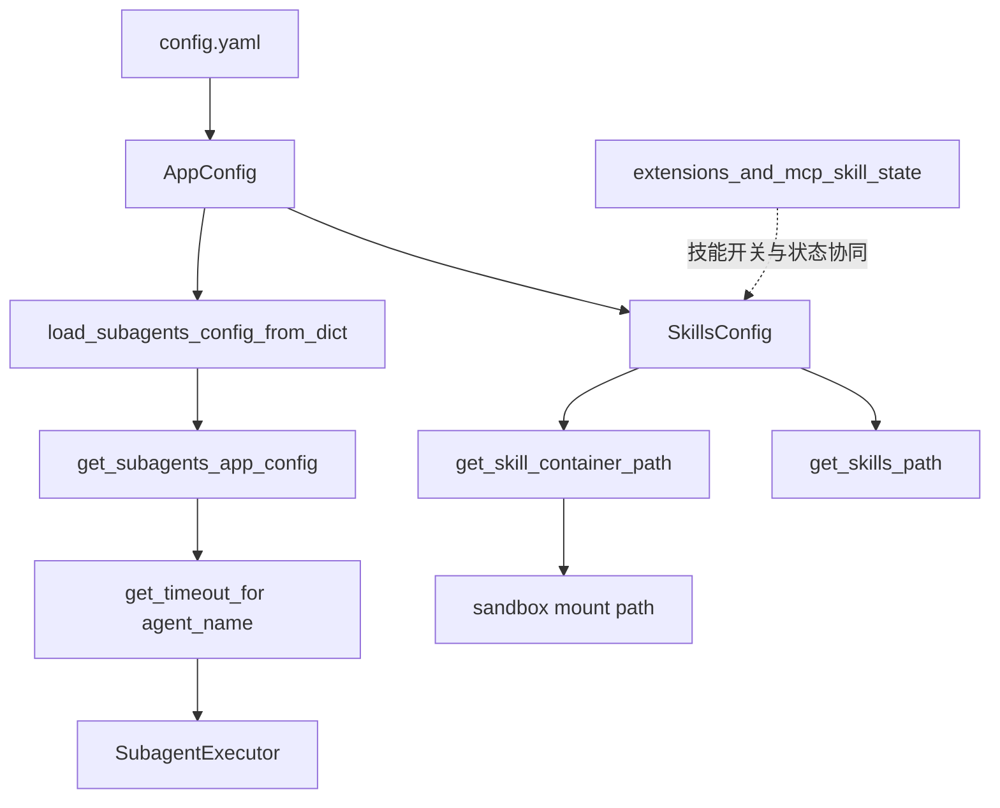
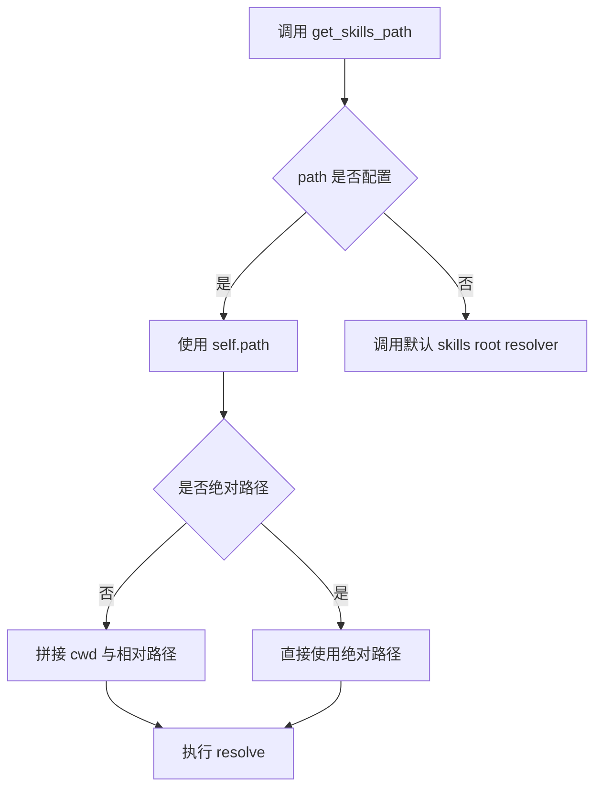
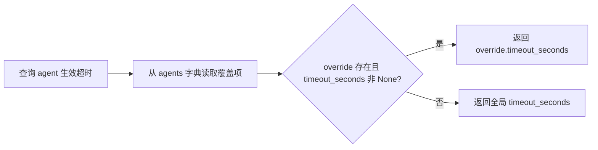
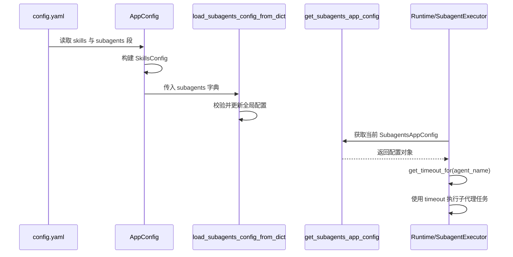

# skills_and_subagents_configuration 模块文档

## 模块概述

`skills_and_subagents_configuration` 是应用配置体系中专门负责“技能路径约定”和“子代理超时策略”的配置子模块，对应三个核心组件：`SkillsConfig`、`SubagentsAppConfig`、`SubagentOverrideConfig`。这个模块本身不执行技能、不调度子代理，但它定义了运行时必须遵守的输入契约：技能资源从哪里加载、在容器中按什么路径访问、每个子代理最多允许运行多久。

该模块存在的意义，是把 `config.yaml` 这类松散文本配置收敛为带类型约束的 Pydantic 对象，尽可能把错误前置到启动阶段，而不是在运行时以“路径找不到”“任务超时不可控”等形式暴露。它在系统中承担“策略声明层”的角色，上接 [application_and_feature_configuration.md](application_and_feature_configuration.md) 的配置编排，下接 [subagents_and_skills_runtime.md](subagents_and_skills_runtime.md) 与 [sandbox_core_runtime.md](sandbox_core_runtime.md) 的执行逻辑。

---

## 模块在系统中的位置与依赖关系



这张图强调一个关键点：该模块不产生业务结果，但它通过配置影响业务结果。`SkillsConfig` 决定“技能文件系统坐标”；`SubagentsAppConfig` 决定“执行时长上限”。因此，任何配置偏差都会在运行层被放大，常见后果是技能无法被容器访问或子代理提前/过晚超时。

---

## 设计原则与实现取舍

本模块实现非常克制，主要围绕三项原则。

第一项原则是“强校验默认值优先”。借助 Pydantic 的 `Field` 约束，像 `timeout_seconds >= 1` 这样的硬约束能在模型构建时直接失败，减少运行时不确定行为。

第二项原则是“全局默认 + 局部覆盖”。`SubagentsAppConfig` 提供全局超时默认值，`SubagentOverrideConfig` 只在必要时覆盖个别 agent，既避免每个 agent 都重复配置，又能对长任务 agent 精细调优。

第三项原则是“宿主路径与容器路径解耦”。`SkillsConfig.path` 关注主机文件位置，`container_path` 关注容器内访问路径，两者通过挂载策略关联，这使得本地开发、容器部署、远程沙箱部署可以共用同一套上层配置语义。

---

## 核心组件详解

## `SkillsConfig`

`SkillsConfig` 定义技能目录的来源路径与容器映射路径，核心目标是把“技能在哪儿”这个问题表达为可复用的统一接口。

### 字段语义

- `path: str | None = None`
  - 为空时走默认技能根目录解析（`get_skills_root_path()`）。
  - 非空时支持绝对路径与相对路径；相对路径以进程 `cwd` 为锚点解析。
- `container_path: str = "/mnt/skills"`
  - 仅表示容器内约定挂载前缀，不保证真实挂载存在。

### `get_skills_path() -> Path`

这个方法返回最终技能根目录（`Path` 对象），逻辑上有两条分支：配置显式路径与默认路径回退。



返回值始终是“解析后路径”，但该方法不检查目录是否存在，也不创建目录。也就是说它只负责“路径决议”，不负责“路径可用性”。如果调用方要保证技能可加载，应在后续显式做 `exists()`/`is_dir()` 校验。

### `get_skill_container_path(skill_name: str, category: str = "public") -> str`

这个方法用字符串拼接技能在容器中的目标路径，返回格式为：

`{container_path}/{category}/{skill_name}`

它是一个轻量工具函数，不做 category 合法性校验，也不会标准化多余斜杠。换句话说，调用方需要保证传入值符合系统约定（常见 category 为 `public` 或 `custom`）。

---

## `SubagentOverrideConfig`

`SubagentOverrideConfig` 是“单个子代理覆盖项”的配置模型，目前只定义了超时覆盖字段。

### 字段语义

- `timeout_seconds: int | None = None`
  - `None` 表示不覆盖，回退到全局默认。
  - 使用 `ge=1` 做下界约束，防止 0 或负值。

当配置为非法值（例如 0、-1、字符串）时，Pydantic 在实例化时抛出验证异常；在典型启动流程中，这会中断配置加载，属于“早失败”行为。

---

## `SubagentsAppConfig`

`SubagentsAppConfig` 表达子代理系统的应用级超时策略，是运行时计算“某 agent 实际超时值”的唯一策略源。

### 字段语义

- `timeout_seconds: int = 900`
  - 全局默认超时，900 秒（15 分钟），并受 `ge=1` 约束。
- `agents: dict[str, SubagentOverrideConfig] = {}`
  - key 为 agent 名称，value 为覆盖配置。

### `get_timeout_for(agent_name: str) -> int`

`get_timeout_for` 的行为是典型两级回退：先查 agent 覆盖，再回退全局默认。



该函数无副作用、无日志输出，纯策略读取。它的可靠性依赖于 agent 名称一致性：如果调用时名称拼写不一致，会静默回退到全局默认。

---

## 模块级函数与全局状态

`subagents_config.py` 额外提供了一个模块级配置单例：`_subagents_config`。默认值为 `SubagentsAppConfig()`。

### `get_subagents_app_config() -> SubagentsAppConfig`

返回当前生效的全局子代理配置对象。该函数本身不做拷贝，调用方拿到的是当前对象引用。

### `load_subagents_config_from_dict(config_dict: dict) -> None`

这个函数负责从字典加载并替换全局配置，内部流程是：

1. `SubagentsAppConfig(**config_dict)` 触发模型构建与校验。
2. 成功后覆盖模块级 `_subagents_config`。
3. 汇总有显式超时覆盖的 agent，并打印 `info` 日志摘要。

它的主要副作用是“写全局状态”。这在启动阶段通常没有问题，但在运行中热加载时，需要由上层保证调用时序与并发可见性。

---

## 关键流程：从 YAML 到运行时行为



这个流程说明了配置层与执行层的边界：该模块只定义策略与默认值，不直接控制任务生命周期；真正的取消、中断、超时处理在执行层完成。

---

## 使用示例

### YAML 配置示例

```yaml
skills:
  path: ./skills
  container_path: /mnt/skills

subagents:
  timeout_seconds: 900
  agents:
    researcher:
      timeout_seconds: 1200
    code_reviewer:
      timeout_seconds: 600
```

### Python 使用示例

```python
from src.config.app_config import AppConfig
from src.config.subagents_config import get_subagents_app_config

app_cfg = AppConfig.from_file("config.yaml")

# 技能路径决议
skills_root = app_cfg.skills.get_skills_path()
web_skill_in_container = app_cfg.skills.get_skill_container_path(
    skill_name="web_search",
    category="public",
)

# 子代理超时决议
sub_cfg = get_subagents_app_config()
research_timeout = sub_cfg.get_timeout_for("researcher")  # 1200
unknown_timeout = sub_cfg.get_timeout_for("unknown")      # 900
```

---

## 扩展方式与兼容性建议

如果要扩展该模块，建议沿用“默认值 + 局部覆盖 + 显式 getter”的现有形态。例如新增 `max_turns`、`model` 这类按 agent 覆盖项时，应先在 `SubagentOverrideConfig` 添加字段，再在 `SubagentsAppConfig` 增加对应的 `get_xxx_for(agent_name)` 决策函数，最后由运行时消费该生效值。这样可以保持策略集中管理，避免调用点分散地手写回退逻辑。

在演进过程中，尽量保持字段向后兼容（为新字段提供默认值），避免让旧配置文件在升级后立刻失效。

---

## 边界条件、错误场景与运维注意事项

最常见的问题来自路径与命名一致性。`skills.path` 如果是相对路径，其解析锚点是进程当前工作目录，而不是配置文件所在目录；部署方式变化（systemd、容器入口、IDE）会导致路径漂移，因此生产环境更推荐绝对路径。

另一个高频问题是容器路径错配。`container_path` 只是约定值，若沙箱挂载没对齐该路径，运行时会出现文件不存在错误，但配置层不会报错。排查时要同时检查 [model_tool_sandbox_basics.md](model_tool_sandbox_basics.md) 与 [sandbox_core_runtime.md](sandbox_core_runtime.md) 中的挂载配置。

对于子代理超时，非法值会在加载时被 Pydantic 拒绝，这是好事；但 agent 名字写错时不会报错，只会回退默认超时。建议在运行日志中打印“agent 名称 + 生效 timeout”，并把关键 agent 名称纳入测试断言。

最后，`load_subagents_config_from_dict` 会替换全局对象。如果系统支持热更新配置，应在上层增加同步策略或版本切换机制，避免请求在配置切换窗口内读取到不一致状态。

---

## 相关文档

- 配置总览与聚合入口： [application_and_feature_configuration.md](application_and_feature_configuration.md)
- 沙箱与挂载基础： [model_tool_sandbox_basics.md](model_tool_sandbox_basics.md)、[sandbox_core_runtime.md](sandbox_core_runtime.md)
- 子代理运行时： [subagents_and_skills_runtime.md](subagents_and_skills_runtime.md)
- 扩展能力与技能状态： [extensions_and_mcp_skill_state.md](extensions_and_mcp_skill_state.md)

---

## 总结

`skills_and_subagents_configuration` 的实现体量很小，但它定义了两条关键控制面：技能路径控制面与子代理超时控制面。通过 Pydantic 结构化建模、默认值回退和统一读取接口，它把“容易在运行时爆炸的配置问题”前移到“可验证、可观测的启动阶段”。对维护者来说，理解该模块的核心不在于复杂算法，而在于它如何为运行时提供稳定、可演进的配置契约。