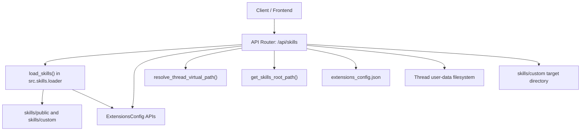
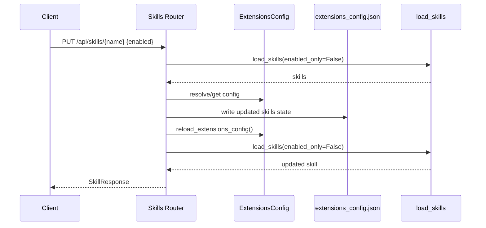
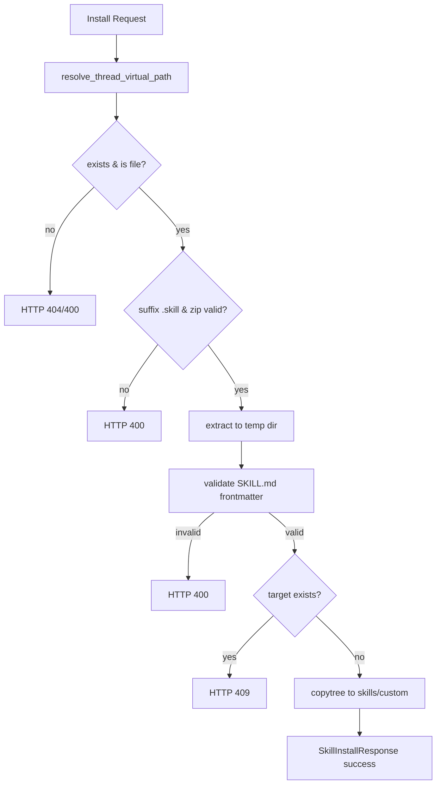

# skills_api_contracts 模块文档

## 模块概述

`skills_api_contracts` 模块对应后端文件 `backend/src/gateway/routers/skills.py`，是 Gateway 层中“技能（Skill）管理”相关 HTTP API 的契约定义与核心实现入口。它的职责并不只是声明几个请求/响应模型，而是将 **技能元数据读取、技能启停状态持久化、以及 `.skill` 安装包落盘** 这些能力统一暴露为稳定的 REST 接口，以便前端与外部客户端可以用一致的协议管理技能生命周期。

从系统设计角度看，这个模块存在的原因是将“技能运行时（`src.skills`）”与“配置系统（`extensions_config`）”之间的细节隔离在网关后面。调用方只需知道 `/api/skills` 相关接口，不需要直接理解技能目录结构、`extensions_config.json` 文件格式、或者路径安全校验逻辑。这样做提升了前后端解耦程度，也降低了未来替换技能存储/配置机制时的迁移成本。

在模块树中，它是 `gateway_api_contracts` 的子模块，并与以下文档有紧密关联：

- 网关运行时配置：[`gateway_runtime_config.md`](gateway_runtime_config.md)
- 扩展与技能状态配置：[`extensions_and_mcp_skill_state.md`](extensions_and_mcp_skill_state.md)
- 路径解析与文件系统安全：[`path_resolution_and_fs_security.md`](path_resolution_and_fs_security.md)
- 技能与子代理运行时类型：[`subagents_and_skills_runtime.md`](subagents_and_skills_runtime.md)
- 应用层技能配置项：[`skills_and_subagents_configuration.md`](skills_and_subagents_configuration.md)

---

## 设计目标与边界

该模块重点解决三个问题。第一，提供技能列表与详情查询能力，并且显式返回 `enabled` 状态，保证 UI 可以正确显示“已启用/已禁用”。第二，允许通过 API 修改技能启用状态，并将结果写入统一扩展配置文件（`extensions_config.json`），避免直接篡改 `SKILL.md`。第三，支持从线程沙箱中的 `.skill` ZIP 包安装自定义技能，同时执行基础安全与格式校验。

这个模块**不负责**技能内容执行、工具调用调度、模型推理或子代理编排；这些行为属于运行时层能力。它也不负责完整的恶意内容扫描（例如脚本行为审计），目前只进行前置的结构与 frontmatter 校验。

---

## 架构与依赖关系



该图说明了模块在运行时的依赖拓扑。`/api/skills` 路由并不直接解析所有配置，而是通过 `load_skills()` 聚合技能元数据；`load_skills()` 内部会基于 `ExtensionsConfig.from_file()` 决定技能最终启用态。更新接口会修改 `extensions_config.json` 并触发 `reload_extensions_config()`，从而刷新进程内缓存。安装接口则走 `resolve_thread_virtual_path()` 把“线程内虚拟路径”映射为真实文件路径，最后把校验通过的技能复制到 `skills/custom`。

---

## API 契约模型（Core Components）

以下 5 个 Pydantic 模型是本模块对外契约的核心。

### 1) `SkillResponse`

`SkillResponse` 是技能实体的标准输出结构，字段包括：

- `name: str`：技能名
- `description: str`：技能描述
- `license: str | None`：许可证信息（可空）
- `category: str`：分类（典型值 `public`/`custom`）
- `enabled: bool`：是否启用

这个模型被“列表查询、单项查询、更新后返回”复用，保证前端读取技能元数据的结构一致。内部通过 `_skill_to_response(skill: Skill)` 将运行时对象 `Skill` 转换为 API 模型。

### 2) `SkillsListResponse`

`SkillsListResponse` 仅包含一个字段：`skills: list[SkillResponse]`。该设计避免了直接暴露运行时 `Skill` 类型，形成清晰的网关边界，同时方便后续给列表响应增加分页或统计字段。

### 3) `SkillUpdateRequest`

`SkillUpdateRequest` 用于 `PUT /api/skills/{skill_name}` 请求体，目前只有一个字段：

- `enabled: bool`

尽管字段简单，但它将“技能启停状态变更”抽象为稳定契约，避免调用方接触底层 `extensions_config.json` 的具体结构。

### 4) `SkillInstallRequest`

`SkillInstallRequest` 用于安装技能，请求字段如下：

- `thread_id: str`：线程 ID
- `path: str`：线程虚拟路径（如 `/mnt/user-data/outputs/my-skill.skill`）

这里的关键是“路径在语义上属于线程沙箱视角”，并非服务进程本地绝对路径。模块通过 `resolve_thread_virtual_path()` 做安全映射。

### 5) `SkillInstallResponse`

安装结果模型，字段包括：

- `success: bool`
- `skill_name: str`
- `message: str`

即便安装失败会抛 HTTPException，这个成功响应模型仍用于前端统一显示“安装结果提示”。

---

## 路由行为详解

虽然当前模块名强调“contracts”，但 `skills.py` 同时实现了完整业务流程。理解这些流程有助于准确把握契约语义。

### `GET /api/skills`：列出全部技能

该接口调用 `load_skills(enabled_only=False)`，意味着返回结果包含启用与禁用技能。若底层读取失败，会记录日志并返回 `500`。

```python
@router.get("/skills", response_model=SkillsListResponse)
async def list_skills() -> SkillsListResponse:
    skills = load_skills(enabled_only=False)
    return SkillsListResponse(skills=[_skill_to_response(skill) for skill in skills])
```

返回顺序受 `load_skills()` 影响，默认按技能名排序。

### `GET /api/skills/{skill_name}`：获取单个技能详情

接口先加载全部技能，再按 `name` 匹配；未找到返回 `404`。这是典型“基于最终视图查询”的方式，可确保 `enabled` 状态与列表接口一致。

### `PUT /api/skills/{skill_name}`：更新启用状态

更新流程包含多个关键步骤：

1. 验证技能存在（通过 `load_skills(enabled_only=False)`）
2. 定位配置文件路径（`ExtensionsConfig.resolve_config_path()`）
3. 获取缓存配置（`get_extensions_config()`）并更新 `skills[skill_name].enabled`
4. 重新序列化并写回 JSON 文件（保留 `mcpServers`）
5. 调用 `reload_extensions_config()` 刷新缓存
6. 再次加载技能并返回更新后的技能对象



这个流程体现了“磁盘真值 + 进程缓存刷新”的一致性策略。

### `POST /api/skills/install`：安装 `.skill` 包

安装过程是本模块最复杂的路径，核心逻辑如下：

1. 根据 `thread_id + virtual path` 解析真实路径
2. 校验文件存在、是文件、扩展名为 `.skill`、且是有效 ZIP
3. 提取到临时目录并识别技能根目录
4. 执行 `_validate_skill_frontmatter()`
5. 检查目标技能名是否已存在
6. 将技能目录复制到 `skills/custom/{skill_name}`



---

## Frontmatter 校验机制（关键内部函数）

`_validate_skill_frontmatter(skill_dir: Path) -> tuple[bool, str, str | None]` 是安装路径的核心防线。它要求：

- 目录下必须有 `SKILL.md`
- 文件开头必须是 YAML frontmatter（`---` 包裹）
- frontmatter 必须是字典
- 仅允许以下字段：`name`, `description`, `license`, `allowed-tools`, `metadata`
- `name` 必须满足 hyphen-case（小写字母/数字/连字符），不能连续 `--`，长度 ≤ 64
- `description` 必须是字符串，不能包含 `<` 或 `>`，长度 ≤ 1024

该函数返回 `(is_valid, message, skill_name)`，路由层据此决定返回 400 或继续安装。

> 注意：当前校验主要针对元数据规范与基础安全约束，不检查 ZIP 炸弹、符号链接逃逸、恶意脚本内容等高级风险。

---

## 与其他模块的协作关系

`skills_api_contracts` 的运行效果依赖若干上游模块行为，建议结合下列文档阅读：

- [`extensions_and_mcp_skill_state.md`](extensions_and_mcp_skill_state.md)：解释 `ExtensionsConfig` 的路径解析策略、缓存机制与 `is_skill_enabled` 默认规则。
- [`path_resolution_and_fs_security.md`](path_resolution_and_fs_security.md)：解释 `resolve_thread_virtual_path` 如何将路径错误映射为 `400/403`。
- [`subagents_and_skills_runtime.md`](subagents_and_skills_runtime.md)：解释 `Skill` 运行时类型与技能目录扫描模型。
- [`skills_and_subagents_configuration.md`](skills_and_subagents_configuration.md)：解释应用配置如何影响技能路径选择。

---

## 使用示例

### 示例 1：获取技能列表

```bash
curl -X GET http://localhost:8000/api/skills
```

```json
{
  "skills": [
    {
      "name": "pdf-processing",
      "description": "Extract and analyze PDF content",
      "license": "MIT",
      "category": "public",
      "enabled": true
    }
  ]
}
```

### 示例 2：禁用技能

```bash
curl -X PUT http://localhost:8000/api/skills/pdf-processing \
  -H "Content-Type: application/json" \
  -d '{"enabled": false}'
```

### 示例 3：安装技能包

```bash
curl -X POST http://localhost:8000/api/skills/install \
  -H "Content-Type: application/json" \
  -d '{
    "thread_id": "abc123-def456",
    "path": "/mnt/user-data/outputs/my-skill.skill"
  }'
```

---

## 错误条件与边界行为

该模块在错误映射上比较明确，开发者需要重点关注：

- `400 Bad Request`：路径不是文件、扩展名错误、非 ZIP、frontmatter 格式非法、必填字段缺失等。
- `403 Forbidden`：通常来自路径解析层识别到 path traversal。
- `404 Not Found`：技能不存在或安装包路径不存在。
- `409 Conflict`：安装时目标技能目录已存在。
- `500 Internal Server Error`：配置读写失败、未知异常、重载后技能丢失等。

此外有几个容易忽略的行为：

1. 更新技能状态时，若找不到既有配置文件，代码会在 `Path.cwd().parent / "extensions_config.json"` 新建文件。这一行为依赖运行目录，容器部署时应明确工作目录策略。
2. `update_skill` 先读缓存配置再写文件，适用于单进程低并发场景；若多实例并发写同一配置文件，可能出现覆盖风险。
3. `install_skill` 使用 `zipfile.extractall()` 直接解压，未显式过滤 ZIP 内部路径形态，建议后续增强防护（如拒绝绝对路径和 `..` 条目）。
4. 安装时只检查“技能名是否已存在”，不提供覆盖安装或版本升级语义。

---

## 可扩展性与演进建议

如果你计划扩展本模块，建议优先考虑以下方向。

第一，可以把“安装校验”抽象为策略链（metadata 校验、文件安全校验、许可证策略校验），以便企业场景按需插拔。第二，可以将配置写入改为原子写（写临时文件后 rename）并引入文件锁，降低并发覆盖风险。第三，可以新增 `DELETE /api/skills/{name}` 与 `POST /api/skills/{name}/reinstall` 形成完整生命周期管理。

对于契约演进，建议保持 `SkillResponse` 向后兼容。如果需要新增字段，优先追加可选字段；尽量不要改变 `enabled`、`category` 的语义，以免影响前端渲染和自动化脚本。

---

## 维护者速查（实现要点）

- 入口路由：`APIRouter(prefix="/api", tags=["skills"])`
- 核心模型：`SkillResponse`、`SkillsListResponse`、`SkillUpdateRequest`、`SkillInstallRequest`、`SkillInstallResponse`
- 关键依赖：`load_skills`、`ExtensionsConfig`、`resolve_thread_virtual_path`、`get_skills_root_path`
- 关键常量：`ALLOWED_FRONTMATTER_PROPERTIES`
- 关键辅助函数：`_validate_skill_frontmatter`、`_skill_to_response`

如果你只做问题排查，建议先看三处日志：`Failed to load skills`、`Failed to update skill`、`Failed to install skill`，再结合配置文件与技能目录实况定位。
