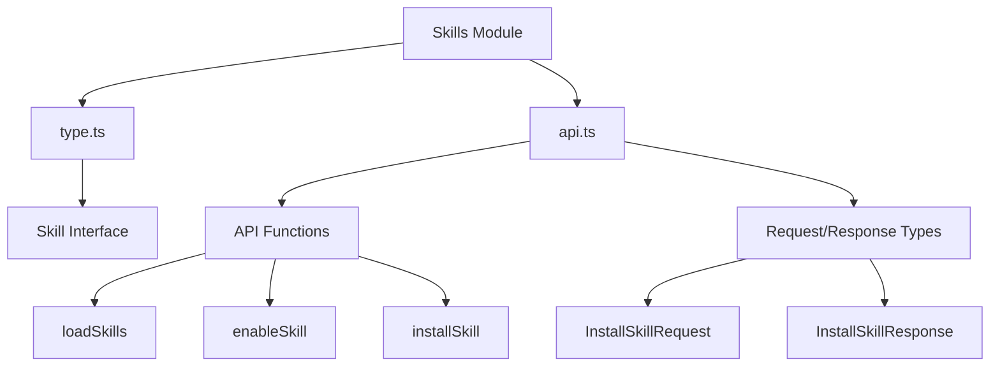

# Skills Module Documentation

## 1. Overview

The Skills module is a core frontend component that manages the integration, installation, and control of skills within the application. Skills are modular capabilities that extend the agent's functionality, allowing users to enhance the agent's abilities through a structured interface.

This module provides:
- Type definitions for skill data structures
- API clients for skill management operations
- Functions to load, install, enable, and disable skills
- Integration with the backend skills API for seamless communication

The module is part of the frontend's core domain types and state management, working closely with other components like the Gateway API contracts and application configuration systems.

## 2. Architecture

The Skills module follows a clean separation of concerns with two main files:
- `type.ts`: Defines the core data structures
- `api.ts`: Provides API interaction functions and request/response types



### Component Relationships

- **Skill Interface**: The foundational data structure that defines what a skill is within the application
- **API Functions**: These functions use the Skill interface and related request/response types to communicate with the backend
- **InstallSkillRequest/Response**: Type-safe contracts for the skill installation API endpoint
- **Backend Integration**: The module communicates with the backend via the `/api/skills` and `/api/skills/install` endpoints

## 3. Core Components

### Skill Interface

The `Skill` interface is the fundamental data structure representing a skill in the system.

```typescript
export interface Skill {
  name: string;
  description: string;
  category: string;
  license: string;
  enabled: boolean;
}
```

**Properties**:
- `name`: Unique identifier for the skill
- `description`: Human-readable description of what the skill does
- `category`: Organizational category for grouping similar skills
- `license`: The license under which the skill is distributed
- `enabled`: Boolean indicating whether the skill is currently active

### API Functions

#### loadSkills

Fetches the list of available skills from the backend.

```typescript
export async function loadSkills() {
  const skills = await fetch(`${getBackendBaseURL()}/api/skills`);
  const json = await skills.json();
  return json.skills as Skill[];
}
```

**Returns**: A promise that resolves to an array of `Skill` objects.

#### enableSkill

Enables or disables a specific skill.

```typescript
export async function enableSkill(skillName: string, enabled: boolean) {
  const response = await fetch(
    `${getBackendBaseURL()}/api/skills/${skillName}`,
    {
      method: "PUT",
      headers: {
        "Content-Type": "application/json",
      },
      body: JSON.stringify({
        enabled,
      }),
    },
  );
  return response.json();
}
```

**Parameters**:
- `skillName`: The name of the skill to modify
- `enabled`: Boolean indicating whether to enable (true) or disable (false) the skill

**Returns**: A promise that resolves to the JSON response from the server.

#### installSkill

Installs a new skill from a specified path.

```typescript
export async function installSkill(
  request: InstallSkillRequest,
): Promise<InstallSkillResponse> {
  const response = await fetch(`${getBackendBaseURL()}/api/skills/install`, {
    method: "POST",
    headers: {
      "Content-Type": "application/json",
    },
    body: JSON.stringify(request),
  });

  if (!response.ok) {
    const errorData = await response.json().catch(() => ({}));
    const errorMessage =
      errorData.detail ?? `HTTP ${response.status}: ${response.statusText}`;
    return {
      success: false,
      skill_name: "",
      message: errorMessage,
    };
  }

  return response.json();
}
```

**Parameters**:
- `request`: An `InstallSkillRequest` object containing the installation details

**Returns**: A promise that resolves to an `InstallSkillResponse` object with the installation result.

### Request/Response Types

#### InstallSkillRequest

Interface for the skill installation request payload.

```typescript
export interface InstallSkillRequest {
  thread_id: string;
  path: string;
}
```

**Properties**:
- `thread_id`: The identifier of the thread where the skill should be installed
- `path`: The file path or URL where the skill is located

#### InstallSkillResponse

Interface for the skill installation response.

```typescript
export interface InstallSkillResponse {
  success: boolean;
  skill_name: string;
  message: string;
}
```

**Properties**:
- `success`: Boolean indicating whether the installation was successful
- `skill_name`: The name of the installed skill (if successful)
- `message`: A human-readable message providing additional information about the installation result

## 4. Usage Examples

### Loading Skills

```typescript
import { loadSkills } from '@/core/skills/api';

async function fetchAndDisplaySkills() {
  try {
    const skills = await loadSkills();
    console.log('Available skills:', skills);
  } catch (error) {
    console.error('Failed to load skills:', error);
  }
}
```

### Enabling/Disabling a Skill

```typescript
import { enableSkill } from '@/core/skills/api';

async function toggleSkill(skillName: string, currentState: boolean) {
  try {
    const response = await enableSkill(skillName, !currentState);
    console.log('Skill toggle response:', response);
  } catch (error) {
    console.error('Failed to toggle skill:', error);
  }
}
```

### Installing a Skill

```typescript
import { installSkill, InstallSkillRequest } from '@/core/skills/api';

async function installNewSkill(threadId: string, skillPath: string) {
  try {
    const request: InstallSkillRequest = {
      thread_id: threadId,
      path: skillPath
    };
    
    const response = await installSkill(request);
    
    if (response.success) {
      console.log(`Successfully installed skill: ${response.skill_name}`);
    } else {
      console.error('Skill installation failed:', response.message);
    }
  } catch (error) {
    console.error('Failed to install skill:', error);
  }
}
```

## 5. Configuration and Integration

The Skills module depends on:

- `getBackendBaseURL()` from `@/core/config`: Provides the base URL for API requests
- Backend API endpoints:
  - `GET /api/skills`: Retrieves the list of skills
  - `PUT /api/skills/{skillName}`: Updates a skill's enabled status
  - `POST /api/skills/install`: Installs a new skill

For backend integration details, see the [Gateway API Contracts](gateway_api_contracts.md) documentation.

## 6. Edge Cases and Error Handling

The Skills module includes specific error handling in the `installSkill` function:

- **HTTP Error Handling**: When the server returns a non-OK status (4xx, 5xx), the function attempts to parse the error response and extract a detailed error message
- **Fallback Error Messages**: If error parsing fails, a generic HTTP error message is provided
- **Consistent Response Format**: Even in error cases, the function returns a properly formatted `InstallSkillResponse` object

Other edge cases to consider:
- Network failures when making API requests
- Invalid skill names in `enableSkill`
- Missing or malformed data in API responses
- Permissions issues when installing skills

## 7. Related Modules

- **Gateway API Contracts**: Defines the backend API structure for skills (see [gateway_api_contracts.md](gateway_api_contracts.md))
- **Application and Feature Configuration**: Contains skills configuration (see [application_and_feature_configuration.md](application_and_feature_configuration.md))
- **Subagents and Skills Runtime**: Handles the execution of skills (see [subagents_and_skills_runtime.md](subagents_and_skills_runtime.md))
