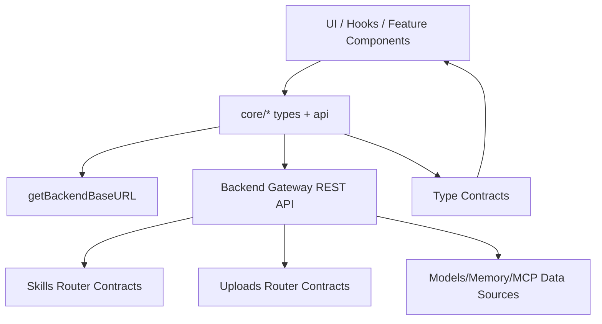
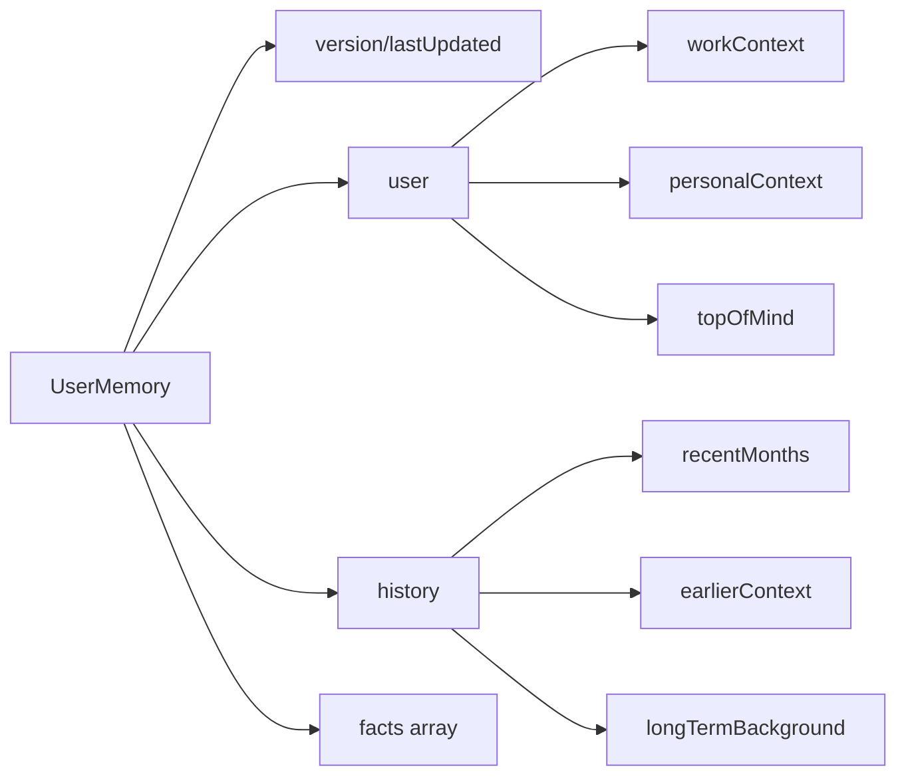
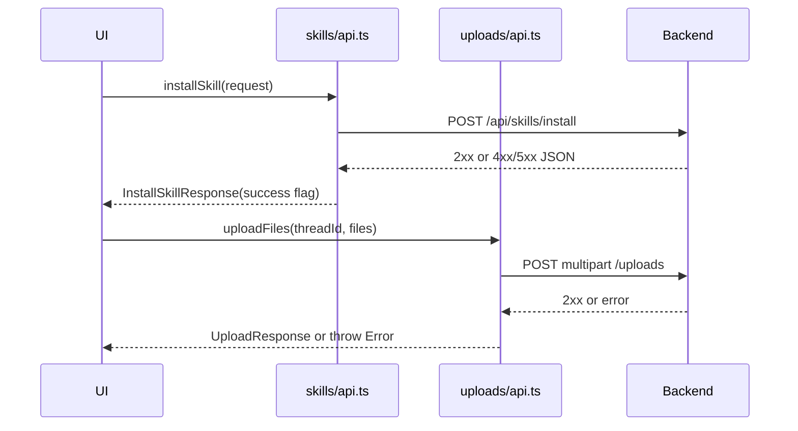
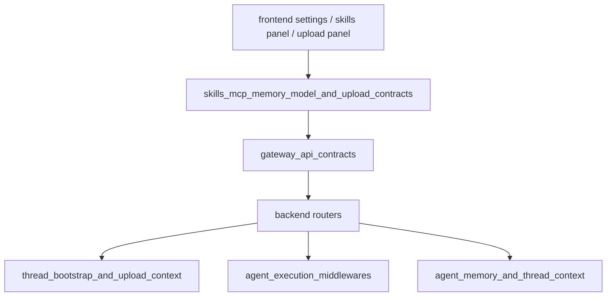

# skills_mcp_memory_model_and_upload_contracts 模块文档

## 1. 模块概述与设计目标

`skills_mcp_memory_model_and_upload_contracts` 是前端核心领域层（`frontend/src/core`）中面向“配置契约与轻量 API 封装”的聚合模块。它把五类和 Agent 运行体验高度相关的数据契约统一放在一起：

1. MCP（Model Context Protocol）服务器配置类型；
2. 用户记忆（Memory）结构化类型；
3. 模型目录（Model catalog）类型；
4. 技能（Skills）安装/启用 API 与类型；
5. 上传文件（Uploads）API 与返回结构。

这个模块存在的核心原因，不是为了实现复杂业务逻辑，而是为了在前端提供**稳定、可推断、可组合**的数据边界：UI、状态管理、Hooks、页面容器在和后端交互时，尽量依赖这些共享类型与函数，而不是散落的手写对象。这样做可以降低接口漂移带来的维护成本，并把“协议变化影响面”收敛到核心层。

从系统视角看，本模块是一个“契约枢纽（contract hub）”：上游承接后端网关 API（参见 [gateway_api_contracts.md](gateway_api_contracts.md)），下游服务于前端线程、消息、设置、技能市场、上传面板等功能域（参见 [frontend_core_domain_types_and_state.md](frontend_core_domain_types_and_state.md) 与 [thread_bootstrap_and_upload_context.md](thread_bootstrap_and_upload_context.md)）。

---

## 2. 模块组成与代码地图

该模块由以下文件构成：

- `frontend/src/core/mcp/types.ts`
- `frontend/src/core/memory/types.ts`
- `frontend/src/core/models/types.ts`
- `frontend/src/core/skills/type.ts`
- `frontend/src/core/skills/api.ts`
- `frontend/src/core/uploads/api.ts`

它们整体上可以分为两类：

- **纯类型契约（Type-only contracts）**：`mcp/types.ts`、`memory/types.ts`、`models/types.ts`、`skills/type.ts`
- **带网络副作用的 API 封装（IO wrappers）**：`skills/api.ts`、`uploads/api.ts`



上图说明了该模块的典型职责：一方面向上提供类型安全，另一方面向下统一 HTTP 调用入口；它自己不管理全局状态，也不承担复杂缓存策略。

---

## 3. 核心数据模型详解

## 3.1 MCP 配置契约（`frontend/src/core/mcp/types.ts`）

### `MCPServerConfig`

```typescript
export interface MCPServerConfig extends Record<string, unknown> {
  enabled: boolean;
  description: string;
}
```

`MCPServerConfig` 用于表达“单个 MCP server 的前端可见配置”。它继承 `Record<string, unknown>`，意味着除了 `enabled` 与 `description` 这两个稳定字段外，还允许后端或插件扩展额外字段。这个设计兼顾了两件事：

- 前端可以依赖核心字段实现启停开关、描述展示；
- 不会因为后端新增字段导致类型层面立刻 break。

需要注意，这种“开放字典”模型带来灵活性，也带来类型约束弱化：调用方在读取扩展字段时必须做运行时校验，否则容易出现 `unknown` 误用。

### `MCPConfig`

```typescript
export interface MCPConfig {
  mcp_servers: Record<string, MCPServerConfig>;
}
```

`MCPConfig` 代表 MCP 总配置快照，其中 `mcp_servers` 的 key 通常是 server 名称或 ID，value 为 `MCPServerConfig`。这使前端可以以“字典遍历”方式构建管理面板，而不是依赖固定 server 列表。

与后端契约映射建议参考 [mcp_configuration_contracts.md](mcp_configuration_contracts.md)。

---

## 3.2 用户记忆结构（`frontend/src/core/memory/types.ts`）

### `UserMemory`

`UserMemory` 是一个分层的、可时间追踪的用户上下文快照，包含版本、更新时间、用户维度摘要、历史维度摘要和事实列表：

- 顶层元信息：`version`、`lastUpdated`
- `user`：`workContext` / `personalContext` / `topOfMind`
- `history`：`recentMonths` / `earlierContext` / `longTermBackground`
- `facts[]`：离散事实条目，包含 `id`、`content`、`category`、`confidence`、`createdAt`、`source`

这种结构的设计动机是把“可叙述摘要（summary）”和“可检索事实（facts）”分开：摘要用于快速注入上下文，facts 用于细粒度回溯与可解释性展示。



在前端实现中，`updatedAt` 和 `createdAt` 都是字符串，不强制 ISO 格式；这意味着展示层如果要排序、格式化，需额外做日期解析与容错。

与后端字段语义对齐请参考 [memory_api_contracts.md](memory_api_contracts.md) 与 [agent_memory_and_thread_context.md](agent_memory_and_thread_context.md)。

---

## 3.3 模型目录类型（`frontend/src/core/models/types.ts`）

### `Model`

```typescript
export interface Model {
  id: string;
  name: string;
  display_name: string;
  description?: string | null;
  supports_thinking?: boolean;
}
```

`Model` 代表前端可展示/可选择的大模型条目。`description` 与 `supports_thinking` 被定义为可选，是为了兼容不同后端供应商返回能力不一致的情况。UI 在渲染时应采用“能力探测”策略：

- 若 `supports_thinking` 缺失，不应默认等同于 `false`，而应视为“未知”；
- `description` 允许 `null`，因此文案 fallback 必须存在。

相关后端 API 约定可参考 [models_api_contracts.md](models_api_contracts.md)。

---

## 3.4 技能类型与安装契约

### `Skill`（`frontend/src/core/skills/type.ts`）

```typescript
export interface Skill {
  name: string;
  description: string;
  category: string;
  license: string;
  enabled: boolean;
}
```

`Skill` 是技能列表页、技能开关、安装结果展示的基础实体。该类型假设技能元数据在前端是“可直接展示”的，因此字段都为必填。

### `InstallSkillRequest` 与 `InstallSkillResponse`（`frontend/src/core/skills/api.ts`）

`InstallSkillRequest`:

- `thread_id: string`：安装过程关联的线程上下文；
- `path: string`：待安装技能路径。

`InstallSkillResponse`:

- `success: boolean`
- `skill_name: string`
- `message: string`

这里的响应结构强调“人可读消息 + 结果标记”，便于前端通知系统直接消费。

与后端接口定义对照见 [skills_api_contracts.md](skills_api_contracts.md)。

---

## 3.5 上传契约（`frontend/src/core/uploads/api.ts`）

### `UploadedFileInfo`

`UploadedFileInfo` 描述单个上传文件及其衍生资源。除基础字段外，还包含 markdown 转换相关可选字段：

- 基础字段：`filename`、`size`、`path`、`virtual_path`、`artifact_url`
- 可选扩展：`extension`、`modified`
- 可选 markdown 衍生：`markdown_file`、`markdown_path`、`markdown_virtual_path`、`markdown_artifact_url`

这表明上传系统不仅存储原始文件，也可能生成可渲染的 markdown 版本供会话/工件视图使用。

### `UploadResponse`

- `success: boolean`
- `files: UploadedFileInfo[]`
- `message: string`

### `ListFilesResponse`

- `files: UploadedFileInfo[]`
- `count: number`

后端协议细节参见 [uploads_api_contracts.md](uploads_api_contracts.md)。

---

## 4. API 函数内部机制与行为说明

## 4.1 Skills API（`frontend/src/core/skills/api.ts`）

### `loadSkills()`

该函数向 `GET /api/skills` 发起请求，解析 JSON 后返回 `json.skills as Skill[]`。它不显式校验 `response.ok`，也不做 schema 校验，因此当后端返回错误结构时，调用方可能在后续渲染阶段才暴露问题。

```typescript
const skills = await loadSkills();
```

### `enableSkill(skillName: string, enabled: boolean)`

该函数向 `PUT /api/skills/{skillName}` 发送 JSON body `{ enabled }`，返回 `response.json()`。它也没有显式处理非 2xx 场景，因此错误对象格式依赖后端。

```typescript
await enableSkill("web_search", true);
```

### `installSkill(request: InstallSkillRequest)`

该函数是 skills API 中错误处理最完整的入口：

1. `POST /api/skills/install` 发送 JSON 请求；
2. 若 `response.ok === false`，尝试解析错误体；
3. 使用 `errorData.detail` 或 `HTTP <status>` 构造统一失败结果；
4. 返回 `InstallSkillResponse`，而不是抛异常。

这意味着调用者可以不使用 `try/catch`，直接根据 `success` 分支处理 UI。

```typescript
const result = await installSkill({
  thread_id: threadId,
  path: "/skills/my_skill",
});

if (!result.success) {
  notify.error(result.message);
}
```

## 4.2 Uploads API（`frontend/src/core/uploads/api.ts`）

### `uploadFiles(threadId: string, files: File[])`

该函数通过 `FormData` 上传多文件到 `POST /api/threads/{threadId}/uploads`。内部行为：

1. 把每个 `File` 追加到同名字段 `files`；
2. 发起 multipart 请求（不手动设置 `Content-Type`）；
3. 非 2xx 时尝试读取 `detail`，并 `throw new Error(...)`；
4. 成功返回 `UploadResponse`。

与 `installSkill` 不同，这里采用“异常流”模型，因此 UI 层必须 `try/catch`。

### `listUploadedFiles(threadId: string)`

发送 `GET /api/threads/{threadId}/uploads/list`。非 2xx 统一抛出 `Error("Failed to list uploaded files")`，不会透出后端详细错误文本。

### `deleteUploadedFile(threadId: string, filename: string)`

发送 `DELETE /api/threads/{threadId}/uploads/{filename}`。失败同样抛出固定错误消息。

```typescript
try {
  const uploaded = await uploadFiles(threadId, selectedFiles);
  console.log(uploaded.files);
} catch (e) {
  notify.error(e instanceof Error ? e.message : "Upload failed");
}
```



上图体现了一个关键差异：skills 安装使用“结果对象语义”，uploads 使用“异常语义”。集成时要避免混用导致遗漏错误处理。

---

## 5. 与系统其他模块的关系

该模块并不孤立，通常位于以下链路中：



在前端侧，它被高层 UI 与状态容器直接依赖；在后端侧，它对应网关层 Router 的请求/响应契约。对于线程上传与上下文注入的完整运行机制，应进一步阅读：

- [thread_bootstrap_and_upload_context.md](thread_bootstrap_and_upload_context.md)
- [uploads_api_contracts.md](uploads_api_contracts.md)
- [memory_api_contracts.md](memory_api_contracts.md)

---

## 6. 典型使用模式

在真实页面中，建议把本模块 API 封装到数据访问层（如 React Query hooks）中，并统一错误策略。

```typescript
import { loadSkills, enableSkill, installSkill } from "@/core/skills/api";
import { uploadFiles, listUploadedFiles } from "@/core/uploads/api";

export async function bootstrapSkillsAndFiles(threadId: string, files: File[]) {
  const skills = await loadSkills();

  // 示例：启用第一个技能
  if (skills[0]) {
    await enableSkill(skills[0].name, true);
  }

  // 安装技能：返回结果对象，不抛异常
  const installResult = await installSkill({
    thread_id: threadId,
    path: "/tmp/skill-package",
  });

  // 上传文件：失败抛异常
  const uploadResult = await uploadFiles(threadId, files);

  // 列表查询
  const listed = await listUploadedFiles(threadId);

  return { installResult, uploadResult, listed };
}
```

对于 MCP、Memory、Model 类型，通常不直接“调用”，而是作为页面 props、store state、API 响应解析后的静态类型标注。

---

## 7. 扩展与演进建议

当你需要扩展该模块时，建议遵循“类型先行、契约对齐、行为一致”三步：先在 `types.ts` 增加字段并标记可选，再对齐后端网关契约，最后统一 API 函数的错误处理范式。当前代码中 skills 与 uploads 的错误语义不一致，长期看建议收敛到统一模式（例如都返回 `Result<T, E>` 或都抛异常并在上层归一化）。

如果要引入 runtime 校验（推荐），可以在 API 层加入 zod/io-ts 等 schema 解析，避免 `as Skill[]` 这类“仅编译期安全”的断言泄漏到运行时。

---

## 8. 边界条件、错误条件与已知限制

本模块最容易踩坑的点集中在“弱校验 + 不一致错误处理 + 可选字段”三类问题。

- `loadSkills()` 与 `enableSkill()` 未检查 `response.ok`，后端异常可能悄然进入正常流程。
- `installSkill()` 返回失败对象而非抛错；`uploadFiles()` 抛错而非失败对象。调用者必须分别处理。
- `MCPServerConfig extends Record<string, unknown>` 虽增强兼容性，但读取扩展字段需要显式类型收窄。
- `UserMemory` 时间字段均为 string；如果服务端格式漂移，前端排序/时间显示会异常。
- `deleteUploadedFile()` 使用 `filename` 作为 URL path 片段，若文件名含特殊字符，调用侧需确保编码正确（通常 `fetch` 拼接前做 `encodeURIComponent` 更稳妥）。
- 上传接口和列表接口错误信息粒度不同，用户提示体验可能不一致。

---

## 9. 测试与维护建议

建议为该模块建立最小但关键的契约测试：

- Skills API：覆盖 2xx、4xx（含 `detail`）、5xx（无 JSON）场景。
- Uploads API：覆盖空文件数组、超大文件、服务端 detail 错误透出、删除失败。
- 类型回归：当后端协议变更时，优先更新 [gateway_api_contracts.md](gateway_api_contracts.md) 相关文档，再同步前端类型。

对于文档联动，请优先引用以下模块而非重复描述：

- [skills_api_contracts.md](skills_api_contracts.md)
- [uploads_api_contracts.md](uploads_api_contracts.md)
- [memory_api_contracts.md](memory_api_contracts.md)
- [mcp_configuration_contracts.md](mcp_configuration_contracts.md)
- [models_api_contracts.md](models_api_contracts.md)

这能确保系统级语义在单一来源维护，避免前后文不一致。
