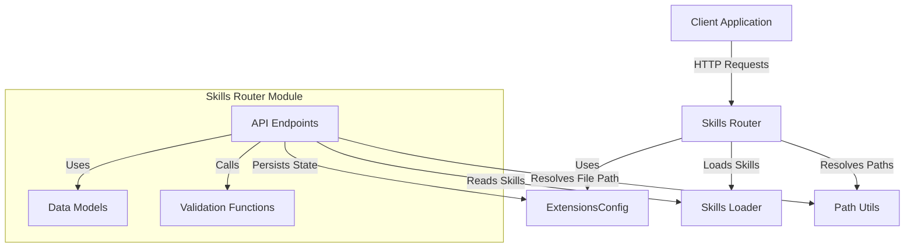

# Skills Router Module Documentation

## 1. Overview

The Skills Router module provides a REST API for managing skills within the system. Skills are modular, self-contained units of functionality that extend the capabilities of the agent system. This module enables users to list, view details, update enabled status, and install new skills from `.skill` files.

### Purpose and Design Rationale

This module serves as the gateway for skill management, providing a clean API that abstracts the underlying skill loading, validation, and persistence mechanisms. The design follows RESTful principles, with clear endpoints for each operation and robust validation to ensure skill integrity. The module is built on FastAPI for high performance and automatic OpenAPI documentation generation.

Key design principles include:
- **Separation of concerns**: API endpoints handle request/response cycles while delegating skill loading to dedicated components
- **Validation-first approach**: Skills are thoroughly validated before installation or use
- **State management**: Skill enabled/disabled status is persisted separately from skill definitions
- **Safety measures**: Path traversal protection and archive validation prevent malicious skill installations

## 2. Architecture and Components

The Skills Router module consists of data models, validation functions, and API endpoints that work together to provide skill management capabilities.

### Component Architecture Diagram



### Core Components

#### Data Models

The module defines several Pydantic models for request/response validation and serialization:

1. **SkillResponse**: Represents a skill with its metadata including name, description, license, category, and enabled status.
2. **SkillsListResponse**: Contains a list of SkillResponse objects for returning multiple skills.
3. **SkillUpdateRequest**: Accepts a boolean `enabled` field for updating a skill's status.
4. **SkillInstallRequest**: Contains `thread_id` and `path` to locate a `.skill` file for installation.
5. **SkillInstallResponse**: Returns installation status, skill name, and result message.

#### Validation Functions

1. **_validate_skill_frontmatter**: Validates the SKILL.md file's YAML frontmatter to ensure it contains required fields and follows naming conventions.
2. **_skill_to_response**: Converts a Skill object to a SkillResponse for API output.

#### API Endpoints

1. **list_skills**: GET endpoint that retrieves all available skills
2. **get_skill**: GET endpoint that retrieves a specific skill by name
3. **update_skill**: PUT endpoint that updates a skill's enabled status
4. **install_skill**: POST endpoint that installs a new skill from a .skill file

### Skill File Structure

A `.skill` file is a ZIP archive that must contain:
- A top-level directory (or files directly in the archive root)
- A `SKILL.md` file with YAML frontmatter containing at least `name` and `description` fields

Optional components may include:
- Scripts
- Reference materials
- Assets
- Other supporting files

## 3. Functionality and Usage

### Listing Skills

The `list_skills` endpoint lists all available skills, regardless of their enabled status.

**Endpoint**: `GET /api/skills`

**Response**: A `SkillsListResponse` containing an array of `SkillResponse` objects.

**Example**:
```json
{
  "skills": [
    {
      "name": "pdf-processing",
      "description": "Extract and analyze PDF content",
      "license": "MIT",
      "category": "public",
      "enabled": true
    },
    {
      "name": "frontend-design",
      "description": "Generate frontend designs and components",
      "license": null,
      "category": "custom",
      "enabled": false
    }
  ]
}
```

### Getting Skill Details

The `get_skill` endpoint retrieves detailed information about a specific skill.

**Endpoint**: `GET /api/skills/{skill_name}`

**Parameters**:
- `skill_name`: The name of the skill to retrieve

**Response**: A `SkillResponse` object with the skill's details.

**Errors**:
- 404: Skill not found

### Updating Skill Status

The `update_skill` endpoint modifies a skill's enabled status.

**Endpoint**: `PUT /api/skills/{skill_name}`

**Parameters**:
- `skill_name`: The name of the skill to update
- Request body: `SkillUpdateRequest` with the new `enabled` status

**Example Request**:
```json
{
  "enabled": false
}
```

**Response**: The updated `SkillResponse` object.

**Errors**:
- 404: Skill not found
- 500: Update failed

This endpoint updates the `extensions_config.json` file to persist the skill's enabled state, without modifying the skill's definition files.

### Installing Skills

The `install_skill` endpoint adds a new skill from a `.skill` file.

**Endpoint**: `POST /api/skills/install`

**Request Body**: `SkillInstallRequest` with:
- `thread_id`: The thread where the .skill file is located
- `path`: Virtual path to the .skill file

**Example Request**:
```json
{
  "thread_id": "abc123-def456",
  "path": "/mnt/user-data/outputs/my-skill.skill"
}
```

**Response**: `SkillInstallResponse` with installation status.

**Example Response**:
```json
{
  "success": true,
  "skill_name": "my-skill",
  "message": "Skill 'my-skill' installed successfully"
}
```

**Errors**:
- 400: Invalid path, file, or skill format
- 403: Access denied (path traversal detected)
- 404: File not found
- 409: Skill already exists
- 500: Installation failed

The installation process:
1. Resolves the virtual path to an actual file path
2. Validates the file is a ZIP archive with .skill extension
3. Extracts to a temporary directory
4. Validates the skill's frontmatter
5. Checks for naming conflicts
6. Copies the skill to the custom skills directory

## 4. Skill Validation Rules

The `_validate_skill_frontmatter` function enforces several rules for skill validity:

### Frontmatter Requirements

- Must be valid YAML enclosed in `---` at the beginning of SKILL.md
- Allowed properties: `name`, `description`, `license`, `allowed-tools`, `metadata`
- Required properties: `name` and `description`

### Naming Constraints

- Must be a non-empty string
- Must use hyphen-case (lowercase letters, digits, and hyphens only)
- Cannot start or end with a hyphen
- Cannot contain consecutive hyphens
- Maximum length: 64 characters

### Description Constraints

- Must be a string
- Cannot contain angle brackets (`<` or `>`)
- Maximum length: 1024 characters

## 5. Integration with Other Modules

The Skills Router module integrates with several other components:

1. **[extensions_config](application_and_feature_configuration.md)**: Manages the persistent state of skills (enabled/disabled) through `ExtensionsConfig` and `SkillStateConfig`.

2. **[skills](subagents_and_skills_runtime.md)**: Provides the `Skill` type and `load_skills` function for loading skills from disk.

3. **[path_utils](gateway_api_contracts.md)**: Provides `resolve_thread_virtual_path` to safely locate files within a thread's context.

## 6. Security Considerations

The module implements several security measures:

- **Path traversal protection**: Uses `resolve_thread_virtual_path` to ensure files are accessed only within authorized directories
- **ZIP validation**: Verifies files are valid ZIP archives before extraction
- **Skill validation**: Ensures skills follow strict formatting and naming rules before installation
- **Error handling**: Avoids exposing sensitive information in error messages while providing sufficient detail for debugging

## 7. Error Handling

All endpoints include comprehensive error handling:

- **400 Bad Request**: Invalid input parameters or file format
- **403 Forbidden**: Access denied (path traversal attempt)
- **404 Not Found**: Requested resource doesn't exist
- **409 Conflict**: Skill already exists
- **500 Internal Server Error**: Unexpected server error

All errors are logged with full stack traces for debugging, while user-facing messages provide descriptive but safe information.

## 8. Usage Examples

### Installing a Skill Programmatically

```python
import requests

# Install a skill
response = requests.post(
    "http://localhost/api/skills/install",
    json={
        "thread_id": "abc123-def456",
        "path": "/mnt/user-data/outputs/my-skill.skill"
    }
)

if response.status_code == 200:
    result = response.json()
    print(f"Success: {result['success']}")
    print(f"Skill name: {result['skill_name']}")
    print(f"Message: {result['message']}")
else:
    print(f"Error: {response.status_code} - {response.text}")
```

### Updating a Skill's Status

```python
import requests

# Disable a skill
response = requests.put(
    "http://localhost/api/skills/pdf-processing",
    json={"enabled": False}
)

if response.status_code == 200:
    skill = response.json()
    print(f"Skill '{skill['name']}' is now {'enabled' if skill['enabled'] else 'disabled'}")
```

## 9. Limitations and Future Enhancements

Current limitations:
- No support for updating existing skill definitions (only enabled status)
- No skill uninstallation endpoint
- No version management for skills
- Skill dependencies are not handled

Potential future enhancements:
- Add skill uninstallation functionality
- Implement skill versioning and update mechanisms
- Add dependency management for skills
- Provide more detailed skill metadata and documentation
- Add skill ratings or community feedback mechanisms
