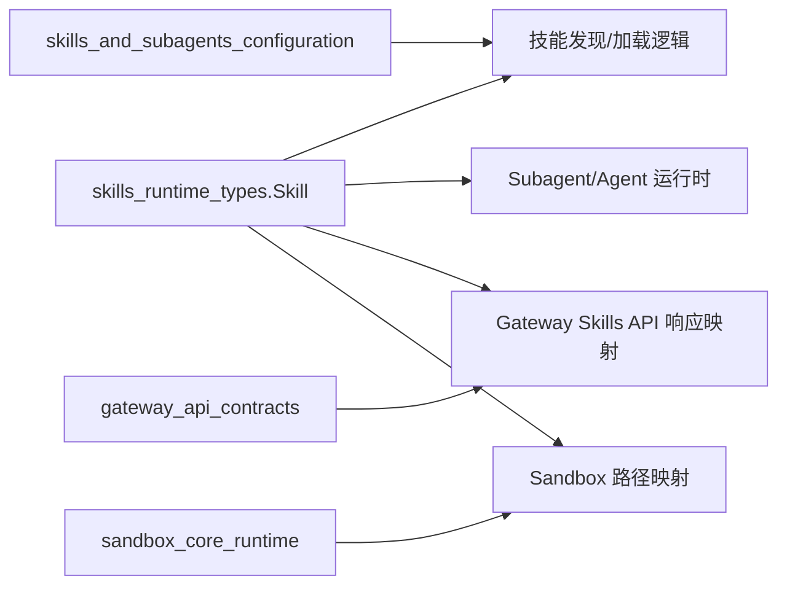
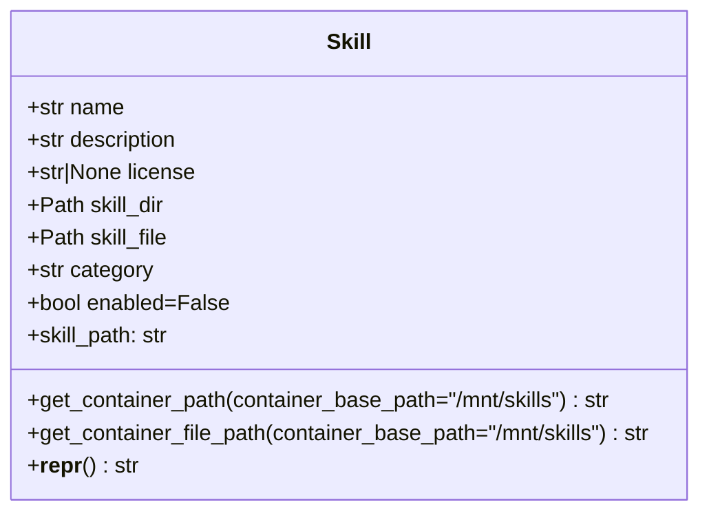
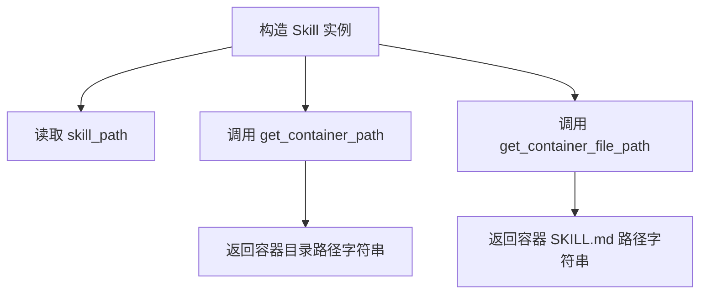

# skills_runtime_types 模块文档

## 1. 模块简介与设计动机

`skills_runtime_types` 模块的核心目标非常聚焦：在运行时用一个统一、轻量、可序列化倾向的数据结构来表示“一个 Skill 是什么”。在当前代码中，这个职责由 `backend.src.skills.types.Skill` 完成。它并不负责扫描磁盘、安装技能、调用模型，也不处理 API 路由；它只定义了技能的**身份信息（name/description/license）**、**本地文件系统位置（skill_dir/skill_file）**、**逻辑分类（category）**以及**启用状态（enabled）**，并提供与容器挂载路径相关的便捷方法。

这类“运行时类型（runtime type）”在架构中的价值在于：上游组件（例如技能发现、配置装载、API 层）和下游组件（例如 Agent 提示词拼装、Sandbox 内路径映射）可以围绕同一个类型协作，减少字符串拼接和隐式约定分散在各处带来的错误。换句话说，该模块的存在，是为了把“技能的最小可信元数据模型”集中到一个稳定契约中。

---

## 2. 在系统中的定位

`Skill` 类型属于 `subagents_and_skills_runtime` 大模块中的 `skills_runtime_types` 子模块。它与以下文档中的模块形成协作关系（本文不重复实现细节）：

- 子代理与技能运行时总览：[`subagents_and_skills_runtime.md`](subagents_and_skills_runtime.md)
- 技能与子代理配置：[`skills_and_subagents_configuration.md`](skills_and_subagents_configuration.md)
- Sandbox 运行时与挂载语义：[`sandbox_core_runtime.md`](sandbox_core_runtime.md)、[`model_tool_sandbox_basics.md`](model_tool_sandbox_basics.md)
- 网关返回契约（技能 API DTO）：[`gateway_api_contracts.md`](gateway_api_contracts.md)



上图体现了一个关键事实：`Skill` 是“被多个模块消费的共享类型”，而不是业务流程的发起者。它的稳定性直接影响跨层协作成本。

---

## 3. 核心组件详解：`Skill`

源文件：`backend/src/skills/types.py`

```python
@dataclass
class Skill:
    name: str
    description: str
    license: str | None
    skill_dir: Path
    skill_file: Path
    category: str  # 'public' or 'custom'
    enabled: bool = False
```

### 3.1 字段语义

`name` 是技能的人类可读标识，通常用于列表展示、选择器和日志。`description` 用于帮助上层代理理解“这个技能适用于什么任务”。`license` 允许为空，意味着系统支持“许可证未知或未声明”的技能条目。

`skill_dir` 和 `skill_file` 都是 `pathlib.Path`，前者表示技能目录，后者通常指向 `SKILL.md`。这两个字段的共存使得调用方既可以定位目录级资源，也可以直接读取主说明文件。

`category` 按约定应为 `'public'` 或 `'custom'`，用于区分技能来源域，并参与容器路径计算。注意它在类型上是 `str`，没有硬校验。`enabled` 是运行时开关，默认 `False`，可用于“已安装但不参与当前会话”的场景。

### 3.2 计算属性：`skill_path`

`skill_path` 返回 `self.skill_dir.name`，也就是目录名本身，而不是完整路径或相对层级路径。其实现非常直接：

```python
@property
def skill_path(self) -> str:
    return self.skill_dir.name
```

这意味着它依赖 `skill_dir` 的最后一级目录名作为稳定 ID。若 `skill_dir` 传入异常值（例如尾部是 `.` 或者非预期目录结构），结果依然会返回字符串，不会自动报错。

### 3.3 方法：`get_container_path(container_base_path="/mnt/skills")`

该方法返回技能目录在容器内的完整路径，拼接规则为：

`{container_base_path}/{category}/{skill_dir.name}`

默认 `container_base_path` 是 `"/mnt/skills"`，与常见 volume mount 约定一致。返回值是 `str`，不会验证目录是否真实存在，也不会规范化重复斜杠。

### 3.4 方法：`get_container_file_path(container_base_path="/mnt/skills")`

该方法返回技能主文件在容器内路径，拼接规则为：

`{container_base_path}/{category}/{skill_dir.name}/SKILL.md`

请注意这里**固定写死了文件名 `SKILL.md`**，并没有使用 `self.skill_file.name`。因此若系统支持非标准入口文件，调用该方法会得到与真实文件不一致的路径。

### 3.5 特殊方法：`__repr__`

`__repr__` 仅输出 `name`、`description`、`category`，不会输出 `skill_dir`、`skill_file`、`enabled` 等字段。这使日志较简洁，但在排障时可能缺少关键信息（例如路径错配或开关状态）。

---

## 4. 类结构与行为流程



上图展示了该模块的全部对外契约：一个 dataclass 加三个行为接口（1 个 property + 2 个 helper method）和一个调试表示方法。因为结构简单，维护成本低，但也意味着很多约束（比如 `category` 合法值、`skill_file` 与目录一致性）需要由外层模块保证。



这个流程说明了 `Skill` 的职责边界：它只做“数据承载 + 纯字符串路径推导”，没有 I/O 副作用，也不与 sandbox API 直接交互。

---

## 5. 典型使用方式

### 5.1 基础构造与路径推导

```python
from pathlib import Path
from backend.src.skills.types import Skill

skill = Skill(
    name="web_search",
    description="Provide best practices for web information gathering",
    license="MIT",
    skill_dir=Path("/opt/app/skills/public/web_search"),
    skill_file=Path("/opt/app/skills/public/web_search/SKILL.md"),
    category="public",
    enabled=True,
)

print(skill.skill_path)  # web_search
print(skill.get_container_path())
# /mnt/skills/public/web_search
print(skill.get_container_file_path())
# /mnt/skills/public/web_search/SKILL.md
```

### 5.2 与自定义挂载根目录配合

```python
container_base = "/workspace/mounted_skills"
container_skill_doc = skill.get_container_file_path(container_base)
# /workspace/mounted_skills/public/web_search/SKILL.md
```

当 Sandbox 的 volume mount 与默认值不同（参考 `sandbox_config` 相关文档）时，调用方应显式传入 `container_base_path`，避免路径漂移。

### 5.3 网关返回对象映射（示例模式）

在 API 层常见做法是把 `Skill` 映射到响应 DTO（如 `SkillResponse` 一类契约），仅暴露前端所需字段。这种映射应在 gateway 层完成，而不是修改 `Skill` 本身，以保持运行时类型稳定。

---

## 6. 行为约束、边界条件与已知限制

`Skill` 当前实现非常“宽松”，这给了业务层灵活性，但也带来一些操作风险。

1. `category` 只是注释约定为 `'public'` 或 `'custom'`，代码不做验证。传入其他值会直接进入容器路径，可能导致挂载路径不存在。
2. `get_container_file_path` 固定返回 `SKILL.md`，即使 `skill_file` 指向别的文件名也不会反映出来。
3. 路径通过 f-string 直接拼接，`container_base_path` 若尾部带 `/`，结果可能出现双斜杠（通常可被 POSIX 容忍，但不够规范）。
4. 没有存在性检查：`skill_dir`、`skill_file` 可以是逻辑路径，不保证真实可读。
5. dataclass 默认可变（mutable），运行时可被任意改写字段；若对象被缓存或跨线程共享，需要调用方自行保证一致性。
6. `__repr__` 未包含 `enabled` 与路径字段，日志可读性与排障信息之间有取舍。

---

## 7. 扩展与演进建议

如果你要扩展该模块，建议优先遵守“保持类型轻量”的原则，在不破坏现有调用方的前提下逐步增强：


一个可行路线是先新增非破坏性能力（例如 `validate()`），让上层按需调用；再在主要调用链稳定后，将 `category` 从 `str` 迁移到 `Enum`（或至少在 `__post_init__` 中校验）。另外，如果系统存在多入口文档格式，可以将 `get_container_file_path` 改为基于 `skill_file.name` 推导，或增加 `entry_file_name` 字段。

---

## 8. 维护与测试建议

建议为该类型建立小而稳定的单元测试，重点覆盖：

- 默认值行为（`enabled=False`、默认 `container_base_path`）
- `category` 异常值的当前行为（记录现状，避免无意变更）
- `container_base_path` 带尾斜杠时的输出
- `skill_file` 非 `SKILL.md` 时 `get_container_file_path` 的既有行为

因为 `Skill` 是跨层共享类型，任何字段语义调整都应同步审查与以下文档对应模块的兼容性：`subagents_and_skills_runtime.md`、`gateway_api_contracts.md`、`sandbox_core_runtime.md`。
