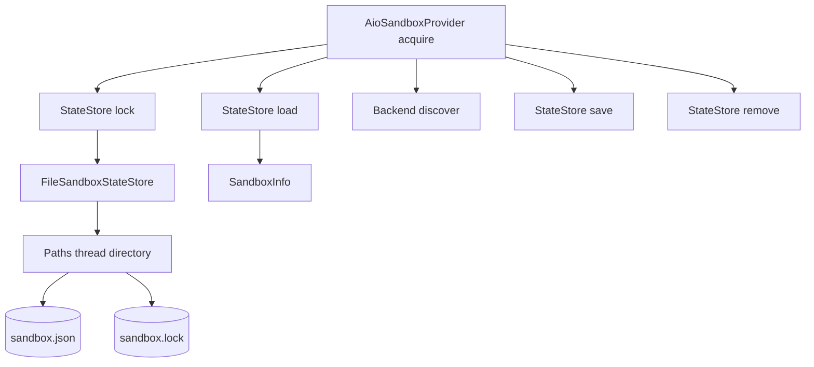
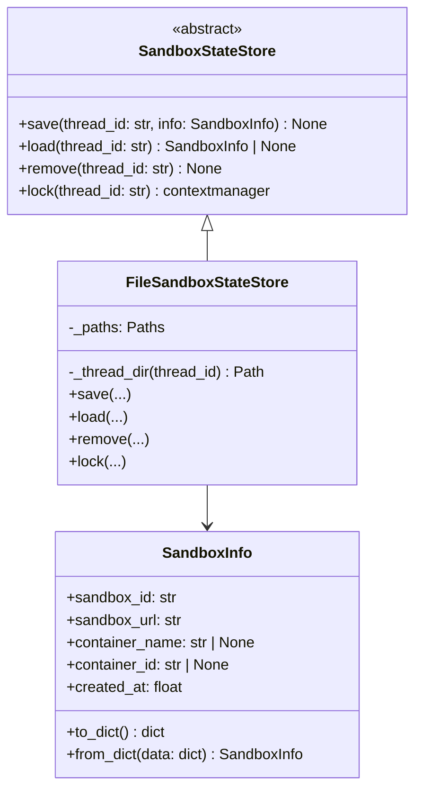
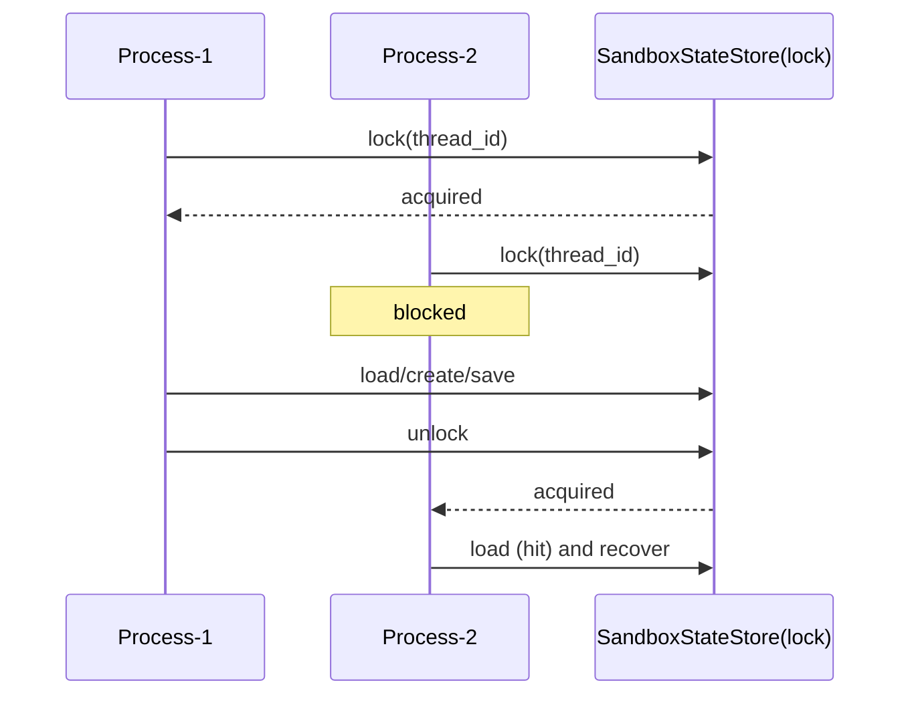
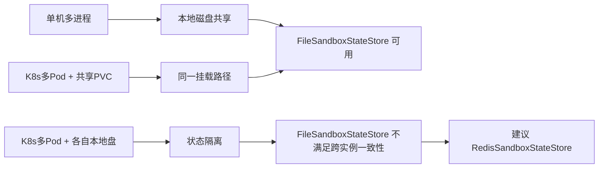
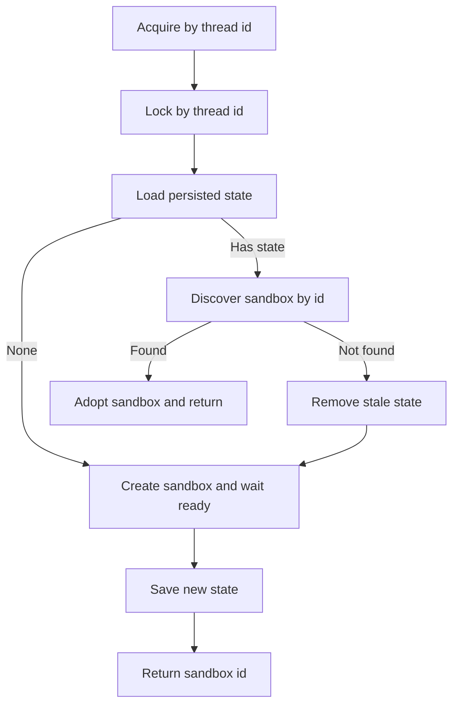

# state_persistence 模块文档

## 模块定位与设计动机

`state_persistence` 是 `sandbox_aio_community_backend` 里的“跨进程状态共享层”。它解决的核心问题非常具体：**同一个 `thread_id` 在不同进程（甚至不同 Pod）中，如何定位并复用同一个 sandbox**。如果没有这一层，`AioSandboxProvider` 只能依赖当前进程内存缓存，那么在 gateway、worker、langgraph 等多进程协作场景下就会重复建箱，带来资源浪费和上下文不一致。

该模块通过 `SandboxStateStore` 抽象统一了“状态保存/读取/删除/加锁”四个能力，并提供 `FileSandboxStateStore` 作为当前默认实现。与此同时，`SandboxInfo` 负责把“可重连 sandbox 所需最小元数据”序列化保存。三者组合后，`provider_orchestration` 可以在 acquire 流程中实现：先读持久化映射，再通过 backend discover 校验是否可用，最后再决定复用或重建。

从系统分层上看，它不是 provisioning 模块（不负责创建容器/Pod），也不是 sandbox 操作模块（不负责执行命令读写文件），而是一个“状态一致性基础设施”。建议配合阅读 [provider_orchestration](provider_orchestration.md) 与 [provisioning_backends](provisioning_backends.md) 以理解完整生命周期链路。

---

## 核心组件总览

本模块包含三个核心组件：

- `SandboxStateStore`：状态存储抽象契约
- `FileSandboxStateStore`：基于 JSON 文件 + `fcntl.flock` 的实现
- `SandboxInfo`：跨进程恢复所需的元数据模型



这张图反映了模块的真实职责边界：`state_persistence` 只维护 thread→sandbox 的持久化与并发互斥，不直接参与容器管理。容器是否存活由 backend 决定，状态是否存在/可读由 state store 决定，上层 provider 负责二者编排。

---

## 接口契约与行为语义（面向实现者）

为了让后续实现 `RedisSandboxStateStore` 或其他后端时保持行为一致，理解接口“语义契约”比只看函数签名更重要。`SandboxStateStore` 的四个抽象方法在 `AioSandboxProvider` 中承担的是“并发控制 + 恢复线索管理”职责，因此实现者需要关注返回值含义、失败后的可恢复性以及副作用。



这张类图体现了一个关键设计：`SandboxInfo` 是“可被持久化和反序列化的值对象”，`SandboxStateStore` 是“持久化策略接口”，而 `FileSandboxStateStore` 只是当前策略之一。也就是说，上层流程（acquire/recover/release）并不依赖文件系统本身，只依赖接口语义。

对于 `save(thread_id, info)`，语义上它是“写入最新映射快照”，不是 append 日志，也不是事务历史。调用方默认它可能失败，因此不会把它当作创建成功的唯一判据；副作用是写入/覆盖状态文件，可能触发 I/O 错误并记录 warning。

对于 `load(thread_id)`，语义上它返回“恢复候选”，而不是“已验证可用实例”。上层必须继续调用 backend `discover` 做活性确认。返回 `None` 有两种含义：真的不存在，或者读取失败/解析失败后软降级。副作用仅包含读文件与日志记录。

对于 `remove(thread_id)`，语义上它是“尽力清理陈旧映射”，设计为幂等操作。即便目标不存在也不应报错中断主流程。副作用是删除状态文件，不负责删除线程目录。

对于 `lock(thread_id)`，语义上它定义了线程级互斥边界：同一 `thread_id` 的恢复与创建在任何时刻只能由一个进程执行。副作用是创建/打开锁文件并阻塞等待锁释放，直到 context 退出。

---


## 组件深度解析

### `SandboxStateStore`（抽象层）

`SandboxStateStore` 是一个 `ABC`，定义了所有状态存储后端必须实现的四个方法：`save`、`load`、`remove`、`lock`。这四个接口看似简单，但实际上覆盖了跨进程一致性最关键的两个方面：**数据持久化**和**并发串行化**。

### `save(thread_id: str, info: SandboxInfo) -> None`

该方法用于持久化某线程对应的 sandbox 元数据。它通常在“新建 sandbox 成功并通过健康检查”后调用。设计上不返回值，意味着调用方不依赖写入结果做强一致事务判断，而是采用“尽力持久化 + backend discover 兜底”的策略。

### `load(thread_id: str) -> SandboxInfo | None`

该方法返回已保存元数据，或者在不存在/异常时返回 `None`。上层会把 `None` 视作“无可恢复状态”，进入建箱流程；把 `SandboxInfo` 视作“候选状态”，再调用 backend `discover` 进行二次确认，避免盲信陈旧记录。

### `remove(thread_id: str) -> None`

该方法在 release、恢复失败清理等路径中调用，用来删除陈旧映射，防止后续反复命中坏状态。其语义是幂等清理：不存在时应安静返回。

### `lock(thread_id: str) -> contextmanager`

这是抽象中最关键的方法。它要求后端提供“同一 `thread_id` 下跨进程互斥锁”，用于包裹恢复/建箱临界区，避免两个进程同时判断“未命中”后重复创建 sandbox。`AioSandboxProvider` 在 `thread_id` 语义下会显式使用这一锁（匿名 sandbox 不使用）。



这个机制是“避免重复建箱”的核心保障；没有它，多进程高并发下会出现同线程多沙箱竞态。

---

## `FileSandboxStateStore`（文件实现）

`FileSandboxStateStore` 是 `SandboxStateStore` 的默认实现，适用于单机多进程，或多 Pod 共享同一 PVC 的部署。它使用线程目录下的两个文件：`sandbox.json`（状态）和 `sandbox.lock`（锁文件）。

### 存储布局

状态文件与锁文件都位于：

- 状态：`{base_dir}/threads/{thread_id}/sandbox.json`
- 锁：`{base_dir}/threads/{thread_id}/sandbox.lock`

其中 `base_dir` 由 `Paths` 管理。`_thread_dir(thread_id)` 实际调用 `Paths.thread_dir(thread_id)`，因此继承了 thread_id 安全校验（仅允许字母数字、`-`、`_`）。这可以阻断路径穿越风险。

### `__init__(base_dir: str)`

构造时只保存 `Paths(base_dir)`。它不主动创建目录，目录创建发生在 `save`/`lock` 路径中（`os.makedirs(..., exist_ok=True)`），属于懒初始化。

### `save(thread_id, info)`

内部流程是：计算线程目录 → 确保目录存在 → `json.dumps(info.to_dict())` → `write_text` 覆盖写入。写失败（`OSError`）时只记录 warning，不抛异常。

这意味着上层调用在持久化失败时通常不会立刻失败，而是继续依赖进程内缓存和 backend discover；这是可用性优先、强一致性次之的工程选择。

### `load(thread_id)`

如果文件不存在返回 `None`。若存在则读取 JSON 并走 `SandboxInfo.from_dict`。当出现文件读取错误、JSON 破损、字段缺失（`KeyError`）时，方法会记录 warning 并返回 `None`。

这种“失败即 miss”语义很重要：它保证加载失败不会阻断请求链路，但会让系统走创建路径，因此在异常持续存在时可能增加建箱频率。

### `remove(thread_id)`

只删除 `sandbox.json`，不会删除目录或锁文件。这样做有两个好处：一是减少并发路径下目录反复创建/删除带来的竞态；二是保留锁文件路径稳定性。

### `lock(thread_id)`

实现采用 `fcntl.flock(lock_file.fileno(), LOCK_EX)`，在 context 退出时 `LOCK_UN` 并关闭文件句柄。锁粒度是“每个 thread_id 一个锁文件”，因此不同线程互不阻塞。

需要注意这是一种**依赖共享文件系统语义**的锁：

- 在同机多进程下可用；
- 在多 Pod 场景必须共享同一挂载（如 PVC）；
- 在不支持 POSIX flock 的环境不可用（当前注释明确支持 macOS/Linux）。

---

## `SandboxInfo`（元数据模型）

`SandboxInfo` 是跨进程重连的最小信息集，包含以下字段：

- `sandbox_id`：逻辑标识（通常由 thread_id 计算得到）
- `sandbox_url`：连接地址（如 `http://localhost:8080`）
- `container_name` / `container_id`：本地容器后端可选字段
- `created_at`：创建时间戳（默认 `time.time()`）

### `to_dict()`

将 dataclass 字段扁平化为可 JSON 序列化字典，供 `FileSandboxStateStore.save` 写盘。

### `from_dict(data)`

从字典恢复对象，值得注意的兼容逻辑是：`sandbox_url` 会优先读 `sandbox_url`，否则回退旧字段 `base_url`。这说明模块考虑了历史版本字段迁移。

如果 `created_at` 缺失，会回退为当前时间。该设计避免旧数据反序列化失败，但也意味着时间语义可能不完全精确。

### 持久化文件示例

在 `FileSandboxStateStore` 中，`sandbox.json` 的内容大致如下。这个格式由 `SandboxInfo.to_dict()` 生成，`from_dict()` 负责反序列化并兼容旧字段。

```json
{
  "sandbox_id": "abc12345",
  "sandbox_url": "http://localhost:18080",
  "container_name": "deer-flow-sandbox-abc12345",
  "container_id": "f3c9b7...",
  "created_at": 1735623456.123
}
```

如果历史数据里仍是 `base_url` 字段，`from_dict()` 会自动回退读取，这使得滚动升级时无需一次性迁移全量状态文件。

### 与配置系统的耦合点

虽然 `state_persistence` 只有一个显式构造参数 `base_dir`，但它的运行行为实际上受配置体系影响明显。`AioSandboxProvider` 默认通过 `get_paths().base_dir` 创建 `FileSandboxStateStore`，而 `Paths` 会按“构造参数 → `DEER_FLOW_HOME` → 开发环境 fallback → 用户目录 fallback”的优先级解析最终根目录。因此在容器化部署中，若你希望跨 Pod 共享状态，需要确保每个实例都把同一个持久卷挂载到同一 `base_dir`。

你可以在应用配置层设置 sandbox provider，再通过环境变量统一状态根目录。典型模式如下：

```yaml
sandbox:
  use: src.community.aio_sandbox:AioSandboxProvider
  auto_start: true
  image: enterprise-public-cn-beijing.cr.volces.com/vefaas-public/all-in-one-sandbox:latest
  idle_timeout: 600
```

```bash
export DEER_FLOW_HOME=/data/deer-flow
```

这组配置不会直接“配置 state store 类型”，但会间接决定状态文件落盘位置与多实例是否可见。

---

## 部署拓扑与能力边界

`FileSandboxStateStore` 的核心假设是“多个执行单元可以看到同一份文件系统并支持 `flock` 语义”。如果这个前提不成立，就会发生看似随机的重复建箱与状态不一致。下面的图展示了几种典型部署的适配关系。



对于单机或共享 PVC，这个模块可以提供足够可靠的跨进程去重能力；对于无共享存储的分布式集群，它只能保证“实例内一致”，无法保证“集群级一致”。这也是 `SandboxStateStore` 采用抽象接口的根本原因。

---


---

## 关键流程：状态恢复与去重创建

以下是 `AioSandboxProvider` 与本模块交互时最关键的一条链路：



该流程体现了“持久化状态不是事实本身，而是恢复线索”的设计思想：真正的真相是 backend 能否发现并连通 sandbox。`SandboxInfo` 负责提供入口，而不是最终可信源。

---

## 配置与使用建议

虽然 `state_persistence` 本身没有复杂配置项，但其行为受 `Paths.base_dir` 与部署拓扑强影响。

```python
from src.community.aio_sandbox.file_state_store import FileSandboxStateStore
from src.community.aio_sandbox.sandbox_info import SandboxInfo

store = FileSandboxStateStore(base_dir="/data/deer-flow")

info = SandboxInfo(
    sandbox_id="abc12345",
    sandbox_url="http://localhost:18080",
    container_name="deer-flow-sandbox-abc12345",
)

with store.lock("thread_001"):
    store.save("thread_001", info)
    loaded = store.load("thread_001")
    assert loaded is not None
```

在生产环境中，更常见的用法是由 `AioSandboxProvider` 自动创建并调用 state store，而不是业务代码直接操作。若你关注整体接线方式，参考 [provider_orchestration](provider_orchestration.md)。

---

## 边界条件、错误处理与已知限制

本模块在错误处理上整体采用“记录日志 + 软失败”的风格，这有助于可用性，但也带来一些运维层面的注意点。

- 当 `save` 失败时，调用方不会自动回滚已创建的 sandbox，可能出现“沙箱存在但映射未落盘”。该场景下跨进程恢复能力下降，但当前进程仍可继续使用。
- 当 `load` 遇到损坏 JSON 时返回 `None`，系统会倾向创建新 sandbox。若损坏频繁发生，可能触发资源抖动。
- `remove` 只删状态文件，不删目录/锁文件，属于有意设计，不应误判为泄漏。
- `lock` 基于 `fcntl`，不适用于 Windows；跨主机部署若无共享存储，锁与状态都无法共享。
- 锁是阻塞式独占锁，极端情况下若某进程在锁域内执行过慢，其他进程会排队等待。
- `SandboxInfo.from_dict` 默认容忍缺字段（部分字段回退），这提升兼容性，但也可能掩盖数据质量问题。

---

## 扩展建议：实现 Redis 状态存储

`SandboxStateStore` 预留了可替换能力，最常见扩展是 `RedisSandboxStateStore`。实现时建议保持与当前语义一致：

1. `save/load/remove` 对外接口不变，保证上层无需改动。
2. `lock(thread_id)` 需提供跨进程互斥，可考虑 Redis 分布式锁（带超时与续租）。
3. 失败语义尽量与现有实现对齐（可恢复场景返回 `None`，硬错误记录日志）。
4. 保留 `SandboxInfo` 序列化格式兼容（含 `base_url` 回退逻辑）。

这样可以在不改 `AioSandboxProvider` 主流程的前提下，把状态共享从“共享文件系统”迁移到“共享缓存服务”，更适合多主机集群。

---

## 与其他文档的关系

- 若你想理解状态持久化在 acquire/recover/release 中如何被调用，请阅读 [provider_orchestration](provider_orchestration.md)。
- 若你想理解 `discover/create/destroy` 的后端差异，请阅读 [provisioning_backends](provisioning_backends.md)。
- 若你想理解更大范围的 sandbox 体系与配置入口，请阅读 [sandbox_aio_community_backend](sandbox_aio_community_backend.md) 与 [application_and_feature_configuration](application_and_feature_configuration.md)。
