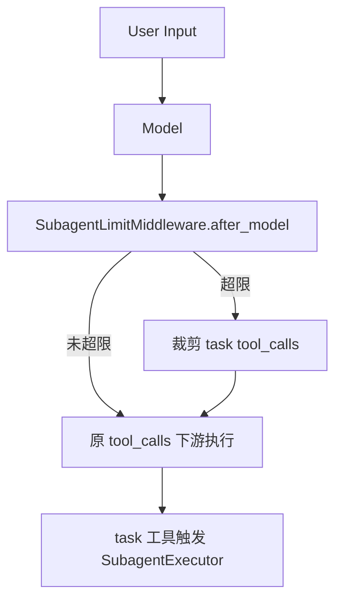
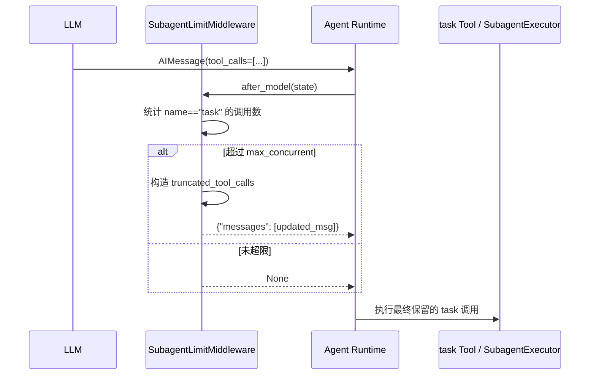
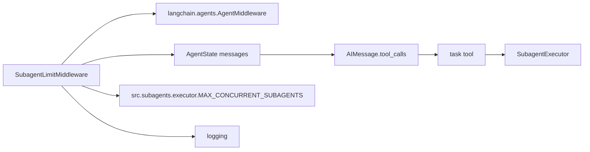
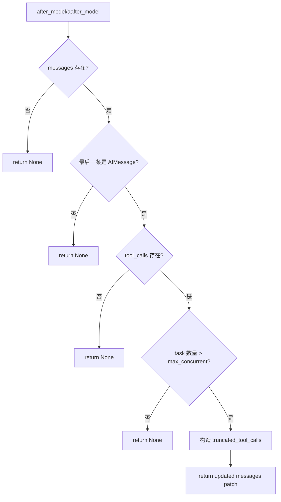

# subagent_concurrency_control 模块文档

## 模块概述

`subagent_concurrency_control` 是 `agent_execution_middlewares` 下专门负责“子代理并发上限治理”的执行中间件模块，核心实现只有一个组件：`SubagentLimitMiddleware`。它的存在并不是为了替代工具层或线程池层的并发控制，而是为了在 **模型刚输出工具调用计划** 的时刻，立即对过量的 `task` 工具调用进行裁剪，避免单轮响应中出现过多并行子任务，进而降低系统抖动、资源争抢和失败级联风险。

该设计体现了一种“上游防线”思路：与其在子代理执行器里被动承受过载（例如排队、超时、上下文竞争），不如在 `after_model` 阶段把不符合策略的调用直接删掉。相比纯提示词约束（prompt-based limit），这种做法更确定、可观测、可复现，且不依赖模型是否“听话”。

从系统分层上看，本模块属于 Agent 运行时的后处理 middleware。它只处理当前轮最后一条 `AIMessage` 里的 `tool_calls`，只关注工具名为 `task` 的调用，其余工具完全透传，不会改写消息内容文本、不会触碰 sandbox 状态，也不会直接调度线程池。

---

## 设计目标与设计取舍

本模块的核心目标是把“每轮子代理并发数量”限制在一个小而安全的范围内，以确保后续 `SubagentExecutor` 负载可控，并减少任务风暴。实现上选择了“截断（truncate）”而不是“延迟排队（queue）”：当模型一次给出过多 `task` 调用时，只保留前 N 个，后续调用直接丢弃。这一策略的优势是实现简单、行为确定、延迟低；代价是被截断的任务不会自动补跑，需要依赖模型后续轮次重新规划。

另一个明确取舍是限制范围硬编码为 `[2, 4]`。这意味着模块不允许被配置成 1（过度保守）或 10（潜在过载）。该边界是系统稳定性优先的策略约束，防止误配置导致体验或成本问题。

---

## 核心组件详解

## 1) 常量与辅助函数

### `MIN_SUBAGENT_LIMIT = 2` 与 `MAX_SUBAGENT_LIMIT = 4`

这两个模块级常量定义了允许的并发阈值区间。无论调用方传入什么值，最终都会被夹紧到该范围。它们是运行时防护阀，避免配置漂移。

### `_clamp_subagent_limit(value: int) -> int`

该函数用于把输入并发值规整到 `[2, 4]`。逻辑等价于：

```python
max(2, min(4, value))
```

函数无副作用，不访问外部状态。其唯一职责是保证 `SubagentLimitMiddleware.max_concurrent` 的合法性。

---

## 2) `SubagentLimitMiddleware`

`SubagentLimitMiddleware` 继承自 `AgentMiddleware[AgentState]`，在 `after_model/aafter_model` 钩子中工作，负责检查并裁剪当前模型响应里的 `task` 工具调用。

### 初始化

```python
SubagentLimitMiddleware(max_concurrent: int = MAX_CONCURRENT_SUBAGENTS)
```

`max_concurrent` 默认来自 `src.subagents.executor.MAX_CONCURRENT_SUBAGENTS`（注释中默认值为 3），但会经过 `_clamp_subagent_limit` 强制限定在 `[2, 4]`。因此即使外部传入 1 或 100，也会分别收敛为 2 和 4。

### 核心流程：`_truncate_task_calls(state: AgentState) -> dict | None`

这是模块的实质逻辑，运行步骤如下：

1. 读取 `state["messages"]`。若消息为空，返回 `None`（表示不改动）。
2. 获取最后一条消息 `last_msg`。若 `last_msg.type != "ai"`，返回 `None`。
3. 读取 `last_msg.tool_calls`。若不存在或为空，返回 `None`。
4. 扫描 `tool_calls`，找出 `name == "task"` 的位置索引。
5. 若 `task` 数量未超过上限，返回 `None`。
6. 若超限，保留前 `max_concurrent` 个 `task`，丢弃多余项；其他非 `task` 工具调用保持原样。
7. 记录 warning 日志，说明本轮裁剪数量与限制值。
8. 使用 `last_msg.model_copy(update={"tool_calls": truncated_tool_calls})` 构造更新后的消息。
9. 返回 `{"messages": [updated_msg]}`，由运行时基于同一消息 id 执行替换。

### 钩子方法

- `after_model(state, runtime)`：同步路径调用 `_truncate_task_calls`。
- `aafter_model(state, runtime)`：异步路径调用 `_truncate_task_calls`。

同步/异步语义一致，避免两条执行链行为不一致。

---

## 架构定位与依赖关系



该图强调本模块是“模型输出之后、工具执行之前”的治理层。它不直接执行子代理，但会改变哪些子代理有资格进入执行阶段。

### 与其他模块的关系

`subagent_concurrency_control` 建议结合以下文档阅读：

- 中间件全局视角：[`agent_execution_middlewares.md`](agent_execution_middlewares.md)
- 子代理执行细节：[`subagents_and_skills_runtime.md`](subagents_and_skills_runtime.md)
- 应用配置体系（整体配置背景）：[`application_and_feature_configuration.md`](application_and_feature_configuration.md)

需要注意：当前并发上限不是通过 `SubagentsAppConfig` 暴露的统一配置项，而是通过中间件构造参数控制。

---

## 数据流与状态变更



这里的关键是：本模块只改“最后一条 AIMessage 的 tool_calls 列表”，不改历史消息，不改 tool result，不注入新消息类型。它的副作用非常聚焦，因此对其他中间件的耦合相对小。

---

## 裁剪行为细节与示例

假设模型输出如下调用序列（`max_concurrent = 3`）：

```python
tool_calls = [
    {"name": "task", "id": "t1"},
    {"name": "search", "id": "s1"},
    {"name": "task", "id": "t2"},
    {"name": "task", "id": "t3"},
    {"name": "task", "id": "t4"},
]
```

模块会识别出 4 个 `task` 调用（索引 0,2,3,4），仅保留前 3 个（索引 0,2,3），因此最终结果是：

```python
[
    {"name": "task", "id": "t1"},
    {"name": "search", "id": "s1"},
    {"name": "task", "id": "t2"},
    {"name": "task", "id": "t3"},
]
```

可见它不是“保留前 3 个调用”，而是“保留前 3 个 `task` 调用”；非 `task` 调用不会因为配额而被删。

---

## 使用方式

在构建 Agent 时将该 middleware 放入 middleware 链即可。示例：

```python
from src.agents.middlewares.subagent_limit_middleware import SubagentLimitMiddleware

middlewares = [
    # ...其他中间件
    SubagentLimitMiddleware(max_concurrent=3),
]

agent = create_agent(
    model=model,
    tools=tools,
    middleware=middlewares,
)
```

如果不传参，将使用 `MAX_CONCURRENT_SUBAGENTS` 默认值（并被限制在 `[2,4]`）。建议把该中间件放在 `after_model` 相关治理逻辑中较靠前的位置，以便尽早减少下游执行压力。

---

## 扩展与定制建议

如果你希望改变“仅识别 `task`”这一行为，可以在子类中改写 `_truncate_task_calls` 的过滤条件。例如把多个工具都纳入并发预算，或者按优先级保留而非按出现顺序保留。

```python
class PrioritySubagentLimitMiddleware(SubagentLimitMiddleware):
    def _truncate_task_calls(self, state):
        # 可定制：按 tc.get("priority") 排序后再裁剪
        return super()._truncate_task_calls(state)
```

如果你希望实现“超限后排队而非丢弃”，建议不要在当前 middleware 上做重度改造，而是在子代理调度层新增队列协议。当前模块定位是轻量拦截器，不负责补偿调度。

---

## 边界条件、错误条件与已知限制

本模块整体偏“静默防护”，多数情况不会抛出异常，而是返回 `None` 不做处理。但在生产中应重点关注以下行为：

- 当 `state.messages` 为空、最后消息不是 `ai`、或不存在 `tool_calls` 时，模块直接跳过。这是正常行为，不代表中间件失效。
- 只匹配 `tc.get("name") == "task"`。若你的子代理工具别名不同（如 `subtask`），不会受到限制。
- 超限后会丢弃多余 `task` 调用，且不会生成解释消息给模型或用户。被丢弃任务需要后续轮次重新提出。
- 依赖 `last_msg.model_copy(...)` 语义进行消息替换；如果上游消息对象不支持该接口，可能导致兼容问题（取决于消息实现类型）。
- 并发上限被强制夹紧到 `[2,4]`，无法通过参数绕过。若业务必须允许 1 或 >4，需要修改模块常量并评估系统容量。
- 该模块控制的是“单次模型响应里的并行调用数”，不是全局并发。跨轮次、跨线程、跨会话总并发仍由执行器线程池与基础设施容量决定。

---

## 运行观测与排障

当发生裁剪时，模块会打 warning 日志，格式类似：

```text
Truncated X excess task tool call(s) from model response (limit: N)
```

排障时可以把这条日志与子代理超时、线程池拥塞、队列积压指标关联分析：如果裁剪日志频率过高，通常说明模型规划倾向“过度并行”，可同步优化工具描述、系统提示或任务分解策略。

---

## 测试建议

建议至少覆盖以下测试场景：

1. `max_concurrent` 越界输入时的夹紧行为（如 1→2，10→4）。
2. 无消息/非 AI 消息/无 tool_calls 时应返回 `None`。
3. `task` 数量未超限时不改写状态。
4. `task` 超限时只删除多余 `task`，保留非 `task` 调用原顺序。
5. `after_model` 与 `aafter_model` 结果一致。

---

## 与系统其余层的依赖映射



从依赖方向看，`SubagentLimitMiddleware` 是一个非常“薄”的组件：它依赖 LangChain/LangGraph 的 middleware 钩子协议来接入 Agent 生命周期，依赖 `AgentState` 来读取消息并回写局部更新，依赖 `src.subagents.executor.MAX_CONCURRENT_SUBAGENTS` 作为默认并发值来源。它不依赖具体 sandbox、内存管理、网关接口或前端状态结构，因此可以在不触碰这些子系统的前提下独立演进。

这也解释了为什么该模块适合作为“防过载第一道门”：它部署位置前、侵入面小、可替换性强。即便将来子代理执行器内部策略变化（比如从固定并发改为自适应并发），该中间件仍可继续作为硬阈值保护层存在。

---

## 决策流程（何时修改状态，何时透传）



该流程可以帮助你快速判断“为什么中间件没有生效”。在大多数排障场景里，问题并不在于逻辑错误，而是输入消息不满足触发条件：比如模型返回的是纯文本回答、最后一条消息不是 AI 消息、或调用工具名称并非 `task`。

---

## 配置与运行策略建议

虽然当前模块只暴露了一个 `max_concurrent` 参数，但在生产部署中，它实际上承载了“响应速度、资源成本、任务完成率”之间的平衡。经验上：

- 取 `2` 更偏稳定，适合资源紧张、子代理任务较重（长耗时、I/O 密集）的环境。
- 取 `3` 通常是默认折中值，兼顾并行收益和系统稳定。
- 取 `4` 更偏吞吐，但更依赖后端执行器容量与外部工具可靠性。

由于模块内部会做 clamp，传入过小或过大的值不会报错，而是被修正。这降低了错误配置风险，但也可能掩盖“配置未按预期生效”的认知偏差。建议在启动日志或配置校验阶段显式打印最终生效值。

---

## 典型集成模式（与其他中间件协作）

在 `agent_execution_middlewares` 链路中，该中间件通常与澄清、标题、上传上下文等中间件并存。一个常见原则是：把“会影响下游工具执行规模”的中间件放在较前位置，使系统尽早收敛到可执行计划。

```python
middlewares = [
    ThreadDataMiddleware(...),
    UploadsMiddleware(...),
    SubagentLimitMiddleware(max_concurrent=3),  # 建议放在工具执行治理段靠前
    DanglingToolCallMiddleware(...),
]
```

更完整的链路职责分工请参考 [`agent_execution_middlewares.md`](agent_execution_middlewares.md)。如果你要理解裁剪后的 `task` 调用如何被真正执行、汇总、回传，请继续阅读 [`subagents_and_skills_runtime.md`](subagents_and_skills_runtime.md)。

---

## 可扩展点与演进方向

当前实现是“按出现顺序保留前 N 个 task”。这在工程上足够可靠，但在复杂任务里未必最优。常见演进方向包括：

- 引入优先级策略：基于 `tool_call` 参数中的权重字段，优先保留高价值任务。
- 引入多工具预算：不仅限制 `task`，还对高成本工具（如大规模检索）施加独立上限。
- 引入软硬双阈值：先警告后裁剪，例如超过软阈值只记录 telemetry，超过硬阈值再截断。

如果采用以上策略，建议保持本模块“只做裁剪，不做调度补偿”的边界，将排队、重放、重试留给执行器层或调度层，避免中间件职责膨胀。

---

## 已知限制与实现语义注意点（补充）

一个容易被忽略的细节是：返回 `{"messages": [updated_msg]}` 依赖运行时按消息 id 做替换语义，而不是简单 append。也就是说，调用方应确认所用消息对象实现与运行时 merge 规则兼容。若后续框架升级导致 merge 行为变化，这里可能是回归测试重点。

另外，本模块不会向模型反馈“你有若干 task 被截断”。这意味着模型在本轮并不知道计划被删减，只有在下一轮通过结果缺失间接感知。对于需要强可解释性的产品，可以考虑在后续层增加系统注记，但这属于产品策略，不属于当前中间件职责。

---


`subagent_concurrency_control` 通过一个非常聚焦的 `SubagentLimitMiddleware`，在模型输出后立刻约束 `task` 工具调用规模，为子代理执行链提供了稳定、可预期的入口流量控制。它的实现简洁、侵入性低、可直接落地，是子代理体系中“先控流再执行”的关键安全阀。若你需要更复杂的调度语义（优先级、排队、补偿重试），建议把该模块作为第一层保护，并在 `subagents_and_skills_runtime` 调度层继续扩展。