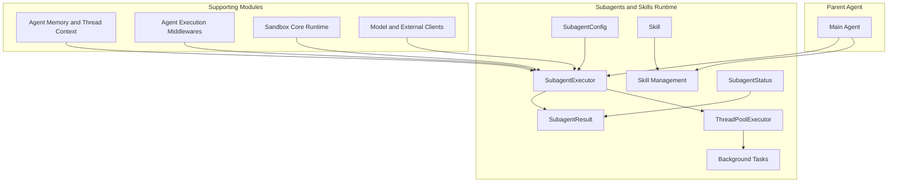

# Subagents and Skills Runtime Module Documentation

## 1. Introduction

The Subagents and Skills Runtime module provides a powerful framework for creating and managing specialized AI agents (subagents) that can be delegated tasks by a parent agent, along with a system for organizing and utilizing skills within the system. This module enables hierarchical agent architectures, where complex tasks can be broken down and handled by specialized subagents with focused capabilities and knowledge.

The primary motivations for this module are:
- **Modularity**: Allow the system to be composed of specialized agents rather than a single monolithic agent
- **Task Specialization**: Enable subagents to have tailored system prompts, toolsets, and configurations for specific tasks
- **Controlled Delegation**: Provide a structured way for parent agents to delegate tasks while maintaining control over execution
- **Skill Management**: Offer a systematic approach to organizing and accessing skills that enhance agent capabilities

This module works in conjunction with the agent execution middlewares, agent memory and thread context, and sandbox core runtime modules to provide a complete agent execution environment.

## 2. Architecture Overview

The Subagents and Skills Runtime module consists of two main sub-components that work together to enable hierarchical agent execution and skill utilization:



### Architecture Components

1. **Subagent Configuration**: The `SubagentConfig` class provides a structured way to define subagent behavior, including their name, description, system prompt, tool access, model choice, and execution constraints.

2. **Subagent Execution Engine**: At the heart of the module is the `SubagentExecutor` class, which handles the actual execution of subagents. It manages the lifecycle of subagent execution, including tool filtering, model selection, state management, and result collection.

3. **Execution Status and Results**: The `SubagentStatus` enum and `SubagentResult` dataclass work together to track and communicate the state and outcome of subagent executions.

4. **Background Task Management**: The module includes infrastructure for running subagents asynchronously using thread pools, with mechanisms to track and retrieve results.

5. **Skill Management**: The `Skill` dataclass represents a skill with its metadata and file paths, providing methods to access skills in both the host and container environments.

The architecture is designed to be flexible, allowing subagents to inherit resources from their parent (like model configuration and sandbox state) while also enabling specialization through their own configurations.

## 3. Sub-module Overview

### 3.1 Subagents Execution Sub-module

The Subagents Execution sub-module provides the core functionality for creating, configuring, and running subagents. It includes components for defining subagent behavior, executing tasks synchronously or asynchronously, and managing the execution lifecycle.

Key components:
- **SubagentConfig**: Defines the configuration for a subagent, including its identity, behavior, and constraints.
- **SubagentExecutor**: The main execution engine that handles running subagents with the specified configuration.
- **SubagentStatus**: An enum that tracks the current state of subagent execution.
- **SubagentResult**: A dataclass that captures the outcome of a subagent execution, including any results, errors, and intermediate messages.

This sub-module handles the complexities of agent execution, including tool filtering, model selection, state management, and background task handling. It also provides mechanisms for real-time updates and timeout management.

[Detailed documentation for the Subagents Execution sub-module](subagents_execution.md)

### 3.2 Skills Management Sub-module

The Skills Management sub-module provides a structured way to represent and manage skills that agents can use. Skills are packaged capabilities that enhance an agent's abilities, typically including documentation, examples, and sometimes code.

Key components:
- **Skill**: A dataclass that represents a skill with its metadata, file paths, and accessibility information.

This sub-module handles the organization of skills, their categorization (as public or custom), and provides methods to access them in different execution environments (host vs. container).

[Detailed documentation for the Skills Management sub-module](skills_management.md)

## 4. Key Component Relationships

The components in the Subagents and Skills Runtime module work together in a coordinated manner to enable hierarchical agent execution:

1. **Configuration Flow**: A `SubagentConfig` is created or loaded, defining the subagent's behavior and constraints. This configuration is then passed to a `SubagentExecutor` instance.

2. **Execution Flow**: The `SubagentExecutor` uses the configuration to filter available tools, select the appropriate model, and set up the execution environment. It then creates the agent and runs it with the provided task.

3. **Status Tracking**: Throughout execution, the `SubagentStatus` is updated to reflect the current state (pending, running, completed, failed, or timed out).

4. **Result Collection**: As the subagent executes, AI messages are collected and stored in a `SubagentResult` object, which is updated with the final result or error when execution completes.

5. **Skill Integration**: While not directly integrated in the core execution flow, `Skill` objects can be used to provide additional capabilities to agents, either by including their documentation in system prompts or by making their functionality available as tools.

The module also includes global state management for background tasks, allowing asynchronous execution and result retrieval through a thread-safe interface.

## 5. Usage Examples

### 5.1 Creating and Running a Subagent Synchronously

```python
from src.subagents.config import SubagentConfig
from src.subagents.executor import SubagentExecutor

# Create a subagent configuration
config = SubagentConfig(
    name="code_reviewer",
    description="Useful for reviewing code and providing feedback",
    system_prompt="You are a code reviewer. Analyze the given code carefully and provide constructive feedback.",
    tools=["read_file", "write_file", "execute_command"],
    disallowed_tools=["task"],
    model="inherit",
    max_turns=20,
    timeout_seconds=600
)

# Initialize the executor with the configuration and available tools
executor = SubagentExecutor(
    config=config,
    tools=available_tools,
    parent_model=parent_model_name,
    sandbox_state=sandbox_state,
    thread_data=thread_data,
    thread_id=thread_id
)

# Execute a task synchronously
result = executor.execute("Review the code in /workspace/main.py and suggest improvements")

# Check the result
if result.status == SubagentStatus.COMPLETED:
    print("Review complete:", result.result)
else:
    print("Review failed:", result.error)
```

### 5.2 Running a Subagent Asynchronously

```python
from src.subagents.executor import get_background_task_result, list_background_tasks

# Initialize executor as before...

# Start an asynchronous execution
task_id = executor.execute_async("Perform a comprehensive analysis of the codebase")

# Later, check on the status
result = get_background_task_result(task_id)
if result:
    print(f"Status: {result.status}")
    if result.status == SubagentStatus.COMPLETED:
        print("Result:", result.result)

# List all background tasks
all_tasks = list_background_tasks()
for task in all_tasks:
    print(f"Task {task.task_id}: {task.status}")
```

### 5.3 Working with Skills

```python
from src.skills.types import Skill
from pathlib import Path

# Create a Skill object
skill = Skill(
    name="web_scraping",
    description="Skills for extracting data from websites",
    license="MIT",
    skill_dir=Path("/path/to/skills/public/web_scraping"),
    skill_file=Path("/path/to/skills/public/web_scraping/SKILL.md"),
    category="public",
    enabled=True
)

# Get the skill path
print(f"Skill path: {skill.skill_path}")

# Get the container path for the skill
container_path = skill.get_container_path()
print(f"Container path: {container_path}")

# Get the container path for the skill file
container_file_path = skill.get_container_file_path()
print(f"Container file path: {container_file_path}")
```

## 6. Configuration and Deployment

### 6.1 Subagent Configuration

The `SubagentConfig` class provides several configuration options:

- **name**: A unique identifier for the subagent
- **description**: Explains when the parent agent should delegate to this subagent
- **system_prompt**: The prompt that guides the subagent's behavior
- **tools**: Optional allowlist of tool names (if None, inherits all tools)
- **disallowed_tools**: Optional denylist of tool names (defaults to ["task"])
- **model**: Model to use ("inherit" uses the parent's model)
- **max_turns**: Maximum number of agent turns before stopping (default: 50)
- **timeout_seconds**: Maximum execution time in seconds (default: 900 = 15 minutes)

### 6.2 Thread Pool Configuration

The module uses two thread pools for managing subagent execution:

- **Scheduler Pool**: Handles task scheduling and orchestration (max_workers=3)
- **Execution Pool**: Handles actual subagent execution (max_workers=3)

These can be adjusted by modifying the `_scheduler_pool` and `_execution_pool` variables in the `executor.py` file if needed for specific deployment scenarios.

### 6.3 Skill Configuration

Skills are typically loaded from the file system and organized into categories (public or custom). The `Skill` class requires:

- **name**: The name of the skill
- **description**: A description of what the skill does
- **license**: The license under which the skill is released (can be None)
- **skill_dir**: The directory containing the skill
- **skill_file**: The main skill file (typically SKILL.md)
- **category**: Either "public" or "custom"
- **enabled**: Whether the skill is enabled for use

## 7. Limitations and Considerations

When working with the Subagents and Skills Runtime module, there are several important limitations and considerations to keep in mind:

1. **Concurrency Limits**: The module has a maximum of 3 concurrent subagents by default (controlled by `MAX_CONCURRENT_SUBAGENTS` and the thread pool sizes). Exceeding this limit may cause tasks to queue.

2. **Timeout Handling**: While the module provides timeout functionality for async execution, the cancellation is on a best-effort basis. Some long-running operations may continue even after a timeout is triggered.

3. **State Isolation**: Subagents reuse the parent's sandbox state and thread data rather than having their own isolated environments. This means changes made by a subagent can affect the parent agent's state.

4. **Tool Inheritance**: By default, subagents inherit all tools from the parent unless restricted by the `tools` or `disallowed_tools` configuration. Care should be taken to ensure subagents only have access to appropriate tools.

5. **Error Propagation**: Errors in subagent execution are captured and returned in the `SubagentResult`, but they don't automatically propagate to the parent agent unless explicitly handled.

6. **Memory Usage**: Each subagent execution maintains its own state and message history. Long-running subagents with many turns can consume significant memory.

7. **Skill Integration**: The `Skill` class provides a representation of skills, but the module doesn't include built-in functionality for loading skills from disk or integrating them into agent prompts. This needs to be implemented separately.

By understanding these limitations and designing your system accordingly, you can effectively use the Subagents and Skills Runtime module to build powerful hierarchical agent systems.
