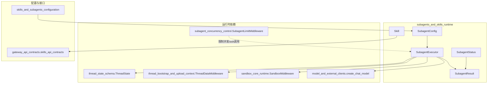
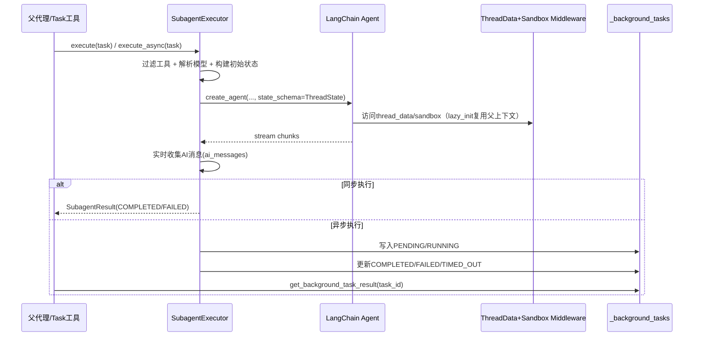

# subagents_and_skills_runtime 模块文档

## 1. 模块简介：它解决了什么问题，为什么存在

`subagents_and_skills_runtime` 是系统中把“任务拆分执行能力（Subagents）”和“可复用能力包（Skills）”连接起来的运行时模块。它的核心目标不是单纯再包一层 Agent API，而是把复杂任务从“单代理一把梭”升级为“主代理编排 + 子代理专业化执行 + 技能资产化复用”的架构。

在真实生产场景里，主代理会同时面对代码分析、资料检索、文件读写、网页处理、结构化输出等任务类型。如果全部逻辑集中在一个代理上，通常会遇到三类问题：第一，提示词膨胀导致行为不稳定；第二，工具权限过宽导致安全与成本不可控；第三，长链路任务缺少清晰的状态观测与超时治理。这个模块正是为了解决这些问题：它通过 `SubagentConfig` 将执行边界显式化，通过 `SubagentExecutor` 将同步/异步执行与超时、状态流转统一化，通过 `Skill` 类型把技能元数据和容器路径映射标准化。

从系统分层上看，本模块位于“配置层”和“执行基础设施层”之间：上游接收 `application_and_feature_configuration` 提供的子代理与技能策略，下游依赖 `agent_execution_middlewares`、`agent_memory_and_thread_context`、`sandbox_core_runtime`、`model_and_external_clients` 来完成真实执行。

---

## 2. 架构总览



上图展示了本模块的关键事实：`SubagentExecutor` 不是“孤立执行器”，而是把模型、线程状态、沙箱上下文和中间件能力组织为一个可控执行面。与此同时，`Skill` 作为轻量运行时类型，不直接执行技能，但为网关返回、容器路径映射和上层技能加载逻辑提供稳定契约。

---

## 3. 组件关系与执行流程



该流程的设计重点在于“执行与观测并重”。执行上，子代理复用父代理的 `sandbox_state` 与 `thread_data`，避免重复初始化成本；观测上，结果对象持续记录状态、时间戳、错误和流式 AI 消息，便于前端轮询、日志关联与排障。

---

## 4. 子模块说明（高层）

### 4.1 subagents_execution

`subagents_execution` 是本模块最核心的执行子模块，负责子代理的配置解释、工具过滤、Agent 实例创建、状态流转、同步/异步执行与后台任务管理。它不仅定义了 `SubagentExecutor`、`SubagentResult`、`SubagentStatus`，还包含全局任务存储与线程池编排逻辑，是“任务真的跑起来”的关键位置。

详细实现、参数语义、状态机和边界条件请参考：
- [subagents_execution.md](subagents_execution.md)

### 4.2 skills_runtime_types

`skills_runtime_types` 提供 `Skill` 这一运行时类型，用于表达技能的元数据（名称、描述、许可证）、宿主机路径、容器路径映射和启用状态。它本身不负责加载或安装技能，但为技能系统上下游提供稳定数据结构，避免路径与字段约定分散在各处。

详细字段、方法行为、限制与演进建议请参考：
- [skills_runtime_types.md](skills_runtime_types.md)

---

## 5. 与其他模块的协作边界（避免重复实现）

本模块在系统中强调“编排而不越界”。以下能力来自其他模块，本模块仅消费其契约：

- 线程状态 Schema 与上下文字段定义：见 [thread_state_schema.md](thread_state_schema.md)
- 线程路径、上传上下文引导：见 [thread_bootstrap_and_upload_context.md](thread_bootstrap_and_upload_context.md)
- 沙箱生命周期与复用策略：见 [sandbox_core_runtime.md](sandbox_core_runtime.md)
- 子代理并发 tool call 截断：见 [subagent_concurrency_control.md](subagent_concurrency_control.md)
- 子代理/技能配置策略：见 [skills_and_subagents_configuration.md](skills_and_subagents_configuration.md)
- 技能 API 合同（DTO）：见 [gateway_api_contracts.md](gateway_api_contracts.md)

这种边界划分让维护者可以在不改动执行核心的前提下，独立演进配置、沙箱、网关或中间件实现。

---

## 6. 使用与扩展指引（入口级）

典型接入路径是：先由配置层生成/覆盖 `SubagentConfig`，再构造 `SubagentExecutor` 执行任务；技能侧则由技能加载器产出 `Skill` 对象供运行时和 API 层消费。

```python
from src.subagents.config import SubagentConfig
from src.subagents.executor import SubagentExecutor

cfg = SubagentConfig(
    name="researcher",
    description="用于深度资料分析",
    system_prompt="You are a focused research subagent.",
    tools=["web_search", "read_file"],
    disallowed_tools=["task"],
    model="inherit",
    max_turns=30,
    timeout_seconds=900,
)

executor = SubagentExecutor(
    config=cfg,
    tools=all_tools,
    parent_model="gpt-4o",
    sandbox_state=parent_sandbox,
    thread_data=parent_thread_data,
    thread_id="thread-001",
    trace_id="trace-abcd",
)

result = executor.execute("分析这个仓库的依赖风险")
```

如果你要扩展本模块，优先考虑两条路径：
1) 在配置层扩展 `SubagentOverrideConfig` 并把生效值注入 `SubagentConfig`；
2) 在执行层继承 `SubagentExecutor`，扩展 `_create_agent` 或 `execute` 前后处理，而不是直接改动全局任务存储语义。

---

## 7. 关键风险、边界条件与限制

- **并发与资源上限**：执行池/调度池默认为固定大小，超出后会排队，吞吐受限。
- **超时取消非强制中断**：异步超时后调用 `Future.cancel()` 仅尽力而为，底层任务可能仍短暂运行。
- **状态共享不是隔离沙箱**：子代理复用父 `sandbox_state` 和 `thread_data`，便于连续性但也带来副作用传播。
- **工具过滤顺序要理解**：先 allowlist 再 denylist，配置冲突时以 denylist 为最终裁决。
- **默认递归防护依赖 disallowed_tools**：若移除 `task` 禁用项，必须配合深度/并发限制策略（参见 `subagent_concurrency_control`）。
- **技能路径是约定，不是存在性保证**：`Skill` 的容器路径方法只做字符串推导，不验证实际挂载。

---

## 8. 维护者快速导航

- 想看“子代理怎么执行、怎么超时、怎么拿结果”：先读 [subagents_execution.md](subagents_execution.md)
- 想看“Skill 类型字段与容器路径规则”：读 [skills_runtime_types.md](skills_runtime_types.md)
- 想看“配置如何决定超时和技能路径”：读 [skills_and_subagents_configuration.md](skills_and_subagents_configuration.md)
- 想看“并发子代理限制怎么落地”：读 [subagent_concurrency_control.md](subagent_concurrency_control.md)

以上文档组合在一起，基本覆盖本模块从配置输入到运行时执行、再到 API 输出契约的完整链路。
