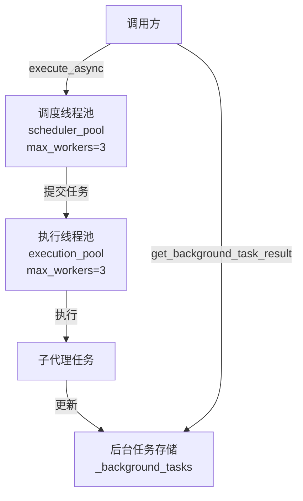
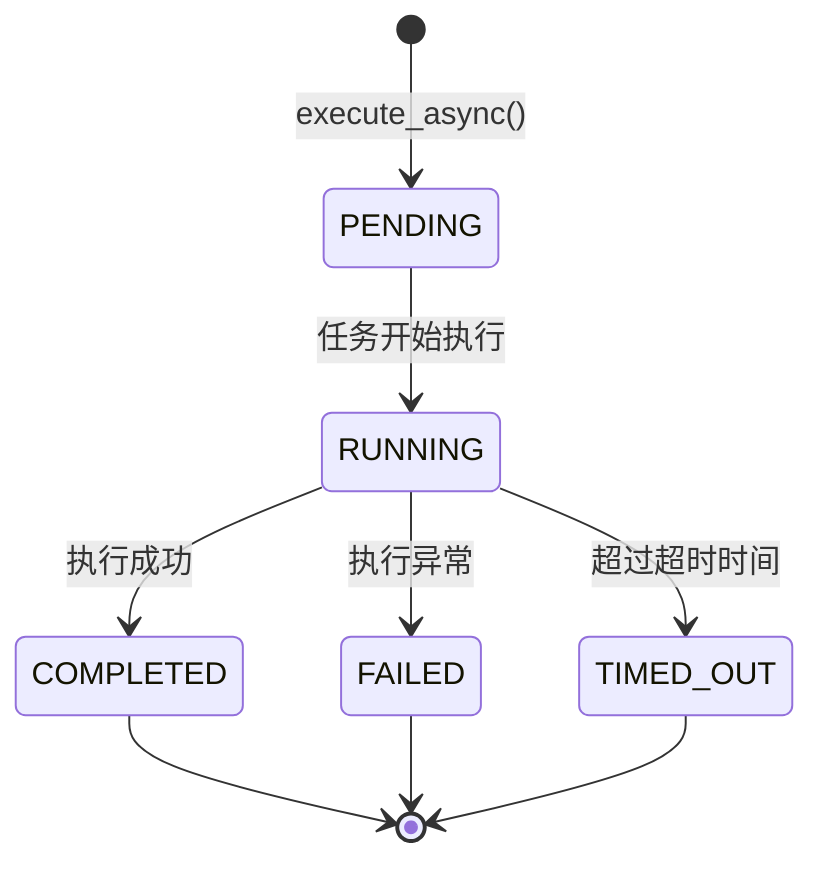
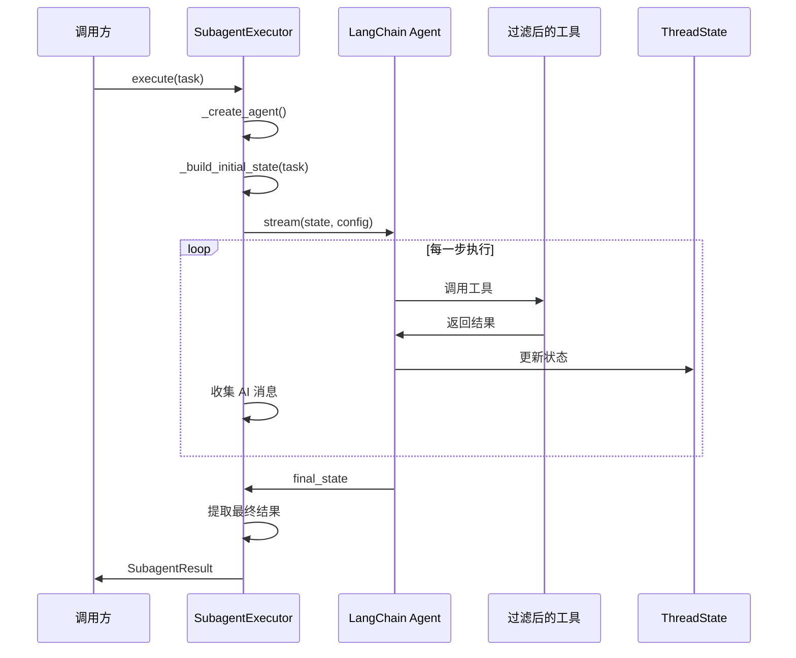

# Subagents Execution 模块文档

## 概述

Subagents Execution 模块提供了一个强大的子代理执行引擎，允许主代理将特定任务委派给专门的子代理执行。该模块实现了同步和异步两种执行模式，支持工具过滤、模型继承、超时控制等关键功能，为多代理协作架构提供了坚实的基础。

该模块的核心设计理念是通过子代理实现任务的专业化处理，每个子代理可以有自己的系统提示、工具集和执行参数，从而在复杂系统中实现关注点分离和任务并行化。

## 核心组件

### SubagentConfig

`SubagentConfig` 是一个数据类，用于定义子代理的完整配置信息。

```python
@dataclass
class SubagentConfig:
    name: str
    description: str
    system_prompt: str
    tools: list[str] | None = None
    disallowed_tools: list[str] | None = field(default_factory=lambda: ["task"])
    model: str = "inherit"
    max_turns: int = 50
    timeout_seconds: int = 900
```

**参数说明：**
- `name`: 子代理的唯一标识符，用于在系统中区分不同的子代理
- `description`: 描述何时应该使用该子代理，帮助主代理决定任务委派策略
- `system_prompt`: 指导子代理行为的系统提示词，定义子代理的角色和任务目标
- `tools`: 可选的允许工具名称列表，如果为 `None` 则继承所有可用工具
- `disallowed_tools`: 可选的禁止工具名称列表，默认为禁止使用 "task" 工具（防止无限递归）
- `model`: 子代理使用的模型，"inherit" 表示使用父代理的模型
- `max_turns`: 执行停止前的最大代理回合数，防止无限循环
- `timeout_seconds`: 最大执行时间（秒），默认为 900 秒（15 分钟）

### SubagentStatus

`SubagentStatus` 是一个枚举类，定义了子代理执行的各种状态。

```python
class SubagentStatus(Enum):
    PENDING = "pending"      # 等待执行
    RUNNING = "running"      # 正在执行
    COMPLETED = "completed"  # 执行完成
    FAILED = "failed"        # 执行失败
    TIMED_OUT = "timed_out"  # 执行超时
```

### SubagentResult

`SubagentResult` 是一个数据类，用于存储子代理执行的完整结果信息。

```python
@dataclass
class SubagentResult:
    task_id: str
    trace_id: str
    status: SubagentStatus
    result: str | None = None
    error: str | None = None
    started_at: datetime | None = None
    completed_at: datetime | None = None
    ai_messages: list[dict[str, Any]] | None = None
```

**属性说明：**
- `task_id`: 执行任务的唯一标识符
- `trace_id`: 分布式追踪的追踪 ID，用于连接父代理和子代理的日志
- `status`: 执行的当前状态
- `result`: 最终结果消息（如果完成）
- `error`: 错误消息（如果失败）
- `started_at`: 执行开始时间
- `completed_at`: 执行完成时间
- `ai_messages`: 执行过程中生成的完整 AI 消息列表（作为字典）

### SubagentExecutor

`SubagentExecutor` 是该模块的核心类，负责实际执行子代理任务。

#### 初始化

```python
def __init__(
    self,
    config: SubagentConfig,
    tools: list[BaseTool],
    parent_model: str | None = None,
    sandbox_state: SandboxState | None = None,
    thread_data: ThreadDataState | None = None,
    thread_id: str | None = None,
    trace_id: str | None = None,
):
```

**参数说明：**
- `config`: 子代理配置对象
- `tools`: 所有可用工具的列表（将根据配置进行过滤）
- `parent_model`: 父代理的模型名称，用于继承
- `sandbox_state`: 来自父代理的沙箱状态
- `thread_data`: 来自父代理的线程数据
- `thread_id`: 用于沙箱操作的线程 ID
- `trace_id`: 来自父代理的追踪 ID，用于分布式追踪

**核心功能：**
- 根据配置过滤可用工具
- 生成或继承追踪 ID
- 初始化子代理执行环境

#### 同步执行 - execute()

```python
def execute(self, task: str, result_holder: SubagentResult | None = None) -> SubagentResult:
```

**功能说明：**
同步执行子代理任务，阻塞直到任务完成或失败。

**参数：**
- `task`: 子代理的任务描述
- `result_holder`: 可选的预创建结果对象，用于在执行过程中实时更新

**返回值：**
包含执行结果的 `SubagentResult` 对象

**执行流程：**
1. 创建代理实例和初始状态
2. 配置运行参数（递归限制、线程 ID 等）
3. 使用流式方式执行代理以获取实时更新
4. 收集 AI 消息并避免重复
5. 提取最终结果并更新状态

**关键特性：**
- 流式执行支持实时消息捕获
- 自动去重 AI 消息
- 处理多种内容类型的结果提取
- 完整的错误处理和状态管理

#### 异步执行 - execute_async()

```python
def execute_async(self, task: str, task_id: str | None = None) -> str:
```

**功能说明：**
在后台启动任务执行，立即返回任务 ID 以供后续查询。

**参数：**
- `task`: 子代理的任务描述
- `task_id`: 可选的任务 ID，如果不提供则生成随机 UUID

**返回值：**
可用于后续检查状态的任务 ID

**执行流程：**
1. 创建初始待处理结果对象
2. 将任务存储到全局后台任务字典
3. 提交任务到调度线程池
4. 在执行线程池中实际执行任务
5. 监控超时并处理结果

**关键特性：**
- 非阻塞执行，立即返回
- 内置超时控制机制
- 实时状态更新
- 支持任务取消（尽力而为）

### 辅助函数

#### _filter_tools()

```python
def _filter_tools(
    all_tools: list[BaseTool],
    allowed: list[str] | None,
    disallowed: list[str] | None,
) -> list[BaseTool]:
```

根据子代理配置过滤工具列表，先应用允许列表（如果指定），然后应用禁止列表。

#### _get_model_name()

```python
def _get_model_name(config: SubagentConfig, parent_model: str | None) -> str | None:
```

解析子代理的模型名称，支持 "inherit" 值以使用父代理的模型。

#### get_background_task_result()

```python
def get_background_task_result(task_id: str) -> SubagentResult | None:
```

获取后台任务的结果，返回 `SubagentResult` 对象（如果找到）。

#### list_background_tasks()

```python
def list_background_tasks() -> list[SubagentResult]:
```

列出所有后台任务，返回所有 `SubagentResult` 实例的列表。

## 架构设计

### 线程池架构

该模块使用两个独立的线程池来实现高效的任务管理：



**设计说明：**
- **调度线程池**：负责任务的调度和超时监控，容量为 3 个线程
- **执行线程池**：负责实际的子代理执行，容量为 3 个线程
- 分离的设计确保即使执行池繁忙，调度操作也能及时响应
- 全局最大并发子代理数限制为 3（`MAX_CONCURRENT_SUBAGENTS`）

### 状态管理



### 组件交互流程



## 使用指南

### 基本使用 - 同步执行

```python
from src.subagents.config import SubagentConfig
from src.subagents.executor import SubagentExecutor, SubagentStatus

# 创建子代理配置
config = SubagentConfig(
    name="code_reviewer",
    description="用于代码审查和质量分析的子代理",
    system_prompt="你是一个专业的代码审查助手，请仔细分析代码并提供改进建议。",
    tools=["read_file", "write_file", "search"],
    max_turns=20,
    timeout_seconds=600
)

# 初始化执行器
executor = SubagentExecutor(
    config=config,
    tools=all_available_tools,
    parent_model="gpt-4",
    sandbox_state=sandbox_state,
    thread_data=thread_data,
    thread_id="thread-123",
    trace_id="trace-abc"
)

# 同步执行任务
result = executor.execute("审查 src/ 目录下的所有 Python 文件")

if result.status == SubagentStatus.COMPLETED:
    print(f"执行结果: {result.result}")
    print(f"AI 消息数: {len(result.ai_messages)}")
else:
    print(f"执行失败: {result.error}")
```

### 异步执行与状态查询

```python
# 异步执行任务
task_id = executor.execute_async("重构用户认证模块")
print(f"任务已启动，ID: {task_id}")

# 定期检查任务状态
import time
from src.subagents.executor import get_background_task_result, list_background_tasks

while True:
    result = get_background_task_result(task_id)
    if result:
        print(f"状态: {result.status.value}")
        if result.status in [SubagentStatus.COMPLETED, SubagentStatus.FAILED, SubagentStatus.TIMED_OUT]:
            if result.status == SubagentStatus.COMPLETED:
                print(f"完成结果: {result.result}")
            else:
                print(f"错误信息: {result.error}")
            break
    time.sleep(2)

# 列出所有后台任务
all_tasks = list_background_tasks()
for task in all_tasks:
    print(f"任务 {task.task_id}: {task.status.value}")
```

### 工具过滤示例

```python
# 只允许特定工具
config1 = SubagentConfig(
    name="search_agent",
    description="专门用于搜索的子代理",
    system_prompt="你是一个搜索助手，帮我查找相关信息。",
    tools=["web_search", "document_search"],  # 只允许这两个工具
    disallowed_tools=["write_file"]  # 额外禁止
)

# 禁止特定工具，继承其他所有工具
config2 = SubagentConfig(
    name="safe_agent",
    description="安全操作代理，不能执行危险操作",
    system_prompt="你是一个安全的助手。",
    tools=None,  # 继承所有工具
    disallowed_tools=["delete_file", "execute_command", "task"]  # 禁止危险工具
)
```

## 配置与扩展

### 子代理配置最佳实践

1. **明确的职责划分**：每个子代理应该有清晰、专一的职责
2. **合理的工具限制**：只授予完成任务所需的最小工具集
3. **详细的系统提示**：提供具体的指导和约束，确保子代理按预期工作
4. **保守的资源限制**：设置适当的 `max_turns` 和 `timeout_seconds`，防止资源耗尽
5. **防止递归**：默认禁止 "task" 工具，避免子代理无限递归创建更多子代理

### 扩展 SubagentExecutor

可以通过继承 `SubagentExecutor` 类来添加自定义功能：

```python
class CustomSubagentExecutor(SubagentExecutor):
    def _create_agent(self):
        # 自定义代理创建逻辑
        agent = super()._create_agent()
        # 添加自定义中间件或修改代理
        return agent
    
    def execute(self, task: str, result_holder=None):
        # 执行前的自定义逻辑
        custom_preprocessing(task)
        # 调用父类执行
        result = super().execute(task, result_holder)
        # 执行后的自定义逻辑
        custom_postprocessing(result)
        return result
```

## 注意事项与限制

### 线程安全

- 后台任务存储 `_background_tasks` 使用 `_background_tasks_lock` 进行保护，确保线程安全
- 两个线程池的大小均限制为 3，避免系统资源过度消耗
- 全局并发子代理数量被限制为 3（`MAX_CONCURRENT_SUBAGENTS`）

### 超时处理

- 超时控制仅适用于异步执行模式
- 超时后会尝试取消任务，但这是尽力而为的操作，可能无法立即停止正在执行的任务
- 对于长时间运行的工具调用，建议在工具层面也实现超时机制

### 错误处理

- 执行过程中的所有异常都会被捕获并记录到结果的 `error` 字段
- 使用日志记录器记录详细的执行信息，包含追踪 ID 以便调试
- 建议在调用方检查 `status` 字段来判断执行结果

### 资源管理

- 子代理复用父代理的沙箱状态和线程数据，不会创建新的沙箱实例
- AI 消息会被完整记录，长时间运行的任务可能产生大量消息数据
- 后台任务结果会一直保留在内存中，建议在完成后及时处理并考虑实现清理机制

### 递归防护

- 默认配置禁止子代理使用 "task" 工具，防止无限递归
- 如果确实需要子代理创建更多子代理，必须明确从 `disallowed_tools` 中移除 "task"，并实现适当的深度限制

## 与其他模块的关系

- **agent_memory_and_thread_context**: 子代理执行器可以接收父代理的 `SandboxState` 和 `ThreadDataState`，并在执行过程中复用这些状态
- **agent_execution_middlewares**: 子代理创建时会添加最小化的中间件集，包括 `ThreadDataMiddleware` 和 `SandboxMiddleware`
- **application_and_feature_configuration**: 可以参考 `SubagentsAppConfig` 和 `SubagentOverrideConfig` 来了解更高层次的子代理配置管理
- **subagents_and_skills_runtime**: 本模块是其子模块，专注于执行部分，而父模块包含更广泛的子代理和技能管理功能

更多相关信息请参考对应模块的文档。
