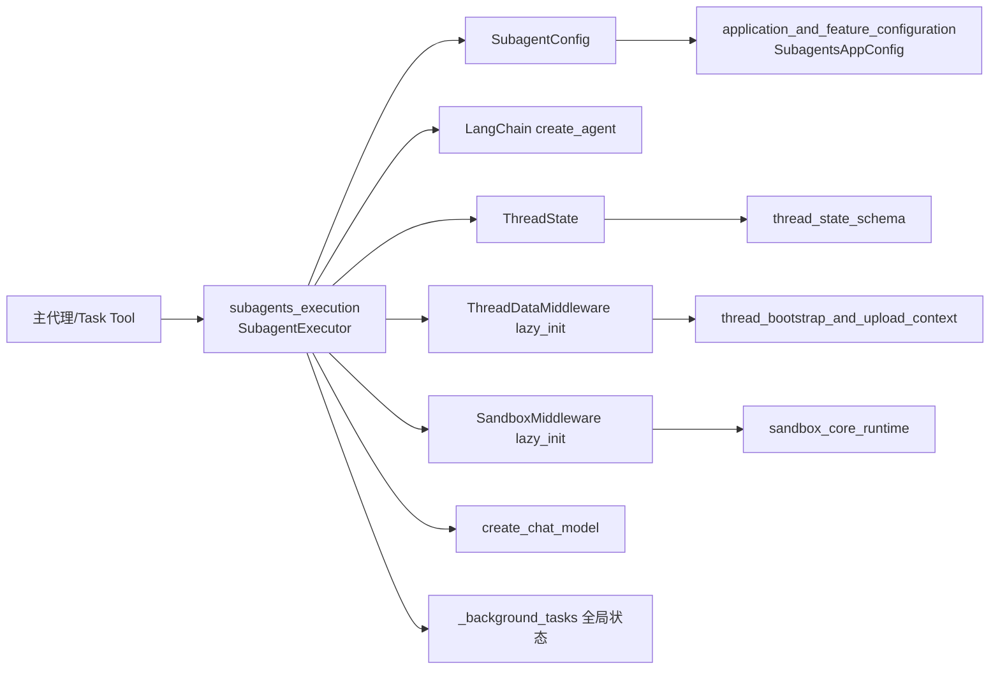
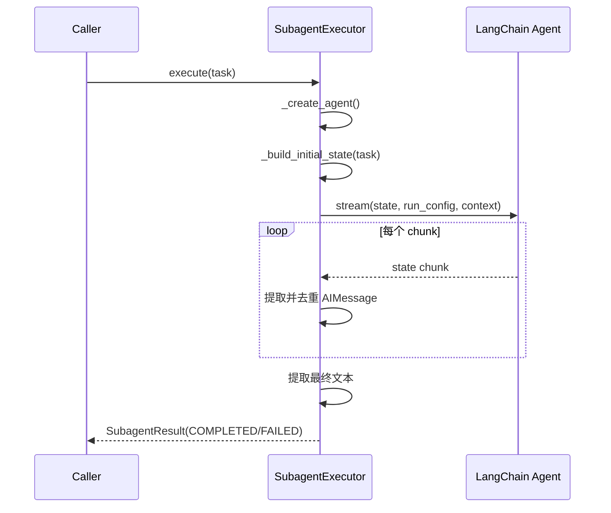
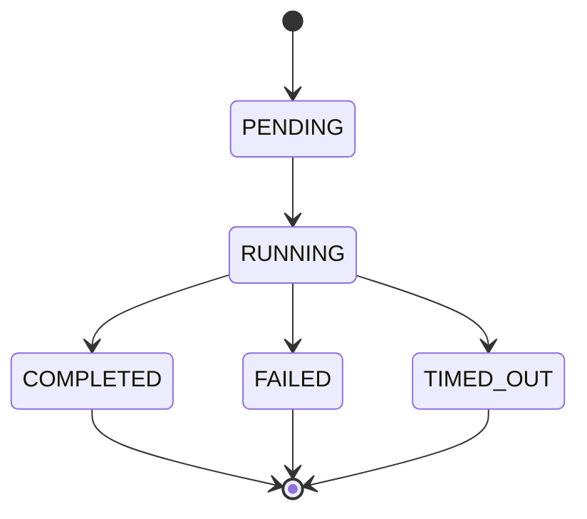
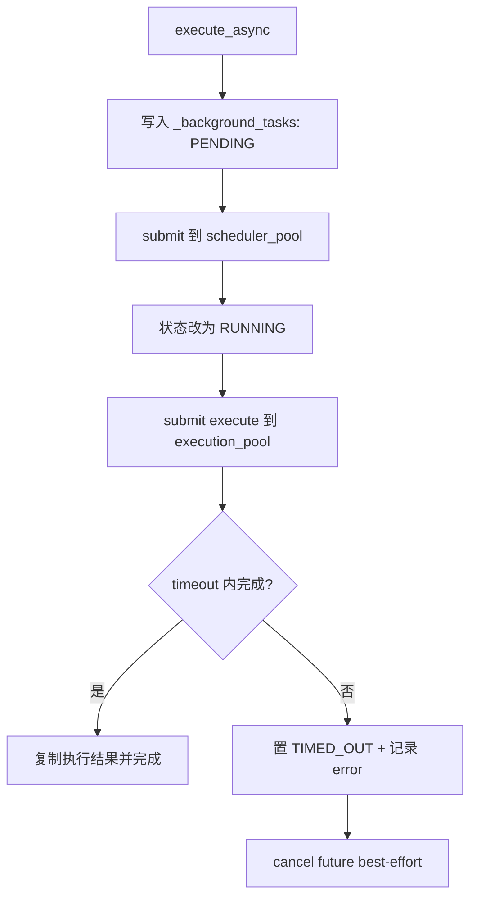

# subagents_execution 模块文档

## 模块简介与设计动机

`subagents_execution` 是子代理运行时的执行核心，负责把“主代理拆分出的子任务”真正落地成一次可控、可追踪、可回收结果的执行过程。它存在的核心原因是：在复杂任务中，主代理往往需要把不同类型的工作（例如检索、代码修改、结构化分析）委托给专门子代理，而不是把所有职责塞进一个巨大的单体 Agent。

该模块围绕三个关键目标设计。第一是**执行隔离**：每个子代理有独立的 `SubagentConfig`（提示词、工具、模型、回合上限、超时），让能力边界清晰。第二是**运行安全**：通过工具白名单/黑名单、回合限制、超时控制以及默认禁用 `task` 工具，降低递归失控和资源耗尽风险。第三是**可观测性**：返回结构化 `SubagentResult`，保留状态、时间戳、错误信息与流式 AI 消息轨迹，并用 `trace_id` 贯穿日志链路。

在整体系统里，它是 [`subagents_and_skills_runtime.md`](subagents_and_skills_runtime.md) 的执行层子模块；与线程上下文、沙箱中间件、配置系统形成协作关系，但不重复实现这些模块的生命周期管理。

---

## 在系统中的位置与依赖关系



上图体现了该模块的“薄编排”定位：它不自己创建目录结构、不自己实现沙箱提供者、不自己定义线程状态 schema，而是通过 `ThreadDataMiddleware` 与 `SandboxMiddleware` 复用已有能力。换句话说，`subagents_execution` 的价值在于把这些能力按子代理执行语义拼装起来，并提供同步/异步两套运行模型。

相关文档可直接参考：
- 线程状态与字段定义：[`thread_state_schema.md`](thread_state_schema.md)
- 线程数据与上传上下文初始化：[`thread_bootstrap_and_upload_context.md`](thread_bootstrap_and_upload_context.md)
- 沙箱抽象与运行时：[`sandbox_core_runtime.md`](sandbox_core_runtime.md)
- 子代理并发限制中间件：[`subagent_concurrency_control.md`](subagent_concurrency_control.md)
- 应用配置总览：[`application_and_feature_configuration.md`](application_and_feature_configuration.md)

---

## 核心组件详解

## `SubagentConfig`（`backend/src/subagents/config.py`）

`SubagentConfig` 是子代理的执行契约。它把“这个子代理是谁、能做什么、运行多久、使用什么模型”集中在一个数据类中。

```python
@dataclass
class SubagentConfig:
    name: str
    description: str
    system_prompt: str
    tools: list[str] | None = None
    disallowed_tools: list[str] | None = field(default_factory=lambda: ["task"])
    model: str = "inherit"
    max_turns: int = 50
    timeout_seconds: int = 900
```

字段行为要点：
- `tools=None` 表示从父执行上下文继承全部可用工具；一旦给出列表，就变成显式 allowlist。
- `disallowed_tools` 总是在 allowlist 之后再生效，因此可以做“先允许，再剔除”。默认值包含 `"task"`，这是递归保护的关键。
- `model="inherit"` 触发模型继承逻辑；否则使用显式模型名。
- `max_turns` 映射到 LangChain `recursion_limit`。
- `timeout_seconds` 只在 `execute_async()` 的等待逻辑中直接生效（同步模式没有外围 Future 超时壳）。

---

## `SubagentStatus`（执行状态枚举）

`SubagentStatus` 定义后台任务可观测状态机：
- `PENDING`：已登记，等待调度。
- `RUNNING`：已进入执行。
- `COMPLETED`：执行完成并得到结果。
- `FAILED`：执行异常。
- `TIMED_OUT`：异步等待超时。

它既是 API 层轮询状态的基础，也是前端/网关构建任务进度展示的稳定枚举值。

---

## `SubagentResult`（执行结果容器）

`SubagentResult` 是同步与异步共享的数据载体，包含任务身份、追踪信息、状态、时间戳、最终文本、错误信息和流式消息快照。

```python
@dataclass
class SubagentResult:
    task_id: str
    trace_id: str
    status: SubagentStatus
    result: str | None = None
    error: str | None = None
    started_at: datetime | None = None
    completed_at: datetime | None = None
    ai_messages: list[dict[str, Any]] | None = None
```

`__post_init__` 会把 `ai_messages` 归一成空列表，避免后续 append 时出现 `NoneType` 错误。这也是该结果对象可以被“实时增量更新”的基础。

---

## `SubagentExecutor`（执行引擎）

`SubagentExecutor` 是模块核心，承担四类责任：配置解析、Agent 构建、同步执行、异步调度。

### 1) 初始化阶段

构造函数会完成以下动作：
1. 记录父模型、沙箱状态、线程数据、线程 ID 与 trace。
2. 若未传 `trace_id`，生成短 UUID（前 8 位）用于日志串联。
3. 通过 `_filter_tools()` 根据 `tools/disallowed_tools` 得到最终可用工具集。

这里的工具过滤是“执行前静态裁剪”，不是运行时拦截；因此配置错误会直接体现在子代理可用能力中。

### 2) `_create_agent()`：子代理实例构建

`_create_agent()` 先调用 `_get_model_name()` 决定模型名，再调用 `create_chat_model(..., thinking_enabled=False)`。随后注入两个最小中间件：
- `ThreadDataMiddleware(lazy_init=True)`：计算 thread 相关路径；目录延迟创建。
- `SandboxMiddleware(lazy_init=True)`：复用父线程沙箱，按需获取。

最后通过 `create_agent(..., state_schema=ThreadState)` 构建 Agent。这里使用 `ThreadState` 的意义是让子代理天然兼容父线程已有字段（如 `sandbox`、`thread_data`、`uploaded_files`、`viewed_images` 等）。

### 3) `_build_initial_state(task)`：初始状态拼装

初始状态至少包含一条 `HumanMessage(task)`。如果调用方提供了 `sandbox_state` 与 `thread_data`，会透传进 state，实现父子代理上下文连续性，减少重复初始化成本。

### 4) `execute()`：同步执行路径

同步执行逻辑使用 `agent.stream(..., stream_mode="values")`，而非一次性 `invoke()`。这样可在执行中实时抓取新增 `AIMessage`，并把序列化后的消息字典追加到 `result.ai_messages`。

消息去重策略分两层：
- 若消息有 `id`，按 `id` 去重；
- 否则按完整字典对比去重。

最终结果提取策略也较稳健：
- 优先找最后一条 `AIMessage`；
- `content` 为 `str` 直接返回；
- `content` 为 `list` 时抽取文本块拼接；
- 若找不到 AIMessage，则降级使用最后一条消息内容；
- 仍无消息则返回 `"No response generated"`。

若执行中抛出异常，状态置为 `FAILED`，错误写入 `error`，并记录完成时间。

### 5) `execute_async()`：异步执行路径

异步路径采用“双线程池”结构：
- `_scheduler_pool`（调度池，3 workers）：负责任务登记、状态切换、超时监控。
- `_execution_pool`（执行池，3 workers）：实际跑 `execute()`。

任务先写入全局 `_background_tasks`（加锁），状态初始为 `PENDING`。调度线程启动后改为 `RUNNING`，并提交执行 Future。若 `future.result(timeout=...)` 超时，则置 `TIMED_OUT` 并 `cancel()`（仅 best-effort，不保证中断底层工具调用）。

---

## 执行流程图

### 同步执行时序



这条路径强调“边执行边采集”，非常适合上层做中间态展示或调试回放。

### 异步状态流转



### 异步调度与超时控制



---

## 关键辅助函数

`_filter_tools(all_tools, allowed, disallowed)` 的语义是“先收敛、再剔除”。因此如果某工具同时出现在 allowlist 与 denylist，最终会被拒绝。这个行为对安全策略是有利的（deny 优先）。

`_get_model_name(config, parent_model)` 只做一件事：当 `config.model == "inherit"` 时返回父模型，否则返回显式模型。这意味着父模型为空时，返回值也可能是 `None`，后续由 `create_chat_model` 决定默认模型策略。

`get_background_task_result(task_id)` 和 `list_background_tasks()` 都通过 `_background_tasks_lock` 读取全局任务表，避免并发读写撕裂。

---

## 配置、使用与扩展

## 基础使用（同步）

```python
from src.subagents.config import SubagentConfig
from src.subagents.executor import SubagentExecutor, SubagentStatus

config = SubagentConfig(
    name="code_reviewer",
    description="当需要代码评审时委托",
    system_prompt="You are a strict code reviewer.",
    tools=["read_file", "grep"],
    disallowed_tools=["task"],
    model="inherit",
    max_turns=20,
)

executor = SubagentExecutor(
    config=config,
    tools=all_tools,
    parent_model="gpt-4o",
    sandbox_state=parent_sandbox,
    thread_data=parent_thread_data,
    thread_id="thread_123",
    trace_id="abc12345",
)

res = executor.execute("Review changed Python files and summarize risks")
if res.status == SubagentStatus.COMPLETED:
    print(res.result)
else:
    print(res.error)
```

## 异步使用（轮询）

```python
from src.subagents.executor import get_background_task_result, SubagentStatus

task_id = executor.execute_async("Refactor auth module")

while True:
    r = get_background_task_result(task_id)
    if r and r.status in {SubagentStatus.COMPLETED, SubagentStatus.FAILED, SubagentStatus.TIMED_OUT}:
        break
```

## 与应用配置的衔接

生产环境中通常由 [`application_and_feature_configuration.md`](application_and_feature_configuration.md) 中的 `SubagentsAppConfig` / `SubagentOverrideConfig` 决定 timeout，再映射到 `SubagentConfig.timeout_seconds`。建议在构建 `SubagentConfig` 时统一走配置层，避免硬编码。

## 扩展建议

若要扩展执行能力，优先继承 `SubagentExecutor` 并覆写以下点：
- `_create_agent()`：加入额外 middleware 或替换模型构建策略。
- `execute()`：加入审计埋点、结果后处理、敏感信息脱敏。
- `execute_async()`：接入外部任务系统（如 Redis/Celery）替代进程内字典。

---

## 运行约束、边界条件与常见坑

该模块的常见风险不在 API 调用本身，而在“并发 + 外部工具 + 长时任务”组合下的系统行为。

第一，`_background_tasks` 是进程内全局字典，当前无 TTL 或清理机制。服务运行越久，历史任务越多，会造成内存持续增长。若你在网关层频繁创建异步任务，必须补充清理策略。

第二，异步超时是对 `Future.result(timeout=...)` 的等待超时，不等价于底层任务一定被终止。`execution_future.cancel()` 只是尽力取消；如果工具调用已经进入阻塞 I/O 或外部进程，仍可能继续运行。

第三，线程池并发数固定为 3（调度池和执行池均为 3），并定义 `MAX_CONCURRENT_SUBAGENTS = 3`。这提供了保守上限，但也可能在高并发场景形成排队与延迟。并且该常量本身不自动做系统级背压，你仍需在上层入口控制流量。

第四，默认 `disallowed_tools=["task"]` 很重要。如果覆盖配置时误删该限制，而又没有像 [`subagent_concurrency_control.md`](subagent_concurrency_control.md) 那样的并发裁剪与深度控制，可能出现递归级联调用。

第五，`ThreadDataMiddleware` 依赖 `context.thread_id`。若调用 `execute/execute_async` 时未传 `thread_id`，而中间件执行路径又需要该值，会触发运行时错误（`Thread ID is required in the context`）。因此多线程/多会话环境下务必传入稳定 thread_id。

第六，最终结果抽取依赖最后 `AIMessage` 的 `content` 结构。对于高度结构化输出（例如纯工具调用无自然语言文本），`result.result` 可能是降级字符串，不一定能完整表达业务语义。此时应同时读取 `ai_messages` 做更精细解析。

---

## 与其他模块的协作建议

如果你正在维护完整子代理链路，可以按下面的阅读顺序理解系统而不是在本模块重复查找：先看 [`subagents_and_skills_runtime.md`](subagents_and_skills_runtime.md) 了解总体运行时定位，再看 [`agent_execution_middlewares.md`](agent_execution_middlewares.md) 与 [`thread_bootstrap_and_upload_context.md`](thread_bootstrap_and_upload_context.md) 理解 thread/sandbox 注入，最后结合 [`sandbox_core_runtime.md`](sandbox_core_runtime.md) 与 [`application_and_feature_configuration.md`](application_and_feature_configuration.md) 落到环境和配置。

这能帮助你把 `subagents_execution` 放在正确层级：它是“执行编排器”，不是“能力提供者”或“基础设施生命周期管理器”。