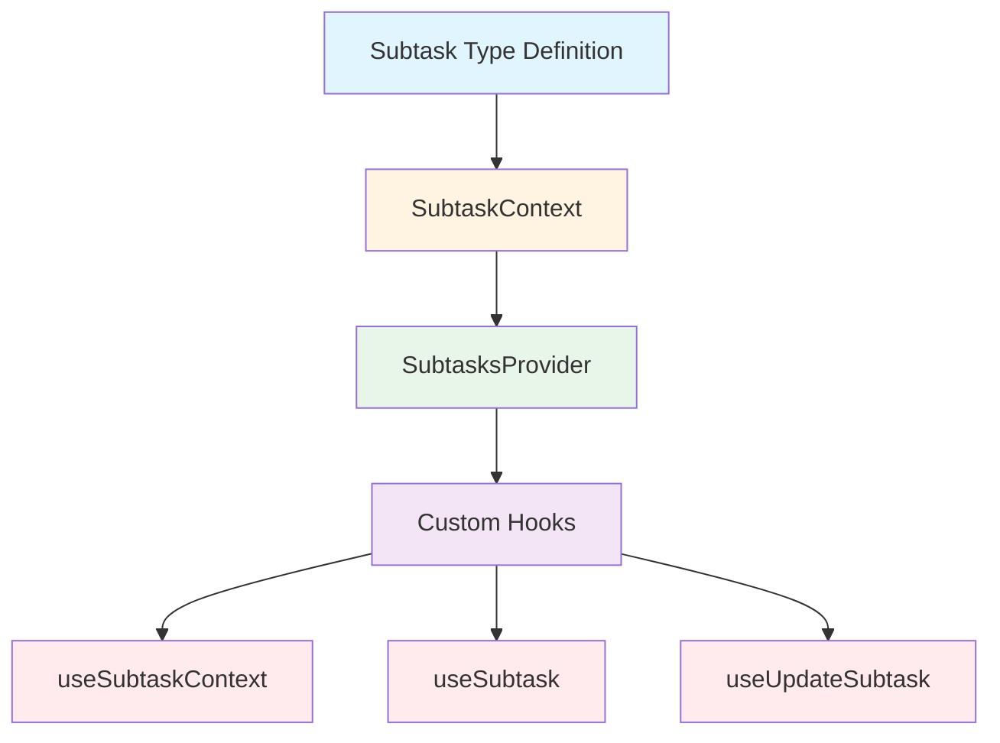

# Tasks Module Documentation

## 1. Overview

The Tasks module is a core frontend component designed to manage and track subagent execution tasks within the application. It provides a centralized state management system for subtasks, enabling components to access, update, and monitor the progress of subagent operations throughout their lifecycle.

This module exists to solve the problem of coordinating and visualizing subagent activities, allowing users to track the status, descriptions, and results of individual subagent tasks. By centralizing subtask state management, it ensures consistent access to task information across different parts of the frontend application.

### Key Features
- Centralized subtask state management using React Context
- Type-safe subtask data structures
- Hooks for accessing and updating subtask information
- Support for tracking task status, messages, and results

## 2. Architecture

The Tasks module follows a React Context-based architecture pattern, providing a clean separation between state definition, state management, and component access.



### Architecture Components

1. **Type Definitions (`types.ts`)**: Defines the core data structure for subtasks, ensuring type safety across the module.
2. **Context Setup (`context.tsx`)**: Creates the React Context that holds the subtask state and provides methods to update it.
3. **Provider Component**: Wraps the application to make subtask state available to all child components.
4. **Custom Hooks**: Provide convenient access to subtask state and update functionality for components.

This architecture ensures that subtask state is managed in a single location but accessible from anywhere in the component tree that needs it, following React's best practices for state management.

## 3. Core Components

### Subtask Type

The `Subtask` interface is the foundational data structure of the module, defining all properties associated with a subagent task.

```typescript
export interface Subtask {
  id: string;
  status: "in_progress" | "completed" | "failed";
  subagent_type: string;
  description: string;
  latestMessage?: AIMessage;
  prompt: string;
  result?: string;
  error?: string;
}
```

**Properties:**
- `id`: Unique identifier for the subtask
- `status`: Current execution status, can be one of "in_progress", "completed", or "failed"
- `subagent_type`: Type of subagent executing the task
- `description`: Human-readable description of what the subtask is accomplishing
- `latestMessage`: Optional most recent message from the subagent (of type AIMessage)
- `prompt`: The original prompt given to the subagent
- `result`: Optional result of the subtask once completed
- `error`: Optional error message if the subtask failed

### SubtaskContextValue

The `SubtaskContextValue` interface defines the shape of the context value that is provided to components.

```typescript
export interface SubtaskContextValue {
  tasks: Record<string, Subtask>;
  setTasks: (tasks: Record<string, Subtask>) => void;
}
```

**Properties:**
- `tasks`: A record (dictionary) of subtasks indexed by their unique IDs
- `setTasks`: A function to update the entire tasks record

### SubtasksProvider

The `SubtasksProvider` component is a React context provider that wraps the application (or a section of it) to make subtask state available to child components.

**Usage:**
```tsx
import { SubtasksProvider } from 'frontend/src/core/tasks/context';

function App() {
  return (
    <SubtasksProvider>
      {/* Your application components */}
    </SubtasksProvider>
  );
}
```

This component initializes the subtask state as an empty object and provides both the state and the setter function through the context.

### useSubtaskContext

The `useSubtaskContext` hook is a custom hook that provides access to the entire subtask context. It throws an error if used outside of a `SubtasksProvider`.

**Usage:**
```tsx
import { useSubtaskContext } from 'frontend/src/core/tasks/context';

function Component() {
  const { tasks, setTasks } = useSubtaskContext();
  // Use tasks and setTasks
}
```

**Returns:** The full `SubtaskContextValue` containing both the tasks record and the setTasks function.

### useSubtask

The `useSubtask` hook retrieves a specific subtask by its ID.

**Parameters:**
- `id`: The unique identifier of the subtask to retrieve

**Usage:**
```tsx
import { useSubtask } from 'frontend/src/core/tasks/context';

function TaskDetails({ taskId }: { taskId: string }) {
  const task = useSubtask(taskId);
  if (!task) return <div>Task not found</div>;
  return <div>Task: {task.description}</div>;
}
```

**Returns:** The `Subtask` object with the specified ID, or undefined if not found.

### useUpdateSubtask

The `useUpdateSubtask` hook returns a function that can be used to update a subtask's properties.

**Usage:**
```tsx
import { useUpdateSubtask } from 'frontend/src/core/tasks/context';

function TaskUpdater() {
  const updateSubtask = useUpdateSubtask();
  
  const completeTask = (taskId: string, result: string) => {
    updateSubtask({
      id: taskId,
      status: 'completed',
      result: result
    });
  };
  
  // ...
}
```

**Return Value:** A function that accepts a partial `Subtask` object (must include the `id`) and updates the corresponding task in the state.

**Important Note:** The update only triggers a re-render if the `latestMessage` property is included in the update. This is an optimization to prevent unnecessary re-renders for minor task updates.

## 4. Usage Examples

### Basic Setup

To use the Tasks module, you first need to wrap your application with the `SubtasksProvider`:

```tsx
import { SubtasksProvider } from 'frontend/src/core/tasks/context';

function App() {
  return (
    <SubtasksProvider>
      <MainContent />
    </SubtasksProvider>
  );
}
```

### Creating a New Subtask

```tsx
import { useSubtaskContext } from 'frontend/src/core/tasks/context';
import type { Subtask } from 'frontend/src/core/tasks/types';

function TaskCreator() {
  const { tasks, setTasks } = useSubtaskContext();
  
  const createNewTask = () => {
    const newTask: Subtask = {
      id: `task-${Date.now()}`,
      status: 'in_progress',
      subagent_type: 'analyzer',
      description: 'Analyze the provided document',
      prompt: 'Please analyze the following document...'
    };
    
    setTasks({
      ...tasks,
      [newTask.id]: newTask
    });
  };
  
  return (
    <button onClick={createNewTask}>Create New Task</button>
  );
}
```

### Updating a Subtask

```tsx
import { useUpdateSubtask } from 'frontend/src/core/tasks/context';

function TaskStatusUpdater({ taskId }: { taskId: string }) {
  const updateSubtask = useUpdateSubtask();
  
  const markAsCompleted = (result: string) => {
    updateSubtask({
      id: taskId,
      status: 'completed',
      result: result
    });
  };
  
  const markAsFailed = (error: string) => {
    updateSubtask({
      id: taskId,
      status: 'failed',
      error: error
    });
  };
  
  return (
    <div>
      <button onClick={() => markAsCompleted('Task completed successfully')}>
        Mark as Completed
      </button>
      <button onClick={() => markAsFailed('Task failed due to error')}>
        Mark as Failed
      </button>
    </div>
  );
}
```

### Displaying Subtasks

```tsx
import { useSubtaskContext } from 'frontend/src/core/tasks/context';

function TaskList() {
  const { tasks } = useSubtaskContext();
  
  return (
    <div>
      <h2>Subtasks</h2>
      <ul>
        {Object.values(tasks).map(task => (
          <li key={task.id}>
            <h3>{task.description}</h3>
            <p>Status: {task.status}</p>
            <p>Type: {task.subagent_type}</p>
            {task.result && <p>Result: {task.result}</p>}
            {task.error && <p>Error: {task.error}</p>}
          </li>
        ))}
      </ul>
    </div>
  );
}
```

## 5. Integration with Other Modules

The Tasks module integrates with several other frontend modules:

- **Threads Module**: Subtasks are often associated with specific agent threads, and the tasks module works alongside the threads module to provide a complete picture of agent activities.
- **Messages Module**: The `latestMessage` property of Subtask references the `AIMessage` type, connecting tasks with the message flow in the application.
- **Subagents and Skills Runtime**: The tasks module tracks the execution of subagents defined in the subagents module.

For more information on these modules, refer to their respective documentation:
- [frontend_core_domain_types_and_state](frontend_core_domain_types_and_state.md)
- [subagents_and_skills_runtime](subagents_and_skills_runtime.md)

## 6. Edge Cases and Limitations

### Important Considerations

1. **Re-render Triggering**: The `useUpdateSubtask` hook only triggers a re-render when the `latestMessage` property is included in the update. This is intentional to avoid excessive re-renders, but it means that updates to other properties won't automatically refresh the UI unless you also include a `latestMessage` or manually manage updates.

2. **Context Availability**: All hooks in this module must be used within a `SubtasksProvider`. If used outside, they will throw an error.

3. **Partial Updates**: When using `useUpdateSubtask`, you only need to provide the properties you want to update, but you must always include the `id` property to identify which task to update.

4. **State Immutability**: The module uses React's state management which relies on immutability. When updating tasks directly (not through `useUpdateSubtask`), always create a new object rather than mutating the existing one.

5. **Memory Considerations**: For long-running applications with many tasks, the task list can grow large. Consider implementing a cleanup mechanism for completed or failed tasks that are no longer needed.

## 7. Best Practices

1. **Wrap Early**: Place the `SubtasksProvider` high in your component tree to make it available to all components that need it.

2. **Use Specific Hooks**: Prefer `useSubtask` and `useUpdateSubtask` over `useSubtaskContext` when you only need specific functionality, as it makes your component's dependencies clearer.

3. **Include latestMessage for UI Updates**: When you want your changes to be reflected in the UI immediately, include the `latestMessage` property in your updates through `useUpdateSubtask`.

4. **Keep Task Descriptions User-Friendly**: The `description` property should be human-readable and clearly explain what the task is trying to accomplish.

5. **Handle All States**: Make sure your UI properly handles all three task states: "in_progress", "completed", and "failed".

By following these practices and understanding the module's architecture and components, you can effectively manage and track subagent tasks in your application.
