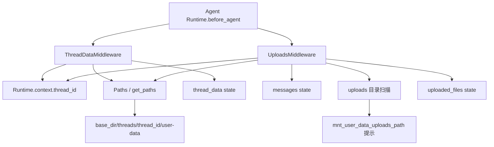
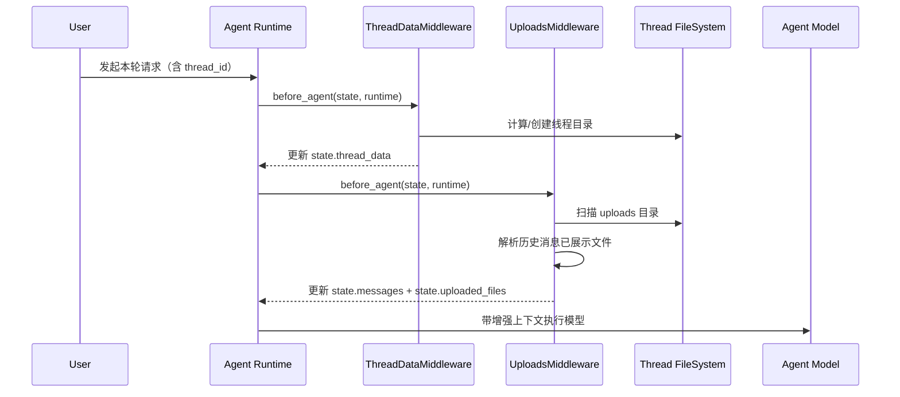
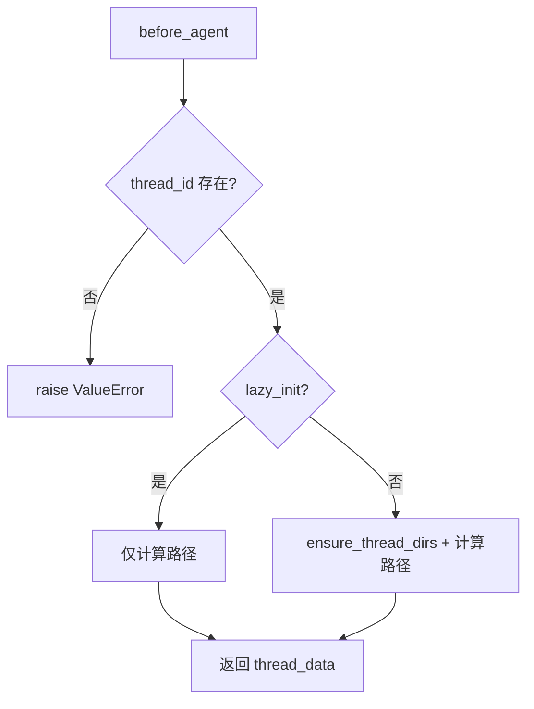
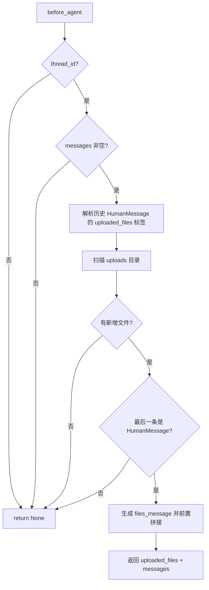
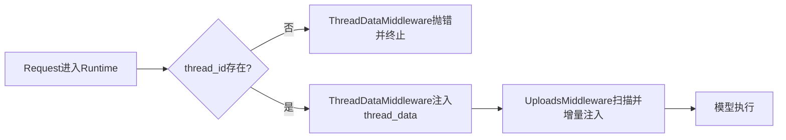

# thread_bootstrap_and_upload_context 模块文档

## 模块概述

`thread_bootstrap_and_upload_context` 是 `agent_execution_middlewares` 下负责“线程启动上下文准备”的关键子模块，它由两个中间件协同组成：`ThreadDataMiddleware` 与 `UploadsMiddleware`。前者负责为每个会话线程建立（或声明）线程级数据目录语义，后者负责把“当前线程可用上传文件”注入到本轮用户消息上下文中，让模型在调用工具前就知道有哪些文件可读。

这个模块存在的核心原因是：在多轮会话、工具调用、沙箱执行并存的系统里，模型并不知道宿主文件系统结构，也不知道用户什么时候上传了什么文件。如果不在执行前统一完成目录上下文和上传文件上下文的注入，就会出现工具路径不一致、模型“看不见”文件、重复提示同一文件、线程间数据污染等问题。该模块通过 middleware 生命周期钩子（`before_agent`）把这些“每轮都必须一致执行的前置动作”抽离出来，避免散落在业务逻辑中。

从职责边界来看，这个模块不直接负责文件上传 API（见 [gateway_api_contracts.md](gateway_api_contracts.md)）和沙箱挂载实现（见 [sandbox_core_runtime.md](sandbox_core_runtime.md)），也不负责线程状态完整 schema 定义（见 [thread_state_schema.md](thread_state_schema.md)）。它只负责在 Agent 执行前，把“线程路径信息”和“新增上传文件信息”放到可消费状态中。

---

## 设计目标与设计取舍

该模块的设计目标是“低耦合地完成线程启动上下文注入”。具体来说，它把两个常见但性质不同的前置任务拆分：

- `ThreadDataMiddleware`：偏基础设施，负责路径解析与（可选）目录初始化。
- `UploadsMiddleware`：偏提示工程与消息改写，负责把文件列表增量注入最后一条 `HumanMessage`。

这种拆分带来两个好处。第一，路径策略可以独立演进（比如 `lazy_init` 政策调整）而不影响上传提示逻辑。第二，上传上下文策略（全量注入 / 增量注入 / 格式化规则）可以独立扩展，不会动到目录创建机制。

同时，模块采取了一个重要取舍：`UploadsMiddleware` 使用“历史消息中 `<uploaded_files>` 标签解析”来推断已展示文件，而不是维护外部持久化索引。这个取舍减少了状态存储复杂度，但要求注入格式稳定，且对消息被外部改写较敏感（后文详述）。

---

## 架构与组件关系



上图展示了核心依赖：两个中间件都依赖 `Runtime.context.thread_id` 与 `Paths`。`ThreadDataMiddleware` 产出 `thread_data`（workspace/uploads/outputs 三类路径），`UploadsMiddleware` 基于线程 uploads 目录扫描结果改写消息并产出 `uploaded_files`。

### 关键交互时序



这个时序意味着：如果你希望模型第一时间知道上传文件，`UploadsMiddleware` 必须在模型调用前运行；如果工具或后续逻辑依赖 `thread_data`，则 `ThreadDataMiddleware` 通常应排在前面。

---

## 核心状态模型

### `ThreadDataMiddlewareState`

`ThreadDataMiddlewareState` 继承 `AgentState`，增加可选字段：

- `thread_data: NotRequired[ThreadDataState | None]`

其中 `ThreadDataState`（定义见 [thread_state_schema.md](thread_state_schema.md)）包含：

- `workspace_path`
- `uploads_path`
- `outputs_path`

这些字段是面向本轮执行的“线程目录上下文快照”。

### `UploadsMiddlewareState`

`UploadsMiddlewareState` 继承 `AgentState`，增加可选字段：

- `uploaded_files: NotRequired[list[dict] | None]`

每个文件字典包含：`filename`、`size`、`path`、`extension`。注意它是运行时构建的轻量结构，不是上传服务的完整元数据对象。

---

## 组件深度解析

## 1) `ThreadDataMiddleware`

### 作用

`ThreadDataMiddleware` 在 `before_agent` 钩子中读取 `thread_id`，将线程数据路径注入 `state.thread_data`。它支持两种生命周期策略：

- `lazy_init=True`（默认）：只计算路径，不创建目录。
- `lazy_init=False`：在 `before_agent` 期间立即创建目录。

### 构造函数

```python
ThreadDataMiddleware(base_dir: str | None = None, lazy_init: bool = True)
```

`base_dir` 用于覆盖默认路径根目录；未提供时走 `get_paths()` 全局解析逻辑（详见 [application_and_feature_configuration.md](application_and_feature_configuration.md) 与 `Paths` 行为说明）。

### 内部方法

#### `_get_thread_paths(thread_id: str) -> dict[str, str]`

该方法只做路径计算，返回：

- `workspace_path`
- `uploads_path`
- `outputs_path`

实现依赖 `Paths.sandbox_work_dir/sandbox_uploads_dir/sandbox_outputs_dir`。

#### `_create_thread_directories(thread_id: str) -> dict[str, str]`

先调用 `Paths.ensure_thread_dirs(thread_id)` 创建目录，再返回同样结构的路径字典。其副作用是实际文件系统写入（mkdir, parents=True, exist_ok=True）。

### `before_agent` 行为

```python
def before_agent(state, runtime) -> dict | None
```

执行流程如下：

1. 从 `runtime.context` 读取 `thread_id`。
2. 若缺失，抛出 `ValueError("Thread ID is required in the context")`。
3. 按 `lazy_init` 策略选择仅计算路径或立即创建目录。
4. 返回 `{"thread_data": {...}}` 作为状态增量。

### 行为图（lazy vs eager）



### 关键副作用与约束

- 在 eager 模式会创建目录；lazy 模式不会。
- 线程 ID 安全性由 `Paths.thread_dir()` 约束，非法 ID（含路径穿越风险字符）会触发异常。
- eager 模式下有 `print` 输出，不走统一日志系统，生产环境可能需要改为 logger。

---

## 2) `UploadsMiddleware`

### 作用

`UploadsMiddleware` 在执行前扫描线程 uploads 目录，只把“尚未在历史人类消息中展示过的文件”注入到最后一条 `HumanMessage` 前缀中。这样模型在当前回合能立即看到新文件，不会反复看到旧文件列表。

### 构造函数

```python
UploadsMiddleware(base_dir: str | None = None)
```

与 `ThreadDataMiddleware` 一样，`base_dir` 可覆盖默认路径根目录，未提供时使用 `get_paths()`。

### 内部方法

#### `_get_uploads_dir(thread_id: str) -> Path`

返回线程上传目录路径：`Paths.sandbox_uploads_dir(thread_id)`。

#### `_list_newly_uploaded_files(thread_id: str, last_message_files: set[str]) -> list[dict]`

该方法扫描 uploads 目录下文件，过滤掉 `last_message_files` 中的名称，返回增量文件列表。每项包含：

- `filename`
- `size`（字节）
- `path`（虚拟路径形式：`/mnt/user-data/uploads/{name}`）
- `extension`

注意这里的“去重”按文件名而不是内容 hash；同名覆盖或重传场景会影响结果判定。

#### `_create_files_message(files: list[dict]) -> str`

把文件列表格式化为：

```text
<uploaded_files>
...
</uploaded_files>
```

包含大小（KB/MB）和 `read_file` 工具使用提示。这个标签结构也是后续历史解析的基础格式。

#### `_extract_files_from_message(content: str) -> set[str>`

使用正则从 `<uploaded_files>...</uploaded_files>` 区块提取已展示文件名。关键点是支持带空格文件名：

- 匹配行模式：`- filename ... (size)`
- 文件名提取正则：`^-\s+(.+?)\s*\(`

这使得 `report final v2.csv` 之类名称可被识别。

### `before_agent` 行为

主流程可分为 8 步：

1. 读取 `thread_id`，缺失则直接 `return None`（与 ThreadData 的“抛错”策略不同）。
2. 读取 `state.messages`，为空则 `return None`。
3. 扫描历史消息（除最后一条）中的 `HumanMessage`，解析出已展示文件集合 `shown_files`。
4. 读取 uploads 目录并构造“新增文件”列表。
5. 若无新增文件，`return None`。
6. 检查最后一条消息是否 `HumanMessage`，否则 `return None`。
7. 构建 `<uploaded_files>` 文本并前置拼接到最后一条人类消息。
8. 返回状态更新：`{"uploaded_files": files, "messages": messages}`。

### 消息改写流程图



### 内容格式处理细节

`last_message.content` 支持两种输入形态：

- `str`：直接使用。
- `list`（content blocks）：仅提取 `{"type": "text"}` 块并拼接，其它块类型会被忽略。

这意味着多模态 block 若非 text，可能在改写后不被保留到 `original_content` 中，扩展多模态时需特别评估。

---

## 两个中间件的协同关系与推荐顺序

推荐顺序通常是：先 `ThreadDataMiddleware`，后 `UploadsMiddleware`。虽然 `UploadsMiddleware` 当前并不直接读取 `state.thread_data`，但两者共享 `thread_id` 和同一目录约定，先完成线程目录语义注入可让链路更稳定、可调试性更好。

```python
middlewares = [
    ThreadDataMiddleware(lazy_init=True),
    UploadsMiddleware(),
]
```

在需要确保目录立即存在（例如某些工具在同一轮极早期就写文件）的场景可改成：

```python
middlewares = [
    ThreadDataMiddleware(lazy_init=False),
    UploadsMiddleware(),
]
```

---

## 配置与运行环境

该模块的路径解析依赖 `Paths`：

- base_dir 来源优先级：构造参数 > `DEER_FLOW_HOME` > 本地开发推断 > `$HOME/.deer-flow`
- 线程目录结构：`{base_dir}/threads/{thread_id}/user-data/{workspace,uploads,outputs}`
- 注入给模型的上传文件路径采用沙箱虚拟路径：`/mnt/user-data/uploads/...`

如果你的沙箱挂载点不是 `/mnt/user-data`，需要同步调整上传消息中的路径文案，否则模型可能调用工具时使用错误路径。沙箱语义细节请参考 [sandbox_core_runtime.md](sandbox_core_runtime.md)。

---

## 使用示例

### 基础接入

```python
from src.agents.middlewares.thread_data_middleware import ThreadDataMiddleware
from src.agents.middlewares.uploads_middleware import UploadsMiddleware

middlewares = [
    ThreadDataMiddleware(),          # 默认 lazy_init=True
    UploadsMiddleware(),
]

# 在运行时 context 中确保提供 thread_id
runtime_context = {"thread_id": "thread_abc_001"}
```

### 指定隔离目录（测试/多租户）

```python
middlewares = [
    ThreadDataMiddleware(base_dir="/tmp/deerflow-test", lazy_init=False),
    UploadsMiddleware(base_dir="/tmp/deerflow-test"),
]
```

此配置常用于集成测试，确保测试线程数据不会污染默认 `$HOME/.deer-flow`。

---

## 可扩展点与二次开发建议

如果你准备扩展该模块，建议优先考虑以下方向：

- 扩展 `uploaded_files` 元数据，例如 MIME type、时间戳、哈希值，以支持更精准文件选择。
- 将“已展示文件”跟踪从消息解析迁移到结构化状态，降低对提示格式稳定性的依赖。
- 支持“按轮次注入策略”（全量/增量/上限 N 个），避免上传量很大时提示膨胀。
- 把 `ThreadDataMiddleware` 的 `print` 改为标准日志，统一 observability。
- 若引入多模态输入块，改写消息时保留非文本 blocks，避免语义丢失。

---

## 行为对照：`ThreadDataMiddleware` 与 `UploadsMiddleware`

为了便于维护者在排障时快速定位责任边界，可以把两个中间件视为“强约束基础设施层”和“弱约束上下文增强层”。前者如果缺少 `thread_id` 会直接失败并中断执行，因为没有 thread 就无法建立安全路径语义；后者则倾向于在条件不足时静默跳过，以避免因为辅助提示失败而阻断主链路。这种策略组合的结果是：系统会优先保证隔离与路径安全，再尽力提供文件可见性提示。



当线上出现“模型看不到上传文件”问题时，优先检查 `UploadsMiddleware` 的跳过条件：最后消息是否是 `HumanMessage`、历史 `<uploaded_files>` 标签是否被其他组件改写、以及 uploads 目录是否确实落盘到当前 thread。反过来，如果是“工具写文件失败”或“路径非法”问题，通常应优先检查 thread_id 传递与 `Paths` 安全校验。


## 边界条件、错误与已知限制

### `ThreadDataMiddleware` 相关

- 缺失 `thread_id` 会直接抛 `ValueError`，可能中断整轮执行。
- `lazy_init=True` 时目录可能尚不存在；若后续组件假定目录已存在，可能失败。
- 非法 `thread_id`（不满足安全规则）会在路径解析阶段抛异常。

### `UploadsMiddleware` 相关

- 缺失 `thread_id`、无消息、最后消息非 `HumanMessage` 都会静默跳过（`None`），不会报错。
- 去重策略按文件名，无法识别同名不同内容。
- 已展示文件识别依赖 `<uploaded_files>` 格式与正则匹配，若消息被手动改写可能失效。
- 对 `content` 为 list 的场景只拼接 text blocks，潜在丢失非文本内容。

### 并发与一致性注意

在高并发上传场景中，目录扫描与消息改写之间可能发生新文件写入，导致“本轮未展示、下轮展示”的自然延迟。这是扫描时点一致性而非数据错误；若业务要求强一致，可考虑在上传完成事件侧写入结构化状态并在 middleware 中消费。

---

## 与其他模块的关系

- 线程状态字段定义：见 [thread_state_schema.md](thread_state_schema.md)
- 中间件总体机制与组合：见 [agent_execution_middlewares.md](agent_execution_middlewares.md)
- 路径与配置来源：见 [application_and_feature_configuration.md](application_and_feature_configuration.md)
- 沙箱路径挂载语义：见 [sandbox_core_runtime.md](sandbox_core_runtime.md)
- 上传接口契约（API 层）：见 [gateway_api_contracts.md](gateway_api_contracts.md)

---

## 维护建议（面向维护者）

维护该模块时，应把“状态契约稳定性”放在首位。`thread_data` 和 `uploaded_files` 的字段命名与结构一旦变化，通常会影响到工具层、提示模板和前端消息解析链路。建议在修改前补充集成测试：至少覆盖 `thread_id` 缺失、空消息、最后消息非 `HumanMessage`、同名文件重复上传、文件名含空格、多轮会话增量注入等用例。
