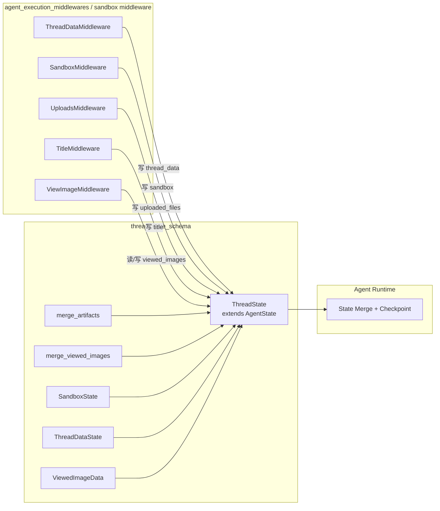
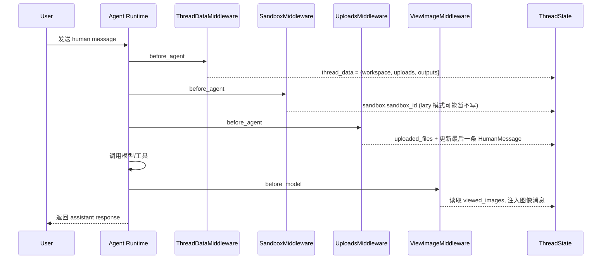
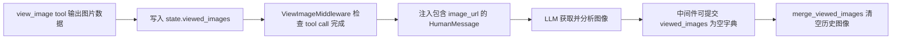

# thread_state_schema 模块文档

## 1. 模块定位与设计动机

`thread_state_schema` 模块定义了 Agent 线程在运行期共享状态的“结构契约（schema）”与关键字段的“合并语义（reducer）”。它本身并不执行工具、模型调用或文件操作，而是约束这些能力在同一条线程中如何读写状态、如何避免互相覆盖，以及在多次增量更新时如何保持结果可预测。

在当前系统中，同一条线程会被多个 middleware 共同处理：例如 `ThreadDataMiddleware` 负责注入线程目录路径，`SandboxMiddleware` 负责注入沙箱标识，`UploadsMiddleware` 会写入上传文件列表并改写消息上下文，`ViewImageMiddleware` 会消费并注入 `viewed_images`。如果缺少统一状态模型，最常见的问题就是字段名漂移、空值语义不一致、列表去重策略冲突，以及中间件升级后的隐式兼容性破坏。`thread_state_schema` 的价值就在于把这些“隐式约定”固化成“显式类型 + 显式合并规则”。

从模块树看，它位于 `agent_memory_and_thread_context` 域中的 `thread_state_schema` 子模块，是该域内“数据模型层”。业务行为在中间件和 runtime 层发生，而 schema 层保证这些行为落地到统一状态平面并持续可维护。

---

## 2. 源码构成与职责边界

源码位于：`backend/src/agents/thread_state.py`。

核心组件包括：

- `SandboxState`
- `ThreadDataState`
- `ViewedImageData`
- `ThreadState`
- `merge_artifacts`
- `merge_viewed_images`

其中前三者是 `TypedDict` 子结构，`ThreadState` 是顶层状态类型（继承 `AgentState`），两个 `merge_*` 函数作为 reducer 通过 `Annotated` 绑定到字段上，定义“多次更新如何合并”。

该模块的边界很清晰：

1. 只定义状态结构与合并语义；
2. 不持有资源（不创建目录、不分配 sandbox、不发模型请求）；
3. 不负责持久化策略（由上层 checkpointer/runtime 决定）。

---

## 3. 架构关系与系统位置



上图强调了一个关键点：`ThreadState` 不是“中间件之一”，而是所有中间件共享的数据接口。中间件之间并不直接依赖彼此内部实现，它们通过同一个 schema 协作。这样可以把演进压力收敛到数据契约层，降低跨模块耦合。

与其他文档的关系建议：

- 中间件执行细节参见 [agent_execution_middlewares.md](agent_execution_middlewares.md)
- 线程与记忆上下文总览参见 [agent_memory_and_thread_context.md](agent_memory_and_thread_context.md)
- 沙箱运行与生命周期参见 [sandbox_core_runtime.md](sandbox_core_runtime.md)
- 路径与配置来源参见 [application_and_feature_configuration.md](application_and_feature_configuration.md)

---

## 4. 关键数据结构逐项解析

### 4.1 `SandboxState`

```python
class SandboxState(TypedDict):
    sandbox_id: NotRequired[str | None]
```

`SandboxState` 只关注一件事：线程当前绑定哪个 sandbox。`sandbox_id` 采用 `NotRequired[str | None]`，意味着存在三种状态：字段缺失、字段存在但为 `None`、字段存在且为有效字符串。这个设计与 `SandboxMiddleware` 的 lazy/eager 初始化策略天然兼容：在 lazy 模式下，线程开始时可能没有 sandbox id；在工具真正需要执行时才分配。

### 4.2 `ThreadDataState`

```python
class ThreadDataState(TypedDict):
    workspace_path: NotRequired[str | None]
    uploads_path: NotRequired[str | None]
    outputs_path: NotRequired[str | None]
```

该结构为线程级文件空间提供路径上下文。三个字段分别对应工作目录、上传目录、输出目录，通常由 `ThreadDataMiddleware` 基于 `thread_id` 计算并写入。字段允许缺省或 `None`，用于覆盖以下场景：

- lazy 仅计算路径但未创建目录；
- 某轮执行尚未注入 thread_data；
- 运行容错时显式表示“当前不可用”。

### 4.3 `ViewedImageData`

```python
class ViewedImageData(TypedDict):
    base64: str
    mime_type: str
```

它定义单张图片的标准载荷：二进制内容的 base64 表示和 MIME 类型。与前两个子结构不同，这里字段是必填的，因为 `ViewImageMiddleware` 要将其直接拼装成模型可消费的 `image_url` 内容块。如果结构不完整，图像注入就会退化或失败。

### 4.4 `ThreadState`

```python
class ThreadState(AgentState):
    sandbox: NotRequired[SandboxState | None]
    thread_data: NotRequired[ThreadDataState | None]
    title: NotRequired[str | None]
    artifacts: Annotated[list[str], merge_artifacts]
    todos: NotRequired[list | None]
    uploaded_files: NotRequired[list[dict] | None]
    viewed_images: Annotated[dict[str, ViewedImageData], merge_viewed_images]
```

`ThreadState` 是线程扩展状态的聚合定义。字段中最关键的是 `artifacts` 与 `viewed_images`：它们不是普通覆盖，而是绑定 reducer 进行增量合并。其余字段默认按运行时规则覆盖。

`todos` 与 `uploaded_files` 当前类型相对宽松（`list` / `list[dict]`），体现的是“先保证跨模块兼容，再逐步收紧 schema”的策略。维护者在扩展时应优先考虑向后兼容，避免一次性收紧导致旧数据无法读取。

---

## 5. Reducer 语义与内部行为

### 5.1 `merge_artifacts(existing, new)`

```python
def merge_artifacts(existing: list[str] | None, new: list[str] | None) -> list[str]:
    if existing is None:
        return new or []
    if new is None:
        return existing
    return list(dict.fromkeys(existing + new))
```

它的行为是“追加 + 去重 + 保序”。具体来说，当 `existing` 为空时返回 `new`（若 `new` 也为空则回退 `[]`）；当 `new is None` 时保持现状不变；两者都存在时，先拼接再通过 `dict.fromkeys` 去重，保留首次出现顺序。这种策略非常适合多轮工具产物累积：既不会因为重复上报而膨胀列表，也不破坏产物出现顺序。

### 5.2 `merge_viewed_images(existing, new)`

```python
def merge_viewed_images(existing, new):
    if existing is None:
        return new or {}
    if new is None:
        return existing
    if len(new) == 0:
        return {}
    return {**existing, **new}
```

该 reducer 的关键特性是“可显式清空”。一般情况下它执行字典浅合并，后写覆盖同 key 值；但 `new == {}` 被定义为**清空命令**，不是“无变化”。这使中间件可以在图像注入后主动回收状态，避免下一轮继续携带历史图像导致 token 浪费或语义污染。

---

## 6. 典型执行流程与状态演进



流程上的本质是“多 middleware 对同一个 schema 做增量更新”。只要 schema 稳定，middleware 可以独立演进；如果 schema 语义变化（尤其 reducer），则会立即影响多个链路。

再看图像状态闭环：



该闭环依赖 reducer 的特殊语义；如果把 `{}` 当成 no-op，会导致历史图像反复注入。

---

## 7. 使用示例

### 7.1 初始化线程状态

```python
from backend.src.agents.thread_state import ThreadState

state: ThreadState = {
    "messages": [],
    "artifacts": [],
    "viewed_images": {},
    "thread_data": {
        "workspace_path": "/data/threads/t-001/user-data/workspace",
        "uploads_path": "/data/threads/t-001/user-data/uploads",
        "outputs_path": "/data/threads/t-001/user-data/outputs",
    },
    "sandbox": {"sandbox_id": "sbx_abc123"},
}
```

### 7.2 artifacts 增量合并

```python
update_1 = {"artifacts": ["report.md", "chart.png"]}
update_2 = {"artifacts": ["chart.png", "summary.csv"]}
# 合并结果语义: ["report.md", "chart.png", "summary.csv"]
```

### 7.3 viewed_images 覆盖与清空

```python
# 追加 / 覆盖
update_a = {
    "viewed_images": {
        "/mnt/user-data/workspace/a.png": {
            "base64": "...",
            "mime_type": "image/png",
        }
    }
}

# 显式清空（非常关键）
update_clear = {"viewed_images": {}}
```

如果你希望“不改动 viewed_images”，请返回 `None` 或不带该字段；不要误传空字典。

---

## 8. 扩展与演进指南

扩展 `ThreadState` 时建议遵循“先定义语义，再定义类型，再接 middleware”的顺序。实践上可以按以下步骤推进：

1. 在 `ThreadState` 中新增字段，并明确缺省语义（缺失、`None`、空容器是否等价）。
2. 若字段需要增量累积或特殊清理逻辑，使用 `Annotated[T, reducer]` 定义 reducer。
3. 在对应 middleware 的 `...State` 中声明兼容字段，让类型检查和 IDE 提示同步生效。
4. 为新 reducer 增加最小回归测试：`existing=None`、`new=None`、重复写入、显式清空。

下面是一个示意扩展（例如新增 `context_tags`）：

```python
from typing import Annotated

def merge_tags(existing: list[str] | None, new: list[str] | None) -> list[str]:
    if existing is None:
        return new or []
    if new is None:
        return existing
    return list(dict.fromkeys(existing + new))

class ThreadState(AgentState):
    # ...existing fields
    context_tags: Annotated[list[str], merge_tags]
```

---

## 9. 边界条件、错误模式与限制

`thread_state_schema` 作为类型契约层，本身不主动抛业务异常，但它的语义会放大或收敛上层错误。最常见的风险点如下：

- `NotRequired` 字段不能被当作必定存在。读取时应使用 `state.get("...")`，否则在 lazy 初始化链路中容易出现 `KeyError` 或 `TypeError`。
- `merge_viewed_images` 中 `new is None` 与 `new == {}` 语义完全不同：前者保留现状，后者清空。误用会导致“图片丢失”或“图片重复注入”。
- `merge_artifacts` 只做字符串级去重，不做路径规范化。`a/../b.txt` 与 `b.txt` 会被视为两个不同条目。
- `uploaded_files`、`todos` 的元素结构约束较弱，跨模块传递时建议在生产者侧做 schema 校验。
- `viewed_images` 可能携带大量 base64 数据；若不及时清理，会显著增加状态体积和模型 token 成本。

此外，与中间件交互时要注意上游错误条件：例如 `ThreadDataMiddleware` 在缺失 `thread_id` 时会抛 `ValueError`，`SandboxMiddleware` 也依赖 `thread_id` 才能分配资源。这些错误虽然不在本模块内产生，但都会表现为状态字段未被正确写入。

---

## 10. 与周边模块的协作视角

从“系统拼图”角度看，`thread_state_schema` 可以理解为 agent 线程的共享内存协议：

- 它为 `agent_execution_middlewares` 提供统一写入面，详见 [agent_execution_middlewares.md](agent_execution_middlewares.md)。
- 它承接 `memory_pipeline` 所依赖的会话状态基础，但不直接处理记忆抽取，详见 [memory_pipeline.md](memory_pipeline.md)。
- 它与 sandbox 运行时通过 `sandbox` 与 `thread_data` 字段间接耦合，详见 [sandbox_core_runtime.md](sandbox_core_runtime.md) 与 [sandbox_aio_community_backend.md](sandbox_aio_community_backend.md)。
- 在前端层，线程状态最终会映射到线程域类型（如 `AgentThreadState`），可结合 [frontend_core_domain_types_and_state.md](frontend_core_domain_types_and_state.md) 理解端到端状态表达。

---

## 11. 维护建议

维护本模块的第一原则是“语义稳定优先于字段扩张”。特别是 reducer 行为一旦变更，往往会同时影响多个 middleware 的状态融合结果。建议在每次 schema 修改后至少回归以下场景：初始化缺省、增量覆盖、重复去重、空值分支、显式清空，以及与 lazy middleware 组合时的读写安全性。这样可以在不牺牲演进速度的前提下，持续保障线程状态的一致性和可解释性。

