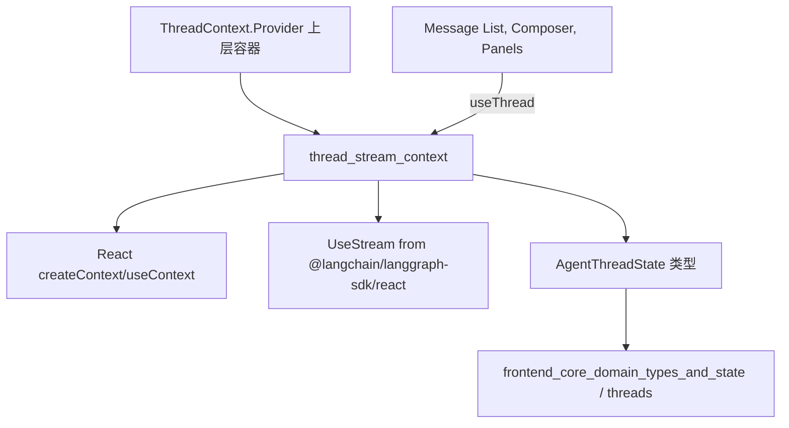
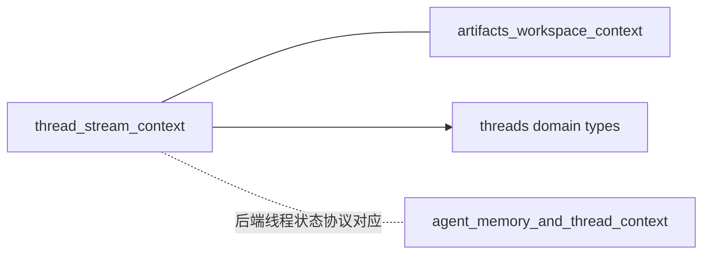
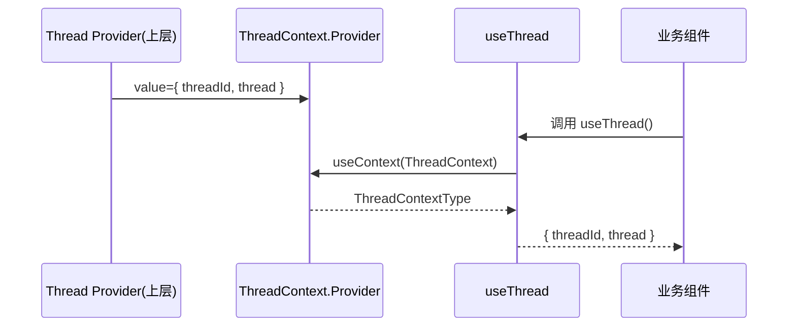
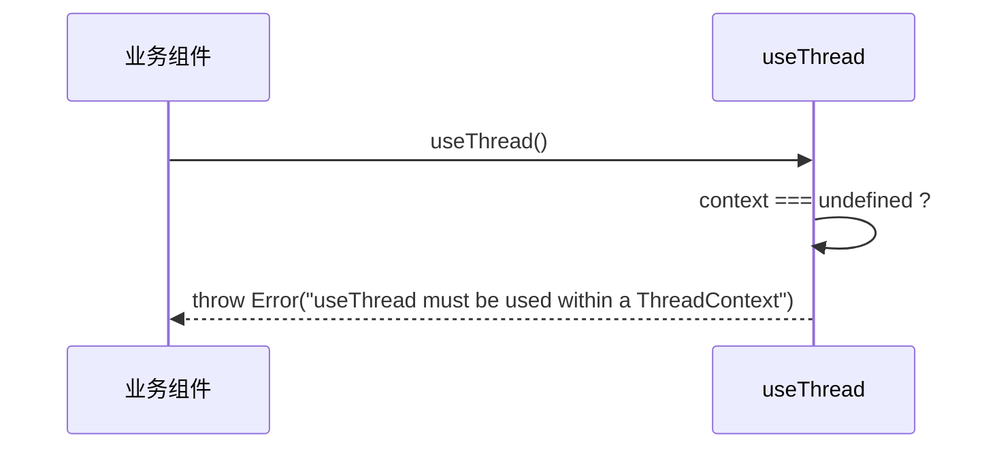

# thread_stream_context 模块文档

## 模块简介

`thread_stream_context` 是工作区消息子系统中的一个极简但关键的状态分发模块，对应代码位于 `frontend/src/components/workspace/messages/context.ts`。它的核心职责不是“管理消息逻辑”，而是为消息工作区中的任意后代组件提供统一的线程运行时入口：`threadId`（线程标识）和 `thread`（基于 `UseStream<AgentThreadState>` 的流式线程状态）。

这个模块存在的意义在于把“线程状态来源”与“线程状态消费”解耦。上层容器负责创建和维护流式连接（例如由 `@langchain/langgraph-sdk/react` 提供的 `useStream` 结果），而下层组件只需通过 `useThread()` 获取上下文即可，不需要每层手动透传 props，也不需要重复处理线程实例注入。对于复杂的消息界面（消息列表、输入框、工具调用面板、状态条、工件联动组件并存）而言，这种解耦能显著降低组件耦合度并减少状态漂移风险。

从模块树角度看，它是 `frontend_workspace_contexts` 下的 `thread_stream_context (current module)`，并依赖 `frontend_core_domain_types_and_state` 中的 `AgentThreadState` 类型契约。关于整个工作区上下文的宏观设计可参考 [frontend_workspace_contexts.md](./frontend_workspace_contexts.md)，关于线程类型本身可参考 [threads.md](./threads.md) 与 [frontend_core_domain_types_and_state.md](./frontend_core_domain_types_and_state.md)。

---

## 核心组件与内部实现

### `ThreadContextType`

`ThreadContextType` 是该模块的公共契约，定义了 Provider 必须提供的最小上下文面。

```ts
export interface ThreadContextType {
  threadId: string;
  thread: UseStream<AgentThreadState>;
}
```

在语义上，`threadId` 解决“当前在看哪条会话”的定位问题，`thread` 解决“这条会话现在是什么状态、如何继续交互”的运行时访问问题。它们被绑定在一个上下文对象中，确保消费者不会拿到“ID 与流实例不一致”的碎片化数据。

参数与返回值方面，该接口本身不定义函数，因此不存在调用参数；但它约束了 Provider value 的结构，并间接约束所有消费者的读取方式。副作用层面，任何 `thread` 对象内部状态变化都会触发依赖该上下文的组件重渲染（取决于 React 渲染边界与组件优化策略）。

### `ThreadContext`

`ThreadContext` 通过 `createContext<ThreadContextType | undefined>(undefined)` 创建：

```ts
export const ThreadContext = createContext<ThreadContextType | undefined>(
  undefined,
);
```

这里把默认值设为 `undefined` 是一个有意的防御式设计。它不会在“忘记挂 Provider”时给出伪默认值，而是把错误暴露给调用链，由 `useThread` 统一抛出明确异常。这种做法比提供空对象更安全，因为空对象会把错误延迟到业务逻辑深处，导致更难排查。

### `useThread()`

`useThread` 是唯一官方访问入口：

```ts
export function useThread() {
  const context = useContext(ThreadContext);
  if (context === undefined) {
    throw new Error("useThread must be used within a ThreadContext");
  }
  return context;
}
```

它的执行流程非常直接：读取上下文、判空、返回。虽然实现短小，但在工程上承担了两项重要职责：第一，统一了错误信息，避免各业务组件重复写判空分支；第二，通过 TypeScript 缩窄类型，使调用端拿到的始终是 `ThreadContextType`，不需要额外可选链判断。

---

## 架构与依赖关系

### 静态依赖结构



该结构说明该模块本质上是一个“契约+访问器”层，不负责创建流对象，也不负责线程生命周期持久化。它位于状态生产者（上层 Provider 容器）与状态消费者（消息 UI 子组件）之间，扮演稳定桥接层。

### 与邻近模块的关系



在工作区页面中，`thread_stream_context` 常与 `artifacts_workspace_context` 并行使用：前者提供线程流状态，后者提供工件 UI 状态。二者职责互补但不交叉，避免了“线程业务逻辑污染工件展示状态”或反向耦合。

---

## 运行时数据流与交互流程

### 正常路径：Provider 注入与消费



这个流程的关键点在于：消费者组件从不关心 `thread` 如何创建，只关心如何读取并使用，从而让流实现可以在上层替换或扩展（例如接入不同模型通道、不同线程源）。

### 异常路径：Provider 缺失



该异常是设计期望行为，不是 bug。它能在开发阶段立即暴露装配错误，避免出现“页面局部功能静默失效”的灰色故障。

---

## 使用指南

在实际项目中，推荐在“线程页根节点”或“workspace 消息根容器”挂载 `ThreadContext.Provider`，保证消息区域的所有子组件共享同一线程流实例。

```tsx
import { ThreadContext } from "@/components/workspace/messages/context";
import { useStream } from "@langchain/langgraph-sdk/react";
import type { AgentThreadState } from "@/core/threads";

export function ThreadPage({ threadId }: { threadId: string }) {
  const thread = useStream<AgentThreadState>({
    // 具体参数按你项目中的 SDK 封装填写
    // assistantId / apiUrl / threadId ...
    threadId,
  });

  return (
    <ThreadContext.Provider value={{ threadId, thread }}>
      <MessageWorkspace />
    </ThreadContext.Provider>
  );
}
```

消费端写法应保持简洁，把读取与业务逻辑分开：

```tsx
import { useThread } from "@/components/workspace/messages/context";

export function ThreadHeader() {
  const { threadId, thread } = useThread();
  return (
    <header>
      <span>Thread: {threadId}</span>
      <span>Status: {String(thread.status ?? "unknown")}</span>
    </header>
  );
}
```

如果需要构建更强约束，可在应用层再封装一个 `ThreadProvider` 组件，把 `ThreadContext.Provider` 和 `useStream` 初始化细节藏起来，减少重复代码并统一错误处理策略。

---

## 可扩展性与演进建议

该模块当前设计非常轻量，适合作为稳定底座。若未来需要扩展，建议优先保持向后兼容并避免破坏现有消费者：

- 可以新增字段（例如 `isRestoring`, `connectionState`），但不要改变 `threadId/thread` 的含义。
- 若新增操作函数（例如 `resetThreadView`），建议通过新 Hook（如 `useThreadActions`）提供，避免让只读组件因上下文 value 对象变化而频繁重渲染。
- 如果线程上下文更新频繁且消费组件很多，可考虑拆分 context（ID 与 stream 分离）或引入 selector 模式优化渲染颗粒度。

---

## 边界条件、错误与限制

该模块本身逻辑简单，但在真实工程里有几个高频“坑位”：

- **Provider 装配顺序错误**：在 Provider 外调用 `useThread` 会稳定抛错。这通常发生在布局重构、条件渲染或单元测试忘记包裹时。
- **`threadId` 与 `thread` 不匹配**：如果上层在切换线程时只更新了其中一个字段，会造成 UI 展示与流状态不一致。应保证它们来自同一切换事务。
- **流对象初始空态**：`UseStream` 常有初始化阶段，消费者应处理 `messages`、`status` 等字段尚未可用的状态，而不是假设数据始终完整。
- **重渲染传播**：Context value 变化会影响所有消费者。高频流更新场景下应在消费侧做好 memoization 或拆分组件。

此外，该模块没有内建持久化、重连、并发冲突解决机制；这些属于上层线程管理策略范畴，不在本模块职责内。

---

## 测试与调试建议

最小测试集建议覆盖两类场景：一类是“正常读取上下文”，确保 `useThread` 返回值类型与内容符合预期；另一类是“Provider 缺失抛错”，确保错误信息稳定，避免回归破坏开发者体验。

在调试时，可先检查三件事：Provider 是否包裹到目标组件、`threadId` 是否随路由/会话正确更新、`thread` 是否来自当前线程而非旧引用。多数上下文相关问题都能通过这三个检查快速定位。

---

## 相关文档

- 工作区上下文总览：[`frontend_workspace_contexts.md`](./frontend_workspace_contexts.md)
- 线程类型契约：[`threads.md`](./threads.md)
- 前端核心领域类型：[`frontend_core_domain_types_and_state.md`](./frontend_core_domain_types_and_state.md)
- 工件上下文（常与本模块配合）：[`artifacts_workspace_context.md`](./artifacts_workspace_context.md)
- 后端线程与记忆上下文（端到端视角）：[`agent_memory_and_thread_context.md`](./agent_memory_and_thread_context.md)
