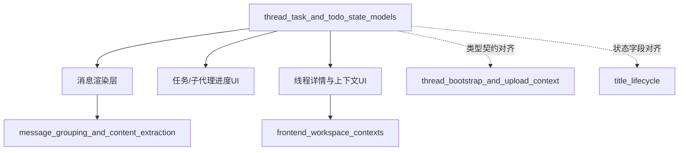
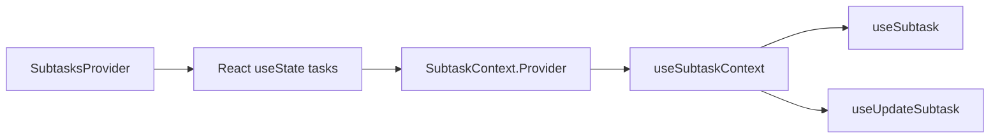
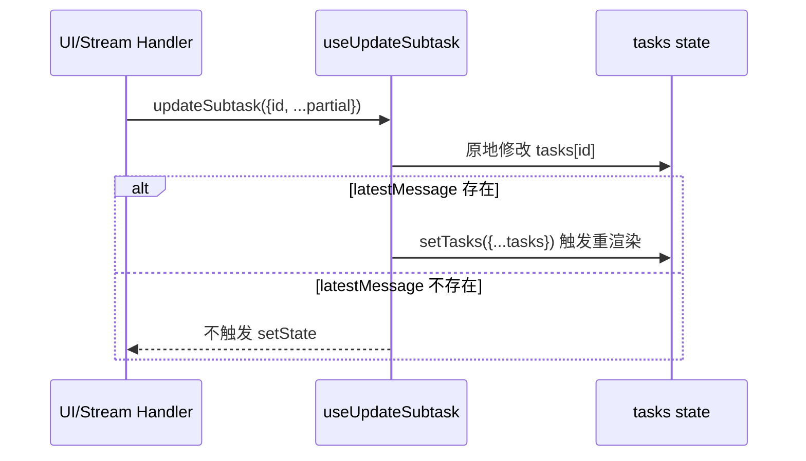
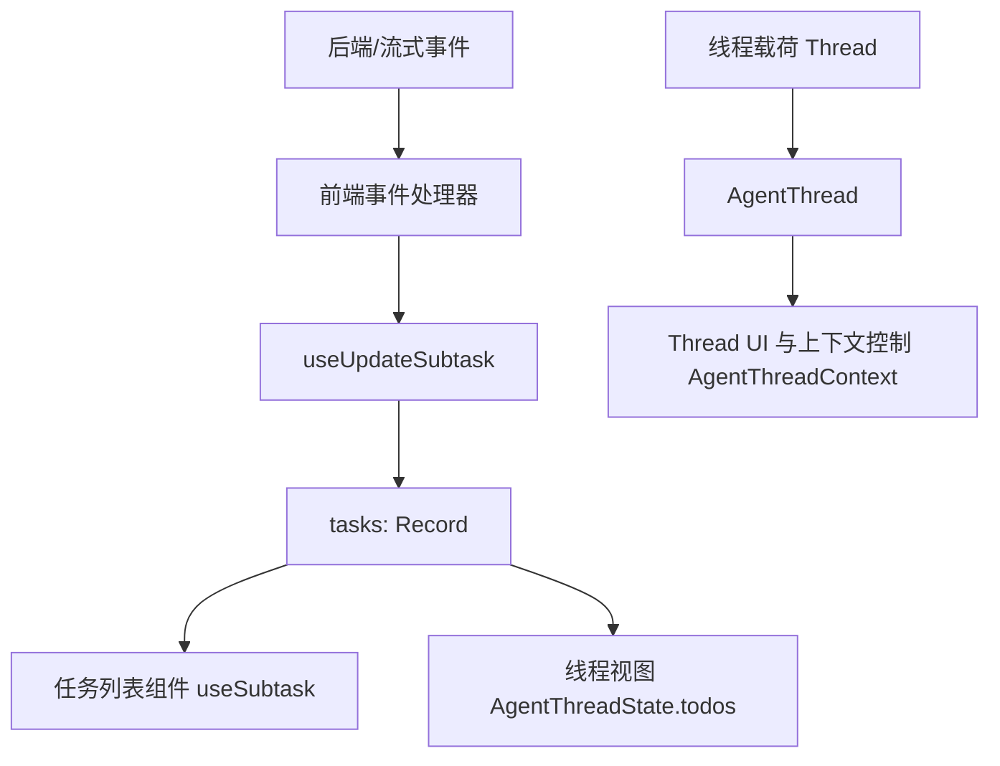

# thread_task_and_todo_state_models 模块文档

## 1. 模块概述

`thread_task_and_todo_state_models` 是前端核心领域模型中的“会话线程（thread）—子任务（subtask）—待办（todo）”状态定义层。它的职责并不是执行业务逻辑，而是提供一组稳定、可组合的 TypeScript 类型与 React Context 机制，让消息线程状态、子代理执行进度、以及计划/待办列表在 UI 层与调用层之间以统一结构流动。

从设计上看，这个模块被有意保持“轻量且靠近类型系统”：

- 在 `frontend/src/core/threads/types.ts` 中定义线程状态和线程上下文契约；
- 在 `frontend/src/core/tasks/types.ts` 中定义子任务数据模型；
- 在 `frontend/src/core/todos/types.ts` 中定义最小 Todo 数据结构；
- 在 `frontend/src/core/tasks/context.tsx` 中提供 React Context + Hook，承载子任务运行态缓存与更新入口。

这种拆分让模块既能作为“领域语言”被全局复用，也能在复杂 Agent 交互时维持前端状态表达的一致性。与其把任务、线程、todo 分散在组件局部状态中，这里将其收敛为核心类型，从而降低跨页面/跨组件沟通成本。

---

## 2. 模块在系统中的位置

该模块属于 `frontend_core_domain_types_and_state` 下的子模块，主要服务于消息展示、任务面板、线程详情与执行过程可视化。它通常与以下文档对应模块协作：

- 消息分组与解析：见 [message_grouping_and_content_extraction.md](message_grouping_and_content_extraction.md)
- 工作区线程上下文：见 [frontend_workspace_contexts.md](frontend_workspace_contexts.md)
- 线程引导与上传上下文（后端中间件）：见 [thread_bootstrap_and_upload_context.md](thread_bootstrap_and_upload_context.md)
- 标题生命周期（后端线程标题生成）：见 [title_lifecycle.md](title_lifecycle.md)



上图说明该模块位于前端领域层核心位置：它既向上支持 UI 组件，也向下对齐后端线程状态载荷字段，起到“前后端语义中介”的作用。

---

## 3. 核心组件详解

## 3.1 `Subtask`（`frontend/src/core/tasks/types.ts`）

`Subtask` 描述一个子代理任务的完整生命周期信息，是任务面板和执行追踪 UI 的基本单元。字段本身非常直接，但组合后能表达“任务定义、执行状态、最新增量消息、最终结果与错误”的闭环。

```typescript
export interface Subtask {
  id: string;
  status: "in_progress" | "completed" | "failed";
  subagent_type: string;
  description: string;
  latestMessage?: AIMessage;
  prompt: string;
  result?: string;
  error?: string;
}
```

关键字段语义：

- `id`: 子任务唯一标识，通常用于字典索引和增量更新。
- `status`: 任务状态机，当前为三态：进行中/完成/失败。
- `subagent_type`: 任务由哪类 subagent 执行。
- `description`: 面向用户的任务说明。
- `latestMessage`: 与子任务关联的最新 `AIMessage`（常用于流式进度展示）。
- `prompt`: 发给子代理的任务指令。
- `result`: 成功时结果摘要或内容。
- `error`: 失败时错误信息。

该模型的设计重点在于兼容“流式更新 + 最终收敛”。`latestMessage` 用于中间态，`result/error` 用于终态，`status` 作为 UI 判断入口。

---

## 3.2 `Todo`（`frontend/src/core/todos/types.ts`）

`Todo` 是一个极简待办模型，通常挂载在线程状态中用于计划模式（plan mode）或步骤执行显示。

```typescript
export interface Todo {
  content?: string;
  status?: "pending" | "in_progress" | "completed";
}
```

它的“全可选字段”设计虽然灵活，但也意味着消费方必须做好空值防御。模块本身不约束 Todo 的唯一 ID，也不内建排序规则，因此上层组件通常需要结合数组顺序或外部生成键来渲染列表。

---

## 3.3 `AgentThreadState` / `AgentThread` / `AgentThreadContext`（`frontend/src/core/threads/types.ts`）

线程类型定义了前端对 LangGraph 线程对象的本地语义扩展。

```typescript
export interface AgentThreadState extends Record<string, unknown> {
  title: string;
  messages: BaseMessage[];
  artifacts: string[];
  todos?: Todo[];
}

export interface AgentThread extends Thread<AgentThreadState> {}

export interface AgentThreadContext extends Record<string, unknown> {
  thread_id: string;
  model_name: string | undefined;
  thinking_enabled: boolean;
  is_plan_mode: boolean;
  subagent_enabled: boolean;
}
```

`AgentThreadState` 关注线程“内部状态快照”，而 `AgentThreadContext` 关注线程“运行参数”。两者分离是合理的：状态用于展示与回放，上下文用于控制行为。

`AgentThread` 通过 `Thread<AgentThreadState>` 将 LangGraph SDK 的通用线程对象绑定为前端可预期的强类型线程对象。这样既复用 SDK 能力，也避免项目中出现大量 `any` 转换。

---

## 3.4 `SubtaskContextValue` 与 `SubtasksProvider`（`frontend/src/core/tasks/context.tsx`）

`SubtaskContextValue` 定义 Context 暴露面：任务字典 `tasks` 与覆盖式写入函数 `setTasks`。

```typescript
export interface SubtaskContextValue {
  tasks: Record<string, Subtask>;
  setTasks: (tasks: Record<string, Subtask>) => void;
}
```

`SubtasksProvider` 内部以 `useState<Record<string, Subtask>>({})` 维护任务映射，并通过 Context 向子树共享。



这个设计的核心价值是“以 `id -> Subtask` 字典做 O(1) 读取”，非常适合高频增量更新场景。

---

## 3.5 Hooks：`useSubtaskContext`、`useSubtask`、`useUpdateSubtask`

### `useSubtaskContext()`

该 Hook 读取 Context 并返回整个任务容器。代码中包含“未在 Provider 内使用时报错”的防御分支，但当前实现里 `createContext` 已提供默认值，因此 `context` 实际不会是 `undefined`。这意味着该错误分支在现状下不可触发。

### `useSubtask(id: string)`

该 Hook 做单任务读取封装，返回 `tasks[id]`。它简化了调用方代码，使组件不必直接接触整个 `tasks` map。

### `useUpdateSubtask()`

这是本模块最关键、也是最需要注意行为细节的函数。其逻辑如下：

1. 获取 `tasks` 与 `setTasks`；
2. 通过 `task.id` 合并写入：`tasks[task.id] = { ...tasks[task.id], ...task }`；
3. **仅当 `task.latestMessage` 存在时** 才触发 `setTasks({ ...tasks })`。



这个“条件触发重渲染”的策略可能是为了降低渲染频率，但也带来明显副作用：如果更新的是 `status/result/error` 且未携带 `latestMessage`，React 可能不会重渲染，导致 UI 停留旧值。

---

## 4. 关键设计关系与数据流



该数据流反映三个层次：

- 子任务增量流（`Subtask` + Context）
- 线程主状态流（`AgentThreadState`）
- 行为开关流（`AgentThreadContext`）

三者共同构成“对话执行面板”的状态基础。

---

## 5. 使用方式与示例

### 5.1 在应用根部注入 `SubtasksProvider`

```tsx
import { SubtasksProvider } from "@/core/tasks/context";

export function AppShell() {
  return (
    <SubtasksProvider>
      <Workspace />
    </SubtasksProvider>
  );
}
```

### 5.2 在任务卡片中读取单个任务

```tsx
import { useSubtask } from "@/core/tasks/context";

export function SubtaskCard({ id }: { id: string }) {
  const task = useSubtask(id);
  if (!task) return null;

  return (
    <div>
      <h4>{task.description}</h4>
      <p>Status: {task.status}</p>
      {task.result && <pre>{task.result}</pre>}
      {task.error && <pre style={{ color: "red" }}>{task.error}</pre>}
    </div>
  );
}
```

### 5.3 流式更新子任务

```tsx
import { useUpdateSubtask } from "@/core/tasks/context";

function useSubtaskStreamHandler() {
  const updateSubtask = useUpdateSubtask();

  function onDelta(delta: { id: string; text: string }) {
    updateSubtask({
      id: delta.id,
      latestMessage: {
        type: "ai",
        content: delta.text,
      } as any,
      status: "in_progress",
    });
  }

  function onDone(id: string, result: string) {
    updateSubtask({
      id,
      status: "completed",
      result,
      // 注意：当前实现若不带 latestMessage，可能不触发重渲染
    });
  }

  return { onDelta, onDone };
}
```

---

## 6. 可扩展点与演进建议

该模块已形成清晰边界，但存在可维护性提升空间。

首先，`Todo` 建议补充稳定主键（如 `id`）与必填状态字段，减少渲染层的临时键策略和空值分支。其次，`Subtask.status` 可考虑引入更完整状态机（例如 `queued`、`cancelled`），便于表达并发和中断语义。最后，`AgentThreadContext` 当前使用多个布尔开关，若后续策略组合增多，可演进为离散模式枚举，降低非法组合概率。

对于 `useUpdateSubtask`，建议改为不可变更新并始终触发状态提交，例如：

```typescript
setTasks((prev) => ({
  ...prev,
  [task.id]: { ...prev[task.id], ...task } as Subtask,
}));
```

这种写法可避免原地变更、陈旧闭包和条件渲染遗漏问题。

---

## 7. 边界条件、错误条件与已知限制

### 7.1 Context 默认值掩盖 Provider 缺失

由于 `createContext` 传入了默认对象，即使未挂载 `SubtasksProvider`，`useSubtaskContext()` 也能返回默认值，因此当前 `undefined` 检查不会真正保护调用方。结果是错误会“静默失败”为 no-op，排障成本更高。

### 7.2 `useUpdateSubtask` 的原地修改风险

`tasks[task.id] = ...` 是可变写法；若多个更新近乎同时到达，可能出现覆盖顺序不稳定的问题。尤其在 React 并发渲染语义下，推荐函数式 `setState` 保证基于最新快照。

### 7.3 仅 `latestMessage` 触发重渲染

这是当前实现最大的行为陷阱。更新 `status/result/error/prompt` 时若未附带 `latestMessage`，UI 可能不刷新。该行为会让“完成态”或“失败态”展示延迟甚至丢失。

### 7.4 `Todo` 字段全可选带来的数据质量问题

`content` 与 `status` 都可缺省，意味着后端或中间层传入不完整数据时，前端需要大量兜底逻辑。若计划模式是核心能力，建议逐步收紧类型约束。

---

## 8. 与相邻模块的协作建议

在实现线程页面时，建议将本模块作为“状态契约中心”，并与以下模块分层配合：

- 消息解析与分组交由 [message_grouping_and_content_extraction.md](message_grouping_and_content_extraction.md)
- 工作区级上下文（线程切换、消息总线）交由 [frontend_workspace_contexts.md](frontend_workspace_contexts.md)
- 后端线程初始化与上传上下文逻辑参考 [thread_bootstrap_and_upload_context.md](thread_bootstrap_and_upload_context.md)

这样可以避免在本模块堆叠业务逻辑，保持其“模型+状态容器”的纯净定位。

---

## 9. 总结

`thread_task_and_todo_state_models` 的价值在于把线程状态、子任务执行、待办计划这三类高频数据统一为前端可复用契约，并提供了最小但实用的子任务 Context 能力。它适合做系统的“状态地基层”。

当前实现已经能支撑基础场景，但在 `useUpdateSubtask` 的更新策略、Context 使用防呆以及 Todo 类型约束上仍有改进空间。若你要在此模块上扩展功能，优先保证“不可变更新 + 明确状态机 + 强类型约束”，可以显著提升可预测性和维护性。
