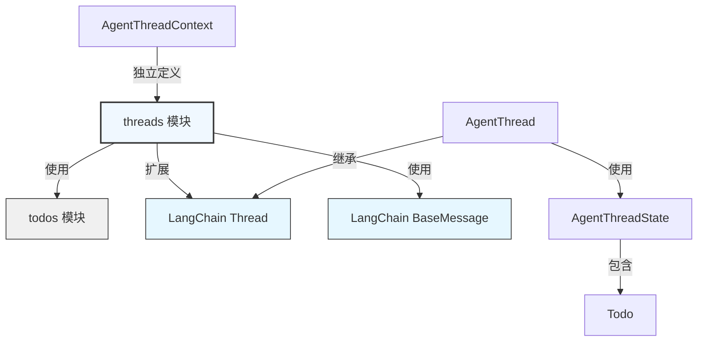
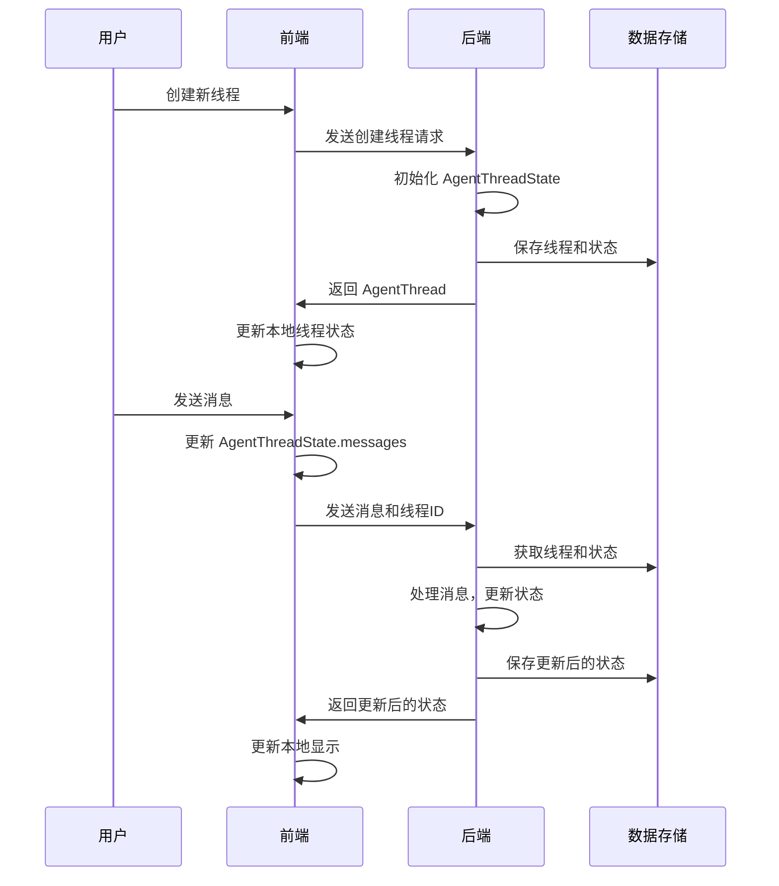

# Threads 模块文档

## 1. 概述

Threads 模块是整个 Agent 应用系统的核心状态管理和交互上下文模块。它负责定义线程（AgentThread）的类型结构、线程状态（AgentThreadState）以及线程上下文（AgentThreadContext），为 Agent 的会话、任务执行和记忆管理提供基础支持。

本模块的核心目的是提供一套完整的类型系统，用于表示和管理 Agent 与用户之间的会话线程、线程状态以及执行上下文，确保前后端交互的一致性和类型安全。

## 2. 核心组件详解

### 2.1 AgentThreadState

**定义位置：** `frontend/src/core/threads/types.ts`

```typescript
export interface AgentThreadState extends Record<string, unknown> {
  title: string;
  messages: BaseMessage[];
  artifacts: string[];
  todos?: Todo[];
}
```

#### 功能说明
AgentThreadState 是线程状态的核心接口，它继承自 `Record<string, unknown>` 以允许扩展自定义属性，同时定义了线程状态的必要字段。这个接口表示了一个线程在任何给定时间点的完整状态，包括标题、消息列表、工件列表和待办事项列表。

#### 属性详解

| 属性 | 类型 | 必填 | 说明 |
|------|------|------|------|
| title | string | 是 | 线程的标题，用于标识和区分不同的线程 |
| messages | BaseMessage[] | 是 | 线程中的消息列表，每个消息可以是用户消息、助手消息、工具调用等 |
| artifacts | string[] | 是 | 线程中生成的工件列表，通常是文件路径或工件标识符 |
| todos | Todo[] | 否 | 线程中的待办事项列表，表示需要完成的任务 |

#### 使用场景
- 线程状态的序列化和反序列化
- 线程状态的存储和恢复
- 状态变更的跟踪和管理
- 线程状态的类型检查和验证

### 2.2 AgentThread

**定义位置：** `frontend/src/core/threads/types.ts`

```typescript
export interface AgentThread extends Thread<AgentThreadState> {}
```

#### 功能说明
AgentThread 是线程的核心接口，它通过泛型参数扩展了 LangChain 的 Thread 类型，并将 AgentThreadState 作为其状态类型。这个接口表示了一个完整的 Agent 会话线程，包括线程的元数据和状态。

#### 继承关系
AgentThread 继承自 `Thread<AgentThreadState>`，其中 Thread 是 LangChain Graph SDK 提供的基础线程类型。这意味着 AgentThread 具有 Thread 类型的所有属性和功能，同时结合了 AgentThreadState 定义的状态结构。

#### 使用场景
- 线程的创建、获取、更新和删除
- 线程元数据的管理
- 线程状态的访问和修改
- 线程列表的展示和管理

### 2.3 AgentThreadContext

**定义位置：** `frontend/src/core/threads/types.ts`

```typescript
export interface AgentThreadContext extends Record<string, unknown> {
  thread_id: string;
  model_name: string | undefined;
  thinking_enabled: boolean;
  is_plan_mode: boolean;
  subagent_enabled: boolean;
}
```

#### 功能说明
AgentThreadContext 是线程执行上下文的核心接口，它继承自 `Record<string, unknown>` 以允许扩展自定义属性，同时定义了线程执行上下文的必要字段。这个接口表示了线程执行时的环境和配置信息，影响 Agent 的行为和决策。

#### 属性详解

| 属性 | 类型 | 必填 | 说明 |
|------|------|------|------|
| thread_id | string | 是 | 线程的唯一标识符，用于在系统中定位和操作线程 |
| model_name | string \| undefined | 是 | 线程使用的模型名称，决定了 Agent 的推理能力 |
| thinking_enabled | boolean | 是 | 标识是否启用思考模式，影响 Agent 的响应深度 |
| is_plan_mode | boolean | 是 | 标识是否处于计划模式，影响 Agent 的执行策略 |
| subagent_enabled | boolean | 是 | 标识是否启用子代理，影响 Agent 的任务分解能力 |

#### 使用场景
- 线程执行配置的传递和管理
- Agent 行为的动态调整
- 线程执行环境的标识和跟踪
- 上下文相关的决策和处理

## 3. 架构与关系

### 3.1 模块依赖关系图



### 3.2 组件关系说明

Threads 模块与其他模块的关系主要体现在以下几个方面：

1. **与 todos 模块的关系**：AgentThreadState 包含了 Todo 类型的可选属性，使线程能够管理相关的待办事项。

2. **与 LangChain 生态的关系**：
   - AgentThread 扩展了 LangChain Graph SDK 的 Thread 类型
   - AgentThreadState 使用了 LangChain Core 的 BaseMessage 类型来表示消息列表

3. **内部组件关系**：
   - AgentThread 使用 AgentThreadState 作为其状态类型
   - AgentThreadContext 提供线程执行的上下文信息，与 AgentThread 配合使用

## 4. 数据流程与状态管理

### 4.1 线程状态生命周期



### 4.2 状态变更流程

线程状态的变更是一个有序的过程，通常遵循以下步骤：

1. **初始化**：创建新线程时，初始化 AgentThreadState，设置标题、空消息列表和空工件列表
2. **消息添加**：用户或助手发送消息时，将消息添加到 messages 数组
3. **工件生成**：Agent 生成工件时，将工件标识符添加到 artifacts 数组
4. **待办事项管理**：根据需要添加、更新或删除 todos 数组中的待办事项
5. **状态持久化**：定期或在关键操作后将状态保存到存储系统

## 5. 实践指南

### 5.1 创建和使用 AgentThreadState

```typescript
import { AgentThreadState } from 'frontend/src/core/threads/types';
import { HumanMessage, AIMessage } from '@langchain/core/messages';
import { Todo } from 'frontend/src/core/todos/types';

// 创建一个新的线程状态
const initialState: AgentThreadState = {
  title: '新的对话',
  messages: [],
  artifacts: [],
  todos: []
};

// 添加用户消息
initialState.messages.push(new HumanMessage('你好，请帮我写一个Python脚本'));

// 添加助手消息
initialState.messages.push(new AIMessage('好的，我来帮您写一个Python脚本。'));

// 添加工件
initialState.artifacts.push('file:///workspace/script.py');

// 添加待办事项
const newTodo: Todo = {
  content: '测试Python脚本',
  status: 'pending'
};
initialState.todos?.push(newTodo);
```

### 5.2 创建和使用 AgentThreadContext

```typescript
import { AgentThreadContext } from 'frontend/src/core/threads/types';

// 创建线程上下文
const threadContext: AgentThreadContext = {
  thread_id: 'thread_123456',
  model_name: 'gpt-4',
  thinking_enabled: true,
  is_plan_mode: false,
  subagent_enabled: true
};

// 使用上下文配置Agent行为
function configureAgent(context: AgentThreadContext) {
  if (context.thinking_enabled) {
    console.log('启用深度思考模式');
  }
  
  if (context.subagent_enabled) {
    console.log('启用子代理功能');
  }
  
  console.log(`使用模型: ${context.model_name || '默认模型'}`);
}

configureAgent(threadContext);
```

## 6. 注意事项与限制

### 6.1 性能考虑

1. **消息列表大小**：当 messages 数组变得非常大时，可能会影响性能。建议实现消息历史的分页或截断机制。

2. **状态序列化**：AgentThreadState 需要频繁序列化和反序列化，应避免在状态中存储过大或复杂的对象。

3. **状态更新频率**：频繁的状态更新可能导致性能问题，建议实现状态批量更新或节流机制。

### 6.2 数据一致性

1. **线程ID唯一性**：确保 thread_id 在整个系统中是唯一的，避免线程冲突。

2. **状态同步**：在分布式环境中，需要注意线程状态的同步问题，避免并发修改导致的数据不一致。

3. **扩展属性**：由于 AgentThreadState 和 AgentThreadContext 都继承自 Record<string, unknown>，添加自定义属性时应注意命名空间，避免与未来版本的属性冲突。

### 6.3 错误处理

1. **状态验证**：在使用线程状态前，应进行必要的验证，确保所有必填字段都存在且类型正确。

2. **异常恢复**：实现状态的备份和恢复机制，以便在发生错误时能够恢复到之前的有效状态。

3. **边界情况**：注意处理空消息列表、空工件列表和未定义的待办事项列表等边界情况。

## 7. 扩展与集成

### 7.1 扩展 AgentThreadState

由于 AgentThreadState 继承自 Record<string, unknown>，可以轻松添加自定义属性：

```typescript
interface CustomAgentThreadState extends AgentThreadState {
  customField: string;
  anotherCustomField: number;
}
```

### 7.2 与其他模块集成

Threads 模块设计为与系统的其他模块无缝集成：

1. **与 memory 模块集成**：使用线程ID作为键，存储和检索与线程相关的记忆。

2. **与 skills 模块集成**：在 AgentThreadContext 中传递技能配置，影响 Agent 的工具使用能力。

3. **与 sandbox 模块集成**：通过 artifacts 数组管理沙箱中生成的文件。

## 8. 相关模块参考

- [todos 模块](./todos.md)：提供 Todo 类型定义，与 AgentThreadState 集成
- [messages 模块](./messages.md)：提供消息类型和工具函数，与 AgentThreadState 的 messages 属性配合使用
- [memory 模块](./agent_memory_and_thread_context.md)：管理 Agent 记忆，与线程状态密切相关

## 总结

Threads 模块是整个 Agent 应用系统的核心基础设施，它通过定义 AgentThread、AgentThreadState 和 AgentThreadContext 三个核心接口，为 Agent 的会话管理、状态维护和执行上下文提供了坚实的基础。该模块设计灵活，易于扩展，与 LangChain 生态系统紧密集成，同时保持了自身的独立性和类型安全。

通过合理使用 Threads 模块提供的类型和接口，开发者可以构建出功能强大、状态管理清晰的 Agent 应用系统，为用户提供流畅、智能的交互体验。
