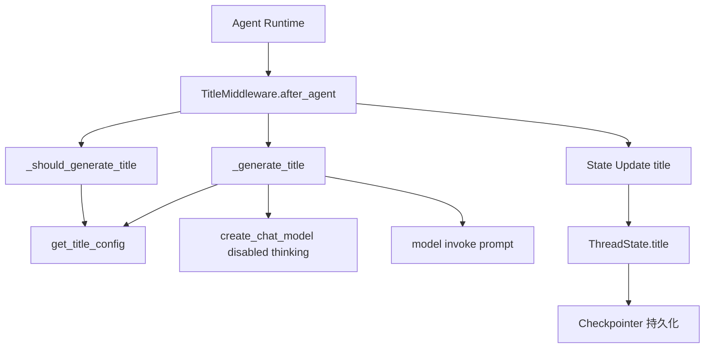
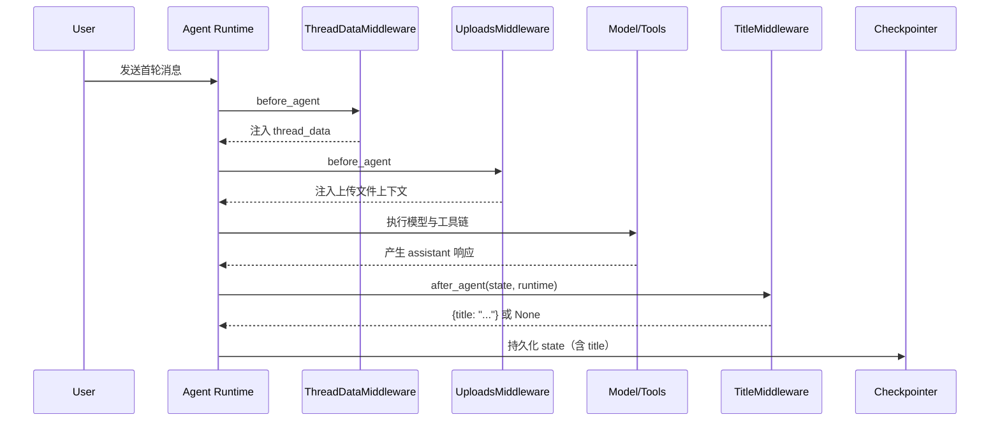
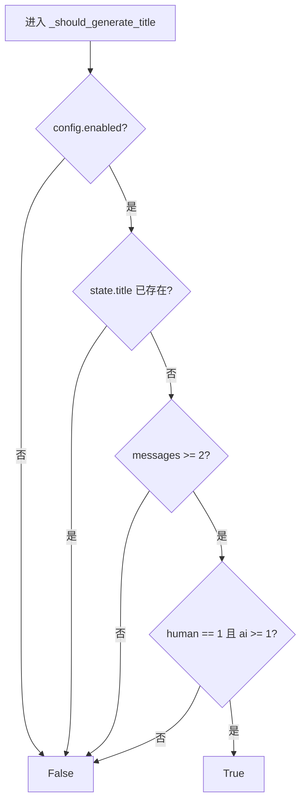
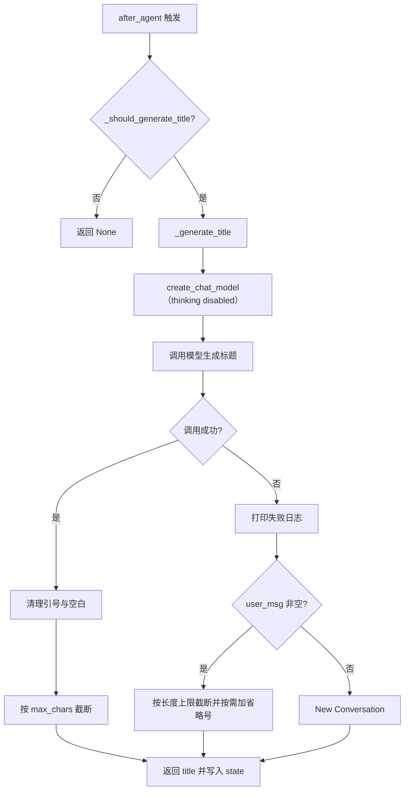

# title_lifecycle 模块文档

## 模块简介

`title_lifecycle` 是 `agent_execution_middlewares` 中负责“会话标题生命周期管理”的子模块，核心由 `TitleMiddlewareState` 与 `TitleMiddleware` 组成。它解决的是一个看似简单、但在多轮智能体系统里非常关键的问题：**线程（thread）标题应该在什么时候生成、由什么信息生成、失败时如何降级、以及如何避免重复生成**。

在没有该模块时，线程标题往往需要前端或后端业务层手工维护，容易出现“标题缺失”“标题过长”“标题与对话不符”以及“每轮都重写标题”的问题。`title_lifecycle` 将这类横切逻辑统一沉淀到 middleware 生命周期中，在 `after_agent` 阶段自动执行，既减少业务重复代码，也让标题策略可通过配置中心集中控制。

从系统定位上看，它不负责线程状态结构定义（参见 [thread_state_schema.md](thread_state_schema.md)），也不负责中间件总装配顺序（参见 [agent_execution_middlewares.md](agent_execution_middlewares.md)），更不负责完整模型配置体系（参见 [application_and_feature_configuration.md](application_and_feature_configuration.md)）。它的职责非常聚焦：**在满足条件时，生成一次高质量标题并回写到状态**。

---

## 设计目标与设计原则

该模块的设计目标可以概括为三个方面。第一是“自动化”，即在首次完整问答后自动产出标题，减少用户和业务端显式操作。第二是“稳定性”，即即便调用模型失败，也必须有可用 fallback，避免线程标题为空。第三是“低侵入”，即只通过状态增量更新 `title` 字段，不破坏已有消息流与工具调用语义。

在实现策略上，模块采用了“**门控判断 + 轻量生成 + 安全降级**”三段式流程：先通过 `_should_generate_title` 严格判断是否应生成，再由 `_generate_title` 执行模型生成，最后在异常路径使用用户首条消息截断作为后备标题。这个模式与 `MemoryMiddleware` 的“条件满足才入队”理念一致，体现了中间件层对副作用的克制设计（可参考 [agent_memory_and_thread_context.md](agent_memory_and_thread_context.md)）。

---

## 核心组件

## 1) `TitleMiddlewareState`

`TitleMiddlewareState` 继承自 `AgentState`，并声明：

```python
class TitleMiddlewareState(AgentState):
    title: NotRequired[str | None]
```

这里的关键点在于 `title` 是可选字段（`NotRequired`），并且允许为 `None`。这使它能与线程全局状态模型保持兼容，尤其与 `ThreadState` 中的 `title` 字段语义一致（参见 [thread_state_schema.md](thread_state_schema.md)）。

该状态类本身不包含行为逻辑，主要用于两件事：一是提供 middleware 的类型约束；二是确保状态更新时只触及预期字段，不引入隐式 schema 漂移。

## 2) `TitleMiddleware`

`TitleMiddleware` 继承 `AgentMiddleware[TitleMiddlewareState]`，并在 `after_agent` 生命周期钩子中触发标题生成。它内部包含三个关键方法：`_should_generate_title`、`_generate_title`、`after_agent`。

```python
class TitleMiddleware(AgentMiddleware[TitleMiddlewareState]):
    state_schema = TitleMiddlewareState
```

`state_schema` 的声明让运行时能以一致方式理解该中间件期望处理的状态结构，也便于与其它 middleware 组合。

---

## 架构关系与依赖



这张图展示了 title 生命周期的主依赖路径：运行时在 `after_agent` 调用中间件；中间件先读 `TitleConfig` 进行门控判断，再可能触发模型生成，最后以状态增量形式更新 `title`。由于更新是通过状态层返回而非直接写库，它自然兼容 checkpointer 或其它状态持久化机制。

### 与其它中间件的协作位置



这说明 `TitleMiddleware` 的定位是“执行后增强”，不会影响工具执行过程本身，也不会改写当前轮用户输入。它与 `thread_bootstrap_and_upload_context` 子模块形成前后分工：前者负责执行前上下文准备，标题中间件负责执行后元信息固化（参见 [thread_bootstrap_and_upload_context.md](thread_bootstrap_and_upload_context.md)）。

---

## 详细行为解析

## `_should_generate_title(state) -> bool`

该方法决定本轮是否有资格触发标题生成，判断逻辑是严格短路的：

1. 读取 `get_title_config()`；若 `enabled=False`，直接返回 `False`。
2. 若 `state` 中已有 `title`，返回 `False`，避免重复覆盖。
3. 检查 `messages` 长度，小于 2 则返回 `False`。
4. 统计 `human` 与 `ai` 消息数量。
5. 仅当“`human == 1` 且 `ai >= 1`”时返回 `True`。



这个门控条件非常有代表性：模块只针对“首次完整往返”生成标题，因此后续轮次不会再次改名。这种策略能稳定 thread identity，但也意味着标题不会随着对话主题迁移自动更新。

## `_generate_title(state) -> str`

该方法执行标题文本构造与模型调用，主要流程如下：

它先从消息历史中拿到首条 `human` 内容与首条 `ai` 内容，再统一转换为字符串（兼容 LangChain 可能出现的 list content 形态）。随后创建轻量模型实例 `create_chat_model(thinking_enabled=False)`，将内容截断至各 500 字符并填入 `prompt_template`，调用 `model.invoke(prompt)`。拿到返回后会执行 `strip` 与引号清理，再用 `max_chars` 做最终长度裁切。

如果调用阶段发生异常，会进入 fallback：优先使用首条用户消息截断（长度 `min(config.max_chars, 50)`），不足则直接返回原文本；若用户消息也为空，最终回退到固定值 `"New Conversation"`。

下面是简化伪代码：

```python
def _generate_title(state):
    config = get_title_config()
    user_msg = first_human_message_as_str(state)[:500]
    assistant_msg = first_ai_message_as_str(state)[:500]

    prompt = config.prompt_template.format(
        max_words=config.max_words,
        user_msg=user_msg,
        assistant_msg=assistant_msg,
    )

    try:
        model = create_chat_model(thinking_enabled=False)
        resp = model.invoke(prompt)
        title = str(resp.content or "").strip().strip('"').strip("'")
        return title[:config.max_chars]
    except Exception:
        return fallback_from_user_message_or_default(config, user_msg)
```

### 参数与返回值说明

- 输入参数：`state: TitleMiddlewareState`。主要读取 `messages`，并在异常路径读取首条用户消息。
- 返回值：`str`。理论上始终返回字符串，即使模型失败也有后备值。
- 副作用：无状态写入副作用（纯计算 + 外部模型调用 + `print` 日志）。真正状态更新由 `after_agent` 完成。

## `after_agent(state, runtime) -> dict | None`

这是模块唯一公开生命周期钩子。其行为非常直接：

- 若 `_should_generate_title(state)` 为真，调用 `_generate_title(state)`；
- 打印 `Generated thread title: ...`；
- 返回 `{"title": title}` 作为状态增量；
- 否则返回 `None`，表示不改动状态。

它不依赖 `runtime.context` 中的 `thread_id`，因此与 `ThreadDataMiddleware` 等不同，不会因上下文缺失抛错。这降低了接入成本，但也意味着它只能基于消息状态判断，而无法按线程元数据做更细粒度策略。

---

## 配置与可调行为

`TitleMiddleware` 的行为由 `TitleConfig` 控制（定义见 `src.config.title_config`，总体配置体系见 [application_and_feature_configuration.md](application_and_feature_configuration.md)）。核心配置字段包括：

- `enabled`：是否启用自动标题。
- `max_words`：提示词中约束的最大词数（1~20）。
- `max_chars`：最终标题硬裁切上限（10~200）。
- `model_name`：标题模型名（当前中间件代码未直接消费该字段，通常由模型创建逻辑统一处理）。
- `prompt_template`：标题生成 prompt 模板。

示例（概念性配置片段）：

```yaml
title:
  enabled: true
  max_words: 6
  max_chars: 60
  model_name: null
  prompt_template: |
    Generate a concise title (max {max_words} words) for this conversation.
    User: {user_msg}
    Assistant: {assistant_msg}

    Return ONLY the title, no quotes, no explanation.
```

需要注意，`max_words` 只是通过 prompt 进行软约束，真正的强约束在代码里只有 `max_chars`。因此在某些模型上，可能出现“词数超限但字符未超限”的情况。

---

## 使用方式

在 middleware pipeline 中注册 `TitleMiddleware` 即可启用生命周期逻辑：

```python
from src.agents.middlewares.title_middleware import TitleMiddleware

middlewares = [
    # ... 其他 before/after middlewares
    TitleMiddleware(),
]
```

最小行为预期如下：当线程首次形成完整“用户输入 + 助手响应”后，下一次 `after_agent` 会把 `title` 写入状态。若状态层有持久化（例如 checkpointer），标题会随线程状态一起保存。

---

## 扩展与二次开发建议

如果你希望标题在“主题明显变化”时重新生成，可以扩展 `_should_generate_title`，引入更多判定条件，例如消息轮数阈值、显式用户指令（如“帮我改标题”）或语义漂移检测。当前默认实现是“一次生成、后续冻结”，优先稳定而非动态。

如果你希望标题质量更高，可以扩展 `_generate_title`，加入语言检测、敏感词清理、领域术语标准化，或接入专用小模型。当前实现强调轻量与鲁棒，适合高吞吐场景。

如果你希望更好观测性，建议把 `print` 替换为结构化日志（包含 thread_id、触发原因、耗时、fallback 类型），并配合 tracing 配置统一接入（参见 [application_and_feature_configuration.md](application_and_feature_configuration.md) 中的 tracing 配置说明）。

---

## 边界条件、错误处理与限制

该模块在稳定性上做了保底，但仍有一些必须了解的行为边界。

第一，消息类型依赖 `m.type == "human"/"ai"`。若上游消息对象类型字段不符合约定（例如自定义类型或被错误改写），可能导致无法触发生成。

第二，标题只在 `len(user_messages) == 1` 时生成。若历史回放、消息补写或中间件注入导致首轮后 `human` 数量不再等于 1，则不会触发，这在迁移旧线程数据时尤需注意。

第三，模型异常仅通过 `except Exception` 捕获并 `print`，不会向上抛错阻断主流程。这保证了主对话可用性，但也可能掩盖持续性模型故障，需要靠日志与监控发现。

第四，fallback 逻辑基于字符截断而非语义截断，可能切断 Unicode 组合语义或留下不完整短语；在多语言混合输入时，这种现象更明显。

第五，`prompt_template` 使用 `str.format`。若模板占位符与代码传参不匹配，会在运行时触发异常并走 fallback；虽然系统不崩溃，但标题质量会退化。

第六，当前实现对 `runtime` 未使用，因此无法做线程级差异化策略（如不同 workspace 使用不同标题策略）。如需此能力，需要显式引入 `runtime.context` 读取逻辑。

---
### 异常与降级流程图



这个流程强调了一个关键工程取舍：标题生成是“尽力而为（best effort）”能力，而不是主链路上的强一致步骤。即使模型不可用，主对话仍继续，线程也能得到可接受的后备标题，从而避免 UI 侧出现空标题或崩溃。


## 测试与验证建议

为了确保标题生命周期可维护，建议至少覆盖以下测试场景：

- 首轮完整问答后成功生成标题。
- `enabled=False` 时不生成标题。
- 状态已有 `title` 时不重复生成。
- 模型抛异常时正确进入 fallback。
- `messages` content 为 list/block 格式时仍能转字符串处理。
- `prompt_template` 异常占位符时流程不崩溃且有后备标题。

示例测试断言（伪代码）：

```python
state = {
    "messages": [HumanMessage(content="请帮我分析销售数据"), AIMessage(content="当然，我先看下结构")],
    "title": None,
}

update = TitleMiddleware().after_agent(state, runtime=mock_runtime)
assert update is not None
assert "title" in update
assert isinstance(update["title"], str)
assert len(update["title"]) <= get_title_config().max_chars
```

---

## 与其它文档的关系

`title_lifecycle` 文档聚焦“标题生成时机与实现细节”。如果你需要更完整的上下文，请按以下路径继续阅读：

- 中间件全景与装配顺序： [agent_execution_middlewares.md](agent_execution_middlewares.md)
- 线程状态字段与合并语义： [thread_state_schema.md](thread_state_schema.md)
- 执行前线程与上传上下文注入： [thread_bootstrap_and_upload_context.md](thread_bootstrap_and_upload_context.md)
- 应用层配置体系（含 `TitleConfig`）： [application_and_feature_configuration.md](application_and_feature_configuration.md)
- 记忆更新等执行后副作用模式对照： [agent_memory_and_thread_context.md](agent_memory_and_thread_context.md)

通过这些文档配合阅读，你可以把 `TitleMiddleware` 放回完整执行链路中理解，从而更安全地进行扩展与运维。