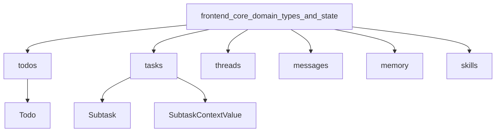

# Todos 模块文档

## 1. 模块概述

Todos 模块是前端核心领域类型系统的一部分，主要负责定义待办事项（Todo）的数据结构。该模块为应用程序提供了统一的待办事项类型定义，确保在整个前端代码库中对待办事项的处理保持一致性。

虽然当前模块仅包含一个简单的类型定义，但它是任务管理功能的基础，可能会在未来的功能扩展中发挥重要作用，如任务跟踪、项目管理等场景。

## 2. 核心组件详解

### Todo 接口

`Todo` 接口是该模块的核心组件，定义了待办事项的基本结构。

```typescript
export interface Todo {
  content?: string;
  status?: "pending" | "in_progress" | "completed";
}
```

#### 详细说明

**功能描述**：
`Todo` 接口定义了待办事项的数据结构，包含内容和状态两个可选属性。这个接口为应用中表示和管理待办事项提供了统一的类型规范。

**属性详解**：
- `content?: string` - 待办事项的内容描述，为可选属性。用于存储待办事项的具体文本信息。
- `status?: "pending" | "in_progress" | "completed"` - 待办事项的状态，为可选属性。限定为三个预定义值之一：
  - `"pending"` - 待处理状态
  - `"in_progress"` - 进行中状态
  - `"completed"` - 已完成状态

**使用场景**：
- 任务管理应用中的待办事项列表
- 项目管理工具中的任务跟踪
- 个人助手应用中的提醒事项
- 任何需要跟踪任务完成状态的功能

## 3. 架构与关系

Todos 模块作为前端核心领域类型系统的一部分，与其他核心领域类型模块（如 tasks、threads、messages 等）共同构成了应用程序的基础类型定义层。

### 模块关系图



Todos 模块与 tasks 模块（包含 Subtask 类型）可能存在紧密的关系，因为待办事项和子任务在概念上有很多相似之处，未来可能会有更深入的集成。

## 4. 使用指南

### 基本使用

导入并使用 `Todo` 接口：

```typescript
import { Todo } from 'frontend/src/core/todos/types';

// 创建一个新的待办事项
const newTodo: Todo = {
  content: '完成项目文档',
  status: 'pending'
};

// 更新待办事项状态
const updateTodoStatus = (todo: Todo, newStatus: Todo['status']): Todo => {
  return {
    ...todo,
    status: newStatus
  };
};

// 使用示例
const inProgressTodo = updateTodoStatus(newTodo, 'in_progress');
const completedTodo = updateTodoStatus(inProgressTodo, 'completed');
```

### 在 React 组件中使用

```typescript
import { Todo } from 'frontend/src/core/todos/types';

interface TodoListProps {
  todos: Todo[];
  onTodoUpdate: (index: number, updatedTodo: Todo) => void;
}

const TodoList: React.FC<TodoListProps> = ({ todos, onTodoUpdate }) => {
  return (
    <div>
      {todos.map((todo, index) => (
        <div key={index} className="todo-item">
          <div className="todo-content">{todo.content}</div>
          <div className="todo-status">{todo.status}</div>
          <button 
            onClick={() => onTodoUpdate(index, { ...todo, status: 'completed' })}
          >
            标记完成
          </button>
        </div>
      ))}
    </div>
  );
};
```

## 5. 扩展与自定义

由于当前 `Todo` 接口相对简单，您可能需要根据应用程序的具体需求进行扩展。以下是一些常见的扩展方式：

### 添加时间戳

```typescript
interface TimestampedTodo extends Todo {
  createdAt: Date;
  updatedAt: Date;
  dueDate?: Date;
}
```

### 添加优先级

```typescript
interface PrioritizedTodo extends Todo {
  priority: 'low' | 'medium' | 'high';
}
```

### 添加分类标签

```typescript
interface CategorizedTodo extends Todo {
  tags: string[];
  category?: string;
}
```

## 6. 注意事项与最佳实践

### 注意事项

1. **可选属性**：`Todo` 接口的所有属性都是可选的，这意味着在创建 Todo 对象时需要确保至少设置一个有意义的属性，以避免创建空对象。

2. **状态值限制**：`status` 属性被限定为三个特定的字符串字面量类型，确保状态值的一致性和可预测性。

3. **与 Subtask 的关系**：注意区分 `Todo` 类型与 `Subtask` 类型（来自 tasks 模块）的使用场景，避免概念混淆。

### 最佳实践

1. **类型守卫**：在处理 Todo 数据时，使用类型守卫确保数据有效性：

```typescript
function isValidTodo(todo: unknown): todo is Todo {
  if (typeof todo !== 'object' || todo === null) return false;
  const { content, status } = todo as Todo;
  if (content !== undefined && typeof content !== 'string') return false;
  if (status !== undefined && !['pending', 'in_progress', 'completed'].includes(status)) return false;
  return true;
}
```

2. **默认值**：在创建 Todo 实例时，提供合理的默认值：

```typescript
function createTodo(content: string, status: Todo['status'] = 'pending'): Todo {
  return { content, status };
}
```

3. **状态转换**：定义明确的状态转换逻辑，避免无效的状态变更：

```typescript
type TodoStatusTransition = {
  from: Todo['status'];
  to: Todo['status'];
};

const allowedTransitions: TodoStatusTransition[] = [
  { from: 'pending', to: 'in_progress' },
  { from: 'in_progress', to: 'completed' },
  { from: 'in_progress', to: 'pending' },
  { from: 'completed', to: 'pending' }, // 允许重新打开
];

function canTransitionStatus(current: Todo['status'], next: Todo['status']): boolean {
  return allowedTransitions.some(
    transition => transition.from === current && transition.to === next
  );
}
```

## 7. 未来扩展方向

基于当前模块的设计和应用程序的需求，Todos 模块未来可能会在以下方面进行扩展：

1. **增加更多核心属性**：如唯一标识符、创建时间、截止日期等
2. **提供 Todo 管理的工具函数**：如状态转换、过滤、排序等
3. **开发专门的 React 上下文和钩子**：用于在组件间共享 Todo 状态
4. **与任务系统更紧密集成**：建立 Todo 和 Subtask 之间的明确关系
5. **添加持久化逻辑**：支持本地存储或与后端 API 集成

## 8. 相关模块参考

- [tasks 模块](tasks.md) - 包含子任务类型定义，与 Todo 概念相关
- [threads 模块](threads.md) - 定义了线程相关类型，可能与 Todo 上下文相关
- [frontend_core_domain_types_and_state 模块](frontend_core_domain_types_and_state.md) - 了解完整的前端核心类型系统
