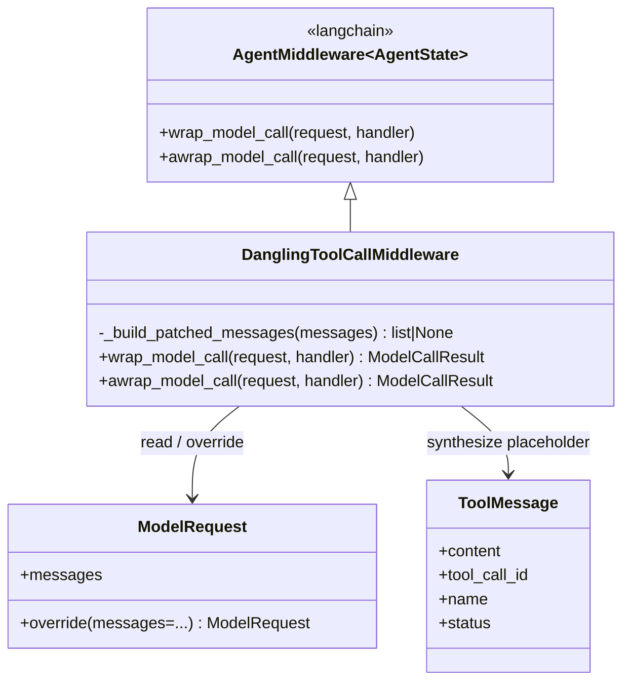
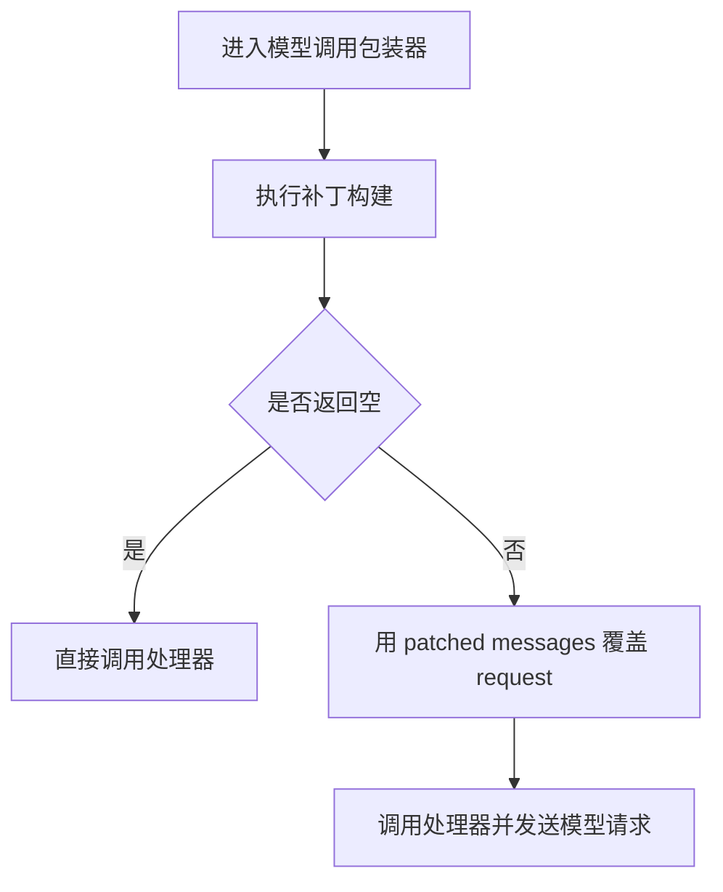
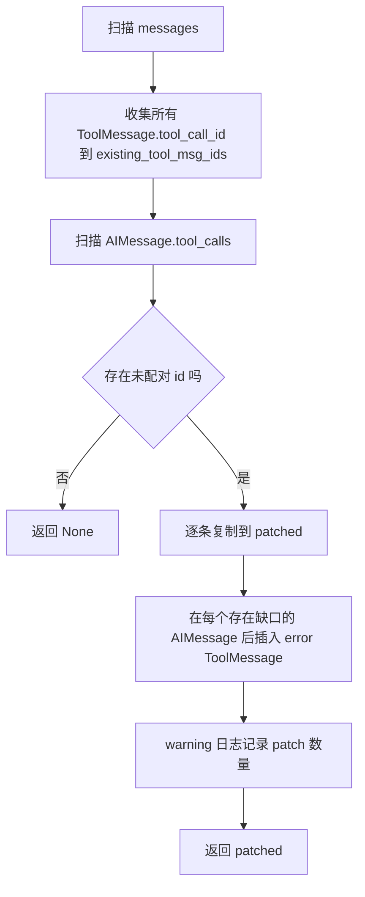
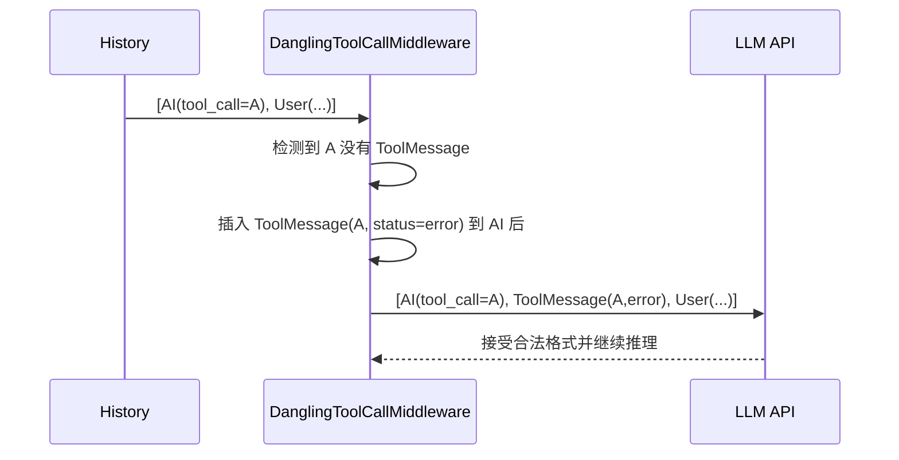

# tool_call_resilience 模块文档

## 模块简介：它解决的不是“工具失败”，而是“协议断裂”

`tool_call_resilience` 是 `agent_execution_middlewares` 下的稳定性子模块，当前核心实现只有一个中间件：`DanglingToolCallMiddleware`。它专门处理一种在真实生产环境中非常常见、但经常被忽略的问题：模型历史里出现了 `AIMessage.tool_calls`，却没有对应 `ToolMessage` 返回。

这种不一致通常不是业务逻辑错误，而是链路中断导致的“半完成状态”，典型触发场景包括用户手动停止、请求取消、超时、服务重启、工具执行崩溃或上游重试截断。对于支持 function/tool calling 的模型来说，这类历史往往会直接导致下一次调用报错，因为消息协议要求 tool call 与 tool result 形成可追踪配对。

该模块的设计目标非常明确：在模型实际调用前，自动检测并修补这类“悬空工具调用（dangling tool call）”，让消息历史恢复为结构合法状态，避免模型因格式不完整而拒绝请求。它**不尝试恢复真实工具结果**，而是注入带错误语义的占位 `ToolMessage`，将系统从“协议层不可继续”转为“语义层可降级继续”。

---

## 核心组件

### `backend.src.agents.middlewares.dangling_tool_call_middleware.DanglingToolCallMiddleware`

`DanglingToolCallMiddleware` 继承 `AgentMiddleware[AgentState]`，重写了同步与异步两条模型调用包装入口：`wrap_model_call` 和 `awrap_model_call`。两者都会在调用下游 handler 前执行同一套补丁逻辑 `_build_patched_messages`。

从职责上看，这个中间件属于“协议守卫（protocol guard）”而非“业务中间件”：它不参与工具执行、不改变线程状态、不写 memory，只确保送入模型的 `messages` 结构满足 tool-calling 对话格式约束。

---

## 架构关系与依赖



该图体现了模块的最小闭环：中间件读取 `ModelRequest.messages`，若发现 dangling tool call，则构造新的消息序列并通过 `request.override` 替换请求对象，最后再把“修正后的请求”交给模型调用 handler。

---

## 处理流程（同步与异步一致）



`_build_patched_messages` 的内部又分成“检测阶段 + 重建阶段”：



这种两阶段结构的价值在于：在绝大多数“无需修复”的正常请求里，它只做一次轻量扫描并返回 `None`，避免不必要的列表重建；仅在确有缺口时才进行插入与对象创建。

---

## 关键方法详解

### `_build_patched_messages(self, messages: list) -> list | None`

这是模块的核心算法实现。方法先遍历历史消息，提取所有现有 `ToolMessage` 的 `tool_call_id`；然后遍历每条 `AIMessage` 的 `tool_calls`，查找那些“声明了调用但历史中不存在结果”的 id。若不存在缺口，直接返回 `None`，上层不会改写请求。

若存在缺口，方法会构建新的 `patched` 列表，并在原 `AIMessage` 后立即插入占位 `ToolMessage`。插入消息的字段固定为：

- `content = "[Tool call was interrupted and did not return a result.]"`
- `tool_call_id = 原 tool_call id`
- `name = tc.get("name", "unknown")`
- `status = "error"`

实现里用 `patched_ids` 去重，确保同一个 `tool_call_id` 在一次修复中不会被重复插入。最后通过 `logger.warning` 输出注入计数，便于观察链路健康度。

**参数与返回值**

- 参数 `messages`：原始历史消息列表（鸭子类型读取 `type` / `tool_calls`）。
- 返回 `None`：不需要修复。
- 返回 `list`：带补丁的新消息列表。

**副作用**

- 记录 warning 日志。
- 不原地修改输入列表；返回新列表并由上层决定是否替换请求。

---

### `wrap_model_call(self, request, handler) -> ModelCallResult`

同步入口。它调用 `_build_patched_messages(request.messages)`，当返回新列表时使用 `request.override(messages=patched)` 构造新请求，再调用 `handler`。如果返回 `None`，则请求原样透传。

这个位置选择非常关键：修复发生在模型调用前最后一层包装，能保证插入位置不会被上游 reducer 追加到末尾。

---

### `awrap_model_call(self, request, handler) -> ModelCallResult`

异步入口，逻辑与同步版本保持完全一致，仅在调用 handler 时 `await`。这保证了同步/异步运行模式下行为一致，不会出现“某条执行路径没修复”的偏差。

---

## 为什么必须用 `wrap_model_call`，而不是 `before_model`



如果把补丁“追加到末尾”，消息可能变成 `[AI(tool_call=A), User(...), ToolMessage(A,error)]`。许多模型会把这视为时序非法或上下文异常。该模块在 `wrap_model_call` 层做“原位紧邻插入”，正是为了满足模型对 tool message 邻接关系的隐式约束。

---

## 在系统中的位置与跨模块协作

`tool_call_resilience` 隶属于 `agent_execution_middlewares`，它与澄清拦截、标题生命周期、线程数据注入、上传上下文注入等中间件并列，但职责完全不同。它不生产业务信息，只兜底协议一致性。

建议结合以下文档建立全局理解，而不是在本模块重复它们的细节：

- 中间件总览与编排顺序：[`agent_execution_middlewares.md`](agent_execution_middlewares.md)
- 线程与会话状态载体：[`agent_memory_and_thread_context.md`](agent_memory_and_thread_context.md)
- 线程初始化与上传上下文注入链路：[`thread_bootstrap_and_upload_context.md`](thread_bootstrap_and_upload_context.md)
- 澄清中断/拦截策略：[`clarification_interception.md`](clarification_interception.md)

在端到端执行上，它处于“最终请求发给模型前”的保护带，和 `Sandbox`、`MemoryUpdater`、`SubagentExecutor` 没有直接调用耦合，但会提升这些模块被中断后系统恢复继续对话的概率。

---

## 使用方式

该中间件无配置项，实例化即可使用。典型集成方式是在 agent middleware 链中注册：

```python
from backend.src.agents.middlewares.dangling_tool_call_middleware import DanglingToolCallMiddleware

middlewares = [
    # ... other middlewares
    DanglingToolCallMiddleware(),
]
```

如果项目存在中间件顺序控制，建议把它放在“能够看到最终 `request.messages`”的位置（通常靠近模型调用层），以避免前序中间件后续又改写消息导致补丁失效或位置偏移。

---

## 行为示例

### 示例 1：单个 dangling tool call

输入：

```python
[
  AIMessage(tool_calls=[{"id": "call_1", "name": "search"}], content=""),
  HumanMessage(content="继续")
]
```

输出（补丁后）：

```python
[
  AIMessage(tool_calls=[{"id": "call_1", "name": "search"}], content=""),
  ToolMessage(
    content="[Tool call was interrupted and did not return a result.]",
    tool_call_id="call_1",
    name="search",
    status="error",
  ),
  HumanMessage(content="继续")
]
```

### 示例 2：已有配对则不修改

若历史中已包含 `tool_call_id="call_1"` 的 `ToolMessage`，方法返回 `None`，请求原样发送。

---

## 边界条件、错误场景与限制

这个模块提升的是鲁棒性，不是语义正确性恢复。维护时要明确以下边界：

- 它只检查“是否存在同 id 的 `ToolMessage`”，不校验内容真实性。因此“错误但存在”的结果不会被替换。
- 插入的是通用错误占位，不含具体失败原因；模型后续回答质量取决于其对 `status="error"` 和上下文的理解。
- 对消息结构采用宽松读取（`getattr`），能避免因字段缺失崩溃，但也可能让上游脏数据被静默跳过。
- 去重基于 `tool_call_id`。如果上游重复复用 id，补丁行为会按单次去重处理。
- 该中间件不做重试、不触发补偿任务、不调用真实工具，只修复消息协议。

---

## 可扩展方向（不破坏现有语义）

若要扩展，建议保持“检测与插入位置”语义不变，把变化集中在可配置层：

- 把占位 `content` 抽为配置模板，支持多语言或更明确的错误文本。
- 为合成消息增加可观测元数据（例如 `synthetic=true`，取决于消息协议支持）。
- 在 warning 日志外增加 metrics/tracing 埋点（如每模型、每线程、每工具的 dangling 率）。
- 在极端场景加入策略开关，例如仅对最近 N 条消息做修复，控制长历史扫描成本。

---

## 测试建议

建议至少覆盖以下测试组合，以避免回归：

1. 无 dangling：返回 `None`，请求不改写。
2. 单 dangling：插入 1 条，且位置必须紧邻对应 `AIMessage`。
3. 多 dangling：跨多条 `AIMessage` 的多点插入。
4. 重复 id：同一 `tool_call_id` 不重复插入。
5. `tool_calls` 缺失/None：安全跳过。
6. sync/async 一致性：`wrap_model_call` 与 `awrap_model_call` 输出一致。

---

## 运维观察建议

该模块日志中的 `Injecting N placeholder ToolMessage(s) for dangling tool calls` 是一个很好的健康信号。若该指标在短期内显著升高，通常意味着工具执行链路中断率上升（超时、取消、服务异常），应联动排查工具 runtime、sandbox 或网络稳定性，而不是仅在中间件层面处理。

---

## 总结

`tool_call_resilience` 通过一个小而关键的中间件，把“模型可能直接报错的协议断裂”转换为“模型可理解的错误上下文”。它的核心贡献不在于业务功能，而在于保证对话链在异常中仍可继续推进。对于生产级 Agent 系统，这是提升可用性与恢复能力的基础设施组件。