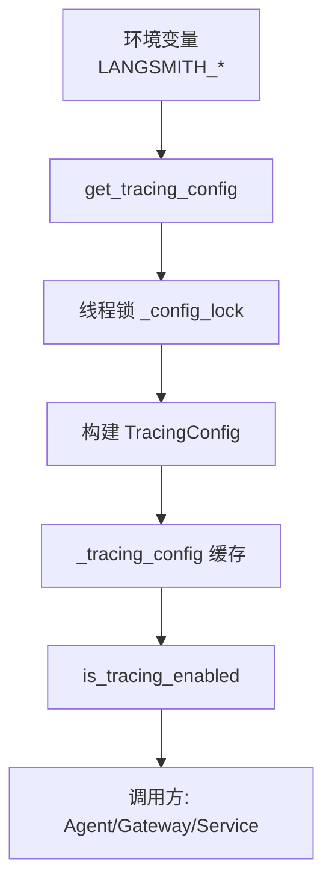
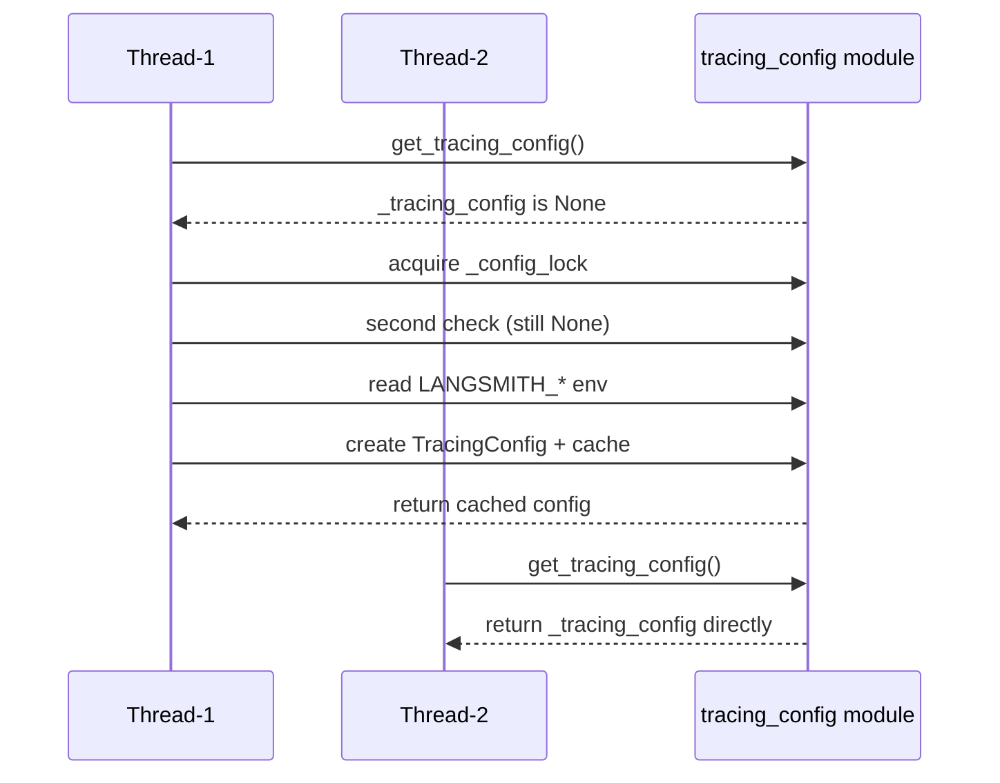
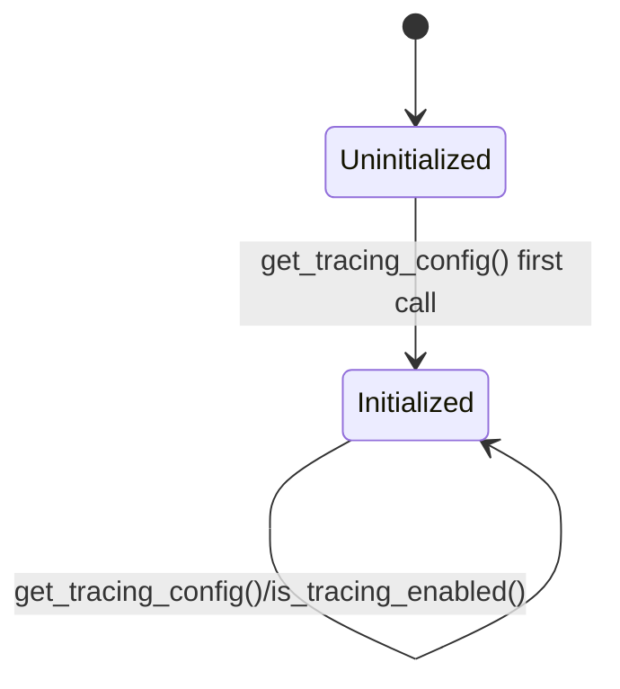
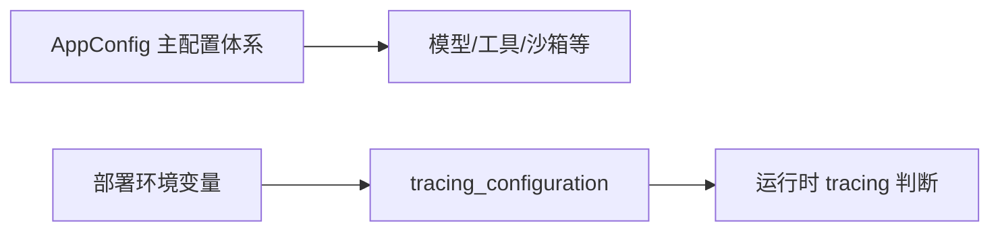

# tracing_configuration 模块文档

## 模块概述

`tracing_configuration` 模块围绕 LangSmith tracing 提供了一个极小但关键的配置层。它的职责并不是执行 tracing 本身，而是把“当前进程是否应启用 tracing、使用哪个项目、向哪个 endpoint 上报、凭证是否完整”这些运行前提统一收敛为一个可复用的配置对象。由于 tracing 通常是跨请求、跨链路的基础能力，这种集中式配置可以避免在各个调用点重复解析环境变量，减少配置分歧导致的可观测性缺口。

从设计上看，这个模块采用了“`Pydantic 数据模型 + 进程内缓存 + 线程锁懒加载`”的组合。`Pydantic` 用于提供结构化字段和类型约束，缓存用于提升访问效率，线程锁用于保证首次初始化时的并发安全。最终，其他代码只需要调用 `is_tracing_enabled()` 或 `get_tracing_config()`，即可获得一致的判断结果或完整配置快照。

> 本模块属于应用配置体系的一部分。关于整体配置装配、配置文件加载与全局配置生命周期，请参阅 [application_and_feature_configuration.md](application_and_feature_configuration.md) 与 [app_config_orchestration.md](app_config_orchestration.md)。

---

## 核心组件与职责

本模块在文件 `backend/src/config/tracing_config.py` 中包含一个核心数据模型和两个常用访问函数（以及一个模块级缓存变量）。它们共同构成 tracing 配置的读取与判定入口。



上图展示了完整的数据来源和访问路径：环境变量只在首次加载时被读取，然后结果写入 `_tracing_config`。后续调用不再触碰环境变量，而是直接复用缓存对象。`is_tracing_enabled()` 则是基于 `TracingConfig.is_configured` 的快捷判断层。

---

## `TracingConfig` 详解

### 设计目的

`TracingConfig` 是一个 `pydantic.BaseModel`，用于表达 LangSmith tracing 的最小必要配置集合。它不承担 I/O 逻辑，只负责承载和验证配置数据，并提供一个语义明确的配置完整性判断属性。

### 字段定义

- `enabled: bool`：是否显式开启 tracing。
- `api_key: str | None`：LangSmith API Key，可为空。
- `project: str`：LangSmith 项目名。
- `endpoint: str`：LangSmith API endpoint。

这些字段都通过 `Field(...)` 声明为必填输入项；但“必填”指的是**模型实例化时必须传值**，并不代表值一定非空字符串。例如 `api_key` 允许为 `None`，这与模块后续的“配置是否可用”判定逻辑配套。

### `is_configured` 属性

`is_configured` 的语义是“可执行 tracing 上报所需条件是否满足”。其实现为：

```python
return self.enabled and bool(self.api_key)
```

这意味着只有在以下两件事同时成立时才认为 tracing 可用：

1. `enabled == True`
2. `api_key` 为非空值（`None` 或空字符串都会导致失败）

这个判定把“功能开关”与“凭证完备性”绑定在一起，可以避免仅开启开关却未配置密钥时出现半启用状态。

---

## 模块级函数与内部工作机制

## `get_tracing_config() -> TracingConfig`

`get_tracing_config` 是本模块的主入口。它从环境变量读取 tracing 配置，并在进程内缓存结果。函数采用了双重检查（double-checked）模式结合锁，确保并发情况下只初始化一次。



### 环境变量映射规则

函数内部读取如下变量：

- `LANGSMITH_TRACING`：仅当其值（忽略大小写）严格等于 `"true"` 时，`enabled=True`。
- `LANGSMITH_API_KEY`：直接读取，可为 `None`。
- `LANGSMITH_PROJECT`：缺省值为 `"deer-flow"`。
- `LANGSMITH_ENDPOINT`：缺省值为 `"https://api.smith.langchain.com"`。

### 返回值与副作用

函数返回 `TracingConfig` 实例。它有一个重要副作用：首次调用会写入模块级全局变量 `_tracing_config`，后续调用共享该实例。

### 关键行为特点

该函数的缓存策略使其非常高效，但也带来一个约束：**进程启动后若环境变量发生变化，默认不会自动生效**。除非显式清空或重置 `_tracing_config`（当前文件未提供公开 reset 函数），否则会持续返回旧值。

---

## `is_tracing_enabled() -> bool`

`is_tracing_enabled` 是语义化包装函数，用于快速判断 tracing 是否“已开启且可用”。它内部等价于：

```python
return get_tracing_config().is_configured
```

对于调用方而言，这个 API 比直接判断环境变量更稳健，原因是它复用了统一的缓存与完整性规则，能确保系统各处对 tracing 状态的判断一致。

---

## 生命周期与状态模型



该模块生命周期非常简单：首次调用触发初始化，之后常驻内存。它没有内建热重载或重置路径，因此更适合作为“启动后稳定不变”的配置读取层。

---

## 与系统其他模块的关系

`tracing_configuration` 是 `application_and_feature_configuration` 体系中的一个子模块，但其实现与主 `AppConfig` 装配链路相对独立：它主要从环境变量读取，而不是从主 YAML 配置文件加载。这种设计通常用于处理敏感信息（API Key）和部署期环境差异。



换句话说，主配置与 tracing 配置并行存在：前者偏静态配置文件，后者偏运行环境注入。这样可以避免把敏感密钥写入版本库，同时保持 tracing 开关可在部署层面灵活控制。

---

## 使用示例

### 基础读取

```python
from backend.src.config.tracing_config import get_tracing_config

cfg = get_tracing_config()
print(cfg.enabled, cfg.project, cfg.endpoint)
```

### 在业务逻辑中守卫式启用 tracing

```python
from backend.src.config.tracing_config import is_tracing_enabled

if is_tracing_enabled():
    # 初始化 LangSmith 回调、注入 tracing handlers 等
    pass
else:
    # 使用无 tracing 的默认路径
    pass
```

### 典型环境变量配置（部署侧）

```bash
export LANGSMITH_TRACING=true
export LANGSMITH_API_KEY=lsv2_xxx
export LANGSMITH_PROJECT=deer-flow-prod
export LANGSMITH_ENDPOINT=https://api.smith.langchain.com
```

---

## 错误条件、边界行为与运维注意事项

本模块代码体量很小，但有几个高价值边界需要明确。

首先，`LANGSMITH_TRACING` 的解析规则非常严格，只有字符串 `"true"`（大小写不敏感）会被视为启用。像 `"1"`、`"yes"`、`"on"` 都会被判定为关闭。这在跨团队部署时是常见踩坑点。

其次，`enabled=True` 但 `LANGSMITH_API_KEY` 缺失时，`is_tracing_enabled()` 会返回 `False`。这不是报错，而是“软失败”行为。优点是系统可继续运行，缺点是如果没有额外日志提示，可能出现“以为启用了 tracing，实际没有”的静默偏差。

再次，缓存策略意味着动态修改环境变量通常不会即时生效。在需要变更 tracing 参数的场景中，建议通过重启进程应用新配置，或在未来为该模块补充显式重载/重置接口。

最后，`project` 与 `endpoint` 提供了默认值。默认值提升了易用性，但也可能掩盖配置错误（例如误连到默认项目）。生产环境建议显式设置并在启动日志中打印脱敏后的关键 tracing 配置状态。

---

## 可扩展性建议

如果后续要扩展该模块，推荐沿着“保持轻量、显式、可测试”的方向演进。实践中可优先考虑以下增强：

- 增加 `reload_tracing_config()` 或 `reset_tracing_config()`，提升测试隔离与运维动态控制能力。
- 为 `endpoint` 增加 URL 格式校验，提前发现拼写错误。
- 在 `enabled=True 且 api_key 缺失` 时增加一次性 warning 日志，减少静默失配。
- 若系统计划支持多 tracing 后端，可在当前模型上抽象 provider 字段，并保持默认 LangSmith 兼容路径。

这些增强应与主配置体系文档保持一致，避免出现“部分配置支持热重载、部分不支持”的认知混乱。

---

## 测试与调试建议

为了保证该模块在并发与配置变更场景下行为稳定，建议为 `get_tracing_config()` 和 `is_tracing_enabled()` 编写单元测试并覆盖以下关键路径：首次加载读取环境变量、重复调用命中缓存、`LANGSMITH_TRACING` 大小写变体、`enabled=True` 且 `api_key` 缺失时的降级行为。由于模块存在全局缓存，测试之间应显式清理 `_tracing_config`（例如在测试夹具中重置模块状态），否则容易出现“前一个用例污染后一个用例”的假阳性。调试线上问题时，可以在进程启动阶段打印 `enabled/project/endpoint`（避免打印明文 `api_key`）来确认当前有效配置是否符合预期。

---


## 小结

`tracing_configuration` 模块的价值在于用极少代码提供了统一、线程安全、低开销的 tracing 配置读取能力。它通过 `TracingConfig` 明确了数据结构，通过 `is_configured` 固化了可用性语义，并通过缓存与锁保证了运行时一致性。对于调用方来说，最佳实践是始终通过 `is_tracing_enabled()` 与 `get_tracing_config()` 访问 tracing 状态，而不是自行解析环境变量。