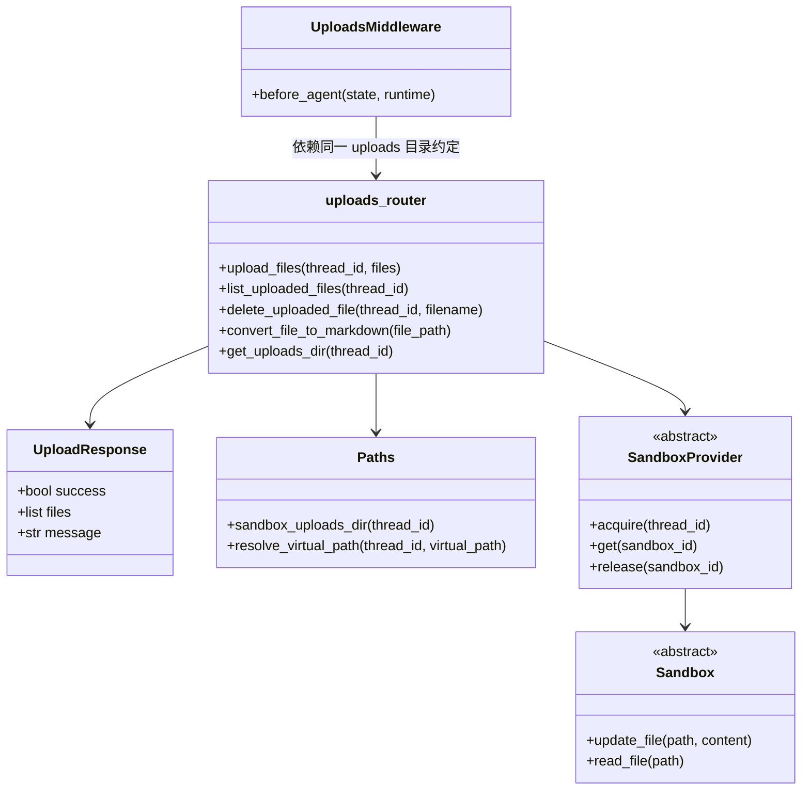
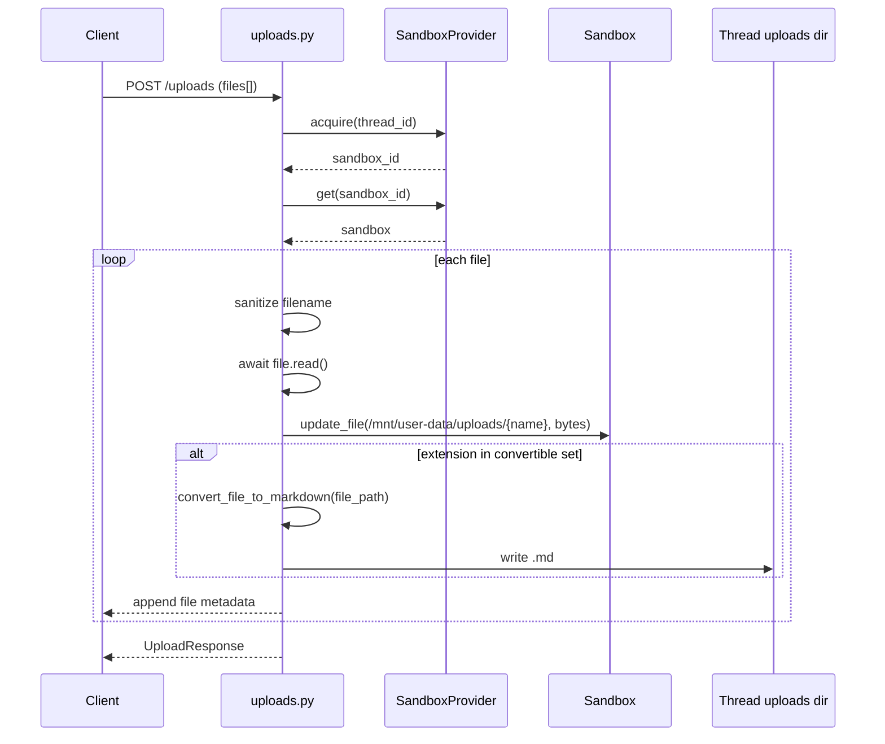

# upload_contracts_and_artifact_paths

## 模块概述

`upload_contracts_and_artifact_paths` 模块对应后端 `backend/src/gateway/routers/uploads.py` 中的上传 API 合约与路径语义，核心对外契约类型是 `UploadResponse`。虽然在模块树里它被归类为“contracts”，但这个模块的实际职责不只是定义响应模型，而是同时承担了**上传入口、上传文件索引、删除操作、以及“主机路径/沙箱虚拟路径/HTTP artifact URL”三套路径的映射规范**。

这个模块存在的原因很直接：Agent 运行时需要消费用户上传文件，而系统内部同时存在网关层、线程隔离目录、沙箱文件系统、以及前端下载链路。如果没有一个集中位置定义上传数据如何落盘、如何暴露给 Agent、如何返回给前端，那么上传行为会分散在多个子系统中，路径规则也会迅速失控。该模块因此成为“上传契约 + 路径桥接”的单点。

从系统位置看，它隶属于 `gateway_api_contracts`，上游对接前端上传请求，下游依赖 `Paths`（线程目录解析）与 `SandboxProvider`（把文件写入 Agent 所在沙箱）。如果你需要先了解路径安全和线程目录组织，建议先读 [path_resolution_and_fs_security.md](path_resolution_and_fs_security.md)；如果你要理解 Agent 如何在推理时感知上传文件，建议继续读 [thread_bootstrap_and_upload_context.md](thread_bootstrap_and_upload_context.md)；如果你要理解沙箱抽象和 provider 生命周期，参考 [sandbox_core_runtime.md](sandbox_core_runtime.md)。

---

## 核心组件：`UploadResponse`

`UploadResponse` 是该模块在“契约层”最关键的模型，定义如下：

```python
class UploadResponse(BaseModel):
    success: bool
    files: list[dict[str, str]]
    message: str
```

它表达的是“本次上传批次”的结果：

- `success`：整体上传成功与否。
- `files`：每个文件的元数据集合（文件名、大小、路径、artifact URL、可选 markdown 衍生信息等）。
- `message`：面向调用方的摘要文本。

需要特别注意的是，`files` 被声明为 `list[dict[str, str]]`，而实现中有些字段在其他接口或前端类型中被当作数值（例如 `size`、`modified`）。前端 `UploadedFileInfo`（`frontend.src.core.uploads.api`）期望 `size: number`。这意味着调用方在做强类型校验时必须考虑类型兼容问题，否则会出现序列化/反序列化不一致。

---

## API 与内部行为

### 1) `POST /api/threads/{thread_id}/uploads`

该接口接收 `multipart/form-data` 的 `files` 列表，执行多文件上传，并返回 `UploadResponse`。

其内部处理流程可以概括为：

1. 校验 `files` 非空，否则返回 `400`。
2. 调用 `get_uploads_dir(thread_id)` 确保线程上传目录存在。
3. 从 `get_sandbox_provider()` 获取 provider，`acquire(thread_id)` 获取沙箱 ID，再 `get(sandbox_id)` 拿到沙箱实例。
4. 逐文件处理：
   - 用 `Path(file.filename).name` 做文件名规范化（去除目录部分，防止路径穿越）。
   - 读取二进制内容：`content = await file.read()`。
   - 生成 `virtual_path = /mnt/user-data/uploads/{safe_filename}`。
   - 调用 `sandbox.update_file(virtual_path, content)` 写入沙箱可见路径。
   - 生成返回元数据（含 `artifact_url`）。
   - 若扩展名属于可转换集合（PDF/PPT/XLS/DOC 系列），尝试调用 `convert_file_to_markdown` 产出 `.md` 文件并附加衍生字段。
5. 全部成功后返回 `success=True`。

### 2) `GET /api/threads/{thread_id}/uploads/list`

该接口列出线程上传目录中的所有文件，返回如下结构：

```json
{
  "files": [...],
  "count": 0
}
```

每个文件项包含：

- `filename`
- `size`
- `path`（后端线程目录相对语义）
- `virtual_path`（Agent 沙箱路径语义）
- `artifact_url`（前端下载访问入口）
- `extension`
- `modified`

这个接口不复用 `UploadResponse`，而是直接返回 `dict`，因此“上传返回结构”和“列表返回结构”存在轻微漂移（例如类型细节）。

### 3) `DELETE /api/threads/{thread_id}/uploads/{filename}`

该接口删除指定文件。它先检查文件存在性（不存在则 `404`），然后做 `resolve().relative_to(...)` 的目录约束校验，防止通过构造路径删除上传目录外文件，最后执行 `unlink()`。

---

## 关键路径模型：主机路径、沙箱路径、Artifact URL

该模块最容易被误解的地方，不在“上传”，而在“同一个文件的三种地址语义”。

```mermaid
flowchart LR
    A[客户端上传文件] --> B[Gateway uploads router]
    B --> C[Host thread dir\n{base}/threads/{thread_id}/user-data/uploads]
    B --> D[Sandbox virtual path\n/mnt/user-data/uploads/{filename}]
    B --> E[HTTP artifact URL\n/api/threads/{thread_id}/artifacts/...]
    D --> F[Agent read_file 工具可访问]
    E --> G[前端下载/预览]
```

上图展示了该模块的核心职责：把同一个物理文件映射成三种消费通道。

- **主机路径（Host path）**：用于后端文件枚举与清理。
- **虚拟路径（Virtual path）**：用于 Agent 在沙箱中读取文件。
- **Artifact URL**：用于前端通过 HTTP 拉取文件。

`Paths.sandbox_uploads_dir(thread_id)` 和 `VIRTUAL_PATH_PREFIX` 在这个转换过程中是关键锚点。模块本身通过这两个配置避免路径硬编码散落。

---

## 组件关系与依赖



这里最重要的耦合关系是：`uploads_router` 与 `UploadsMiddleware` 都默认“上传文件位于 `/mnt/user-data/uploads`”，两者通过共享目录约定实现 Agent 上下文注入。如果你修改上传目录规则，必须同步评估中间件行为，否则 Agent 看不到新文件。

---

## 处理流程（含可转换文档）



转换分支依赖 `markitdown`。转换失败不会中断上传主流程，而是记录日志并忽略 markdown 衍生字段，这个设计保证了“上传可用性优先于转换完整性”。

---

## 与前端契约的对齐说明

后端该模块与前端 `frontend/src/core/uploads/api` 的类型契约在字段层面总体一致，但存在以下细节差异需要维护者关注：

1. 后端 `UploadResponse.files` 当前声明为 `dict[str, str]`，但前端 `UploadedFileInfo.size` 是 `number`。
2. 上传接口里 `size` 被写成字符串：`str(len(content))`；列表接口里的 `size` 是整数。
3. 列表接口返回 `extension`、`modified`，上传接口返回可选 `markdown_*` 字段；两者字段并不完全重合。

如果你要做 SDK 或严格 schema 校验，建议以“并集模型”定义并进行字段归一化。

---

## 使用与扩展示例

### 基础上传调用

```bash
curl -X POST \
  "http://localhost:8000/api/threads/thread_123/uploads" \
  -F "files=@/tmp/report.pdf" \
  -F "files=@/tmp/data.csv"
```

典型响应（示意）：

```json
{
  "success": true,
  "files": [
    {
      "filename": "report.pdf",
      "size": "245760",
      "path": ".../threads/thread_123/user-data/uploads/report.pdf",
      "virtual_path": "/mnt/user-data/uploads/report.pdf",
      "artifact_url": "/api/threads/thread_123/artifacts/mnt/user-data/uploads/report.pdf",
      "markdown_file": "report.md",
      "markdown_path": ".../threads/thread_123/user-data/uploads/report.md",
      "markdown_virtual_path": "/mnt/user-data/uploads/report.md",
      "markdown_artifact_url": "/api/threads/thread_123/artifacts/mnt/user-data/uploads/report.md"
    }
  ],
  "message": "Successfully uploaded 1 file(s)"
}
```

### 扩展可转换文件类型

```python
# backend/src/gateway/routers/uploads.py
CONVERTIBLE_EXTENSIONS = {
    ".pdf", ".ppt", ".pptx", ".xls", ".xlsx", ".doc", ".docx",
    ".odt",  # 新增
}
```

扩展时不仅要考虑 `markitdown` 是否支持该格式，还要验证转换失败时不会影响上传主链路。

### 自定义响应模型（建议）

如果要修复类型漂移，可引入显式文件项模型，例如：

```python
class UploadedFileItem(BaseModel):
    filename: str
    size: int
    path: str
    virtual_path: str
    artifact_url: str
    extension: str | None = None
    modified: float | None = None
    markdown_file: str | None = None
    markdown_path: str | None = None
    markdown_virtual_path: str | None = None
    markdown_artifact_url: str | None = None
```

这样可以避免 `dict[str, str]` 带来的静态类型不确定性。

---

## 边界条件、错误处理与已知限制

### 错误分层

该模块错误策略比较明确：

- 参数级错误：无文件时 `400`。
- 资源不存在：删除不存在文件时 `404`。
- 安全违规：删除路径越界时 `403`。
- 其他异常：上传/删除内部异常统一 `500`。

### 安全注意事项

上传时通过 `Path(file.filename).name` 去掉目录信息，降低路径穿越风险；删除时额外使用 `resolve().relative_to(...)` 再做一次越界检查。两层保护组合是合理的，但要注意上传路径目前并未对文件名字符集做更严格约束（例如保留字符、超长文件名、平台差异字符）。

### 运行时耦合限制

上传逻辑假设沙箱路径 `/mnt/user-data/uploads` 与线程上传目录语义一致。若沙箱实现不共享该路径语义，`list` 结果、markdown 转换、以及 Agent 可见性可能出现偏差。

### 资源管理风险

`upload_files` 中调用了 `sandbox_provider.acquire(thread_id)`，但函数内没有显式 `release`。这是否是问题取决于具体 provider 策略（池化复用/自动回收/长生命周期），维护时请结合 [sandbox_core_runtime.md](sandbox_core_runtime.md) 与具体 provider 实现核查。

### 转换链路限制

`convert_file_to_markdown` 依赖可选第三方包 `markitdown`。如果环境缺失依赖或文件内容异常，转换会静默降级（仅日志，接口仍成功）。这对可用性友好，但调用方若“强依赖 markdown 产物”，必须自行检查 `markdown_*` 字段是否存在。

---

## 设计建议（维护者视角）

从长期可维护性看，这个模块最值得优先改进的点是契约一致性：

1. 用结构化 `UploadedFileItem` 替代 `dict[str, str]`。
2. 统一上传接口和列表接口的字段类型（尤其 `size`）。
3. 在 OpenAPI 层明确 `markdown_*` 字段是条件可选。
4. 明确沙箱 acquire/release 生命周期约束，避免 provider 实现切换时引入泄漏。

这样可以显著降低前后端联调成本，并提升多 provider 场景下的行为可预测性。
