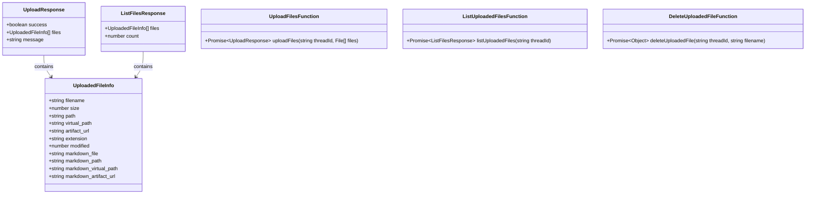
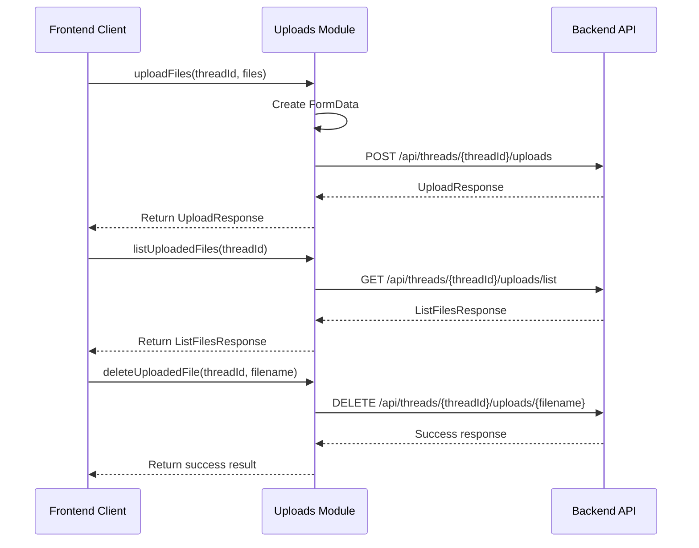

# Uploads Module Documentation

## 1. Overview

The Uploads module is a core frontend component that provides functionality for managing file uploads within agent threads. It enables users to upload, list, and delete files associated with specific conversation threads, facilitating file sharing and management between users and AI assistants.

This module exists to handle the complete lifecycle of file operations in the system, from uploading files to making them available to the AI assistant through the thread context. It abstracts the underlying API communication and provides clean interfaces for file management operations.

## 2. Architecture & Components

### Core Components Diagram



### Data Flow Diagram



## 3. Core Components

### UploadedFileInfo Interface

The `UploadedFileInfo` interface defines the structure of information about an uploaded file. This includes both the original file and potentially a Markdown-rendered version of the file if applicable.

#### Properties

- **filename**: `string` - The original name of the uploaded file
- **size**: `number` - The size of the file in bytes
- **path**: `string` - The server-side path where the file is stored
- **virtual_path**: `string` - A virtual path used for referencing the file within the system
- **artifact_url**: `string` - A URL that can be used to access the file
- **extension** (optional): `string` - The file extension
- **modified** (optional): `number` - Timestamp of when the file was last modified
- **markdown_file** (optional): `string` - Path to the Markdown-rendered version of the file
- **markdown_path** (optional): `string` - Server-side path for the Markdown version
- **markdown_virtual_path** (optional): `string` - Virtual path for the Markdown version
- **markdown_artifact_url** (optional): `string` - URL to access the Markdown version

### UploadResponse Interface

The `UploadResponse` interface defines the structure of the response returned after attempting to upload files.

#### Properties

- **success**: `boolean` - Indicates whether the upload was successful
- **files**: `UploadedFileInfo[]` - An array of information about the uploaded files
- **message**: `string` - A message providing additional information about the upload result

### ListFilesResponse Interface

The `ListFilesResponse` interface defines the structure of the response returned when listing uploaded files for a thread.

#### Properties

- **files**: `UploadedFileInfo[]` - An array of information about the uploaded files
- **count**: `number` - The total number of uploaded files

## 4. API Functions

### uploadFiles

Uploads one or more files to a specific thread.

```typescript
export async function uploadFiles(
  threadId: string,
  files: File[],
): Promise<UploadResponse>
```

#### Parameters

- **threadId**: `string` - The unique identifier of the thread to upload files to
- **files**: `File[]` - An array of File objects to upload

#### Return Value

Returns a Promise that resolves to an `UploadResponse` object containing information about the upload result.

#### Usage Example

```typescript
try {
  const threadId = "thread-123";
  const selectedFiles = fileInput.files; // From a file input element
  
  const response = await uploadFiles(threadId, Array.from(selectedFiles));
  
  if (response.success) {
    console.log(`Successfully uploaded ${response.files.length} files`);
    response.files.forEach(file => {
      console.log(`File: ${file.filename}, Size: ${file.size} bytes`);
    });
  } else {
    console.error(`Upload failed: ${response.message}`);
  }
} catch (error) {
  console.error(`Error during upload: ${error.message}`);
}
```

### listUploadedFiles

Lists all files that have been uploaded to a specific thread.

```typescript
export async function listUploadedFiles(
  threadId: string,
): Promise<ListFilesResponse>
```

#### Parameters

- **threadId**: `string` - The unique identifier of the thread to list files for

#### Return Value

Returns a Promise that resolves to a `ListFilesResponse` object containing the list of uploaded files.

#### Usage Example

```typescript
try {
  const threadId = "thread-123";
  const response = await listUploadedFiles(threadId);
  
  console.log(`Found ${response.count} uploaded files`);
  response.files.forEach(file => {
    console.log(`${file.filename} - ${file.size} bytes`);
  });
} catch (error) {
  console.error(`Failed to list files: ${error.message}`);
}
```

### deleteUploadedFile

Deletes a specific uploaded file from a thread.

```typescript
export async function deleteUploadedFile(
  threadId: string,
  filename: string,
): Promise<{ success: boolean; message: string }>
```

#### Parameters

- **threadId**: `string` - The unique identifier of the thread
- **filename**: `string` - The name of the file to delete

#### Return Value

Returns a Promise that resolves to an object with a success indicator and a message.

#### Usage Example

```typescript
try {
  const threadId = "thread-123";
  const filename = "document.pdf";
  
  const result = await deleteUploadedFile(threadId, filename);
  
  if (result.success) {
    console.log(`Successfully deleted ${filename}`);
  } else {
    console.error(`Failed to delete ${filename}: ${result.message}`);
  }
} catch (error) {
  console.error(`Error deleting file: ${error.message}`);
}
```

## 5. Integration Points

The Uploads module integrates with several other parts of the system:

### Frontend Components
- **Messages Module**: The Uploads module works with the messages module to display uploaded files within the conversation. See [frontend_core_domain_types_and_state.md](frontend_core_domain_types_and_state.md) for more information on message types.
- **Threads Module**: Files are always associated with specific threads, so the Uploads module is closely tied to thread management. See [frontend_core_domain_types_and_state.md](frontend_core_domain_types_and_state.md) for more details on thread types.

### Backend Services
- **Uploads Router**: The frontend Uploads module communicates with the backend's uploads router API. See [gateway_api_contracts.md](gateway_api_contracts.md) for details on the backend API contracts.
- **Uploads Middleware**: The backend uses middleware to process file uploads and make them available to the AI agent. See [agent_execution_middlewares.md](agent_execution_middlewares.md) for more information.

## 6. Configuration & Dependencies

### Dependencies

The Uploads module depends on:

- **getBackendBaseURL**: A function from `../config` that provides the base URL for backend API calls.
- **Fetch API**: Uses the browser's built-in Fetch API for making HTTP requests.

### Configuration

The module uses the backend base URL provided by the `getBackendBaseURL()` function. This should be configured to point to the correct backend API endpoint.

## 7. Usage Examples

### Complete File Management Workflow

```typescript
// 1. First, upload some files
async function uploadAndManageFiles(threadId: string, files: File[]) {
  try {
    // Upload files
    const uploadResult = await uploadFiles(threadId, files);
    if (!uploadResult.success) {
      throw new Error(uploadResult.message);
    }
    
    console.log("Uploaded successfully:", uploadResult.files);
    
    // List all files for the thread
    const filesList = await listUploadedFiles(threadId);
    console.log(`Total files: ${filesList.count}`);
    
    // If we have more than 3 files, delete the oldest one
    if (filesList.count > 3) {
      // Sort by modified date (oldest first)
      const sortedFiles = [...filesList.files].sort((a, b) => 
        (a.modified || 0) - (b.modified || 0)
      );
      
      const oldestFile = sortedFiles[0];
      console.log(`Deleting oldest file: ${oldestFile.filename}`);
      
      await deleteUploadedFile(threadId, oldestFile.filename);
      
      // List files again to confirm deletion
      const updatedList = await listUploadedFiles(threadId);
      console.log(`Files after deletion: ${updatedList.count}`);
    }
    
  } catch (error) {
    console.error("Error managing files:", error);
  }
}
```

## 8. Edge Cases & Limitations

### Error Conditions

- **Network Failures**: All API calls will throw an error if the network request fails. Always wrap calls in try-catch blocks.
- **Invalid Thread ID**: Providing an invalid or non-existent thread ID will result in an error response from the backend.
- **File Size Limits**: The backend may impose limits on file sizes. Large files may fail to upload without specific client-side validation.
- **File Type Restrictions**: Some file types may be restricted by the backend.
- **Concurrent Uploads**: Uploading multiple files simultaneously may cause issues if not properly managed.

### Limitations

- **Browser Only**: The module uses the browser's Fetch API and FormData, so it won't work directly in Node.js without adaptation.
- **No Progress Tracking**: The current implementation doesn't provide upload progress tracking.
- **No Resumable Uploads**: If an upload fails midway, it needs to be restarted from the beginning.

## 9. Security Considerations

- **File Validation**: Always validate files on the server side, even if client-side validation is implemented.
- **File Access**: The `artifact_url` should be properly secured to prevent unauthorized access to uploaded files.
- **Malicious Files**: Be cautious when processing uploaded files, as they may contain malicious content.
- **Thread Isolation**: Ensure that files uploaded to one thread cannot be accessed from another thread without proper authorization.

## 10. Related Modules

- [frontend_core_domain_types_and_state.md](frontend_core_domain_types_and_state.md) - Contains types for messages, threads, and other core domain concepts that work with uploaded files.
- [gateway_api_contracts.md](gateway_api_contracts.md) - Contains the backend API contracts including the uploads router.
- [agent_execution_middlewares.md](agent_execution_middlewares.md) - Contains information about the UploadsMiddleware that processes files on the backend.
