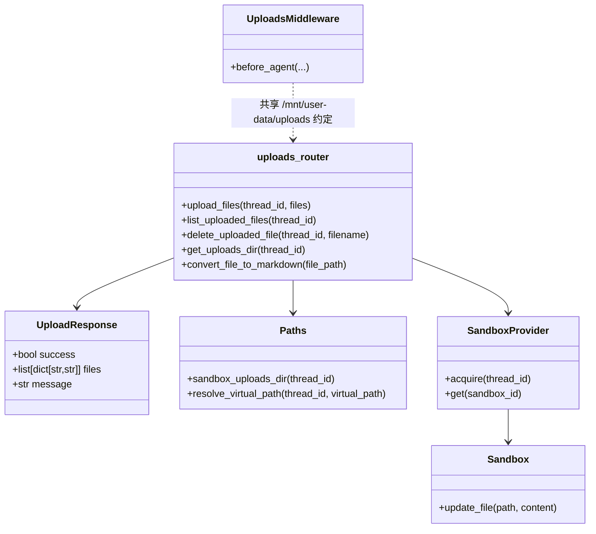
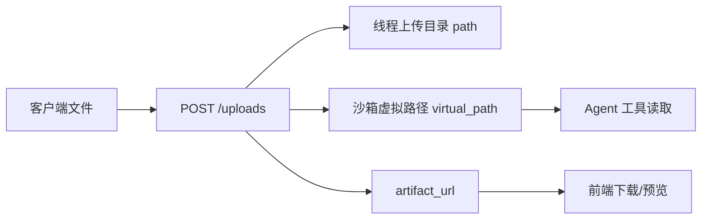

# uploads_api_contracts 模块文档

## 模块定位与设计目标

`uploads_api_contracts` 对应后端 `backend/src/gateway/routers/uploads.py` 中的上传接口契约，核心契约模型是 `UploadResponse`。虽然模块名强调“contracts”，但这个文件实际上同时承载了三层职责：第一层是 API 路由入口（上传、列出、删除）；第二层是文件元数据契约（返回给前端与调用方的结构）；第三层是路径语义桥接（主机文件路径、沙箱虚拟路径、artifact HTTP URL 的一致映射）。

该模块存在的根本原因是：系统并不是简单“收文件”，而是要让同一份上传内容同时服务于多个子系统。前端需要 URL 下载或预览，Agent 需要在沙箱内按虚拟路径读取，网关需要在线程作用域里进行存储隔离和安全治理。如果没有单点约束，路径规则、命名约定、返回字段会在不同层散落，最终导致上传行为不可预测。因此 `uploads.py` 被设计为线程文件管理的网关收敛点。

在模块树中，它属于 `gateway_api_contracts`，并与以下模块形成直接联动：路径解析依赖 [path_resolution_and_fs_security.md](path_resolution_and_fs_security.md)；沙箱文件注入依赖 [sandbox_core_runtime.md](sandbox_core_runtime.md)；Agent 在执行前如何感知上传文件，依赖 [thread_bootstrap_and_upload_context.md](thread_bootstrap_and_upload_context.md) 中的上传上下文中间件约定。

---

## 核心组件：`UploadResponse`

`UploadResponse` 是该模块唯一声明的显式 Pydantic 契约模型，用于 `POST /api/threads/{thread_id}/uploads` 的响应体。

```python
class UploadResponse(BaseModel):
    success: bool
    files: list[dict[str, str]]
    message: str
```

它的语义非常直接：`success` 表示本次上传批次是否成功；`files` 表示每个成功处理文件的元信息；`message` 是面向调用方的摘要文本。

需要特别注意的是，`files` 的类型被声明为 `list[dict[str, str]]`，这意味着从模型声明层面看所有值都应是字符串，但实现里存在数值语义字段（例如列表接口的 `size`、`modified` 通常为数字）。这会给强类型客户端带来“声明类型”和“实际值”不完全一致的问题。若你在 SDK 或前端做严格 schema 校验，建议建立归一化层。

---

## API 面与契约行为

虽然当前模块树将核心组件标注为 `UploadResponse`，但为了让维护者完整理解契约，必须把同文件中的三个路由一起看，因为它们共同定义了上传域的 API 行为。

### 1) 上传接口：`POST /api/threads/{thread_id}/uploads`

该接口接收 `multipart/form-data`，字段名是 `files`，支持一次上传多个文件。成功时返回 `UploadResponse`。

其处理逻辑包含以下关键步骤：首先校验文件列表非空；随后按线程获取上传目录；接着向 `SandboxProvider` 申请当前线程对应沙箱；然后逐文件进行文件名净化、内容读取、沙箱写入、返回字段构建；最后在可转换格式上尝试生成 Markdown 衍生产物并补充相关字段。

可转换扩展名集合为：`.pdf`、`.ppt`、`.pptx`、`.xls`、`.xlsx`、`.doc`、`.docx`。转换由 `markitdown` 提供。

### 2) 列表接口：`GET /api/threads/{thread_id}/uploads/list`

该接口返回一个未显式建模的 `dict`：

```json
{
  "files": [...],
  "count": 0
}
```

其中每个文件包含 `filename`、`size`、`path`、`virtual_path`、`artifact_url`、`extension`、`modified`。这组字段与 `POST` 的 `files[]` 字段存在交集，但并非完全一致（`POST` 会出现 `markdown_*`，`GET` 会出现 `modified` 等）。

### 3) 删除接口：`DELETE /api/threads/{thread_id}/uploads/{filename}`

该接口按文件名删除线程上传目录下目标文件。若文件不存在返回 404；若路径校验失败返回 403；删除异常返回 500；成功返回 `{"success": true, "message": ...}`。

---

## 内部架构与依赖关系



上图里最关键的关系不是 `UploadResponse` 本身，而是“路由逻辑与运行时约定”的耦合：`uploads.py` 把文件映射到 `/mnt/user-data/uploads/*`，而 `UploadsMiddleware`（见 [thread_bootstrap_and_upload_context.md](thread_bootstrap_and_upload_context.md)）会基于同一目录约定把上传内容注入 Agent 上下文。只要改动目录前缀或路径拼接规则，就必须联动校验中间件与前端下载链路。

---

## 数据流：一次上传如何变成三种可消费地址



该模块的重要价值在于把同一文件实体转换成三类地址语义：`path` 面向后端文件管理，`virtual_path` 面向 Agent 沙箱读取，`artifact_url` 面向 HTTP 访问。维护时要避免把这三者混为一谈，尤其不要把 `path` 直接暴露给前端作为下载地址。

---

## 关键函数逐项说明

### `get_uploads_dir(thread_id: str) -> Path`

该函数通过 `get_paths().sandbox_uploads_dir(thread_id)` 获取线程上传目录，并使用 `mkdir(parents=True, exist_ok=True)` 保证目录存在。它的副作用是可能在第一次访问线程时创建目录结构。

### `convert_file_to_markdown(file_path: Path) -> Path | None`

该函数在运行时动态导入 `markitdown.MarkItDown`，调用 `convert(str(file_path))` 进行转换，成功时写出同名 `.md` 文件并返回路径，失败则返回 `None`。这里采用“失败降级”策略：转换失败不会阻断主上传流程，只记录日志。

### `upload_files(thread_id: str, files: list[UploadFile]) -> UploadResponse`

这是上传域的核心入口。其入参是线程 ID 与文件数组，返回 `UploadResponse`。关键副作用包括：

- 触发线程目录创建；
- 向沙箱写入文件内容（`sandbox.update_file`）；
- 可能触发 markdown 衍生文件生成；
- 记录上传/失败日志。

错误行为方面：当 `files` 为空时返回 400；单文件处理中出现异常会抛出 500 并终止整个请求。

### `list_uploaded_files(thread_id: str) -> dict`

遍历线程上传目录并返回文件元数据。它依赖文件系统状态，而不是上传请求缓存，因此可作为“真实落盘视图”。需要注意它没有单独的 Pydantic response model，返回结构属于弱契约。

### `delete_uploaded_file(thread_id: str, filename: str) -> dict`

通过 `resolve().relative_to(...)` 做目录边界校验后执行删除，重点防止路径穿越删除。该函数只处理主文件，不自动处理可能存在的衍生 `.md` 文件，是否级联删除取决于上层调用策略。

---

## 与其他模块的接口边界

`uploads_api_contracts` 只负责上传域 API 契约与路径映射，不负责以下职责：它不负责前端状态管理（参考 [frontend_core_domain_types_and_state.md](frontend_core_domain_types_and_state.md)）；不负责沙箱实例生命周期策略（参考 [sandbox_core_runtime.md](sandbox_core_runtime.md)）；不负责上传文件在 Agent 提示词中的注入逻辑（参考 [thread_bootstrap_and_upload_context.md](thread_bootstrap_and_upload_context.md)）。

将边界明确后，排障会更快：如果“上传成功但 Agent 看不到文件”，优先排查中间件上下文注入与目录约定；如果“有 artifact_url 但下载失败”，优先排查 artifacts 路由和路径解析规则。

---

## 使用示例

### 上传多个文件

```bash
curl -X POST "http://localhost:8001/api/threads/t1/uploads" \
  -F "files=@/tmp/spec.pdf" \
  -F "files=@/tmp/table.xlsx"
```

示例响应（节选）：

```json
{
  "success": true,
  "files": [
    {
      "filename": "spec.pdf",
      "size": "18234",
      "path": ".../threads/t1/user-data/uploads/spec.pdf",
      "virtual_path": "/mnt/user-data/uploads/spec.pdf",
      "artifact_url": "/api/threads/t1/artifacts/mnt/user-data/uploads/spec.pdf",
      "markdown_file": "spec.md",
      "markdown_virtual_path": "/mnt/user-data/uploads/spec.md"
    }
  ],
  "message": "Successfully uploaded 1 file(s)"
}
```

### 列出文件

```bash
curl "http://localhost:8001/api/threads/t1/uploads/list"
```

### 删除文件

```bash
curl -X DELETE "http://localhost:8001/api/threads/t1/uploads/spec.pdf"
```

---

## 扩展建议

如果你要扩展该模块，最稳妥的方向是先提升契约显式性：为 `files[]` 项和 `list` 响应定义独立 Pydantic 模型，避免 `dict` 与隐式字段造成漂移。其次再考虑能力扩展，例如新增可转换格式、增加 MIME 白名单、增加文件大小限制、引入批量删除等。

当你扩展 `CONVERTIBLE_EXTENSIONS` 时，务必同时验证 `markitdown` 的真实支持能力，并在转换失败时保持“上传主流程不受影响”的降级特性。

---

## 边界条件、错误与已知限制

1. **空文件列表**：`POST` 会返回 400。
2. **文件名安全**：上传时通过 `Path(file.filename).name` 去除目录；删除时通过 `relative_to` 校验边界。
3. **批次失败语义**：当前实现遇到单文件异常会抛 500，可能导致“前面文件成功、后面失败”时客户端难以获知部分成功状态。
4. **类型漂移**：`UploadResponse.files` 声明为 `dict[str, str]`，但上下游常将部分字段按数值处理。
5. **转换依赖可选**：`markitdown` 缺失或转换异常不会使上传失败，但会缺少 `markdown_*` 字段。
6. **主文件与衍生文件生命周期**：删除接口不会自动级联处理同名 `.md` 文件，可能出现残留。
7. **实现一致性风险**：上传流程主要通过 `sandbox.update_file` 写入沙箱路径；若运行时后端未将其映射到线程上传目录，`list`/转换行为可能与预期不一致。部署时需结合具体 `SandboxProvider` 实现验证。

---

## 维护建议（面向后续重构）

建议把该模块从“弱类型字典契约”演进为“强类型契约 + 统一元数据模型”，并补充上传大小限制、MIME 校验与可观察性指标（上传耗时、转换耗时、失败率）。这样可以显著降低前后端协作成本，并提升生产环境问题定位效率。
