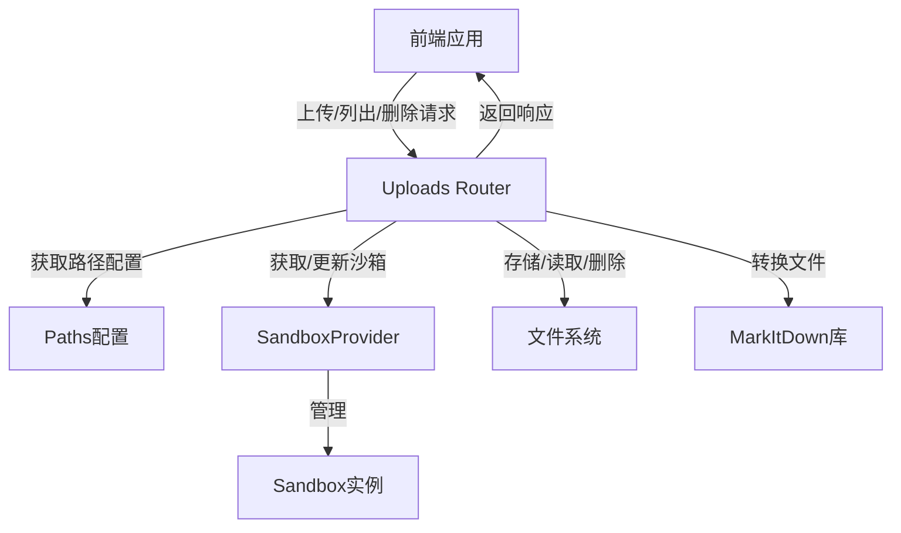
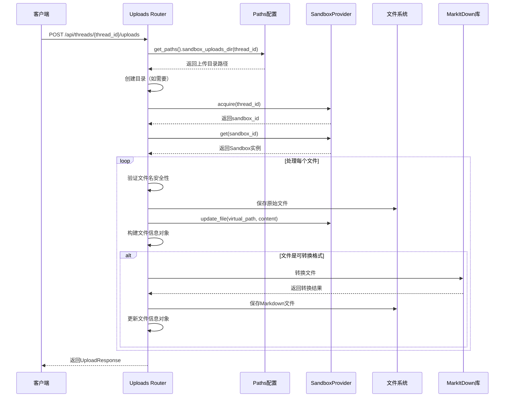

# Uploads Router 模块文档

## 模块概述

Uploads Router 模块是一个专门用于处理文件上传、列出和删除操作的API网关组件。该模块为应用程序提供了线程级别的文件管理功能，允许用户在特定线程上下文中上传文件、查看已上传文件列表以及删除不需要的文件。特别地，该模块内置了对常见文档格式（如PDF、PowerPoint、Excel和Word文档）的Markdown转换功能，使这些文件内容能够在应用程序中更容易被处理和展示。

### 设计理念

该模块的设计遵循以下几个核心原则：
1. **线程隔离**：每个线程都有独立的上传目录，确保文件在不同会话间的隔离性
2. **安全优先**：实施严格的文件名验证和路径安全检查，防止路径遍历攻击
3. **智能转换**：自动将支持的文档格式转换为Markdown，提高内容可读性和可用性
4. **多路径映射**：维护文件系统路径、虚拟路径和HTTP访问URL的多重映射，满足不同场景的访问需求

## 核心组件

### UploadResponse

`UploadResponse` 是一个用于标准化文件上传操作响应的Pydantic模型。

```python
class UploadResponse(BaseModel):
    """Response model for file upload."""
    success: bool
    files: list[dict[str, str]]
    message: str
```

#### 字段说明

- **success** (bool)：表示上传操作是否整体成功
- **files** (list[dict[str, str]])：包含已上传文件详细信息的列表，每个文件信息包含：
  - `filename`：安全的文件名
  - `size`：文件大小（字节数）
  - `path`：实际文件系统路径（相对于backend/目录）
  - `virtual_path`：沙箱中代理访问文件的路径
  - `artifact_url`：通过HTTP访问文件的URL
  - 对于可转换文件，还会包含额外的Markdown相关字段
- **message** (str)：操作结果的人类可读描述

### 关键函数

#### get_uploads_dir(thread_id: str) -> Path

获取指定线程的上传目录路径，如果目录不存在则创建。

**参数**：
- `thread_id` (str)：线程标识符

**返回值**：
- `Path`：上传目录的路径对象

**功能**：
此函数确保每个线程都有独立的上传目录，并通过`get_paths().sandbox_uploads_dir(thread_id)`获取基础目录路径，然后使用`mkdir(parents=True, exist_ok=True)`确保目录存在。

#### convert_file_to_markdown(file_path: Path) -> Path | None

使用markitdown库将文件转换为Markdown格式。

**参数**：
- `file_path` (Path)：要转换的文件路径

**返回值**：
- `Path | None`：成功转换时返回Markdown文件路径，否则返回None

**功能**：
此函数尝试使用markitdown库将支持的文件格式转换为Markdown。它会创建一个与原文件同名但扩展名为.md的新文件，并将转换后的内容写入其中。整个过程被包裹在异常处理中，确保即使转换失败也不会中断主流程。

#### upload_files(thread_id: str, files: list[UploadFile]) -> UploadResponse

处理文件上传的主要API端点，支持多文件上传和自动格式转换。

**参数**：
- `thread_id` (str)：线程标识符
- `files` (list[UploadFile])：要上传的文件列表

**返回值**：
- `UploadResponse`：包含上传结果的响应对象

**功能**：
1. 验证输入：确保至少提供了一个文件
2. 获取上传目录和沙箱实例
3. 遍历处理每个文件：
   - 验证文件名安全性
   - 保存原始文件
   - 更新沙箱中的文件
   - 构建文件信息对象
   - 检查是否需要转换为Markdown并执行转换
4. 收集所有成功上传的文件信息并返回响应

**异常处理**：
- 如果没有提供文件，抛出400错误
- 文件处理过程中的任何异常都被记录并转换为500错误

#### list_uploaded_files(thread_id: str) -> dict

列出指定线程已上传的所有文件。

**参数**：
- `thread_id` (str)：线程标识符

**返回值**：
- `dict`：包含文件列表和计数的字典，格式为`{"files": [...], "count": n}`

**功能**：
1. 获取线程的上传目录
2. 如果目录不存在，返回空列表
3. 遍历目录中的所有文件，收集每个文件的元数据
4. 返回文件列表和计数

#### delete_uploaded_file(thread_id: str, filename: str) -> dict

删除指定线程中的特定文件。

**参数**：
- `thread_id` (str)：线程标识符
- `filename` (str)：要删除的文件名

**返回值**：
- `dict`：包含操作成功状态和消息的字典

**功能**：
1. 构建文件路径
2. 检查文件是否存在
3. 执行安全检查，确保路径在允许的上传目录内
4. 删除文件并返回成功消息

**安全措施**：
- 验证文件存在性，不存在则返回404
- 使用`resolve().relative_to()`确保路径安全，防止路径遍历攻击，违规则返回403

## 模块架构与数据流

### 架构概览

Uploads Router模块作为API网关的一部分，位于前端请求和后端存储/处理系统之间。它与多个核心模块交互，共同完成文件管理功能。



### 上传流程详解

当用户请求上传文件时，系统执行以下步骤：



## 使用指南

### 基础使用

#### 上传文件

上传文件到特定线程：

```python
import requests

# 上传单个或多个文件
files = [
    ('files', ('document.pdf', open('document.pdf', 'rb'), 'application/pdf')),
    ('files', ('image.png', open('image.png', 'rb'), 'image/png'))
]

response = requests.post(
    'http://api.example.com/api/threads/thread-123/uploads',
    files=files
)

result = response.json()
if result['success']:
    print(f"Uploaded {len(result['files'])} files")
    for file in result['files']:
        print(f"  - {file['filename']} ({file['size']} bytes)")
        if 'markdown_file' in file:
            print(f"    Converted to: {file['markdown_file']}")
```

#### 列出已上传文件

获取特定线程的所有已上传文件：

```python
import requests

response = requests.get(
    'http://api.example.com/api/threads/thread-123/uploads/list'
)

result = response.json()
print(f"Found {result['count']} files:")
for file in result['files']:
    print(f"  - {file['filename']} ({file['size']} bytes)")
    print(f"    Modified: {file['modified']}")
```

#### 删除文件

从特定线程删除文件：

```python
import requests

filename = 'document.pdf'
response = requests.delete(
    f'http://api.example.com/api/threads/thread-123/uploads/{filename}'
)

result = response.json()
if result['success']:
    print(result['message'])
```

### 配置与依赖

#### 可转换文件类型

模块默认支持以下文件类型的Markdown转换：
- PDF (.pdf)
- PowerPoint (.ppt, .pptx)
- Excel (.xls, .xlsx)
- Word (.doc, .docx)

这些类型在`CONVERTIBLE_EXTENSIONS`集合中定义，可以根据需要进行扩展。

#### 依赖项

该模块依赖以下外部库和内部组件：
- `fastapi`：Web框架
- `pydantic`：数据验证
- `markitdown`：文档转换（可选，仅在转换时需要）
- `src.config.paths`：路径配置
- `src.sandbox.sandbox_provider`：沙箱提供程序

#### 路径配置

模块使用`Paths`配置来确定上传文件的存储位置。特别是`sandbox_uploads_dir(thread_id)`方法用于获取特定线程的上传目录。

## 安全考量

### 文件名安全

模块采取多重措施确保文件名安全：
1. 使用`Path(file.filename).name`提取纯文件名，去除任何路径成分
2. 验证提取后的文件名不为空
3. 在删除操作中，使用`resolve().relative_to()`确保文件确实位于预期的上传目录中

### 路径遍历防护

删除操作中实施的路径遍历防护特别重要：

```python
# Security check: ensure the path is within the uploads directory
try:
    file_path.resolve().relative_to(uploads_dir.resolve())
except ValueError:
    raise HTTPException(status_code=403, detail="Access denied")
```

这段代码确保即使攻击者尝试使用`../../../../../etc/passwd`这样的路径，系统也会拒绝访问。

## 注意事项与限制

### 已知限制

1. **Markdown转换依赖**：文件转换功能需要`markitdown`库，如果该库未安装或出现问题，转换将失败，但原始文件仍会被保存
2. **转换性能**：大文件转换可能需要较长时间和较多内存，可能导致请求超时
3. **文件覆盖**：上传同名文件将覆盖现有文件，没有版本控制机制
4. **删除限制**：删除操作只删除文件，不删除可能对应的Markdown转换文件

### 错误处理

模块使用FastAPI的HTTPException来处理错误情况：
- 400 Bad Request：未提供文件
- 403 Forbidden：尝试访问不允许的路径
- 404 Not Found：尝试删除不存在的文件
- 500 Internal Server Error：文件处理过程中的任何其他错误

所有错误都被记录在日志中，可通过配置的日志系统进行监控。

### 扩展建议

1. **文件类型验证**：添加基于内容的文件类型验证，而不仅仅依赖扩展名
2. **文件大小限制**：实现可配置的文件大小限制
3. **异步处理**：对于大文件或批量上传，考虑使用后台任务处理
4. **病毒扫描**：集成病毒扫描功能，确保上传文件的安全性
5. **文件配额**：实现基于线程或用户的存储配额管理

## 相关模块

- [paths](paths.md)：路径配置模块，定义了上传目录的位置
- [sandbox_core_runtime](sandbox_core_runtime.md)：沙箱运行时模块，提供沙箱环境管理
- [gateway_api_contracts](gateway_api_contracts.md)：API契约模块，包含相关数据模型定义
