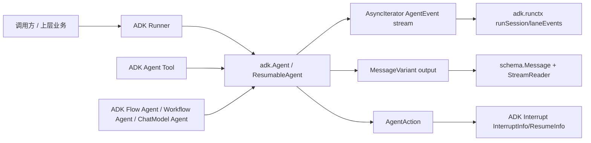

# ADK Agent Interface

`ADK Agent Interface` 是整个 ADK 体系里的“交通规则层”：它不直接做推理、不直接调模型，而是统一定义了 **Agent 如何接收输入、如何产出事件、如何表达控制动作（退出/转交/中断）以及如何恢复执行**。如果没有这一层，系统里不同类型的 agent（例如 ChatModel agent、workflow agent、flow agent）会各自发明一套输入输出协议，结果就是 Runner 无法通用、跨 agent 转交难以组合、checkpoint/resume 无法稳定落盘。这个模块的核心价值不是“多一个 interface”，而是把多智能体执行过程抽象成一条可流式、可中断、可恢复的事件流合同。

---

## 架构角色与数据流



从依赖关系看，`adk.interface` 位于 ADK 执行面的中轴位置：

1. **上游调用者**（直接业务代码或封装层）并不需要知道某个具体 agent 的内部实现，只需要通过 `Agent.Run(...)` 或 `ResumableAgent.Resume(...)` 获取 `AsyncIterator[*AgentEvent]`。
2. **`ADK Runner`** 通过其 `Runner` 结构中的 `a Agent` 字段，直接依赖这个接口合同，实现统一调度和（可选）checkpoint。
3. **具体 agent 实现**（如 `ChatModelAgent`、`workflowAgent`、`flowAgent`）都通过实现 `Agent` 接口接入统一执行面。
4. **消息层契约** 下沉到 `schema.Message` 与 `schema.StreamReader`，由 `MessageVariant` 做“单条消息 vs 流式消息”的统一封装。
5. **控制流契约**（`AgentAction`）把“内容输出”和“执行动作”分开编码，使得事件既可携带模型内容，也可表达流程控制指令。

如果用类比：可以把这个模块看成“多智能体系统的 TCP 协议层”。各个 agent 是不同应用进程，Runner 是网络栈，`AgentEvent` 是数据包格式。只要遵守包格式，不同实现就能互联互通。

---

## 心智模型：把一次 Agent 执行看成“事件流 + 控制信号”

新加入项目时，建议把这个模块记成三层抽象：

- `AgentInput`：执行请求（输入消息 + 是否流式）
- `AgentEvent`：执行过程中不断产出的事件（输出、动作、错误）
- `AgentAction`：与文本输出并行的控制信号（退出、转交、中断、循环控制）

关键不是“返回一条最终 answer”，而是 **持续产出事件**。因此接口设计采用 `Run(...) *AsyncIterator[*AgentEvent]`，而不是 `Run(...) (*AgentEvent, error)`。这使系统天然支持：

- token 级或 chunk 级流式输出；
- 中途转交给其他 agent（handoff）；
- 中断后恢复（resume）；
- 多 agent 复合执行中的事件转发与路径标注（`RunPath`）。

---

## 核心组件深潜

## `Agent` 与 `ResumableAgent`：统一执行合同

`Agent` 接口定义了最小可运行能力：

```go
type Agent interface {
    Name(ctx context.Context) string
    Description(ctx context.Context) string
    Run(ctx context.Context, input *AgentInput, options ...AgentRunOption) *AsyncIterator[*AgentEvent]
}
```

设计意图上，`Name/Description` 不只是展示字段，它们在多 agent 场景中也是路由和可观测性的基础元数据。`Run` 返回 `AsyncIterator` 是整个 ADK 的关键决策：把 agent 执行建模为异步事件源，而不是阻塞函数调用。

`ResumableAgent` 在 `Agent` 基础上增加：

```go
Resume(ctx context.Context, info *ResumeInfo, opts ...AgentRunOption) *AsyncIterator[*AgentEvent]
```

这让“是否支持恢复”成为显式能力分层：

- 实现 `Agent`：可运行；
- 实现 `ResumableAgent`：可从中断点恢复。

这是一个经典的接口分层 tradeoff：避免把 `Resume` 强加给所有 agent（简化普通实现），同时给需要可靠长流程的实现提供标准扩展位。

> 代码中的重要隐式契约：`Run` 注释要求返回的 `AgentEvent` 可安全修改；若事件里包含 `MessageStream`，该 stream 必须是独占可消费的，并建议 `SetAutomaticClose()`。这说明框架默认事件可能被中间层二次加工，且强依赖流资源生命周期正确管理。

## `AgentInput`：最小输入面

`AgentInput` 只有两个字段：

- `Messages []Message`
- `EnableStreaming bool`

这看起来“过于简单”，但背后是 deliberate choice：让输入协议稳定，复杂控制（重试、回调、上下文注入）放在 `AgentRunOption` 和上层运行时。简单输入面降低了跨 agent 互操作成本。

## `AgentEvent`：事件作为统一传输单位

`AgentEvent` 结构：

- `AgentName string`
- `RunPath []RunStep`
- `Output *AgentOutput`
- `Action *AgentAction`
- `Err error`

它把三类信息放进同一个 envelope：

1. **数据面**：`Output`
2. **控制面**：`Action`
3. **异常面**：`Err`

这种设计避免了“输出通道 + 动作通道 + 错误通道”三路并发同步问题。上游只需消费一条事件流就能重建执行轨迹。

其中 `RunPath` 的设计非常关键：`RunStep` 的字段 `agentName` 是未导出字段，注释明确它由框架管理（`flowAgent` 在空路径时设置；`agentTool` 转发嵌套 agent 事件时前置父路径）。这是一种 **受控可写** 机制：用户看得见路径，但不能伪造路径，保证审计与恢复语义可靠。

## `RunStep`：可序列化且受保护的路径节点

`RunStep` 提供 `String()`、`Equals(...)`、`GobEncode/GobDecode`，并在 `init()` 中注册：

```go
schema.RegisterName[[]RunStep]("eino_run_step_list")
```

这显示它被当作 checkpoint schema 的稳定类型名来持久化。这里的取舍是：

- 使用 gob 编码，快速接入 Go 原生序列化生态；
- 通过注册名保证跨组件恢复时可识别；
- 用私有字段防止外部篡改运行路径。

## `MessageVariant`：把“普通消息”和“流消息”压成一个抽象

`MessageVariant` 同时容纳：

- `Message`（非流式）
- `MessageStream`（流式）
- `IsStreaming`（判别位）
- `Role`、`ToolName`（消息角色元信息）

这避免了在事件层定义两个不同输出类型。调用方只需要记住：先看 `IsStreaming`，或直接调用 `GetMessage()` 取聚合结果。

### 为什么有 `GobEncode/GobDecode`

`MessageVariant` 自定义 gob 逻辑的核心是：**stream 不能直接稳定序列化**。实现策略是把流消费完并 `ConcatMessages` 成单条 `Message` 后再编码。

这背后有明显 tradeoff：

- 优点：checkpoint/跨边界传输时数据结构稳定；
- 代价：编码阶段会“消耗”原始流（一次性资源），并带来内存聚合成本。

因此如果你在扩展中复用 `MessageStream`，必须意识到序列化路径会 drain stream。

### `GetMessage()` 的语义

`GetMessage()` 在流式情况下调用 `schema.ConcatMessageStream(mv.MessageStream)`；该函数内部会 `defer s.Close()` 并迭代到 EOF。也就是说，获取聚合消息是一个 **消耗性读取** 行为，不是纯 getter。

## `AgentOutput`：业务输出扩展槽

`AgentOutput` 包含：

- `MessageOutput *MessageVariant`
- `CustomizedOutput any`

这是面向未来的兼容点。框架内通用逻辑主要看 `MessageOutput`；如果某类 agent 有额外结构化结果，可放在 `CustomizedOutput`。tradeoff 是类型安全下降（`any`），但扩展灵活性极高。

## `AgentAction`：控制信号总线

`AgentAction` 当前承载：

- `Exit bool`
- `Interrupted *InterruptInfo`
- `TransferToAgent *TransferToAgentAction`
- `BreakLoop *BreakLoopAction`
- `CustomizedAction any`
- `internalInterrupted *core.InterruptSignal`（内部字段）

配套 helper：

- `NewTransferToAgentAction(destAgentName string)`
- `NewExitAction()`

最重要的是注释里的“作用域规则”：当 agent 被包装为 agent tool（`NewAgentTool`）时，内层 agent 的 `Exit/TransferToAgent/BreakLoop` 不向父层传播，只有中断通过 composite 机制跨边界传播。这是一个非常有意识的隔离设计，防止嵌套 agent 意外“杀掉”父流程。

## `EventFromMessage(...)`：消息转事件的便捷桥

`EventFromMessage` 把 `Message` 或 `MessageStream` 包装成标准 `AgentEvent`，并写入 `Role/ToolName` 元信息。它主要减少重复样板代码，同时确保输出结构一致。

## `OnSubAgents`：子 agent 生命周期回调协定

`OnSubAgents` 提供三个回调：

- `OnSetSubAgents`
- `OnSetAsSubAgent`
- `OnDisallowTransferToParent`

这不是执行期主路径，而是拓扑装配期的“握手协议”。它让具体 agent 在被编排进父子结构时有机会同步内部状态，例如禁止向父级转交流程。

---

## 依赖分析：谁依赖它，它依赖谁

从提供的组件结构和类型关系可确认：

`ADK Agent Interface` 直接依赖：

- [Schema Core Types](Schema Core Types.md)：`schema.Message`、`schema.RoleType`、`ConcatMessages`、`ConcatMessageStream`。
- [Schema Stream](Schema Stream.md)：`schema.StreamReader`（通过 `MessageStream` 使用）。
- [Internal Core](Internal Core.md)（在树中为 Internal Core）：`core.InterruptSignal`（`AgentAction` 内部字段）。
- [ADK Utils](ADK Utils.md)：`AsyncIterator` 作为运行返回通道。
- [ADK Interrupt](ADK Interrupt.md)：`InterruptInfo`、`ResumeInfo` 作为中断/恢复契约。

主要下游（通过字段或实现关系可见）包括：

- [ADK Runner](ADK Runner.md)：`Runner` 持有 `a Agent`，统一运行入口。
- `adk.runctx`：`runContext` 持有 `*AgentInput` 与 `[]RunStep`，`agentEventWrapper` 包装 `*AgentEvent`。
- [ADK Agent Tool](ADK Agent Tool.md)：`agentTool` 持有 `agent Agent`，把 agent 暴露成工具时复用同一事件/动作契约。
- [ADK Flow Agent](ADK Flow Agent.md)：`flowAgent` 嵌入/组合 `Agent`，并维护父子 agent 关系与转交约束。
- [ADK ChatModel Agent](ADK ChatModel Agent.md)：`subAgents []Agent`、`parentAgent Agent`。
- [ADK Workflow Agents](ADK Workflow Agents.md)：`workflowAgent` 组合子 agent 流程。

数据合同的关键耦合点在于：

- 上游必须消费 `AsyncIterator[*AgentEvent]`；
- 下游必须遵循 `AgentEvent` 内 output/action/error 的编码方式；
- 任何依赖 `RunPath` 的调试/恢复逻辑都假设路径由框架独占维护。

---

## 关键设计决策与权衡

### 1) 事件流模型（灵活）优先于同步返回（简单）

选择 `AsyncIterator` 让 streaming、中断、handoff 成为一等公民，但复杂度转移到了消费端：需要正确处理事件顺序、流关闭、部分结果。

### 2) `MessageVariant` 统一抽象（接口整洁）vs 流语义复杂（一次性消费）

统一后接口很干净；但调用方必须理解 stream 的一次性语义，尤其在 `GetMessage()` 和 gob 编码路径下会被消费。

### 3) `any` 扩展槽（高扩展）vs 弱类型约束

`CustomizedOutput`/`CustomizedAction` 让框架可演进，但也要求调用方自定义类型断言和版本兼容策略。

### 4) RunPath 私有字段（正确性）vs 外部可控性

不允许用户手工设置 `RunStep.agentName`，强化了执行轨迹可信度；代价是做高级自定义路由时自由度降低。

### 5) agent-tool 动作作用域隔离（安全）vs 跨层控制能力

阻断内层 `Exit/TransferToAgent/BreakLoop` 向外传播，减少意外副作用；但也意味着某些“全局控制”需求要通过显式协议实现，而不能偷懒透传。

---

## 使用方式与示例

下面示例只使用本模块真实存在的 API。

### 实现一个最小 Agent

```go
type MyAgent struct{}

func (a *MyAgent) Name(ctx context.Context) string { return "my_agent" }
func (a *MyAgent) Description(ctx context.Context) string { return "demo" }

func (a *MyAgent) Run(ctx context.Context, input *adk.AgentInput, opts ...adk.AgentRunOption) *adk.AsyncIterator[*adk.AgentEvent] {
    // 伪代码：按你们项目里 AsyncIterator 的构造方式返回
    // 重点是产出 *adk.AgentEvent
    return nil
}
```

### 生成消息事件

```go
ev := adk.EventFromMessage(msg, nil, schema.Assistant, "")
// ev.Output.MessageOutput.IsStreaming == false
```

如果是工具消息：

```go
ev := adk.EventFromMessage(toolMsg, nil, schema.Tool, "search_tool")
```

### 生成控制动作

```go
exit := adk.NewExitAction()
transfer := adk.NewTransferToAgentAction("planner_agent")

_ = &adk.AgentEvent{Action: exit}
_ = &adk.AgentEvent{Action: transfer}
```

### 读取 `MessageVariant`

```go
m, err := ev.Output.MessageOutput.GetMessage()
if err != nil {
    // 处理流拼接错误
}
_ = m
```

注意：在流式场景这会消费底层 `MessageStream`。

---

## 新贡献者最容易踩的坑

第一，**把 `GetMessage()` 当成无副作用 getter**。它在流式场景会读取并关闭流；如果你后续还想逐帧读，就会发现数据已被消费。

第二，**忽略 stream 独占约束**。`Agent` 注释明确要求 `MessageStream` 必须可被直接、独占消费。如果多个协程同时读同一流，行为不可预测。

第三，**手工拼 `RunPath`**。不要尝试在业务层“伪造”运行路径。该字段设计上由框架维护，尤其在嵌套 agent + agent tool 转发场景中有严格语义。

第四，**在 agent tool 场景误判动作传播**。内层 agent 发出的 `Exit/TransferToAgent/BreakLoop` 不会影响外层 agent 的控制流，这是故意的边界隔离。

第五，**忽视 gob 序列化对流的影响**。`MessageVariant.GobEncode()` 会收敛流并编码为单消息，适合持久化，不适合“边序列化边继续流式消费”的想象。

---

## 参考阅读

- [ADK Runner](ADK Runner.md)：接口如何被调度执行与 checkpoint 管理。  
- [ADK Interrupt](ADK Interrupt.md)：`InterruptInfo/ResumeInfo` 的完整语义。  
- [ADK Agent Tool](ADK Agent Tool.md)：agent 包装为 tool 时的动作作用域边界。  
- [ADK Flow Agent](ADK Flow Agent.md)：`RunPath` 在多级 agent 转发中的实际维护。  
- [ADK ChatModel Agent](ADK ChatModel Agent.md)：典型 `Agent` 实现。  
- [Schema Core Types](Schema Core Types.md)：`schema.Message` 拼接与 role/tool 字段语义。  
- [Schema Stream](Schema Stream.md)：`StreamReader` 生命周期与消费模型。  
