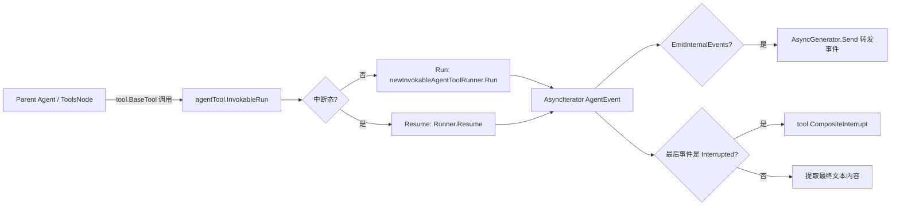

# ADK Agent Tool

`ADK Agent Tool` 的核心价值，是把一个 `Agent` 包装成“可被另一个 Agent 当作 Tool 调用”的能力。直白说，它解决的是**多层 Agent 组合**中的边界问题：上层 Agent 想把下层 Agent 当函数调用，但下层 Agent 又有自己的事件流、中断恢复、会话状态与动作语义（如 `Exit` / `TransferToAgent`）。如果直接“嵌套调用”，很容易出现状态串线、动作越权、恢复点丢失。这个模块的设计重点不是“调用一下子 Agent”，而是**在 Agent 边界上做协议转换与隔离**，既复用 Agent 能力，又不破坏父 Agent 的执行控制。

---

## 架构角色与数据流

从架构位置看，`adk.agent_tool` 是一个 **Adapter + Boundary Guard**：

- 对上：实现 Tool 语义（`Info`、`InvokableRun`），供 Tool 节点统一调度。
- 对下：驱动真实 `Agent`（通过 `Runner` 运行或恢复）。
- 对中：处理跨边界的输入映射、事件转发、动作裁剪、中断桥接。



这个图里最关键的不是执行链路本身，而是两处“边界控制点”：

第一处是 `InvokableRun` 入口，它把 Tool 参数与 Agent 输入对齐，并区分首次运行/恢复运行。第二处是事件循环末端，它决定哪些内部事件可以透出给上层（用于实时展示），哪些动作必须截断在工具边界内（避免内层 Agent 影响外层控制流）。

---

## 心智模型：把它当成“带海关的跨国转运站”

可以把 `agentTool` 想成一个跨国转运站：

- **货物**是消息输入输出（`argumentsInJSON` ↔ `[]Message` ↔ `string`）。
- **航班**是内层 Agent 的事件流（`AsyncIterator[*AgentEvent]`）。
- **海关**是动作与中断边界策略：
  - 普通事件可转发给上层观众（`AsyncGenerator`）。
  - `Interrupted` 要走专门通道（`tool.CompositeInterrupt`），因为要支持恢复。
  - `Exit` / `TransferToAgent` / `BreakLoop` 不允许“出境”，只能在内层生效。

这个模型能帮助你理解一个常见误区：`agentTool` 不是简单的“函数调用包装器”，它是**语义收敛器**。它把 Agent 世界里更丰富的运行语义压缩成 Tool 世界可以安全消费的接口。

---

## 关键组件深潜

### 1) `AgentToolOptions` 与 `AgentToolOption`

`AgentToolOptions` 只有两个字段：

- `fullChatHistoryAsInput bool`
- `agentInputSchema *schema.ParamsOneOf`

这看起来很小，但对应两个非常关键的策略开关。

`WithFullChatHistoryAsInput()` 决定输入是“单轮请求”还是“重建后的聊天上下文”。默认情况下，工具参数会被当成当前用户请求；打开后会从状态中提取历史并做改写后喂给子 Agent。这是**上下文完整性 vs 输入简洁性**的取舍。

`WithAgentInputSchema(schema *schema.ParamsOneOf)` 允许覆盖默认参数模式。默认 schema 是 `{"request": string}`，这对大多数工具调用最稳妥；但当调用方已建立更严格的参数契约时，可自定义 schema 并自行解释 JSON 入参。

---

### 2) `NewAgentTool`

签名：`NewAgentTool(_ context.Context, agent Agent, options ...AgentToolOption) tool.BaseTool`

它做了两件事：

1. 聚合 `AgentToolOption` 到 `AgentToolOptions`。
2. 返回 `*agentTool`（以 `tool.BaseTool` 形式暴露）。

这里的设计意图是让调用方只看到 Tool 抽象，不暴露内部运行细节。也因此，很多控制能力通过内部 `tool.Option` 扩展（如事件生成器、流式开关），而不是挂在公开构造函数上。这是典型的“公开 API 保守、内部协议可演进”策略。

---

### 3) `agentTool.Info`

`Info` 输出 `schema.ToolInfo`，核心字段：

- `Name`: 来自 `at.agent.Name(ctx)`
- `Desc`: 来自 `at.agent.Description(ctx)`
- `ParamsOneOf`: 使用 `inputSchema` 或默认 `defaultAgentToolParam`

`Info` 的本质是把 Agent 的可发现信息映射为 Tool 元数据，供上层模型/调度器感知可调用能力。这里体现一个隐式契约：**Tool 名称与 Agent 名称绑定**。后续 `getOptionsByAgentName` 也依赖这个名称匹配，如果名称不稳定，选项路由会失效。

---

### 4) `agentTool.InvokableRun`（模块核心）

这是最关键路径。它内部可以分五段看。

**第一段：解析运行控制选项**

`getEmitGeneratorAndEnableStreaming(opts)` 从 `tool.Option` 中提取：

- `generator *AsyncGenerator[*AgentEvent]`
- `enableStreaming bool`

这是一种“实现特定选项通道”（`tool.WrapImplSpecificOptFn` + `tool.GetImplSpecificOptions`）。优点是避免污染通用 Tool 接口；代价是选项类型耦合在实现侧，不够直观。

**第二段：处理中断分支（Run vs Resume）**

通过 `tool.GetInterruptState[[]byte](ctx)` 判断：

- 非中断：创建 `newBridgeStore()`，构造输入后调用 `Runner.Run`。
- 中断恢复：要求必须有 state；否则报错。然后 `newResumeBridgeStore(state)` + `Runner.Resume`。

这一段体现了模块最重要的正确性目标：**工具级调用也要保留 Agent 级恢复语义**。没有这层桥接，子 Agent 中断后父 Agent 无法可靠恢复。

**第三段：输入组装**

- 若 `fullChatHistoryAsInput=true`：调用 `getReactChatHistory(ctx, at.agent.Name(ctx))`。
- 否则：
  - 若未自定义 schema，按 `{"request": "..."}` 反序列化，再把 `request` 作为用户消息内容。
  - 若有自定义 schema，不做该拆解，直接把原始 `argumentsInJSON` 作为 `schema.UserMessage(argumentsInJSON)`。

这段有一个非常实用但容易踩坑的语义：**自定义 schema 并不会自动解析为结构化字段再注入消息**，这里只负责透传字符串。换言之，结构化参数解释应由内层 Agent 自己处理。

**第四段：事件循环与转发**

循环 `iter.Next()` 消费 `AgentEvent`：

- 先关闭上一条事件里可能存在的 `MessageStream`，避免流资源悬挂。
- 若 `event.Err != nil` 立即返回。
- 若配置了生成器且当前事件不是 `Interrupted`：
  - 若存在父 `runContext.RunPath`，把父路径前缀拼到当前 `event.RunPath`。
  - `copyAgentEvent(event)` 后调用 `gen.Send(event)`，再把 `event` 还原为副本，避免下游副作用污染本地处理。

这里体现出作者对**流式事件共享对象可变性**的防御：Agent 接口明确说事件“必须可修改”，这给了高性能复用空间，但跨组件共享时容易互相踩内存。`copyAgentEvent` 是一个边界拷贝保险丝。

**第五段：收尾判定与返回值**

- 若最后事件是 `Interrupted`：从 bridge store 取 `bridgeCheckpointID` 对应数据，调用 `tool.CompositeInterrupt(...)` 返回可恢复中断。
- 若没有任何事件：返回 `no event returned`。
- 正常路径：从 `lastEvent.Output.MessageOutput.GetMessage().Content` 取字符串作为 Tool 返回。

这意味着 `agentTool` 对外是“字符串工具”，即便内部有复杂多模态/结构化输出，最终只抽取 message content。这个选择简化了 Tool 接口对接，但牺牲了输出丰富性。

---

### 5) `agentToolOptions` 及相关函数（内部选项总线）

`agentToolOptions` 承载内部路由信息：

- `agentName string`
- `opts []AgentRunOption`
- `generator *AsyncGenerator[*AgentEvent]`
- `enableStreaming bool`

相关函数：

- `withAgentToolOptions(agentName, opts)`：把某个目标 agent 的运行选项塞进 `tool.Option`。
- `withAgentToolEventGenerator(gen)`：塞事件生成器。
- `withAgentToolEnableStreaming(enabled)`：塞流式标志。
- `getOptionsByAgentName(agentName, opts)`：按 agent 名筛出对应 `AgentRunOption`。
- `getEmitGeneratorAndEnableStreaming(opts)`：提取生成器和流式标志。

这套机制相当于“隐形控制面”。它允许上层在统一 Tool 调用链路里，向特定 `agentTool` 精确投递运行配置。

---

### 6) `getReactChatHistory`

该函数把当前状态改造成可供目标 Agent 使用的历史输入，步骤是：

1. `compose.ProcessState` 读取 `*State`。
2. 复制 `st.Messages` 但去掉最后一条 assistant 消息（注释说明这是 tool call message）。
3. 追加 `GenTransferMessages(ctx, destAgentName)` 生成的两条消息。
4. 遍历过滤：
   - 丢弃 `schema.System`。
   - 对 `schema.Assistant` / `schema.Tool` 调用 `rewriteMessage(msg, agentName)`。

该实现明显针对 React/工具调用场景做了定制，重点是“把父上下文重写成子 Agent 可理解的对话轨迹”。这提升了子 Agent 上下文感知能力，但也引入了格式假设（例如最后一条必须是 tool call assistant message）。

---

### 7) `newInvokableAgentToolRunner`

只是构造 `Runner`：

- `a: agent`
- `enableStreaming: enableStreaming`
- `store: compose.CheckPointStore`

它存在的意义是把 `agentTool` 的桥接存储和流式配置，稳定地注入 Runner，避免在主流程里散落构造逻辑。

---

## 依赖关系与调用契约

`adk.agent_tool` 依赖的关键模块与目的如下：

- [ADK Agent Interface](ADK Agent Interface.md)：使用 `Agent`、`AgentEvent`、`AgentAction`、`Message` 作为核心运行协议。
- [runner_lifecycle_and_checkpointing](runner_lifecycle_and_checkpointing.md)：通过 `Runner` 执行/恢复子 Agent。
- [Compose Checkpoint](Compose Checkpoint.md)：`bridgeStore` 实现 `compose.CheckPointStore`，承接中断数据。
- [Compose Graph Engine](Compose Graph Engine.md)：`compose.ProcessState` 读取运行时 `State`。
- [Component Interfaces](Component Interfaces.md)：对外符合 `tool.BaseTool` / invokable tool 生态。
- [Compose Tool Node](Compose Tool Node.md)：上层工具节点可携带 `tool.Option` 与 `ToolList`，与本模块内部选项通道对接。

反向看，谁会调用它：

- 任何需要把 `Agent` 暴露为 Tool 的 Agent 编排层。
- 在 `ToolsConfig.EmitInternalEvents` 场景下，上层会向其注入 generator 以转发内部事件（该语义在 `ToolsConfig` 注释里明确）。

数据契约上，最重要的几点是：

- Tool 入参默认必须是 `{"request": string}`（除非显式 `WithAgentInputSchema`）。
- `AgentEvent` 可能携带 `MessageStream`，消费者必须负责关闭；本模块在循环中做了防泄漏处理。
- `Interrupted` 必须经 `tool.CompositeInterrupt` 返回，才能让外层恢复机制识别。

---

## 设计决策与权衡

这个模块有几处很“工程化”的选择。

第一，**强边界动作隔离**。`Interrupted` 允许跨边界传播；`Exit`/`TransferToAgent`/`BreakLoop` 不外溢。这样做牺牲了一部分“嵌套 Agent 全能控制”，但换来父 Agent 执行流的可预测性，特别适合生产系统。

第二，**默认字符串输出**。最终返回 `Message.Content` 字符串，接口简单、兼容大多数 Tool Calling 模型，但对多模态/结构化输出不友好。这是“易集成优先”的选择。

第三，**内部实现特定 options**。通过 `tool.WrapImplSpecificOptFn` 在通用 `tool.Option` 通道上传递 agent 专属控制，扩展性强且不破坏公共接口，但可读性一般、调试门槛更高。

第四，**历史输入重写策略**。`fullChatHistoryAsInput` 在复杂任务中能显著提升子 Agent 理解力，但引入对状态形态的依赖，错误历史结构会让输入失真。

---

## 使用方式与示例

最常见使用方式是把现有 `Agent` 适配成 Tool：

```go
wrapped := NewAgentTool(ctx, subAgent)
```

如果你希望子 Agent 接收到完整上下文：

```go
wrapped := NewAgentTool(
    ctx,
    subAgent,
    WithFullChatHistoryAsInput(),
)
```

如果你要声明自定义参数 schema（仅影响 Tool 元信息与默认解析行为）：

```go
customSchema := schema.NewParamsOneOfByParams(map[string]*schema.ParameterInfo{
    "query": {Type: schema.String, Required: true, Desc: "user query"},
})

wrapped := NewAgentTool(
    ctx,
    subAgent,
    WithAgentInputSchema(customSchema),
)
```

注意：设置 `WithAgentInputSchema` 后，`InvokableRun` 不再执行默认 `{"request": ...}` 解包；`argumentsInJSON` 会作为整段字符串进入 `schema.UserMessage(...)`。

---

## 新贡献者最该注意的坑

第一，`getReactChatHistory` 对状态结构有隐含假设（最后一条 assistant 为 tool call message）。如果上游消息编排策略变化，这里会变成潜在 bug 点。

第二，按 `agent.Name(ctx)` 路由选项（`getOptionsByAgentName`）意味着名称稳定性非常关键。若名称动态变化或重复，可能导致选项错投或丢失。

第三，事件转发时会拼接 `RunPath` 并复制事件对象。不要轻易删除这段“看起来多余”的拷贝逻辑，否则容易引入事件对象共享导致的数据污染。

第四，`no event returned` 是显式错误路径，说明 Runner/Agent 必须至少产出一个事件。自定义 Agent 实现要遵守这一契约。

第五，`Interrupted` 恢复依赖 bridge store 中 `bridgeCheckpointID` 的数据存在。任何改动若破坏该 key 的写入/读取一致性，恢复链路会直接断。

---

## 与其他模块的阅读顺序建议

如果你刚接手这块代码，建议按这个顺序看：先看 [ADK Agent Interface](ADK Agent Interface.md) 理解事件与动作协议，再看 [runner_lifecycle_and_checkpointing](runner_lifecycle_and_checkpointing.md) 理解 Run/Resume 机制，然后看 [Compose Tool Node](Compose Tool Node.md) 理解 Tool 在图执行中的装配方式，最后回到本模块看边界策略，整体会非常清晰。
