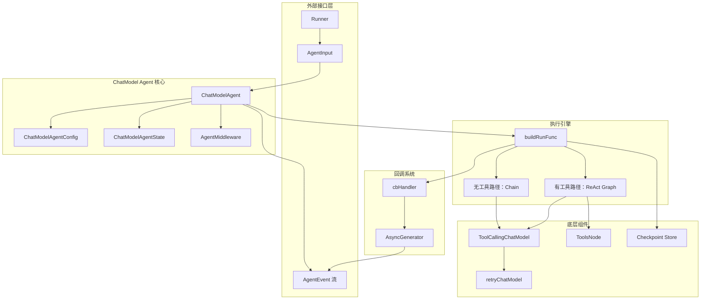

# ADK ChatModel Agent

## 模块概述

**ChatModel Agent** 是整个 ADK（Agent Development Kit）系统的核心执行引擎。想象一下，你有一个智能助手，它不仅能理解你的问题，还能主动调用工具、与其他助手协作、在需要时暂停等待人工干预，然后从暂停点继续工作——这就是 ChatModel Agent 要解决的问题。

这个模块的核心价值在于：**将一个大语言模型（LLM）包装成一个有状态、可扩展、可中断恢复的自主代理**。它不是简单地调用模型 API，而是构建了一个完整的决策循环：接收输入 → 思考（调用模型）→ 行动（调用工具）→ 观察结果 → 继续思考，直到任务完成。

### 为什么需要这个模块？

在没有这个模块之前，开发者需要手动处理以下复杂问题：

1. **多轮对话状态管理**：每次调用模型都需要手动拼接历史消息
2. **工具调用循环**：检测模型是否需要调用工具、执行工具、将结果反馈给模型
3. **流式输出**：将模型生成的 token 实时推送给用户
4. **中断与恢复**：在长时间任务中暂停执行，稍后从断点继续
5. **多代理协作**：一个代理将任务转交给另一个更专业的代理

ChatModel Agent 将这些模式封装成统一的接口，让开发者只需关注业务逻辑，而非底层编排细节。

---

## 心智模型

建议把该模块理解为“**塔台 + 导播台**”：

- **塔台（orchestrator）**：`ChatModelAgent.buildRunFunc` 选择执行航线（无工具直链 / 有工具 ReAct 图），并注入控制工具、迭代上限、checkpoint。
- **导播台（event bridge）**：`cbHandler` / `noToolsCbHandler` 把内部 callback 信号剪辑成对外 `AgentEvent` 流。
- **应急系统（reliability layer）**：`retryChatModel` 为模型调用提供可配置重试与退避，并把“将重试”语义通过 `WillRetryError` 外显。

所以你在脑中不应把它看成“一个类调用一个模型”，而应看成“一个小型运行时”：输入是 `AgentInput`，输出是事件流，内部有状态、调度、恢复与策略。

---

## 架构概览



### 架构分层解析

#### 1. 外部接口层
- **Runner**：统一的代理执行入口，管理整个 Agent 的生命周期
- **AgentInput**：封装用户输入，包括消息列表和流式输出开关
- **AgentEvent**：执行过程中产生的所有事件（模型输出、工具调用、错误、动作等）

#### 2. 核心配置层
- **ChatModelAgent**：代理主体，持有模型引用、工具配置、中间件等
- **ChatModelAgentConfig**：声明式配置，定义代理的所有行为参数
- **ChatModelAgentState**：运行时状态，主要是消息历史
- **AgentMiddleware**：钩子系统，允许在关键节点注入自定义逻辑

#### 3. 执行引擎层
- **buildRunFunc**：懒加载的执行函数构建器，根据配置决定执行路径
- **无工具路径**：当没有配置工具时，使用简单的 Chain 直接调用模型
- **ReAct 路径**：当有工具时，使用 ReAct 图引擎实现思考 - 行动循环

#### 4. 底层组件层
- **ToolCallingChatModel**：支持工具调用的模型接口
- **ToolsNode**：工具执行节点，处理并行工具调用和结果聚合
- **retryChatModel**：模型调用的重试包装器，处理 transient 错误
- **Checkpoint**：状态持久化，支持中断恢复

#### 5. 回调系统
- **cbHandler**：监听模型和工具节点的生命周期事件
- **AsyncGenerator**：将事件推送到外部的事件流

### 架构叙事

1. `Run`/`Resume` 调用首先进入 `buildRunFunc`。该函数只构建一次（`sync.Once`），并冻结可变拓扑（sub-agent / parent-agent 关系不能再改）。
2. 构建阶段会把中间件注入的 instruction/tools/hook 合并，并决定是：
   - **无工具路径**：`GenModelInput -> ChatModel`。
   - **有工具路径**：`GenModelInput -> ReAct graph`（含 tools node、return-directly、迭代控制）。
3. 执行期间 callback 被桥接为 `AgentEvent`：assistant 消息、tool 消息、错误、中断信息。
4. 若出现中断，`cbHandler.onGraphError` 从 `bridgeStore` 取 checkpoint bytes，封装 `CompositeInterrupt` 并附带 `ChatModelAgentInterruptInfo`。
5. `Resume` 通过 `newResumeBridgeStore(stateByte)` 回放状态，可选应用 `ChatModelAgentResumeData.HistoryModifier` 修改历史再继续。

---

## 核心设计决策

### 决策 A：一次构建、运行后冻结（consistency > runtime flexibility）

- 体现：`once + frozen`，`OnSetSubAgents`/`OnSetAsSubAgent` 运行后禁止修改。
- 好处：checkpoint/resume 时图结构稳定，不会出现“状态来自旧图、代码已是新图”的错配。
- 代价：不能热修改 agent 拓扑。

### 决策 B：工具路径与无工具路径分离（simplicity for no-tool fast path）

**决策**：根据是否有工具配置，选择两种不同的执行路径。

```go
if len(toolsNodeConf.Tools) == 0 {
    // 无工具：简单 Chain
    a.run = func(...) {
        compose.NewChain().AppendLambda(...).AppendChatModel(...)
    }
} else {
    // 有工具：ReAct Graph
    g, err := newReact(ctx, conf)
    a.run = func(...) {
        compose.NewChain().AppendLambda(...).AppendGraph(g, ...)
    }
}
```

**为什么这样设计？**

| 维度 | 无工具路径 | 有工具路径 |
|------|-----------|-----------|
| 复杂度 | 低：单次模型调用 | 高：多轮思考 - 行动循环 |
| 延迟 | 低：无额外开销 | 高：需要多次迭代 |
| 状态管理 | 简单 | 复杂：需要跟踪工具调用状态 |
| 适用场景 | 纯对话、问答 | 需要外部操作的任务 |

**替代方案分析**：
- **统一使用 ReAct**：会导致无工具场景也有不必要的图执行开销
- **统一使用 Chain**：无法支持工具调用循环

这个设计体现了**按需付费**的原则：简单场景用简单实现，复杂场景才引入复杂机制。

### 决策 C：控制动作通过工具 + Action 传递（correctness > implicit text semantics）

- `ExitTool`、`transferToAgent` 在 `InvokableRun` 里调用 `SendToolGenAction` 发结构化动作。
- 好处：流程控制可检查、可恢复、可被 Runner 明确消费。
- 代价：理解门槛更高；返回字符串不是控制依据，`AgentAction` 才是。

### 决策 D：流式重试采用“先验证再返回”策略（correctness > first-token latency）

**决策**：`retryChatModel` 包装底层模型，提供可配置的重试逻辑。

```go
type ModelRetryConfig struct {
    MaxRetries  int
    IsRetryAble func(ctx context.Context, err error) bool
    BackoffFunc func(ctx context.Context, attempt int) time.Duration
}
```

**为什么需要包装器？**

模型调用可能因网络波动、服务限流等原因失败。与其在每个调用点重复重试逻辑，不如用装饰器模式统一处理。

**流式重试的特殊处理**：

对于流式输出，重试更复杂：需要消费完整流才能知道是否出错。

```go
copies := stream.Copy(2)
checkCopy := copies[0]   // 用于检查错误
returnCopy := copies[1]  // 返回给用户

streamErr := consumeStreamForError(checkCopy)
if streamErr == nil {
    return returnCopy, nil  // 成功，返回可用流
}
// 出错，关闭返回流，重试
```

**权衡**：
- **优点**：避免把“即将失败的流”直接暴露给上层
- **缺点**：牺牲首 token 延迟与部分流式实时性

### 决策 E：中间件采用轻量组合而非复杂生命周期（composition > framework complexity）

- `AgentMiddleware` 仅提供补充 instruction/tools、前后 hook、tool wrap。
- 好处：简单可预测。
- 代价：不适合承载复杂跨轮状态机。

### 决策 F：Return-Directly 工具行为

**决策**：允许某些工具被调用后立即返回结果，不再将结果反馈给模型。

```go
type ToolsConfig struct {
    ReturnDirectly map[string]bool  // 工具名 → 是否直接返回
}
```

**使用场景**：

考虑一个 `transfer_to_agent` 工具：当模型决定将任务转交给另一个代理时，你通常不希望模型继续生成内容，而是立即结束当前代理的执行。类似地，`exit` 工具用于显式终止代理。

**权衡**：
- **优点**：支持明确的控制流（如代理转移、提前退出）
- **缺点**：多个 ReturnDirectly 工具同时调用时，只有第一个生效

## 设计模式与架构权衡深入分析

### 主要设计模式

#### 1. 状态机模式 (State Machine Pattern)

ChatModelAgent 本质上是一个复杂的状态机，其状态转换如下：

```
初始化 → 构建执行图 → 执行中（可循环） → 完成/中断
                        ↓
                    可恢复
```

这种设计使得代理能够清晰地管理自己的生命周期，特别是支持复杂的中断恢复场景。

#### 2. 策略模式 (Strategy Pattern)

通过 `GenModelInput`、`IsRetryAble`、`BackoffFunc` 等函数类型，模块允许在运行时选择不同的算法策略，而不是将所有逻辑硬编码。

#### 3. 装饰器模式 (Decorator Pattern)

`retryChatModel` 是装饰器模式的典型应用，它透明地为底层模型添加重试功能，而不改变模型的接口。

#### 4. 事件驱动架构 (Event-Driven Architecture)

整个模块的执行流程通过 `AgentEvent` 流对外暴露，使得系统具有高度的可观测性和可扩展性。

### 关键架构权衡

#### 1. 一致性 vs 运行时灵活性

**选择**：一致性优先

**体现**：运行后冻结拓扑结构，禁止修改 sub-agent/parent-agent 关系

**原因**：
- 确保 checkpoint/resume 时状态与代码的一致性
- 避免"状态来自旧图、代码已是新图"的错配问题
- 简化推理和调试过程

**代价**：
- 不能在运行时动态调整 agent 拓扑
- 需要重启才能应用配置变更

#### 2. 简单性 vs 完整性

**选择**：根据场景分离路径

**体现**：无工具场景使用简单 Chain，有工具场景使用复杂 ReAct Graph

**原因**：
- 为简单场景保持低延迟和低开销
- 为复杂场景提供完整功能
- 体现"按需付费"的设计原则

**代价**：
- 代码中有两个独立路径，增加了维护成本
- 需要确保两个路径在重叠功能上的行为一致

#### 3. 正确性 vs 首 token 延迟

**选择**：正确性优先

**体现**：流式重试采用"先验证再返回"策略

**原因**：
- 避免将"即将失败的流"直接暴露给上层
- 确保重试逻辑的正确性和可靠性
- 简化上层应用的错误处理

**代价**：
- 牺牲了首 token 延迟
- 部分流式实时性受到影响

**缓解**：
- 对于非重试场景或不关心重试的场景，可以禁用此功能
- 未来可以考虑提供可选的"快速路径"，允许权衡正确性和延迟

#### 4. 显式控制 vs 隐式语义

**选择**：显式控制优先

**体现**：控制动作通过工具 + Action 传递，而不是依赖文本语义

**原因**：
- 流程控制可检查、可恢复、可被 Runner 明确消费
- 避免因模型输出格式变化导致的控制流错误
- 提供更可靠的多代理协作机制

**代价**：
- 理解门槛更高
- 需要学习 Action 机制而不是仅依赖文本交互

## 常见扩展场景与实现路径

### 1. 添加自定义工具

**场景**：为代理添加特定领域的工具

**实现路径**：
1. 实现 `tool.BaseTool` 接口
2. 在 `ToolsConfig.Tools` 中添加工具
3. （可选）在 `ToolsConfig.ReturnDirectly` 中配置工具行为
4. 考虑为工具添加清晰的描述，帮助模型理解如何使用

### 2. 自定义模型输入生成

**场景**：需要特殊的消息格式化或上下文注入逻辑

**实现路径**：
1. 实现自定义 `GenModelInput` 函数
2. 在 `ChatModelAgentConfig` 中设置自定义函数
3. 注意与 `Instruction` 和中间件的 `AdditionalInstruction` 的协作

### 3. 添加审计和监控

**场景**：需要记录代理的决策过程和工具使用情况

**实现路径**：
1. 使用 `AgentMiddleware.BeforeChatModel` 和 `AfterChatModel` 钩子
2. 实现自定义回调处理器
3. 考虑将审计日志与 `AgentEvent` 流集成

### 4. 实现自定义重试策略

**场景**：有特定的错误模式需要特殊处理

**实现路径**：
1. 实现自定义 `IsRetryAble` 函数
2. 实现自定义 `BackoffFunc`
3. 在 `ModelRetryConfig` 中配置自定义函数
4. 考虑使用 `WillRetryError` 事件提供重试可见性

---

## 数据流追踪

### 场景 1：无工具的单轮对话

```
用户输入 → Runner.Run() → ChatModelAgent.Run()
    ↓
buildRunFunc() 检测到无工具配置
    ↓
创建 Chain: Lambda(消息转换) → ChatModel(调用模型)
    ↓
genNoToolsCallbacks() 注册回调
    ↓
Chain.Invoke/Stream() 执行
    ↓
模型输出 → cbHandler.onChatModelEnd() → AsyncGenerator.Send()
    ↓
AgentEvent 流 → 用户
```

### 场景 2：有工具的多轮 ReAct 循环

```
用户输入 → Runner.Run() → ChatModelAgent.Run()
    ↓
buildRunFunc() 检测到有工具配置
    ↓
创建 Chain: Lambda(消息转换) → ReAct Graph
    ↓
genReactCallbacks() 注册回调（模型 + 工具节点）
    ↓
ReAct Graph 执行循环:
    ├─ ChatModel 生成 → cbHandler.onChatModelEnd() → 发送 Assistant 消息
    ├─ 检测 ToolCall → ToolsNode 执行
    │   ├─ 对每个工具: WrapToolCall → InvokableRun/StreamableRun
    │   └─ 工具结果 → createToolResultSender() → 发送 Tool 消息
    └─ 循环直到无 ToolCall 或达到 MaxIterations
    ↓
最终输出 → AsyncGenerator.Send() → AgentEvent 流 → 用户
```

### 场景 3：中断与恢复

```
执行中 → 遇到 Interrupt → compose.ExtractInterruptInfo()
    ↓
cbHandler.onGraphError() 捕获中断
    ↓
从 Checkpoint 获取数据 → CompositeInterrupt() 构建事件
    ↓
AgentEvent{Action: Interrupted} → 用户
    ↓
[用户决定恢复]
    ↓
Runner.Resume() → ChatModelAgent.Resume()
    ↓
从 stateByte 恢复 Checkpoint
    ↓
可选：应用 HistoryModifier 修改消息历史
    ↓
从断点继续执行
```

---

## 子模块详解

### 代理运行时与编排

这是 ChatModel Agent 模块的核心，负责整个代理的生命周期管理。它包含 `ChatModelAgent` 主体结构、配置系统、状态管理和回调桥接等关键功能。

主要内容：
- 配置合并与中间件应用
- 执行图的懒加载构建
- 运行时状态管理
- 回调事件到 `AgentEvent` 的转换
- Checkpoint 序列化与恢复机制

详细信息请参考 [agent_runtime_and_orchestration.md](agent_runtime_and_orchestration.md)

### 内建控制工具与转交

这个子模块定义了代理流程控制的内置工具，包括任务终止和智能体转交等关键功能。它实现了显式控制流，使得代理的行为更加可预测和可控制。

主要内容：
- `ExitTool` 的实现与使用
- `transferToAgent` 的任务转交机制
- `ReturnDirectly` 工具行为配置
- 中断信息的序列化与恢复

详细信息请参考 [builtin_control_tools_and_handoff.md](builtin_control_tools_and_handoff.md)

### 模型重试包装器

这个子模块提供了可靠的模型调用重试功能，是系统稳定性的重要保障。它不仅处理同步调用的重试，还特别针对流式输出场景做了优化。

主要内容：
- 可配置的重试策略
- 带抖动的指数退避算法
- 流式输出的重试处理
- 重试事件的可观测性

详细信息请参考 [chatmodel_retry_wrapper.md](chatmodel_retry_wrapper.md)

> 阅读顺序建议：先看 `agent_runtime_and_orchestration` 建立整体执行心智，再看 `builtin_control_tools_and_handoff` 理解控制流动作，最后看 `chatmodel_retry_wrapper` 理解稳定性策略。

---

## 跨模块依赖

### 上游依赖

| 模块 | 依赖内容 | 用途 |
|------|---------|------|
| [Component Interfaces](component_interfaces.md) | `ToolCallingChatModel`, `BaseTool` | 模型和工具的抽象接口 |
| [Compose Graph Engine](compose_graph_engine.md) | `Chain`, `Graph`, `ToolsNode` | 执行引擎 |
| [Callbacks System](callbacks_system.md) | `ModelCallbackHandler`, `ToolsNodeCallbackHandlers` | 事件监听 |
| [Schema Core Types](schema_core_types.md) | `Message`, `ToolInfo`, `ToolCall` | 数据结构 |

### 下游依赖

| 模块 | 依赖内容 | 用途 |
|------|---------|------|
| [ADK Runner](adk_runner.md) | `Runner`, `ResumeInfo` | 执行入口和生命周期管理 |
| [ADK Interrupt](adk_interrupt.md) | `InterruptInfo`, `bridgeStore` | 中断序列化与存储 |
| [ADK Agent Tool](adk_agent_tool.md) | `agentTool` | 将 Agent 包装为工具供其他 Agent 调用 |
| [ADK React Agent](adk_react_agent.md) | `newReact`, `reactConfig` | ReAct 图实现 |

### 隐含耦合点

1. `Resume` 假设 interrupt state 是 `[]byte`，且恢复时状态类型匹配 ReAct `State`。
2. `SendToolGenAction` 假设当前上下文存在 ChatModelAgent/ReAct 的状态槽。
3. `defaultGenModelInput` 假设 instruction 可以安全做 FString（含 `{}` 字面量时会失败）。

---

## 使用指南

### 基础用法

```go
// 1. 配置代理
config := &adk.ChatModelAgentConfig{
    Name:        "assistant",
    Description: "A helpful assistant",
    Instruction: "You are a helpful assistant.",
    Model:       myChatModel,  // 实现 ToolCallingChatModel 接口
    ToolsConfig: adk.ToolsConfig{
        Tools:          []tool.BaseTool{myTool},
        ReturnDirectly: map[string]bool{"exit": true},
    },
    MaxIterations: 10,
}

// 2. 创建代理
agent, err := adk.NewChatModelAgent(ctx, config)

// 3. 运行
input := &adk.AgentInput{
    Messages:       []*schema.Message{userMessage},
    EnableStreaming: true,
}
iterator := agent.Run(ctx, input)

// 4. 消费事件流
for event := range iterator {
    if event.Err != nil {
        // 处理错误
    }
    if event.Message != nil {
        // 处理模型输出或工具消息
    }
    if event.Action != nil {
        // 处理动作（如 TransferToAgent, Exit, Interrupted）
    }
}
```

### 添加中间件

```go
config.Middlewares = []adk.AgentMiddleware{
    {
        AdditionalInstruction: "当前时间是 2025-01-15。",
        BeforeChatModel: func(ctx context.Context, state *adk.ChatModelAgentState) error {
            // 在模型调用前记录日志
            log.Printf("Messages before chat: %d", len(state.Messages))
            return nil
        },
        AfterChatModel: func(ctx context.Context, state *adk.ChatModelAgentState) error {
            // 在模型调用后审计输出
            lastMsg := state.Messages[len(state.Messages)-1]
            auditOutput(lastMsg)
            return nil
        },
    },
}
```

### 配置重试

```go
config.ModelRetryConfig = &adk.ModelRetryConfig{
    MaxRetries: 3,
    IsRetryAble: func(ctx context.Context, err error) bool {
        // 只重试网络错误
        return strings.Contains(err.Error(), "timeout") ||
               strings.Contains(err.Error(), "connection")
    },
    BackoffFunc: func(ctx context.Context, attempt int) time.Duration {
        return time.Duration(attempt*2) * time.Second  // 线性退避
    },
}
```

### 中断恢复

```go
// 运行中遇到中断
iterator := agent.Run(ctx, input)
var interruptInfo *adk.ResumeInfo
for event := range iterator {
    if event.Action != nil && event.Action.Interrupted != nil {
        interruptInfo = &adk.ResumeInfo{
            InterruptState: event.Action.Interrupted.Data,
        }
        break
    }
}

// ... 稍后恢复 ...
resumeData := &adk.ChatModelAgentResumeData{
    HistoryModifier: func(ctx context.Context, history []Message) []Message {
        // 注入新的上下文
        return append(history, schema.UserMessage("继续之前的任务"))
    },
}
interruptInfo.ResumeData = resumeData

iterator = agent.Resume(ctx, interruptInfo)
```

---

## 新贡献者注意事项

1. **不要在首次 Run 后修改拓扑**：`frozen` 会拒绝，且即使绕过也可能破坏恢复一致性。
2. **`Resume` 的类型错误会 panic**：`InterruptState` 不是 `[]byte` 或 `ResumeData` 类型不匹配会直接 panic。
3. **`ReturnDirectly` 事件不是立即发送**：会缓存并在 tools node 结束时发送，以保证时序。
4. **`EmitInternalEvents` 仅影响可观测，不影响父状态**：转发事件不会写入父 checkpoint/session。
5. **流式重试不是真正边生成边透传**：`retryChatModel.Stream` 为 correctness 牺牲首 token 延迟。
6. **`WithHistoryModifier` 已 deprecated**：优先用 `ResumeWithData` + `ChatModelAgentResumeData`。
7. **中间件执行顺序**：多个中间件的 `BeforeChatModel`/`AfterChatModel` 按添加顺序依次执行。
8. **Checkpoint 序列化限制**：使用 `gobSerializer` 进行状态持久化，确保所有状态字段都是 gob 可序列化的类型。
9. **SendEvent 的调用上下文**：只能在中间件内部调用，且必须在 `Run()`/`Resume()` 执行期间。

---

## 典型配置片段

```go
agent, err := NewChatModelAgent(ctx, &ChatModelAgentConfig{
    Name:        "assistant",
    Description: "General assistant with tool use",
    Instruction: "You are a helpful assistant.",
    Model:       myToolCallingModel,
    ToolsConfig: ToolsConfig{
        ToolsNodeConfig: compose.ToolsNodeConfig{Tools: []tool.BaseTool{myTool}},
        ReturnDirectly:  map[string]bool{"exit": true},
    },
    Exit:           ExitTool{},
    MaxIterations:  20,
    ModelRetryConfig: &ModelRetryConfig{MaxRetries: 3},
})
_ = err
```

这个片段背后的意图是：在保留工具能力的同时，给模型调用增加鲁棒性，并给流程提供显式退出通道。

---

## 总结

ChatModel Agent 是 ADK 系统的核心执行引擎，它将大语言模型包装成一个有状态、可扩展、可中断恢复的自主代理。其设计遵循以下原则：

1. **按需付费**：无工具场景使用简单 Chain，有工具场景使用 ReAct Graph
2. **显式控制流**：通过 Action 事件（Exit、TransferToAgent、Interrupted）明确表达控制流变化
3. **可扩展性**：通过中间件系统支持横切关注点的模块化
4. **容错性**：内置重试机制处理 transient 错误
5. **可恢复性**：通过 Checkpoint 支持中断后从断点继续

理解这个模块的关键是把握**事件驱动的执行模型**：模型调用、工具执行、中断恢复都通过统一的 AgentEvent 流对外暴露，使得复杂的代理行为变得可观察、可控制。

