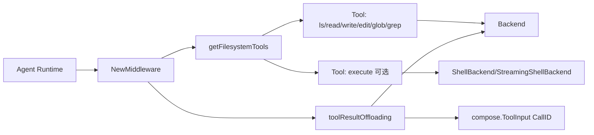

# ADK Filesystem Middleware

`ADK Filesystem Middleware` 的核心价值，不是“提供几个文件工具”这么简单；它是在 **Agent 与外部文件世界之间放置了一个可替换、可控、可降噪的执行层**。你可以把它想象成“给 Agent 配了一个受管家监管的文件操作台”：Agent 只会看到 `ls/read_file/write_file/edit_file/glob/grep/(可选 execute)` 这些标准化按钮，而按钮背后可以是真实 OS、沙箱、甚至内存后端。这样做的目的，是把“文件访问能力”从 agent 业务逻辑里剥离出来，既能复用，也能做安全/性能策略（例如大结果自动落盘）。

---

## 1. 它解决了什么问题（先讲问题空间）

在没有这个模块时，团队通常会遇到三类痛点：

1. **能力耦合**：每个 Agent 自己拼文件工具，参数格式、错误语义、输出格式都不一致。
2. **上下文污染**：工具返回超长文本时直接塞回模型上下文，token 成本飙升，且会压缩真正有价值的信息。
3. **后端不可替换**：测试时想用内存文件系统、线上想用沙箱 shell，结果调用路径写死在业务层。

该模块的设计意图就是把这三件事统一：

- 通过 `Backend` 接口统一文件能力协议；
- 通过中间件 `NewMiddleware` 把工具注册与系统提示拼装自动化；
- 通过 `toolResultOffloading` 在工具调用链上做“大结果降载”。

---

## 2. 心智模型：三层适配器 + 一条拦截链

建议你用下面这个心智模型理解模块：

- **底层（Capability Layer）**：`adk/filesystem/backend.go` 定义文件协议（`Backend` / `ShellBackend` / `StreamingShellBackend`）。
- **中层（Adapter Layer）**：`adk/middlewares/filesystem/filesystem.go` 把 backend 方法适配成 Agent 可用 tool（`utils.InferTool` / `utils.InferStreamTool`）。
- **横切层（Policy Layer）**：`large_tool_result.go` 以 `compose.ToolMiddleware` 形式拦截工具结果，按阈值决定是否写回 backend 并返回摘要提示。

类比：

> 想象这是一个“仓库操作系统”：
> - Backend 是仓库机械臂协议；
> - Tool 层是给调度员的控制面板；
> - Offloading 是超大货物的分流通道（主传送带不堵塞）。

---

## 3. 架构总览

### 叙事化走读

1. Agent 初始化时调用 `NewMiddleware`，做 `Config.Validate()`。
2. `getFilesystemTools` 固定注册六个文件工具（`ls/read_file/write_file/edit_file/glob/grep`）。
3. 如果 `config.Backend` 还实现了 `filesystem.StreamingShellBackend` 或 `filesystem.ShellBackend`，额外注册 `execute`。
4. 中间件向 agent 注入：
   - `AdditionalTools`
   - `AdditionalInstruction`（默认 `ToolsSystemPrompt`，若支持 execute 再拼 `ExecuteToolsSystemPrompt`）
5. 若未关闭 offloading，`WrapToolCall = newToolResultOffloading(...)`，后续工具返回先经过拦截。
6. `toolResultOffloading.handleResult` 发现结果过大（`len(result) > tokenLimit * 4`）时：
   - 通过 `PathGenerator` 生成路径（默认 `/large_tool_result/{CallID}`）；
   - 原始结果 `backend.Write(...)` 落盘；
   - 返回一段格式化提示（含采样与文件路径），而非整段原文。

---

## 4. 关键数据流（按操作端到端）

### 4.1 `read_file` 调用路径

`ToolInput(JSON)` → `newReadFileTool` 解析 `readFileArgs` → 兜底 `Offset/Limit` → `Backend.Read(ReadRequest)` → 字符串返回模型。

关键点：`newReadFileTool` 和 `InMemoryBackend.Read` 都有默认值保护（`offset<0 => 0`, `limit<=0 => 200`），这是“边界在多层防守”的策略。

### 4.2 `grep` 调用路径

`grepArgs`（`Path`/`Glob` 可选指针）→ 转换为 `GrepRequest` → `Backend.GrepRaw` 返回 `[]GrepMatch` → 根据 `OutputMode` 进行二次格式化：

- `count`：返回总数；
- `content`：`path:line:content` 列表；
- 默认（含未知值）走 `files_with_matches`：去重后只返回文件路径。

这体现了一个设计偏好：**backend 保持“原始匹配”，展示语义由 tool 层决定**。

### 4.3 `execute`（流式）调用路径

`executeArgs.Command` → `StreamingShellBackend.ExecuteStreaming` → goroutine 消费 `StreamReader[*ExecuteResponse]` → 转成 `StreamReader[string]`。

其中做了三件非显式但关键的事：

- panic recover 并转错误发送；
- 聚合 `ExitCode`，在结束后补发失败提示；
- 若无任何输出且 exit code 正常，补发 `[Command executed successfully with no output]`。

### 4.4 大结果分流路径

任何工具输出（invokable/streamable 两条路径）→ `toolResultOffloading.invoke/stream` → `handleResult` 判定阈值 → 可能写入 backend 并返回缩略消息。

流式分支会先 `concatString` 收敛为完整字符串再判定，因此 offloading 是 **结果级策略**，不是 chunk 级策略。

---

## 5. 关键设计决策与取舍

### 决策 A：接口分层（`Backend` + Shell 扩展）

- 选择：`Backend` 只包含文件操作；shell 能力通过 `ShellBackend` / `StreamingShellBackend` 扩展。
- 好处：无 shell 场景不被迫实现多余能力；execute 工具可按能力自动出现。
- 代价：调用方需要做类型断言分支（已在 `getFilesystemTools` 内封装）。

### 决策 B：参数对象化（`*ReadRequest` 等）

- 选择：每个方法统一使用 request struct，而非长参数列表。
- 好处：未来加字段兼容性更好；工具层映射清晰。
- 代价：样板代码增多。

### 决策 C：offloading 阈值用 `len(result) > tokenLimit*4`

- 选择：用字符长度近似 token 数。
- 好处：无需模型 tokenizer，性能和依赖都轻。
- 代价：估算不精确（多字节字符、不同模型 tokenization 差异）。

### 决策 D：`Write` 语义是“仅新建，已存在报错”

- 选择：`InMemoryBackend.Write` 若存在同名文件直接报错。
- 好处：防止无意覆盖。
- 代价：与“write=upsert”的直觉不一致；调用方若想覆盖需先走 edit 或设计新语义。

### 决策 E：`Edit` 在 `ReplaceAll=false` 时强制“恰好一次”

- 选择：多次命中会报错。
- 好处：减少误改，尤其是 LLM 生成模糊替换时。
- 代价：操作更严格，交互中需要先 `grep`/`read_file` 定位唯一上下文。

---

## 6. 与其他模块的连接关系（跨模块依赖）

- 与 [ADK ChatModel Agent](ADK ChatModel Agent.md) / [ADK Agent Interface](ADK Agent Interface.md)：
  - 通过返回 `adk.AgentMiddleware` 把工具与系统提示注入 Agent 运行时。
- 与 [Compose Tool Node](Compose Tool Node.md)：
  - offloading 使用 `compose.ToolMiddleware`、`compose.ToolInput`、`compose.ToolOutput`、`compose.StreamToolOutput`。
- 与 [Schema Stream](Schema Stream.md) / [Schema Core Types](Schema Core Types.md)：
  - 流式 execute 依赖 `schema.StreamReader` / `schema.Pipe`。
- 与 [Component Interfaces](Component Interfaces.md) 及工具适配层：
  - `utils.InferTool` / `utils.InferStreamTool` 把普通函数提升为 `tool.BaseTool`。

模块角色上，它本质是 **能力网关 + 策略拦截器**，位于 Agent 与外部文件系统之间。

---

## 7. 子模块导读

- [backend_protocol_and_requests](backend_protocol_and_requests.md)
  - 讲清 `Backend` / `ShellBackend` / `StreamingShellBackend` 三层协议边界，以及 request/response 结构的契约意义。
- [in_memory_backend_implementation](in_memory_backend_implementation.md)
  - 详细分析 `InMemoryBackend` 的并发模型、路径归一化、`Read/Grep/Glob/Edit` 的语义细节与行为边界。
- [filesystem_middleware_and_tool_surface](filesystem_middleware_and_tool_surface.md)
  - 解释 `NewMiddleware` 如何装配工具面、提示词和 execute 能力开关。
- [large_tool_result_offloading_pipeline](large_tool_result_offloading_pipeline.md)
  - 拆解工具结果分流机制、阈值策略、路径生成器以及流式场景的聚合处理。

> 备注：上述四个子模块文档已生成并可直接阅读，建议先看 `filesystem_middleware_and_tool_surface.md` 再看 `large_tool_result_offloading_pipeline.md`，更容易建立完整调用链认知。

---

## 8. 新贡献者最容易踩的坑

1. **`Backend` 接口有两份定义**：
   - `adk/filesystem/backend.go` 与 `adk/middlewares/filesystem/backend.go`（后者通过 type alias 复用请求结构）。
   - 它们方法集等价，但包路径不同；实现/注入时注意类型匹配。

2. **`write_file` 返回文案是 “Updated file ...”**，但底层 `Write` 在 in-memory 实现是“文件已存在报错”。

3. **`glob`/`grep` 的 glob 在 `InMemoryBackend` 中是匹配 `filepath.Base(...)`**，不是全路径匹配；如果你期望 `src/**/*.go` 风格路径筛选，这个实现可能不符合预期。

4. **流式 execute 不会逐块透传结构体**，而是转成字符串流并附加状态信息；若你要做机器可读结构化消费，需要改造 `newStreamingExecuteTool`。

5. **offloading 的默认落盘路径可冲突**：默认由 `CallID` 生成，但若自定义 `PathGenerator` 不保证唯一，`Write` 可能因“file already exists”失败。

6. **`grep` 的 `OutputMode` 未命中枚举时会走默认文件列表模式**，这在模型输出不稳定时是容错，但也可能掩盖参数错误。

---

## 9. 实战建议（扩展与演进）

- 若要接真实文件系统/沙箱：先实现 `Backend`，再按需实现 `ShellBackend` 或 `StreamingShellBackend`。
- 若要控制安全边界：把路径校验、命令白名单放在 backend 实现层（不要只放在 prompt）。
- 若要优化大结果策略：可替换 `LargeToolResultOffloadingPathGen`，并把 `tokenLimit` 按模型上下文窗口调优。
- 若要更准确 token 控制：当前是近似估算，后续可引入 tokenizer（成本是额外依赖和运行开销）。

---

从架构视角看，这个模块最值得肯定的点是：**它把“文件能力、工具暴露、上下文治理”放在同一个中间件边界内完成**。这让 Agent 本身可以专注推理与编排，而不是重复造“文件交互脚手架”。