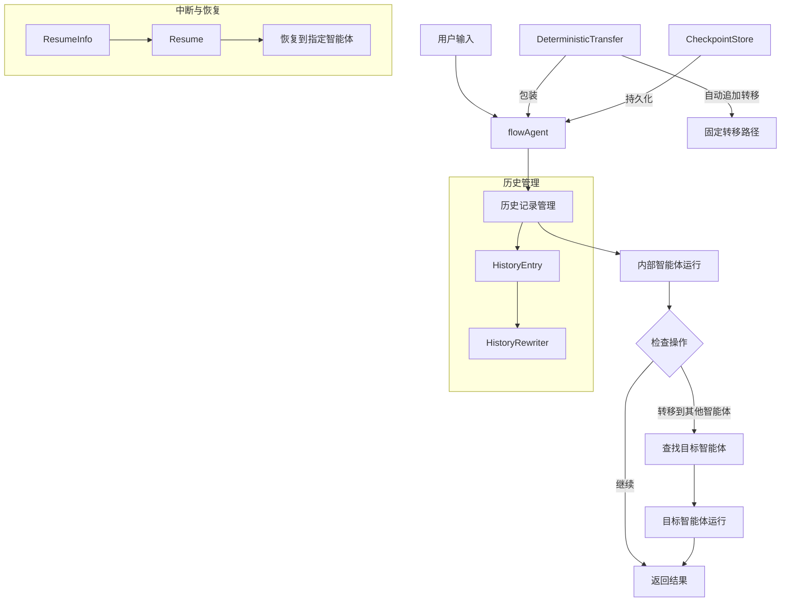
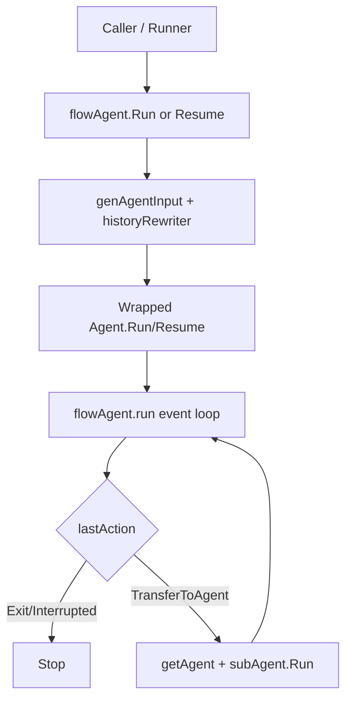

# ADK Flow Agent 技术深度文档

## 模块概述

**ADK Flow Agent** 是构建多智能体协作系统的核心编排层，它解决了智能体之间如何高效协作、传递上下文以及处理控制权转移的问题。想象一下，你有一支专业团队，每个成员都有自己的专长，但需要有人来协调他们的工作流程、管理交接、确保信息不丢失——**ADK Flow Agent** 就是这个团队的"项目经理"。

`ADK Flow Agent` 是 ADK 里专门负责“多 Agent 对话编排”的那一层。它解决的不是“如何让模型回答更聪明”，而是“当系统里有多个 agent 时，如何让它们**按可控路径协作**、共享必要历史、在中断后还能从正确位置恢复”。如果把单个 agent 看成一个专家，`flowAgent` 就是会诊协调员：谁先说、谁接手、哪些历史该带上、什么时候停止或转交，全部由它统一调度。

### 核心问题域

在多智能体系统中，你通常会遇到以下挑战：
- 如何让智能体之间无缝地"移交"对话和任务
- 如何在智能体切换时保持完整的对话历史和上下文
- 如何处理某些智能体需要固定顺序执行的场景
- 如何实现智能体协作过程中的可恢复性和状态持久化

**ADK Flow Agent** 正是为解决这些问题而设计的。它不是一个具体的智能体实现，而是一个**智能体协作框架**，为你提供构建复杂多智能体系统的基础设施。

---

## 1. 这个模块为什么存在：它在解决什么问题

单 Agent 运行模型很直接：输入消息，拿到事件流输出。但多 Agent 一上来就有四个“朴素实现会翻车”的问题：

1. **路由问题**：子 agent 和父 agent 的关系如何维护？转移目标是否合法？
2. **上下文问题**：一个 agent 产生的消息，另一个 agent 应该“原样看到”，还是“作为上下文摘要看到”？
3. **事件归属问题**：父子层级都会产生事件，谁该写入当前 session 历史？
4. **恢复问题**：interrupt 后 resume 应该从哪个 agent 继续？

`flowAgent` 的核心价值就是：把这些跨 agent 的“控制平面”从业务 agent 中抽离出来，形成统一、可预期的编排语义。

---

## 2. 心智模型：把它当作"事件流路由器 + 历史改写器"

可以用一个双层比喻理解：

- **事件流路由器**：监听底层 agent 产生的 `AgentEvent`，根据最后动作（`Exit` / `Interrupted` / `TransferToAgent`）决定下一步。
- **历史改写器**：把跨 agent 消息改写成当前 agent 能安全理解的上下文文本，避免角色混淆。

也就是说，`flowAgent` 不生成业务答案，它生成"协作秩序"。

---

## 3. 架构总览



---

### 基础执行流程



### 架构叙事（按调用链）

- 入口是 `flowAgent.Run(...)` 或 `flowAgent.Resume(...)`。
- `Run(...)` 会先构造 `runContext`（`initRunCtx`），再调用 `genAgentInput(...)` 把根输入 + session 历史转成当前 agent 输入。
- 然后执行被包装的底层 `Agent.Run(...)`，并在 `run(...)` 循环里转发事件、记录历史、追踪 `lastAction`。
- 若最后动作是 `TransferToAgent`，调用 `getAgent(...)` 找到目标（子 agent 或父 agent）并继续跑。
- `Resume(...)` 则通过 `buildResumeInfo(...)` + `getNextResumeAgent(...)` 选择恢复路径并递归委托。

模块的建筑角色非常明确：**orchestrator（编排器）+ policy enforcer（策略执行器）**。

---

## 4. 核心组件详解

### flowAgent 结构体

`flowAgent` 是整个模块的核心，它通过包装一个基础 `Agent` 来添加协作能力。

```go
type flowAgent struct {
    Agent                    // 内部智能体
    subAgents   []*flowAgent // 子智能体列表
    parentAgent *flowAgent   // 父智能体（如果有的话）
    
    disallowTransferToParent bool // 是否禁止转移到父智能体
    historyRewriter          HistoryRewriter // 历史记录重写器
    
    checkPointStore compose.CheckPointStore // 检查点存储
}
```

**关键方法**：

- `Run()`：主执行入口，处理历史生成、内部运行、事件处理和转移逻辑
- `Resume()`：从断点恢复执行
- `genAgentInput()`：根据会话历史生成智能体输入
- `getAgent()`：通过名称查找智能体（包括子智能体和父智能体）

**设计亮点**：
- 使用嵌入的 `Agent` 字段，使得 `flowAgent` 可以直接调用内部智能体的方法
- 支持递归结构（智能体可以有子智能体，子智能体也可以有自己的子智能体）
- 通过 `deepCopy()` 确保配置的不可变性

### HistoryRewriter 接口

```go
type HistoryRewriter func(ctx context.Context, entries []*HistoryEntry) ([]Message, error)
```

这个接口允许你完全控制子智能体看到的历史记录。默认实现 `buildDefaultHistoryRewriter` 会将其他智能体的消息转换为上下文描述，但你可以：
- 过滤掉某些敏感消息
- 压缩历史记录以节省 token
- 按特定格式重组织历史记录
- 添加额外的上下文信息

### DeterministicTransferConfig

```go
type DeterministicTransferConfig struct {
    Agent        Agent
    ToAgentNames []string
}
```

当你需要智能体执行完后**自动**转移到一个或多个固定的智能体时，使用这个配置。这对于构建固定流程的协作系统非常有用。

---

## 5. 关键设计决策与取舍

### 决策 A：包装 `Agent`，不要求 agent 继承统一实现

- 选择：`flowAgent` 通过组合（嵌入 `Agent`）增强行为。
- 好处：兼容任意已有 agent，实现侵入小。
- 代价：包装链可能很深（例如再叠加 deterministic wrapper），调试时要看清“当前层是谁在处理事件”。

### 决策 B：默认历史改写成 `For context: ...` 文本

- 选择：`buildDefaultHistoryRewriter(...)` 对跨 agent 消息做自然语言改写。
- 好处：降低角色污染风险，让当前 agent 把其他 agent 输出当“上下文事实”而不是“自己发言”。
- 代价：结构化信息可能被压扁；复杂 tool 返回语义损失。
- 扩展点：`WithHistoryRewriter(...)` 允许替换策略。

### 决策 C：基于 `RunPath` 做精确事件归属

- 选择：`exactRunPathMatch(...)` 决定哪些事件属于当前执行层。
- 好处：避免父层误记子层/工具内部事件，提升 correctness。
- 代价：实现复杂度上升，对 `RunPath` 契约强依赖。

### 决策 D：父子关系设置一次、子节点禁止多父

- 选择：`setSubAgents(...)` 禁止重复设置，禁止同一子 agent 绑定多个父。
- 好处：路由与 resume 行为更确定。
- 代价：牺牲动态图拓扑灵活性。

### 决策 E：恢复链路串行化

- 选择：`getNextResumeAgent(...)` 若发现多个候选恢复分支直接报错（不支持并发 transfer 恢复）。
- 好处：恢复语义简单、可审计。
- 代价：高级并行恢复场景需要额外编排层支持。

---

## 6. 关键数据流（端到端）

### `Run` 路径

1. 调用者触发 `flowAgent.Run(ctx, input, opts...)`
2. `initRunCtx(...)` 建立/复制 `runContext`，并追加当前 agent 的 `RunStep`
3. `genAgentInput(...)` 收集：
   - `runCtx.RootInput.Messages`
   - `runCtx.Session.getEvents()` 中可提取的消息
4. `historyRewriter` 生成最终 `[]Message`
5. 调底层 `Agent.Run(...)`，进入 `run(...)` 事件循环
6. 事件按 `RunPath` 精确过滤后写入 session（非 interrupt action）
7. 循环结束读取 `lastAction`：
   - `Interrupted` / `Exit`：停止
   - `TransferToAgent`：查目标并运行目标 agent

### `Resume` 路径

1. `buildResumeInfo(...)` 把上下文推进到当前 agent 地址段
2. 若 `info.WasInterrupted`：当前层就是中断点，要求底层实现 `ResumableAgent`
3. 否则 `getNextResumeAgent(...)` 找下一跳
4. `subAgent.Resume(...)` 递归下钻到真正中断点

---

## 7. 使用指南

### 基本用法：设置子智能体

```go
// 创建主智能体和子智能体
mainAgent := NewChatModelAgent(...)
subAgent1 := NewChatModelAgent(...)
subAgent2 := NewChatModelAgent(...)

// 设置子智能体
flowAgent, err := SetSubAgents(ctx, mainAgent, []Agent{subAgent1, subAgent2})
if err != nil {
    // 处理错误
}

// 运行智能体
events := flowAgent.Run(ctx, input)
```

### 自定义历史记录重写

```go
customRewriter := func(ctx context.Context, entries []*HistoryEntry) ([]Message, error) {
    // 自定义历史处理逻辑
    // 例如：只保留最近 10 条消息
    if len(entries) > 10 {
        entries = entries[len(entries)-10:]
    }
    
    // 使用默认逻辑处理筛选后的条目
    return buildDefaultHistoryRewriter("my-agent")(ctx, entries)
}

agent := AgentWithOptions(ctx, myAgent, WithHistoryRewriter(customRewriter))
```

### 确定性转移

```go
// 创建智能体
analyzer := NewChatModelAgent(...)
writer := NewChatModelAgent(...)
reviewer := NewChatModelAgent(...)

// 包装分析器，使其完成后自动转移到写作者
analyzerWithTransfer := AgentWithDeterministicTransferTo(ctx, &DeterministicTransferConfig{
    Agent: analyzer,
    ToAgentNames: []string{writer.Name(ctx)},
})

// 包装写作者，使其完成后自动转移到审核者
writerWithTransfer := AgentWithDeterministicTransferTo(ctx, &DeterministicTransferConfig{
    Agent: writer,
    ToAgentNames: []string{reviewer.Name(ctx)},
})

// 设置为子智能体
mainAgent, err := SetSubAgents(ctx, analyzerWithTransfer, []Agent{writerWithTransfer, reviewer})
```

---

## 8. 设计权衡与注意事项

### 权衡 1：历史记录的完整 vs 效率

**现状**：默认情况下，所有历史记录都会被保留和处理

- **优点**：确保上下文完整，智能体拥有所有必要信息
- **缺点**：可能导致 token 消耗增加，处理变慢

**应对策略**：
- 使用自定义 `HistoryRewriter` 来压缩或过滤历史记录
- 考虑实现滑动窗口机制，只保留最近的 N 条消息

### 权衡 2：转移灵活性 vs 确定性

**现状**：提供两种转移方式：
1. 智能体自主决定转移目标（灵活）
2. 确定性转移（固定路径）

- **灵活转移的优点**：适应复杂场景，智能体可以根据情况做出最优选择
- **灵活转移的缺点**：不可预测，难以调试
- **确定性转移的优点**：可预测，易于测试和理解
- **确定性转移的缺点**：缺乏适应性

**建议**：
- 对于简单、固定的流程，使用确定性转移
- 对于复杂、需要判断力的场景，使用灵活转移
- 可以混合使用：部分环节固定，部分环节灵活

### 常见陷阱与注意事项

1. **循环转移**：确保转移图中没有循环，否则可能导致无限循环
   - 例如：A → B → C → A
   
2. **智能体命名冲突**：确保协作图中的所有智能体都有唯一的名称
   - `getAgent()` 是按名称查找的，名称冲突会导致意外行为

3. **历史记录膨胀**：长时间运行的会话可能导致历史记录变得非常大
   - 考虑实现历史记录截断或摘要机制

4. **中断恢复的状态一致性**：当使用 checkpoint 时，确保所有相关状态都被正确序列化
   - 特别是自定义的 `HistoryRewriter` 如果有状态，需要特殊处理

5. **RunPath 的重要性**：不要手动修改 `RunPath`，这可能导致事件记录和控制流混乱
   - 系统会自动设置和管理 `RunPath`

---

## 9. 子模块总览

> 快速跳转：
> - [flow_agent_orchestration](flow_agent_orchestration.md)
> - [deterministic_transfer_wrapper](deterministic_transfer_wrapper.md)

### 9.1 `flow_agent_orchestration`

聚焦 `flowAgent` 主体逻辑：子 agent 拓扑构建（`SetSubAgents`）、输入重写（`genAgentInput` + `HistoryRewriter`）、事件归属（`RunPath` 匹配）、transfer 执行与 resume 路由。这个子模块是 Flow Agent 的主引擎。

详见：[flow_agent_orchestration](flow_agent_orchestration.md)

### 9.2 `deterministic_transfer_wrapper`

提供 `AgentWithDeterministicTransferTo(...)` 包装器：在 agent 正常结束后，按预设顺序追加 transfer 事件。对 `*flowAgent` 还有 isolated session 特化，保证 interrupt/resume 一致性（`deterministicTransferState`）。

详见：[deterministic_transfer_wrapper](deterministic_transfer_wrapper.md)

---

## 10. 跨模块依赖与耦合面

`ADK Flow Agent` 与以下模块存在直接架构耦合：

- [ADK Agent Interface](ADK%20Agent%20Interface.md)
  - 强依赖 `Agent` / `ResumableAgent` / `AgentEvent` / `AgentAction` 契约。
- [ADK Interrupt](ADK%20Interrupt.md)
  - `ResumeInfo`、`buildResumeInfo`、`CompositeInterrupt` 决定恢复语义。
- [runner_lifecycle_and_checkpointing](runner_lifecycle_and_checkpointing.md)
  - Runner 消费事件并持久化中断状态，是 flow resume 生效的上层执行器。
- [agent_run_option_system](agent_run_option_system.md)
  - `getCommonOptions` / `filterOptions` 控制 option 透传与可见性。
- [ADK Workflow Agents](ADK%20Workflow%20Agents.md)
  - `flowAgent.Run` 对 `*workflowAgent` 有专门分支。
- [ADK Utils](ADK%20Utils.md)
  - 事件迭代基于 `AsyncIterator` / `AsyncGenerator`。

### 隐含契约（改动时最容易破坏）

1. `AgentEvent.RunPath` 必须由框架维护且“只设置一次”。
2. 写入 session 的事件必须满足当前层归属条件，否则历史会串层。
3. transfer 语义依赖 `AgentAction.TransferToAgent` 结构字段，不是靠文本匹配。
4. interrupt 与 internal interrupt 的处理层级不能混淆。

---

## 11. 新贡献者操作指南（实践层）

### 常见用法

- 给已有 agent 增加 flow 能力：`AgentWithOptions(...)`
- 挂子 agent：`SetSubAgents(...)`
- 自定义历史策略：`WithHistoryRewriter(...)`
- 禁止子 agent 回跳父节点：`WithDisallowTransferToParent()`
- 需要固定 handoff 序列：`AgentWithDeterministicTransferTo(...)`

### 最重要的注意点

- 改 `genAgentInput(...)` 时，务必连带检查 `skipTransferMessages` 的分支逻辑。
- 改事件循环时，不要破坏 `setAutomaticClose` / `copyAgentEvent` 相关资源与独占语义（这些函数在模块中被调用，定义位于其他文件）。
- 改 resume 路由时，先确认 `getNextResumeAgent(...)` 的单分支约束是否仍成立。
- 修改 deterministic transfer 的 state 类型时，要考虑 `schema.RegisterName[...]` 的序列化兼容。

---

## 12. 总结

`ADK Flow Agent` 是构建多智能体协作系统的基石，它通过装饰器模式、历史管理、智能体转移等机制，让你可以轻松构建复杂的智能体协作流程。

关键要点：
1. **装饰器模式**：灵活包装任何智能体，添加协作能力
2. **历史管理**：可定制的历史记录处理，确保上下文连贯性
3. **双重转移模式**：灵活转移 + 确定性转移，满足不同场景需求
4. **精确的事件控制**：通过 `RunPath` 确保职责清晰
5. **隔离与恢复**：支持 checkpoint 和中断恢复

**ADK Flow Agent** 不是"另一个 agent 实现"，而是 ADK 多 agent 系统的**控制平面**：它把 transfer、历史、事件归属和恢复路径都变成框架级规则，从而让复杂协作变得可控、可恢复、可维护。
