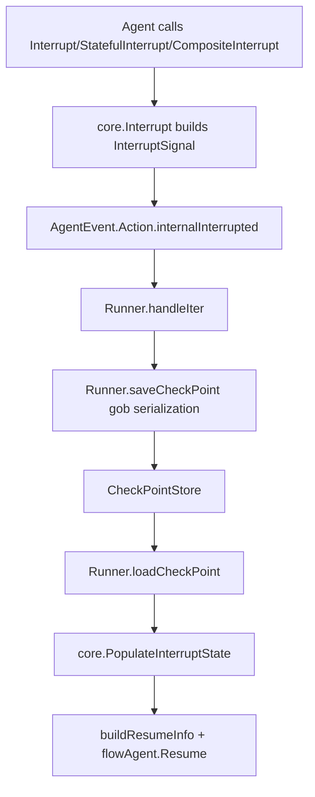

# ADK Interrupt

`ADK Interrupt` 模块是 ADK 里的“暂停-续跑协议适配层”：它把底层可恢复中断机制（`core.InterruptSignal`）翻译成 Agent 层可理解、可持久化、可路由的形态。直白说，它解决的不是“报错”，而是“执行到一半先停下来，之后在正确的位置继续跑”。如果没有这个模块，Runner、workflow agent、agent tool 会各自实现一套中断语义，最后很容易出现“能停但不能准确定向恢复”的系统性问题。

## 为什么需要它：问题空间先于 API

在 ADK 中断场景里，朴素方案通常是“组件返回一个 error，外层看到后重试”。这在单层调用还勉强可行，但在真实运行链（agent 嵌 agent、workflow 并行分支、tool 内再跑 agent）会立刻失效。因为恢复不仅需要“知道发生了中断”，还需要同时回答四个问题：中断点的层级地址是什么、是否有内部状态、哪些子分支是根因、恢复数据应该注入给谁。普通 `error` 无法表达这些结构化语义。

`ADK Interrupt` 的设计洞察是：**中断是控制流，不是失败流**。所以它把中断对象分成“对用户友好的视图”（`InterruptInfo` / `InterruptCtx`）和“对运行时可恢复的信号树”（`core.InterruptSignal`），并在 Runner checkpoint 读写、flow 路由、workflow 聚合之间提供一致桥接。

## 心智模型：把它当作“带门牌号的暂停单”

可以把每次执行想象成一栋多层建筑。每一层（agent/tool）都有门牌号（`AddressSegment` 组成的 `Address`）。发生中断时，系统开一张“暂停单”：写明在哪个门牌号停下（地址）、为什么停（`info`）、恢复时要带什么内部行李（`state`）、以及是否还挂着下级暂停单（`Subs`）。

`ADK Interrupt` 的工作像前台分诊台：

- 向下接收底层暂停单（`core.InterruptSignal`）；
- 向上给业务侧展示可读链路（`InterruptContexts`）；
- 在恢复时再把“地址→状态/恢复数据”重新装回 `context`，确保下一跳 agent 能拿到自己的那份信息。

## 架构与数据流



主路径可以按“触发、持久化、恢复路由”三段理解。首先，agent 侧调用 `Interrupt`、`StatefulInterrupt` 或 `CompositeInterrupt`，这些函数都委托 `core.Interrupt(...)` 生成 `*core.InterruptSignal`，并塞进 `AgentAction.internalInterrupted`。随后 `Runner.handleIter` 识别这个内部字段，把它转换成用户可见的 `InterruptContexts`，并在发送中断事件前调用 `Runner.saveCheckPoint`。最后恢复时，`Runner.loadCheckPoint` 反序列化 `serialization`，通过 `core.PopulateInterruptState` 回填上下文，再由 `buildResumeInfo` 和 `flowAgent.Resume` 把“下一跳应恢复谁”路由到具体 agent。

这说明它在架构上的角色是**协议转换 + 状态桥接**，不是独立执行器。

## 组件深潜

### `ResumeInfo`

`ResumeInfo` 是恢复入口的统一载体，给 `ResumableAgent.Resume` 使用。它同时容纳三类信息：运行模式（`EnableStreaming`）、中断视图（嵌入 `*InterruptInfo`）、以及本次恢复决策结果（`WasInterrupted` / `InterruptState` / `IsResumeTarget` / `ResumeData`）。

关键点是它把“历史事实”和“当前地址判断”放在一起：`InterruptInfo` 描述当时发生了什么，而 `buildResumeInfo` 会基于当前 append 后的地址，动态算出这个 agent 当前是不是恢复目标。这样可以避免每个 agent 自己去遍历整棵中断树。

### `InterruptInfo`

`InterruptInfo` 在 ADK 层保留了两个面向上层的字段：`Data any`（兼容字段）和 `InterruptContexts []*InterruptCtx`（推荐）。实际设计倾向已经很明确：注释标注 `ResumeInfo.InterruptInfo` 的旧用法已 deprecated，鼓励外部走 `InterruptContexts` + `GetInterruptState`。

这个结构的价值不在“完整表达底层信号”，而在“稳定对外契约”。底层 `core.InterruptSignal` 可演进，但上层消费可以尽量聚焦 `InterruptCtx`。

### `Interrupt(ctx, info any) *AgentEvent`

这是无状态中断入口。它先从 `runContext` 取 `RunPath`，作为 `core.WithLayerPayload(rp)` 传下去，然后调用 `core.Interrupt(ctx, info, nil, nil, ...)`。最后它并不直接暴露 `InterruptSignal`，而是包装成 `AgentEvent`：`Action.Interrupted` 给用户看，`Action.internalInterrupted` 给运行时用。

这个“双通道字段”是模块里最关键的非显式设计：同一个事件同时承载用户语义和恢复语义，避免到处复制/转换。

### `StatefulInterrupt(ctx, info, state)`

与 `Interrupt` 的差异只在第三个参数：把 `state` 交给底层持久化链路。它适合“必须从局部进度继续”的 agent；否则恢复后只能重跑，可能重复副作用。

代价是 `state` 类型为 `any`，类型正确性由调用者在 `Resume` 中自行保证（不少 agent 在恢复路径直接 `panic` 做强校验）。这是“灵活性优先”的选择。

### `CompositeInterrupt(ctx, info, state, subInterruptSignals...)`

这是 workflow/复合 agent 的核心 API。它把子中断信号聚合成父级中断，同时允许父级写入自己的 `state`（例如顺序 workflow 的当前索引）。

在 `workflowAgent.runSequential/runParallel/runLoop` 中都能看到这个模式：子分支先各自产生 `internalInterrupted`，父级再调用 `CompositeInterrupt` 统一上抛。这样 Runner 层始终只需要处理一次中断动作，简化了 checkpoint 语义。

### `serialization`

`serialization` 是 checkpoint gob payload，字段包括 `RunCtx`、`EnableStreaming`、`InterruptID2Address`、`InterruptID2State`，以及为兼容保留的 `Info`。注释里的 `CheckpointSchema` 提醒非常重要：这是持久化格式，修改必须考虑向后兼容。

设计上它不直接存整棵 `InterruptSignal`，而是存两张 map（ID→Address，ID→State）。这种“去结构化存储”让恢复时按地址匹配更直接，也降低了对信号树具体形状的耦合。

### `Runner.saveCheckPoint` / `Runner.loadCheckPoint`

`saveCheckPoint` 从 `core.SignalToPersistenceMaps` 得到两张 map，连同 `runCtx` 和 streaming 标志一起 gob 编码后写入 `store.Set`。`loadCheckPoint` 反向解码并调用 `core.PopulateInterruptState` 把恢复索引装回上下文。

这里最重要的时序契约不在函数本身，而在调用方 `Runner.handleIter`：先保存 checkpoint，再发中断事件。这样用户拿到中断通知时，恢复入口必然可用。

### `bridgeStore` / `newBridgeStore` / `newResumeBridgeStore`

`bridgeStore` 是一个内存态 `CheckPointStore` 极简实现（`Data + Valid`），用于 `agentTool` 这类“在一次父运行里桥接子 agent 中断状态”的场景。它不像正式 store 那样持久化，只负责把子 agent checkpoint byte 在 run/resume 两阶段传递。

`newBridgeStore()` 创建空桥，`newResumeBridgeStore(data)` 创建已就绪桥。二者让 `agentTool.InvokableRun` 可以在首次运行和恢复运行之间复用同一套 Runner 代码路径，而不用为“内嵌子执行”再造一套中断机制。

### `getNextResumeAgent` / `getNextResumeAgents`

这两个函数都调用 `core.GetNextResumptionPoints(ctx)`，区别在返回单个还是多个。单个版本明确拒绝多目标恢复（返回 `concurrent transfer is not supported`），反映了当前 flow agent 对并发 transfer 的边界。多个版本给 parallel workflow 用。

注意这两个函数签名虽然带 `info *ResumeInfo`，但当前实现未使用该参数。这通常意味着 API 预留了未来扩展点。

### `buildResumeInfo`

`buildResumeInfo` 是恢复路由的关键桥。它先 `AppendAddressSegment(..., AddressSegmentAgent, nextAgentID)` 进入目标地址，再读取：

- `core.GetInterruptState`：这个地址是否曾中断、是否有 state；
- `core.GetResumeContext`：本次是否被命中为恢复目标、是否有 resume data。

然后它还会 `updateRunPathOnly`，保证后续事件路径与地址前进一致。这一步让 `flowAgent.Resume` 可以非常轻量：先构造 scoped `ResumeInfo`，再决定“自己恢复还是继续向下转发”。

### `AppendAddressSegment` / 地址类型别名

`Address`、`AddressSegment`、`InterruptCtx`、`InterruptSignal` 在 ADK 层都做了 type alias 到 `core`。这是一种“薄包装”策略：复用 core 语义，避免重复模型；同时通过 `allowedAddressSegmentTypes`（仅 `agent`/`tool`）收敛对外暴露的地址类型，减少上层认知负担。

### `WithCheckPointID`

`WithCheckPointID(id string)` 通过 `WrapImplSpecificOptFn` 写入 `options.checkPointID`，是 Runner checkpoint 的开关入口。没有这个 option，`Runner` 即使配置了 store 也不会知道要落哪个 key。

## 依赖分析：它调用谁，谁调用它

向下依赖方面，`ADK Interrupt` 强依赖 [interrupt_signal_and_context_bridge](interrupt_signal_and_context_bridge.md) 和 [address_and_resume_routing](address_and_resume_routing.md)。几乎所有核心语义都来自 `core`：`Interrupt`、`ToInterruptContexts`、`SignalToPersistenceMaps`、`PopulateInterruptState`、`GetNextResumptionPoints`、`GetInterruptState`、`GetResumeContext`、`AppendAddressSegment`。同时依赖 `schema.RegisterName` 维护 gob 反序列化类型注册。

向上调用方面，热路径至少有三类。第一类是 [runner_lifecycle_and_checkpointing](runner_lifecycle_and_checkpointing.md)：`Runner.handleIter`、`saveCheckPoint`、`loadCheckPoint` 直接承接该模块的持久化逻辑。第二类是 [ADK Flow Agent](adk_flow_agent.md) 与 [ADK Workflow Agents](adk_workflow_agents.md)：`flowAgent.Resume` 调 `buildResumeInfo/getNextResumeAgent`，workflow 的 `runSequential/runParallel/runLoop` 调 `CompositeInterrupt`。第三类是 [ADK Agent Tool](adk_agent_tool.md)：`agentTool.InvokableRun` 使用 `bridgeStore` + `WithCheckPointID` + `tool.CompositeInterrupt` 完成内嵌 agent 的中断桥接。

数据契约上有两个隐式约束非常硬。第一，`AgentAction.internalInterrupted` 只能由框架内部消费，业务代码应读 `Action.Interrupted.InterruptContexts`。第二，checkpoint gob payload 需要可解码；所以任何放进 `state` 或 `Data` 的类型，都必须满足序列化约束并在必要时注册 schema 名称。

## 设计决策与权衡

这个模块最明显的取舍是“薄适配而非重封装”。它大量使用 type alias 直连 core 类型，优点是语义统一、性能开销低、无需重复维护模型；代价是 ADK 与 core 的演进节奏强耦合，core 字段语义变化会快速传导到 ADK 层。

第二个取舍是“`any` 到处可扩展”。`info/state/resumeData` 都是 `any`，这让框架能承载不同 agent 的异构状态；但类型错误会延后到运行时，很多实现用 `panic` 做硬失败。对高灵活系统这是常见选择，但新贡献者必须把类型校验当成恢复路径的一部分，而不是可选项。

第三个取舍是“单中断事件不变量”。`Runner.handleIter` 明确假设一次运行中断动作应已在上层合并（否则 panic）。这压缩了 Runner 复杂度，也让 checkpoint 语义简单；对应成本是复合组件（尤其并发场景）必须严格使用 `CompositeInterrupt` 做聚合。

第四个取舍是“向后兼容优先”。`serialization.Info`、`ResumeInfo` 里的 deprecated 注释都说明模块在迁移期兼容旧字段。好处是升级平滑，坏处是模型暂时有双轨心智负担。

## 使用方式与示例

最常见模式是 agent 在需要外部确认时直接中断：

```go
func (a *MyAgent) Run(ctx context.Context, input *AgentInput, opts ...AgentRunOption) *AsyncIterator[*AgentEvent] {
    iter, gen := NewAsyncIteratorPair[*AgentEvent]()
    go func() {
        defer gen.Close()
        gen.Send(StatefulInterrupt(ctx, "need human approval", myState))
    }()
    return iter
}
```

恢复入口由 `Runner` 驱动，并通过 `ResumeWithParams` 按 `InterruptCtx.ID` 定向注入数据：

```go
iter, err := runner.ResumeWithParams(ctx, checkpointID, &ResumeParams{
    Targets: map[string]any{
        interruptID: approvalPayload,
    },
})
```

如果你在复合 agent（例如 workflow）里管理子 agent，中断上抛应该走聚合：

```go
event := CompositeInterrupt(ctx, "Parallel workflow interrupted", workflowState, subSignals...)
```

而在 agent tool 这种“子 Runner 内嵌”场景，推荐复用现有桥接模式（`newBridgeStore` / `newResumeBridgeStore`），避免手写临时状态传递。

## 边界情况与坑点

最常见坑是恢复时地址不对。`buildResumeInfo` 依赖 `AppendAddressSegment` 后再读状态，如果你自定义恢复逻辑时跳过这一步，就会得到 `WasInterrupted=false`，看起来像“状态丢失”。

另一个高频坑是并发恢复假设。`getNextResumeAgent` 遇到多个 next points 会直接报错；如果你的 agent 设计天然并发 transfer，需要走 `getNextResumeAgents` 那一类分支模型，而不是复用单目标 API。

第三个坑是序列化兼容性。`serialization` 是 checkpoint 持久化协议，字段变更要谨慎。特别是删除/重命名字段会导致历史 checkpoint 无法恢复。代码里显式保留 `Info` 就是在规避这个问题。

第四个坑是把 `InterruptInfo.Data` 当主通道。它是兼容字段，推荐消费 `InterruptContexts` 和 `ResumeInfo` 的 typed state/resume data；否则在新旧模型混用时容易出现语义偏差。

## 参考模块

- [runner_lifecycle_and_checkpointing](runner_lifecycle_and_checkpointing.md)
- [ADK Agent Interface](adk_agent_interface.md)
- [ADK Flow Agent](adk_flow_agent.md)
- [ADK Workflow Agents](adk_workflow_agents.md)
- [ADK Agent Tool](adk_agent_tool.md)
- [Compose Interrupt](compose_interrupt.md)
- [interrupt_signal_and_context_bridge](interrupt_signal_and_context_bridge.md)
- [address_and_resume_routing](address_and_resume_routing.md)
