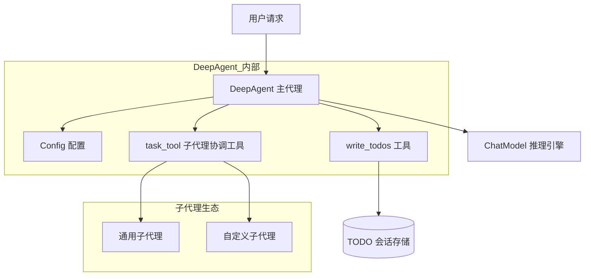

# ADK Prebuilt Deep Research 模块技术文档

## 1. 概述

### 1.1 模块定位与问题空间

**ADK Prebuilt Deep Research** 是一个预构建的深度任务编排代理模块。它解决的核心问题是：如何让一个 AI 代理能够系统性地规划、分解并执行复杂的研究任务，同时能够协调多个专门的子代理来处理不同维度的工作。

想象一下，当你需要研究"如何构建一个高性能的分布式缓存系统"时，这个问题可以分解为多个子任务：调研现有的缓存系统、分析性能指标、设计架构方案、验证可行性等。Deep Research 模块就像一位经验丰富的研究主管，它不仅会自己思考，还会：
1. 将复杂问题分解成可管理的 TODO 列表
2. 给每个任务明确的状态跟踪
3. 根据需要调用不同专长的子代理来完成具体工作

### 1.2 核心价值

这个模块的设计初衷是：**让复杂任务的执行变得可观测、可追踪、可中断恢复**。通过结构化的任务管理和子代理协调，它将原本"黑盒"的 AI 推理过程转化为一个透明的工作流。

## 2. 架构设计

### 2.1 核心组件关系图



### 2.2 架构分层解析

#### 2.2.1 外层：DeepAgent 门面层
- **职责**：作为用户交互的入口，接收研究任务请求
- **实现**：基于 `adk.ChatModelAgent` 构建，添加了特定的中间件和工具
- **关键配置**：通过 `Config` 结构体控制所有行为

#### 2.2.2 中间层：工具与协调层
这是模块的核心创新所在，包含两个关键工具：

1. **write_todos 工具**：
   - 作用：让代理能够创建和更新任务列表
   - 设计意图：将模糊的推理过程转化为结构化的任务管理
   - 数据契约：使用 `TODO` 结构体定义任务状态

2. **task_tool 工具**：
   - 作用：作为子代理的统一调用入口
   - 设计意图：封装子代理的调用细节，提供统一的接口
   - 关键机制：维护子代理注册表，根据 `subagent_type` 路由请求

#### 2.2.3 内层：子代理执行层
- **通用子代理**：当没有配置专门子代理时，提供一个默认的全能代理
- **自定义子代理**：用户可以注入任意数量的专门代理（如代码分析代理、文档检索代理等）

## 3. 核心数据模型

### 3.1 TODO 任务结构

```go
type TODO struct {
    Content    string `json:"content"`    // 任务内容描述
    ActiveForm string `json:"activeForm"` // 任务的主动形式表述
    Status     string `json:"status" jsonschema:"enum=pending,enum=in_progress,enum=completed"`
}
```

**设计意图**：
- `Content`：告诉代理"要做什么"
- `ActiveForm`：用主动语态重新表述任务，帮助代理更清晰地理解执行方式
- `Status`：提供明确的状态机（pending → in_progress → completed），使任务进度可追踪

### 3.2 配置模型

`Config` 结构体是整个模块的控制中心，它的设计体现了"约定优于配置"的理念：

| 配置项 | 作用 | 默认行为 |
|--------|------|----------|
| `ChatModel` | 推理引擎 | 必填，无默认 |
| `Instruction` | 系统提示词 | 使用内置的 `baseAgentInstruction` |
| `SubAgents` | 专门子代理列表 | 空，仅启用通用子代理 |
| `WithoutWriteTodos` | 禁用任务管理工具 | false，默认启用 |
| `WithoutGeneralSubAgent` | 禁用通用子代理 | false，默认启用 |

## 4. 关键工作流程

### 4.1 任务分解与执行流程

当用户提交一个研究请求时，典型的执行流程如下：

1. **初始化阶段**：
   - `New()` 函数创建代理实例
   - 注册 `write_todos` 工具（除非被禁用）
   - 创建 `task_tool` 并注册所有子代理

2. **任务规划阶段**：
   - 代理理解用户请求
   - 调用 `write_todos` 工具创建初始 TODO 列表
   - 每个任务都设置为 `pending` 状态

3. **任务执行阶段**（迭代进行）：
   - 代理选择一个任务，将其状态更新为 `in_progress`
   - 判断是否需要子代理协助
   - 如需要，调用 `task_tool` 并指定合适的子代理
   - 完成后将任务状态更新为 `completed`

4. **总结阶段**：
   - 所有任务完成后，代理生成最终总结

### 4.2 子代理调用流程

`task_tool` 的工作机制值得特别关注：

1. **注册阶段**：在 `newTaskTool()` 中，所有子代理被包装成 `tool.InvokableTool` 并存储在 map 中
2. **描述生成**：`Info()` 方法动态生成工具描述，列出所有可用子代理
3. **调用路由**：`InvokableRun()` 解析 `subagent_type`，找到对应的子代理并转发请求

**关键设计点**：子代理的输入被统一转换为 `{"request": "..."}` 格式，这简化了子代理的接口契约。

## 5. 设计决策与权衡

### 5.1 基于工具的任务管理 vs 专用状态机

**选择**：使用 `write_todos` 工具让代理自己管理任务列表，而不是构建外部状态机。

**权衡分析**：
- ✅ **优点**：
  - 灵活性高：代理可以根据实际情况动态调整任务列表
  - 减少耦合：不需要额外的状态管理组件
  - 自然语言友好：代理可以用自然语言描述任务
- ⚠️ **缺点**：
  - 可靠性依赖代理能力：如果代理推理出错，任务列表可能混乱
  - 缺少强制约束：没有外部机制保证任务状态转换的正确性

**为什么这样设计**：这是一个"智能优先"的选择。在 AI 代理系统中，我们希望代理能够展现出适应性，而不是被僵化的流程束缚。

### 5.2 子代理统一包装 vs 直接调用

**选择**：所有子代理都通过 `task_tool` 统一调用，而不是让主代理直接选择子代理。

**权衡分析**：
- ✅ **优点**：
  - 接口一致：主代理只需要知道一个工具
  - 易于扩展：添加新子代理不需要修改主代理逻辑
  - 可观测性：所有子代理调用都经过同一个点，便于监控
- ⚠️ **缺点**：
  - 间接层开销：多了一层包装和转发
  - 描述限制：子代理的能力需要被浓缩到工具描述中

### 5.3 可选组件的默认启用策略

**选择**：`write_todos` 和通用子代理默认启用，提供 "opt-out" 而不是 "opt-in"。

**设计意图**：让新用户零配置就能获得一个功能完整的代理。这符合"合理默认"的设计原则。

## 6. 扩展点与自定义

### 6.1 自定义子代理

最常见的扩展方式是添加自定义子代理：

```go
// 创建专门的研究子代理
researchAgent := createMyResearchAgent()

// 配置 DeepAgent
cfg := &deep.Config{
    ChatModel: myModel,
    SubAgents: []adk.Agent{researchAgent},  // 注入自定义子代理
}
```

### 6.2 自定义任务工具描述

如果你想改变子代理的描述方式：

```go
cfg := &deep.Config{
    TaskToolDescriptionGenerator: func(ctx context.Context, agents []adk.Agent) (string, error) {
        // 生成你自己的工具描述
        return "自定义描述...", nil
    },
}
```

### 6.3 禁用不需要的组件

```go
cfg := &deep.Config{
    WithoutWriteTodos: true,        // 如果你想自己管理任务
    WithoutGeneralSubAgent: true,   // 如果你只想要专门子代理
}
```

## 7. 与其他模块的关系

### 7.1 依赖关系

- **ADK ChatModel Agent**：DeepAgent 本质上是一个配置好的 ChatModelAgent
- **ADK Agent Tool**：用于将子代理包装成工具
- **Schema Core Types**：用于消息和工具定义
- **Callbacks System**：可用于监控和追踪代理执行

### 7.2 在生态中的位置

Deep Research 模块是一个"宏代理"——它不提供新的基础能力，而是通过组合现有能力来解决复杂问题。它位于 ADK 堆栈的上层，构建在 [ADK ChatModel Agent](ADK ChatModel Agent.md) 和 [Compose Graph Engine](Compose Graph Engine.md) 等基础模块之上。

## 8. 注意事项与常见陷阱

### 8.1 隐式契约：子代理的输入格式

`task_tool` 会将输入转换为 `{"request": "..."}` 格式。这意味着你的子代理必须能够理解这种格式的输入。如果你的子代理期望不同的输入结构，需要做适配。

### 8.2 会话存储的使用

TODO 列表通过 `adk.AddSessionValue` 存储在会话中，键为 `SessionKeyTodos`。这意味着：
- TODO 列表会在整个会话中持久化
- 你可以在外部读取这个值来展示任务进度
- 但不要在外部修改它，避免与代理的操作冲突

### 8.3 最大迭代次数的设置

`MaxIteration` 配置很重要。如果设置得太小，复杂任务可能无法完成；如果设置得太大，可能导致昂贵的无限循环。建议从 20-50 开始，根据实际情况调整。

### 8.4 子代理名称唯一性

所有子代理（包括自动创建的通用子代理）的名称必须唯一。如果有冲突，后面的会覆盖前面的。

## 9. 总结

ADK Prebuilt Deep Research 模块的核心理念是：**将复杂问题的解决过程结构化、可视化**。它通过两个简单但强大的工具——任务列表管理器和子代理协调器——将原本不可控的 AI 推理过程转化为一个可观测、可追踪的工作流。

这个模块的设计展现了一种优雅的平衡：它提供了足够的结构来保证可靠性，同时又保留了足够的灵活性让代理能够适应性地解决问题。

---

## 子模块文档

- [Deep Research Core](deep_research_core.md) - 了解 `Config`、`TODO` 结构和 `write_todos` 工具的详细实现
- [Task Tool Orchestration](task_tool_orchestration.md) - 解析 `task_tool` 的工作原理和子代理编排机制

这些子模块文档详细介绍了每个部分的实现细节、API 使用方法和扩展点。建议按照顺序阅读，以便全面理解整个模块的工作原理。
