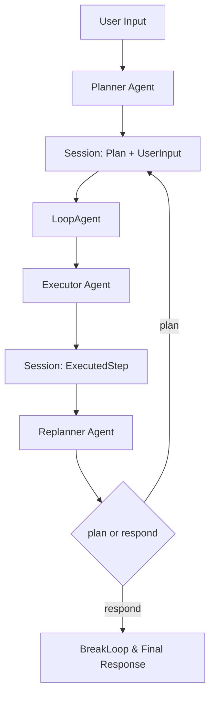

# ADK Prebuilt Plan-Execute

`ADK Prebuilt Plan-Execute` 是一个“先做计划、再执行一步、再根据结果改计划”的预制 Agent 编排器。它存在的价值很直接：当任务复杂、信息会在执行中不断变化时，一次性让模型“直接答完”通常不可靠；而这个模块把任务拆成可迭代的闭环，让系统像一个谨慎的项目经理一样，边做边校正，直到确认可以给出最终答复。

---

## 这个模块解决什么问题？（先讲问题空间）

在真实生产任务里，常见痛点不是“模型不会说话”，而是：

- 任务长、约束多，一次性回答容易漏条件
- 某些步骤必须先执行才能拿到下一步信息
- 过程中可能需要改变策略（replan）
- 希望保留“已执行历史”，便于追溯与恢复

传统单轮 Agent 像“闭卷一次性交卷”；Plan-Execute 更像“开题 -> 实验 -> 复盘 -> 下一轮实验”。

该模块采用的核心策略是：

1. `planner` 先产出结构化 `Plan`
2. `executor` 只执行当前第一步
3. `replanner` 二选一：
   - 继续：输出剩余计划（`plan` tool）
   - 结束：输出最终回答（`respond` tool）

然后通过循环不断推进。

---

## 心智模型（Mental Model）

把它想象成一个“三角色作战室”：

- **Planner（参谋）**：先给路线图
- **Executor（执行官）**：只做当下最优先动作
- **Replanner（复盘官）**：看战果，决定继续推进还是收官

这三个角色不直接传函数参数，而是共享“作战白板”（session kv）：

- `UserInputSessionKey`
- `PlanSessionKey`
- `ExecutedStepSessionKey`
- `ExecutedStepsSessionKey`

所以它的本质是一个**状态驱动的循环编排器**，不是一个“单次调用模型函数”的薄封装。

---

## 架构总览

### 架构叙事（按真实代码路径）

- 顶层 `New`：
  - 先建 `adk.NewLoopAgent`，子 agent 固定为 `[]adk.Agent{cfg.Executor, cfg.Replanner}`
  - 再建 `adk.NewSequentialAgent`，子 agent 为 `[]adk.Agent{cfg.Planner, loop}`
- `planner.Run`：
  - 生成 planner prompt
  - 调模型（可结构化输出或 tool-calling）
  - 反序列化为 `Plan`
  - 写入 `PlanSessionKey`
- `executor`：
  - 通过 `adk.NewChatModelAgent` 运行
  - 其 `GenModelInput` 从 session 取 `Plan/UserInput/ExecutedSteps`
  - 输出写入 `ExecutedStepSessionKey`
- `replanner.Run`：
  - 将本轮 `ExecutedStepSessionKey` 追加到 `ExecutedStepsSessionKey`
  - 调用带 `plan/respond` 双工具的模型（强制 tool choice）
  - 若 `respond`：发送 `adk.NewBreakLoopAction(...)`
  - 若 `plan`：解析新计划并回写 `PlanSessionKey`

---

## 关键设计决策与取舍

### 1) 计划抽象为 `Plan` 接口，而不是固定结构

**选择**：`Plan` 要求 `FirstStep + MarshalJSON + UnmarshalJSON`。  
**为什么**：允许领域侧自定义计划结构（不仅仅是 `[]string`）。  
**代价**：自定义实现要自己保证 JSON 协议稳定，否则解析失败。

### 2) Planner 支持两种模型接入路径

**选择**：`ChatModelWithFormattedOutput` 或 `ToolCallingChatModel + ToolInfo`。  
**为什么**：兼容不同模型能力面。  
**代价**：实现里出现双分支处理（尤其流式输出和解析路径）。

### 3) Replanner 用 tool-call 二选一，而非自由文本判断

**选择**：必须调用 `plan` 或 `respond`。  
**为什么**：让“继续/结束”变成可程序判定的结构化动作。  
**代价**：强依赖 tool-calling 能力，且当前只读取第一条 `ToolCall`。

### 4) 状态通过 session 共享，而不是显式参数链

**选择**：跨 agent 读写 session key。  
**为什么**：组合器更简洁，和 ADK 运行时风格一致。  
**代价**：隐式契约多；键缺失或类型变化会触发 panic（代码中多处 `panic("impossible: ...")`）。

### 5) 失败策略偏“快速暴露不变量破坏”

`NewExecutor` / `replanner.genInput` 中对关键 session 值缺失直接 panic，表明作者把执行顺序视为硬约束。该策略提升调试清晰度，但对错误编排不“温柔”。

---

## 关键数据流（端到端）

### 流程 A：正常完成

1. 用户消息进入 `planner`
2. `planner` 输出计划 JSON，写 `PlanSessionKey`
3. `executor` 读取计划第一步并执行，写 `ExecutedStepSessionKey`
4. `replanner` 累计历史到 `ExecutedStepsSessionKey`
5. `replanner` 选择 `respond` 工具，发送 `BreakLoopAction`
6. Loop 结束，返回最终响应

### 流程 B：继续改计划

前 4 步相同，但第 5 步改为 `plan` 工具：

- `replanner` 解析新计划并更新 `PlanSessionKey`
- Loop 下一轮再进入 `executor`

### 流程 C：流式输出

`planner.Run` 和 `replanner.Run` 都会在 `EnableStreaming` 下复制 `StreamReader`：

- 一路用于向外发送事件
- 一路用于内部 `ConcatMessageStream` 做完整解析

当输出来自 tool-calling 时，会通过 `argToContent` 将 `Function.Arguments` 映射成可展示消息内容。

---

## 子模块说明

### 1) [plan_execute_orchestration_core](plan_execute_orchestration_core.md)

主逻辑核心：`Plan` 抽象、`Planner/Executor/Replanner` 配置与运行、`New` 顶层编排、Prompt 输入生成、session 状态演进。这里是你改业务策略、扩展计划结构、替换默认提示词的主要入口。

> 推荐阅读顺序：先看本页“关键数据流”，再看该子页的组件级细节。

### 2) [session_kv_output_wrapper](session_kv_output_wrapper.md)

一个轻量装饰器 agent：透传原事件流，并在结束时补发 session 全量快照。当前主要用于测试/调试场景验证状态演化。

> 如果你在写断言或回归测试，优先看该子页的“末尾快照事件”契约。

---

## 跨模块依赖关系（按代码导入与调用）

- [ADK ChatModel Agent](ADK ChatModel Agent.md)
  - `NewExecutor` 直接调用 `adk.NewChatModelAgent`
- [ADK Workflow Agents](ADK Workflow Agents.md)
  - `New` 使用 `adk.NewLoopAgent` 与 `adk.NewSequentialAgent` 组织流程
- [Compose Graph Engine](Compose Graph Engine.md)
  - `planner.Run` / `replanner.Run` 使用 `compose.NewChain` 与 lambda 拼装执行链
- [Schema Core Types](Schema Core Types.md)
  - 使用 `schema.Message`、`ToolCall`、`ToolInfo`、`StreamReaderWithConvert`、`ConcatMessageStream`
- [Component Interfaces](Component Interfaces.md)
  - 依赖 `model.BaseChatModel` 与 `model.ToolCallingChatModel` 抽象
- [Internal Utilities](Internal Utilities.md)（panic safety 相关细节在 [panic_safety_wrapper](panic_safety_wrapper.md)）
  - `planner.Run` / `replanner.Run` 中 `safe.NewPanicErr` 用于 panic 转错误事件

> 注：上述关系基于当前模块源码中的实际 import 与调用。

---

## 新贡献者重点注意（Gotchas）

1. **别打破执行顺序不变量**：executor/replanner 强依赖 planner 先写 session。  
2. **谨慎修改 session value 类型**：例如 `ExecutedStepSessionKey` 在 replanner 里按 `string` 断言。  
3. **多 tool call 当前只看第一条**：若模型返回多个 tool calls，会被静默忽略后续项。  
4. **`FirstStep()` 可能为空**：空计划会让 executor 收到空 step 文本。  
5. **tool 名称是协议的一部分**：replanner 用 `Function.Name` 与 `planTool.Name/respondTool.Name` 精确匹配。  
6. **流式展示内容可能是 tool arguments**：不是自然语言摘要，而是 JSON 参数字符串。

---

## 典型扩展点

- 自定义计划结构：实现 `Plan` + 在 `PlannerConfig.NewPlan/ReplannerConfig.NewPlan` 注入
- 定制提示词：替换 `PlannerConfig.GenInputFn`、`ExecutorConfig.GenInputFn`、`ReplannerConfig.GenInputFn`
- 定制工具协议：替换 `PlannerConfig.ToolInfo`、`ReplannerConfig.PlanTool/RespondTool`
- 控制循环预算：`Config.MaxIterations` 与 `ExecutorConfig.MaxIterations`

如果你第一次接手这个模块，建议从 `New -> NewPlanner/NewExecutor/NewReplanner -> planner.Run/replanner.Run` 这条路径读代码，先掌握 session 状态如何滚动，再做策略层改动。
