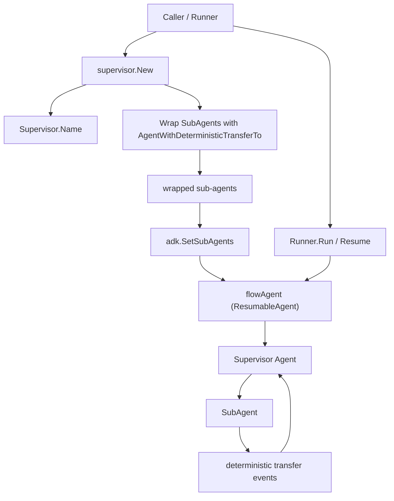

# ADK Prebuilt Supervisor

`ADK Prebuilt Supervisor` 是一个“装配器”模块：它不自己实现复杂调度算法，而是把 ADK 里已经存在的 `flow` 多 Agent 运行机制和 `deterministic transfer` 约束包装成一个开箱即用的“主管-下属”拓扑。直观地说，它解决的是“如何让多个 Agent 协作但不失控”这个问题：你可以让一个 `Supervisor` 统筹多个 `SubAgents`，但每个子 Agent 被强制只能回到主管，不能横向乱跳，从而形成可预测、可恢复、可追踪的层级流程。

## 这个模块在解决什么问题？

在多 Agent 系统里，一个朴素方案是：把所有 Agent 都挂在同一个运行时里，允许彼此 `TransferToAgent`。这种做法短期看很灵活，但很快会遇到三个工程问题。第一是**控制面失序**：任意 Agent 间可跳转，会让路由图变成隐式全连接，调试时很难回答“为什么走到了这个 Agent”。第二是**上下文污染**：横向跳转会带来历史拼接复杂度上升，尤其在嵌套结构和中断恢复场景里。第三是**恢复语义不稳定**：当执行中断并 resume 时，若跳转路径不受约束，恢复目标和事件回放很容易不确定。

`supervisor.New` 的设计意图就是把这个问题空间收敛到“星型拓扑”：主管在中心，子 Agent 在外围。外围节点执行完后，系统自动补一段确定性的“返回主管”转移事件。这样做的核心收益不是“更聪明”，而是“更可预测”。

## 心智模型：把它当作“企业组织架构 + 盖章回流”

可以把这个模块想象成一个企业流程：

- `Supervisor` 是部门总监，负责分派任务。
- `SubAgents` 是专员，只做各自工作。
- 每个专员办完事后，系统会自动盖章要求“回到总监汇报”。

技术上，这个“盖章”由 `adk.AgentWithDeterministicTransferTo` 完成。它会包装每个子 Agent，在其运行流末尾（非中断/非退出）自动注入转移动作，目标是主管名字。`supervisor` 模块本身只负责组装这层约束，不重写底层调度器。

## 架构与数据流



从构建阶段看，`New(ctx, conf)` 做了三件事：先读取主管名称 `conf.Supervisor.Name(ctx)`；然后遍历 `conf.SubAgents`，把每个子 Agent 包成 `AgentWithDeterministicTransferTo(... ToAgentNames: []string{supervisorName})`；最后调用 `adk.SetSubAgents(ctx, conf.Supervisor, subAgents)` 返回 `adk.ResumableAgent`。

从运行阶段看，真正执行由 `flowAgent` 机制处理（`SetSubAgents` 内部创建/配置）。主管如果产生 `TransferToAgent` 动作，会切到对应子 Agent。子 Agent 执行完成后，包装器通过 `sendTransferEvents` 自动追加转移事件，把控制权送回主管。若发生 `Interrupted` 或 `Exit`，自动回流不会触发，这保证中断语义优先于路由补全。

## 组件深潜

## `type Config struct`

`Config` 很克制，只暴露两个字段：`Supervisor adk.Agent` 和 `SubAgents []adk.Agent`。这体现了一个明显的设计选择：**把拓扑表达降到最小面**。模块不接管 prompt、tool、history rewrite、checkpoint 策略等细节，那些都留在各 Agent 自身或底层 ADK 机制里。

这种最小配置的好处是，`supervisor` 能作为“薄层语义胶水”存在：用户先按自己需要构建 `ChatModelAgent` / workflow / 其它 agent，再统一接入这里形成层级控制。代价是这里几乎不做参数校验（例如源码里未显式检查 `conf` 或 `conf.Supervisor` 是否 nil），调用者需要保证输入合法。

## `func New(ctx context.Context, conf *Config) (adk.ResumableAgent, error)`

`New` 是模块唯一核心入口，逻辑很短，但每一步都有意图。

第一步拿 `supervisorName := conf.Supervisor.Name(ctx)`，这不是装饰信息，而是后续 deterministic transfer 的硬约束目标。第二步把每个 `subAgent` 包装为 `adk.AgentWithDeterministicTransferTo`，并把允许转移目标限制为主管名。第三步调用 `adk.SetSubAgents` 交给 `flow` 层建立父子关系和可恢复执行体。

返回值是 `adk.ResumableAgent`，这是个很关键的契约信号：`supervisor` 不是一次性运行器，而是天然兼容 `Runner` 的中断恢复链路。测试 `TestNestedSupervisorInterruptResume` 也验证了嵌套 supervisor + 工具中断后的恢复可工作。

## 依赖关系与契约分析

这个模块本身依赖极少，但都是关键依赖：

- 它调用 `adk.AgentWithDeterministicTransferTo`：用于把“子 Agent 必须回主管”变成可执行约束。
- 它调用 `adk.SetSubAgents`：用于把主管与子 Agent 装配为 `flowAgent` 层级，并获得 `ResumableAgent` 能力。
- 它依赖 `adk.Agent.Name(ctx)`：把路由目标从对象引用降级成稳定字符串名（`TransferToAgentAction.DestAgentName`）。

谁会调用它？从 API 形态和测试看，典型调用方是应用初始化代码：先创建 supervisor 与 sub-agents，再把 `New(...)` 返回值交给 `adk.NewRunner` 执行。也就是说，它位于“组装阶段”，而不是“每轮推理热路径”里的重计算节点。

数据契约上最隐含但最重要的一点是**名称契约**：转移动作按 `DestAgentName` 匹配，若 Agent 名字不稳定或重名，路由会歧义/失败。`supervisor` 自己不解决命名冲突，完全信任上游。

## 设计取舍与非显然决策

这个模块最核心的取舍是：选择“约束型组合”而不是“可编排 DSL”。它没有提供复杂路由规则、优先级、权限矩阵，而是只做一件事——强制子 Agent 回主管。这样牺牲了部分灵活性（例如子 Agent 之间不能直接协作），换来更强的确定性与恢复稳定性，尤其适合需要审计和可解释路径的场景。

另一个取舍是复用已有 ADK 原语而非自建运行时。`New` 只是薄封装，复杂行为都下沉到 [`deterministic_transfer_wrapper`](deterministic_transfer_wrapper.md) 与 [`flow_agent_orchestration`](flow_agent_orchestration.md)。优点是复用成熟能力（事件流、中断恢复、session 历史处理），缺点是行为理解需要跨模块阅读，`supervisor` 文件本身不会告诉你全部运行细节。

还有一个值得注意的点：`deterministic transfer` 采用“追加事件”而不是“直接函数返回切换”。这让执行轨迹在事件层完整可见（包含转移 assistant/tool message），便于日志和回放；代价是事件序列更长，且调用方若自行处理历史，需要理解这些转移消息的语义。

## 如何使用

```go
ctx := context.Background()

multi, err := supervisor.New(ctx, &supervisor.Config{
    Supervisor: supervisorAgent,
    SubAgents:  []adk.Agent{sub1, sub2},
})
if err != nil {
    // handle error
}

runner := adk.NewRunner(ctx, adk.RunnerConfig{Agent: multi})
iter := runner.Run(ctx, []adk.Message{schema.UserMessage("...task...")})
```

实践上，常见模式是让 `Supervisor` 使用可调用 `transfer_to_agent` 的 chat model agent；`SubAgents` 专注单域工具。若要做分层组织，可把一个 supervisor 包成具名 agent，再作为更上层 supervisor 的 sub-agent（测试中通过 `namedAgent` 展示了这种嵌套）。

## 新贡献者要特别注意的坑

第一，`New` 没有看到显式 nil 校验逻辑；若传入空 `conf` 或空字段，风险会延后到运行期触发 panic 或错误。第二，路由依赖 `Name(ctx)` 字符串，请避免动态变名和重名。第三，自动“回主管”只在子 Agent 正常结束时发生；若最后动作是 `Interrupted` 或 `Exit`，不会补 transfer，这在恢复流程里是正确行为，但容易被误判成“没回流”。

第四，若你期待子 Agent 之间直接协作，这个模块的拓扑是故意不支持的；应通过主管二次转发实现。第五，嵌套 supervisor 虽可行，但上下文与历史改写由 `flowAgent` 管理，调试时建议结合运行事件观察，而不是只看最终消息。

## 参考阅读

- [`ADK Flow Agent`](ADK%20Flow%20Agent.md)（`SetSubAgents`、层级运行与 history 处理）
- [`deterministic_transfer_wrapper`](deterministic_transfer_wrapper.md)（`AgentWithDeterministicTransferTo` 的事件追加与 resume 逻辑）
- [`runner_lifecycle_and_checkpointing`](runner_lifecycle_and_checkpointing.md)（`Runner` 执行与恢复入口）
- [`ADK ChatModel Agent`](ADK%20ChatModel%20Agent.md)（常见 supervisor/sub-agent 的具体实现载体）
